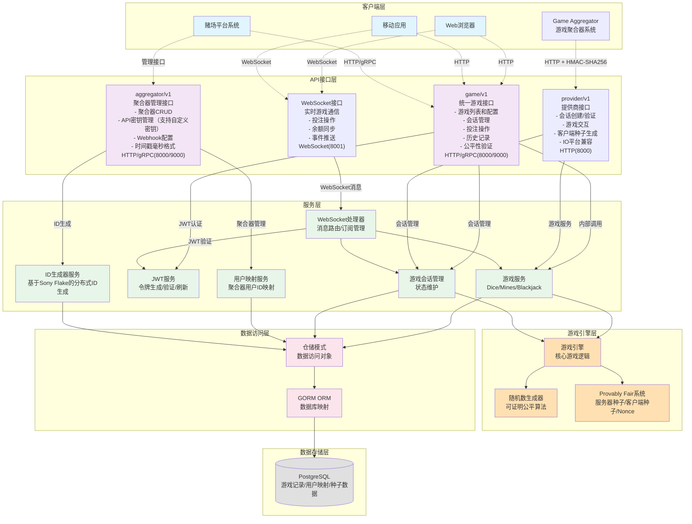
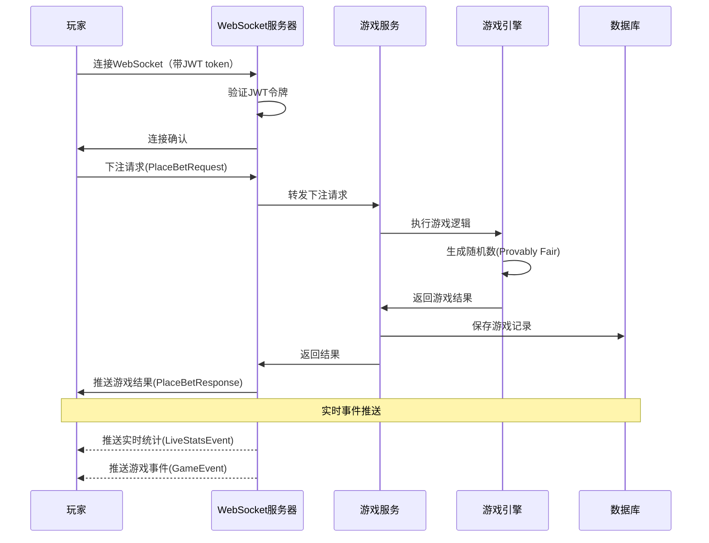
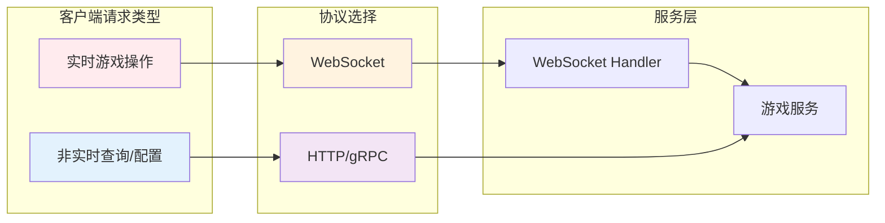
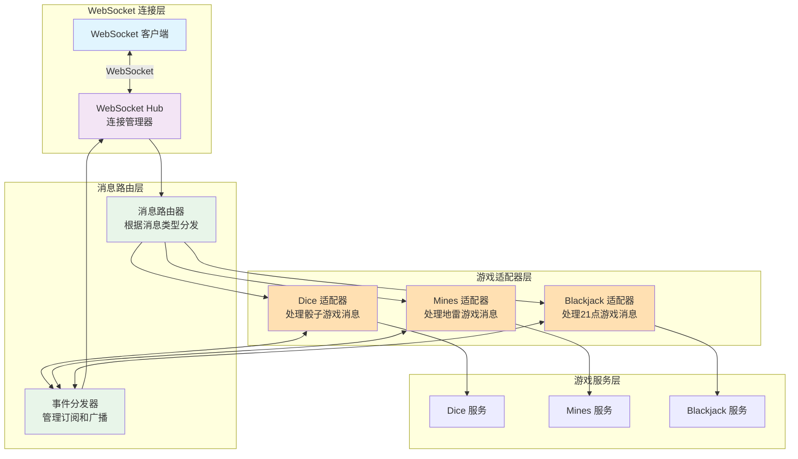
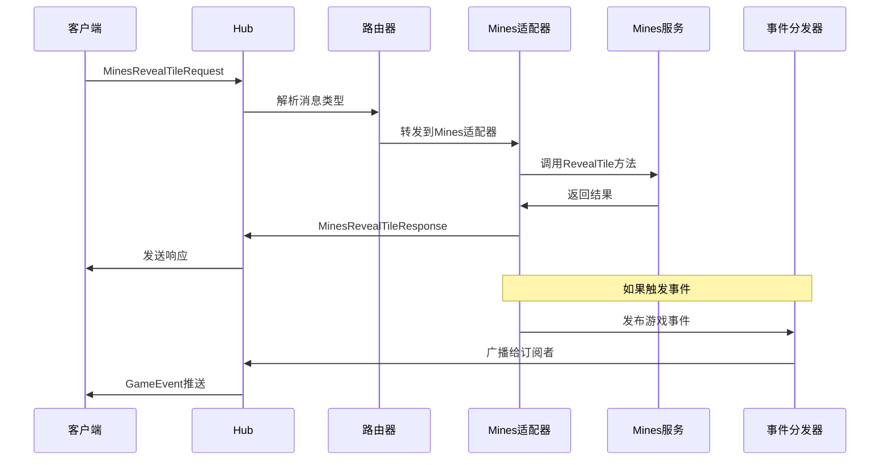
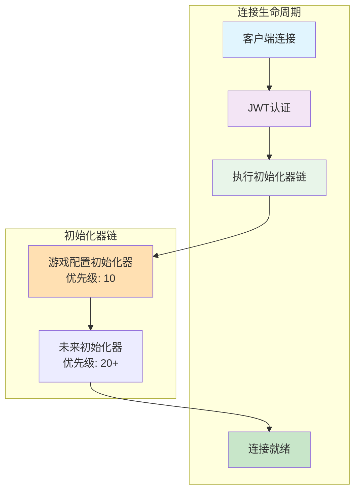

# Invoker Server 业务架构图

## 系统概览

Invoker Server 是一个为赌场平台设计的内部原创游戏提供商服务，提供具有可证明公平机制的多样化游戏。系统专注于游戏逻辑实现，余额管理由游戏聚合器负责。

### 当前支持的游戏：
- ✅ **骰子(Dice)** - 经典的大小猜测游戏
- ✅ **地雷(Mines)** - 扫雷类游戏，玩家揭开安全格子获得倍数奖励
- ✅ **21点(Blackjack)** - 经典纸牌游戏，支持分牌、加倍、保险等功能
- ✅ **基诺(Keno)** - 数字彩票游戏，玩家选择1-10个数字，系统开出10个中奖号码
- ✅ **弹珠机(Plinko)** - 弹珠下落游戏，支持延迟结算机制

### 计划中的游戏：
- **撞击(Crash)** - 倍数增长游戏

服务采用 Kratos v2 框架构建，直接暴露 WebSocket、HTTP 和 gRPC 端点，无需独立的 API 网关。

## 业务架构图

## 数据流程图

## 核心组件说明

### 1. **客户端层**
- **Web浏览器**: 通过JavaScript WebSocket API连接
- **移动应用**: iOS/Android原生应用
- **赌场平台系统**: 第三方赌场平台通过集成API接入

### 2. **API接口层**
- **game/v1**: 统一游戏API，支持WebSocket、HTTP和gRPC
  - WebSocket: 实时游戏交互，支持 Protocol Buffers 和 JSON
  - HTTP/gRPC: 游戏配置、历史记录、公平性验证等
  - 连接初始化：自动发送游戏配置
- **provider/v1**: 游戏聚合器接口
  - HMAC-SHA256认证
  - 会话管理和游戏操作
- **aggregator/v1**: 聚合器管理接口
  - 主密钥认证
  - 聚合器配置管理

### 3. **服务层**
- **游戏服务**: 处理各种游戏的业务逻辑
  - **✅ 骰子(Dice)服务** - 大小猜测游戏，目标数字范围4-96
  - **✅ 地雷(Mines)服务** - 扫雷游戏，支持3×3、5×5、7×7网格，逐步揭示和提现，会话恢复和放弃功能
  - **✅ 21点(Blackjack)服务** - 经典21点，支持分牌、加倍、保险
  - **✅ 基诺(Keno)服务** - 即时数字彩票游戏，选择1-10个数字，系统开出10个中奖号码
- **JWT服务**: 处理JWT令牌的生成、验证和刷新
  - 令牌生成：包含session_id、user_id、aggregator_id、game_id等
  - 令牌验证：验证有效性和签名
  - 自动刷新：2小时过期，1.5小时自动刷新
- **WebSocket处理器**: 管理连接、消息路由和事件订阅
  - 每个游戏独立的WebSocket适配器
  - 统一事件分发机制
  - JWT认证和自动刷新
  - 连接初始化系统
  - 实时余额同步
- **投注活动广播器(BetActivityBroadcaster)**: 实时推送和历史缓存
  - 环形缓冲区(RecentActivityBuffer)存储最近200条投注记录
  - 批量推送机制（每3秒或达到10条消息）
  - 智能采样策略（高频时采样，低频时全量）
  - GET_BET_ACTIVITIES接口支持历史查询
- **游戏会话管理**: 维护玩家游戏状态和会话信息
  - 支持 Mines 和 Blackjack 的持久化会话
- **ID生成器服务**: 基于 Sony Flake 算法的分布式ID生成
  - 64位时间有序ID，支持分布式部署
  - 每10毫秒可生成256个ID
  - 用于生成用户ID、会话ID、回合ID等
- **用户映射服务**: 管理聚合器用户ID到内部用户ID的映射
  - 维护 (aggregator_id, external_player_id) → internal_user_id 映射
  - 解决不同聚合器间的用户ID冲突
  - 支持并发安全的用户创建
- **定时任务服务(PendingGameSettler)**: 处理延迟结算游戏的异常兜底
  - 每 20 秒扫描超时的 pending 游戏
  - 自动调用聚合器 API 完成结算
  - 防止前端崩溃导致的结算遗漏
  - 当前应用于 Plinko 游戏

### 4. **游戏引擎层**
- **游戏引擎**: 核心游戏逻辑实现，支持多种游戏类型
- **随机数生成器**: 基于加密算法的安全随机数生成
- **Provably Fair系统**: 实现可证明公平机制，包括服务器种子、客户端种子和Nonce管理

### 5. **数据访问层**
- **仓储模式**: 提供统一的数据访问接口
- **GORM ORM**: Go语言的ORM框架，处理数据库映射和查询

### 6. **数据存储层**
- **PostgreSQL**: 存储游戏记录、用户数据、种子信息等持久化数据，同时也存储游戏会话和连接状态信息

## API接口体系

### 三大API体系
1. **Game API** (`/api/game/v1/`) - 统一游戏接口
   - 认证、会话、种子、历史、公平性验证服务
   - 支持HTTP/gRPC和WebSocket
   
2. **Provider API** (`/api/provider/v1/`) - 游戏聚合器接口
   - HMAC-SHA256认证
   - 会话创建、游戏操作、客户端种子生成
   
3. **Aggregator API** (`/api/aggregator/v1/`) - 聚合器管理
   - 主密钥认证
   - 聚合器CRUD、密钥管理

## API通信协议详解

### Provider API (游戏提供商接口)
**端口**: 8000
**认证**: HMAC-SHA256 签名验证

**主要功能**:
- 会话管理：CreateSession、GetSession
- 游戏操作：Play
- 种子生成：GenerateClientSeed  
- IO平台兼容：CreateIOSession
- 游戏列表：GetGames

**特性**:
- 完整的错误码体系
- 游戏注册表动态管理
- 请求验证框架
- 结构化日志系统
- JWT令牌生成供WebSocket使用

### Game API 与服务层交互

1. **WebSocket 协议** (主要用于实时游戏)
   - 认证方式：JWT令牌验证（连接时通过URL参数token传递）
   - 传输格式：支持 Protocol Buffers 和 JSON 双格式
   - 消息结构：使用 `WebSocketMessage` 作为统一消息容器
   - 用途：
     - 实时下注 (PlaceBetRequest/Response)
     - 游戏状态获取 (GetGameStateRequest/Response)
     - 事件订阅 (Subscribe/Unsubscribe)
     - 心跳保活 (Ping/Pong)
   - 特点：
     - 双向实时通信
     - 低延迟
     - 支持事件推送
     - JWT令牌自动刷新（在令牌即将过期时自动刷新）

2. **HTTP/gRPC 协议** (用于非实时操作)
   - 传输格式：Protocol Buffers
   - 用途：
     - 获取游戏配置 (GetDiceGameConfig)
     - 创建服务器种子 (CreateServerSeed)
     - 查询历史记录 - 包含完整公平性验证信息
     - 公平性验证 - 独立验证游戏结果
   - 特点：
     - 请求-响应模式
     - RESTful API 通过 gRPC-Gateway 自动生成
     - 适合状态查询和配置管理
     - 历史记录接口返回完整的公平性数据

### 协议选择策略

## WebSocket 适配器架构

系统采用适配器模式来处理不同游戏的 WebSocket 通信，确保每个游戏都有独立且专用的消息处理逻辑。

### 适配器架构图

### 适配器职责

1. **WebSocket Hub**
   - 管理所有 WebSocket 连接的生命周期
   - 处理连接建立、断开和错误
   - 消息的序列化和反序列化

2. **消息路由器**
   - 根据消息类型（`oneof payload`）路由到对应的游戏适配器
   - 处理通用消息（如心跳、订阅等）

3. **游戏适配器**
   - **Dice 适配器**: 处理 `DicePlaceBetRequest/Response`
   - **Mines 适配器**: 处理 `MinesPlaceBetRequest`、`MinesRevealTileRequest`、`MinesCashOutRequest` 等
   - **Blackjack 适配器**: 处理 `BlackjackPlaceBetRequest`、`BlackjackPlayerActionRequest`、`BlackjackInsuranceRequest` 等

4. **事件分发器**
   - 管理客户端的事件订阅（游戏事件、实时统计等）
   - 向订阅的客户端广播相关事件
   - 支持精细化的订阅管理

### 消息流程示例

### 适配器模式的优势

1. **解耦性**: 每个游戏的 WebSocket 逻辑完全独立
2. **可维护性**: 修改某个游戏不会影响其他游戏
3. **可扩展性**: 添加新游戏只需创建新的适配器
4. **测试性**: 每个适配器可以独立测试
5. **性能**: 消息直接路由到对应处理器，避免不必要的处理

## WebSocket 连接初始化系统

系统实现了一个灵活的连接初始化器架构，允许在 WebSocket 连接建立后自动执行各种初始化逻辑。

### 初始化器架构

### 初始化器特性

1. **优先级执行**: 初始化器按优先级顺序执行（数字越小优先级越高）
2. **错误隔离**: 单个初始化器失败不会影响其他初始化器执行
3. **上下文感知**: 初始化器可以访问连接上下文和用户信息
4. **可扩展性**: 轻松添加新的初始化器而不影响现有逻辑

### 当前实现的初始化器

#### GameConfigInitializer（优先级: 10）
- **功能**: 在连接建立后自动发送当前游戏的配置信息
- **游戏ID来源**（按优先级）:
  1. JWT token 中的 `game_id` 字段
  2. WebSocket URL 参数 `game_id`
- **发送内容**:
  - 游戏ID、名称、类别
  - 最小/最大下注限制
  - RTP（返还率）
  - 游戏特性列表
  - 支持的货币
- **消息格式**:
  - 游戏配置: `game_config`（统一消息类型，数据包含完整GameConfig对象）
  - 初始化完成通知: `initialization_complete`
- **注意**: 如果没有指定游戏ID，则不发送任何游戏配置

## 技术特性

1. **可证明公平(Provably Fair)**
   - 每个游戏结果都可以被独立验证
   - 使用服务器种子、客户端种子和Nonce生成结果
   - 服务器种子哈希提前公开，游戏后揭示原始种子

2. **实时通信**
   - WebSocket支持低延迟的实时游戏体验
   - 事件订阅机制支持选择性推送
   - 心跳机制保持连接活跃

3. **可扩展性**
   - 微服务架构支持独立扩展
   - 游戏引擎设计支持快速添加新游戏类型
   - 使用Kratos框架提供的中间件机制

4. **安全性**
   - **认证机制**：
     - JWT认证系统（WebSocket和Game API）
     - HMAC-SHA256签名（Provider API）
     - 主密钥认证（Aggregator API）
     - 令牌自动刷新机制
   - **中间件保护**：
     - Recovery中间件处理panic
     - HMAC认证中间件
     - 输入验证（protobuf类型验证）
   - **客户端种子安全**：
     - 强制提供客户端种子（8-256字符）
     - 提供安全种子生成接口
   - **并发安全**：
     - Nonce原子操作（PostgreSQL RETURNING）
     - 并发安全的用户创建
     - 双索引缓存机制（Mines游戏）

5. **Mines游戏特性**
   - **网格配置**：支持3×3、5×5、7×7三种网格大小
   - **会话管理**：
     - 持久化游戏状态到数据库
     - 双索引缓存（userID -> roundID，roundID -> instance）
     - 支持断线重连和游戏恢复
   - **游戏功能**：
     - 逐步揭示格子机制
     - 实时赔率计算
     - 随时提现功能
     - 游戏放弃功能
   - **安全保护**：
     - 5分钟无活动自动提现
     - 线性探测处理地雷位置碰撞
     - 单游戏限制（每玩家一个活跃游戏）

## 相关文档

为了深入了解 Invoker Server 的设计和实现细节，请参考以下文档：

### 设计文档
- **[详细设计文档](./detailed-design-zh.md)** - 包含完整的系统设计，涵盖 API 设计原则、WebSocket 协议、数据模型、认证授权、错误处理、限流策略等核心设计要素
- **[序列图文档](./sequence-diagrams-zh.md)** - 使用 Mermaid 图表展示关键业务流程，包括玩家认证、WebSocket 连接、游戏下注、错误处理等场景的详细交互序列

### 开发文档
- **[API 参考文档](./api-reference-zh.md)** - 完整的 API 接口文档，包含 WebSocket 消息格式、HTTP/gRPC 端点说明、请求响应示例、错误码定义和多语言客户端示例代码
- **[集成指南](others/integration-guide-zh.md)** - 面向赌场平台的集成指南，提供快速开始步骤、认证配置、WebSocket 客户端实现、钱包接口对接、测试策略和最佳实践

### 快速导航
- 如果您是**平台集成商**，请从[集成指南](others/integration-guide-zh.md)开始
- 如果您是**前端开发者**，请重点查看[API 参考文档](./api-reference-zh.md)中的 WebSocket 部分
- 如果您是**系统架构师**，请查看[详细设计文档](./detailed-design-zh.md)了解整体设计
- 如果您想**了解业务流程**，请查看[序列图文档](./sequence-diagrams-zh.md)中的可视化流程图