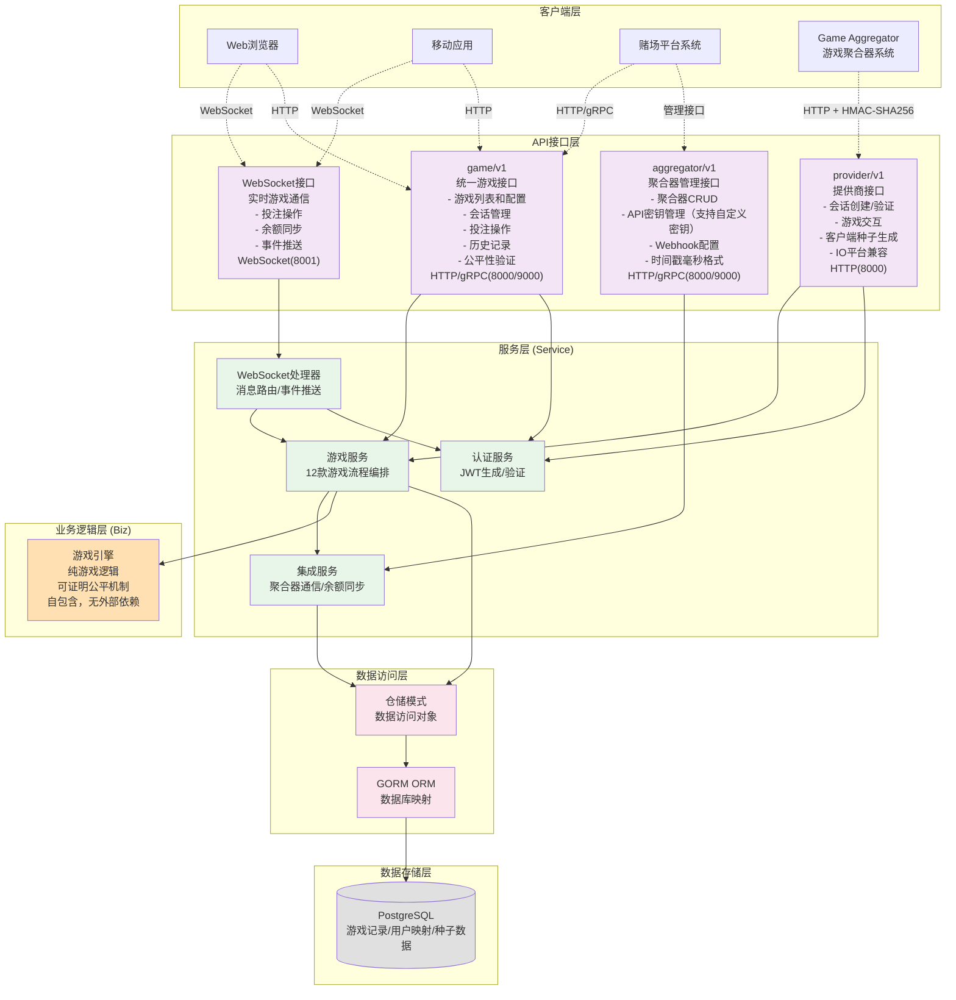
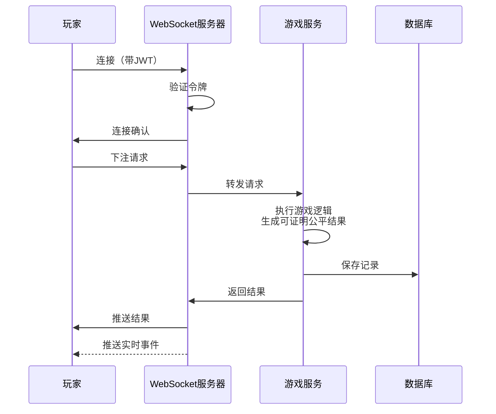

# Invoker Server 业务架构图

## 系统概览

Invoker Server 是一个为赌场平台设计的内部原创游戏提供商服务，提供具有可证明公平机制的多样化游戏。系统专注于游戏逻辑实现，余额管理由游戏聚合器负责。

### 已实现的游戏（12款）

**即时游戏（6款）**：
- ✅ **骰子(Dice)** - 大小猜测游戏
- ✅ **基诺(Keno)** - 数字彩票游戏
- ✅ **林波(Limbo)** - 倍数预测游戏
- ✅ **弹珠机(Plinko)** - 弹珠下落游戏
- ✅ **龙虎斗(DragonTiger)** - 比大小游戏
- ✅ **轮盘(Roulette)** - 经典轮盘游戏

**会话游戏（5款）**：
- ✅ **地雷(Mines)** - 扫雷游戏，逐步揭示
- ✅ **HiLo** - 高低预测游戏
- ✅ **鸡路(ChickenRoad)** - 路径选择游戏
- ✅ **龙塔(DragonTower)** - 爬塔游戏
- ✅ **21点(Blackjack)** - 经典纸牌游戏

**多人实时游戏（1款）**：
- ✅ **撞击(Crash)** - 实时倍数增长游戏

服务采用 Kratos v2 框架构建，直接暴露 WebSocket、HTTP 和 gRPC 端点，无需独立的 API 网关。

## 业务架构图

## 数据流程图

## 核心组件说明

### 1. **客户端层**
- **Web浏览器**: 通过JavaScript WebSocket API连接
- **移动应用**: iOS/Android原生应用
- **赌场平台系统**: 第三方赌场平台通过集成API接入

### 2. **API接口层**
- **game/v1**: 统一游戏API，支持WebSocket、HTTP和gRPC
  - WebSocket: 实时游戏交互，支持 Protocol Buffers 和 JSON
  - HTTP/gRPC: 游戏配置、历史记录、公平性验证等
  - 连接初始化：自动发送游戏配置
- **provider/v1**: 游戏聚合器接口
  - HMAC-SHA256认证
  - 会话管理和游戏操作
- **aggregator/v1**: 聚合器管理接口
  - 主密钥认证
  - 聚合器配置管理

### 3. **服务层 (Service)**
- **游戏服务**: 流程编排和外部集成，不包含游戏逻辑
  - 即时游戏：Dice、Keno、Limbo、Plinko、DragonTiger、Roulette
  - 会话游戏：Mines、HiLo、ChickenRoad、DragonTower、Blackjack
  - 多人实时游戏：Crash
  - 职责：聚合器通信、余额同步、数据持久化
- **JWT服务**: 处理JWT令牌的生成、验证和刷新
  - 令牌生成：包含session_id、user_id、aggregator_id、game_id等
  - 令牌验证：验证有效性和签名
  - 自动刷新：2小时过期，1.5小时自动刷新
- **WebSocket处理器**: 管理连接、消息路由和事件订阅
  - 基于 MessageHandlerFunc 的路由机制
  - 统一事件分发机制
  - JWT认证和自动刷新
  - 实时余额同步
- **投注活动广播器(BetActivityBroadcaster)**: 实时推送和历史缓存
  - 环形缓冲区(RecentActivityBuffer)存储最近200条投注记录
  - 批量推送机制（每3秒或达到10条消息）
  - 智能采样策略（高频时采样，低频时全量）
  - 通过 RESTful API `POST /v1/bets/activities` 支持历史查询（无需认证）
- **集成服务**:
  - 聚合器通信和余额同步
  - 用户ID映射（聚合器ID到内部ID）
  - Sony Flake ID生成（分布式唯一ID）
- **定时任务服务**: Plinko延迟结算兜底（每20秒扫描超时游戏）

### 4. **业务逻辑层 (Biz)**
- 每个游戏独立实现核心逻辑
- 直接使用 SHA256 生成可证明公平的随机结果
- 自包含，无外部依赖

### 5. **数据访问层**
- **仓储模式**: 提供统一的数据访问接口
- **GORM ORM**: Go语言的ORM框架，处理数据库映射和查询

### 6. **数据存储层**
- **PostgreSQL**: 存储游戏记录、用户数据、种子信息等持久化数据，同时也存储游戏会话和连接状态信息

## API接口体系

### 三大API体系
1. **Game API** (`/api/game/v1/`) - 统一游戏接口
   - 认证、会话、种子、历史、公平性验证服务
   - 支持HTTP/gRPC和WebSocket
   
2. **Provider API** (`/api/provider/v1/`) - 游戏聚合器接口
   - HMAC-SHA256认证
   - 会话创建、游戏操作、客户端种子生成
   
3. **Aggregator API** (`/api/aggregator/v1/`) - 聚合器管理
   - 主密钥认证
   - 聚合器CRUD、密钥管理

## API通信协议详解

### Provider API (游戏提供商接口)
**端口**: 8000
**认证**: HMAC-SHA256 签名验证

**主要功能**:
- 会话管理：CreateSession、GetSession
- 游戏操作：Play
- 种子生成：GenerateClientSeed  
- IO平台兼容：CreateIOSession
- 游戏列表：GetGames

**特性**:
- 完整的错误码体系
- 游戏注册表动态管理
- 请求验证框架
- 结构化日志系统
- JWT令牌生成供WebSocket使用

### Game API 与服务层交互

1. **WebSocket 协议** (主要用于实时游戏)
   - 认证方式：JWT令牌验证（连接时通过URL参数token传递）
   - 传输格式：支持 Protocol Buffers 和 JSON 双格式
   - 消息结构：使用 `WebSocketMessage` 作为统一消息容器
   - 用途：
     - 实时下注 (PlaceBetRequest/Response)
     - 游戏状态获取 (GetGameStateRequest/Response)
     - 事件订阅 (Subscribe/Unsubscribe)
     - 心跳保活 (Ping/Pong)
   - 特点：
     - 双向实时通信
     - 低延迟
     - 支持事件推送
     - JWT令牌自动刷新（在令牌即将过期时自动刷新）

2. **HTTP/gRPC 协议** (用于非实时操作)
   - 传输格式：Protocol Buffers
   - 用途：
     - 获取游戏配置 (GetDiceGameConfig)
     - 创建服务器种子 (CreateServerSeed)
     - 查询历史记录 - 包含完整公平性验证信息
     - 公平性验证 - 独立验证游戏结果
   - 特点：
     - 请求-响应模式
     - RESTful API 通过 gRPC-Gateway 自动生成
     - 适合状态查询和配置管理
     - 历史记录接口返回完整的公平性数据

### 协议选择

实时游戏用 WebSocket，配置查询用 HTTP/gRPC。

## WebSocket 消息路由

- **Hub**: 管理连接生命周期
- **MessageHandler**: 基于消息类型路由到对应的 handler 函数
- **EventDispatcher**: 管理订阅和广播

## 核心特性

- **可证明公平**: 服务器种子+客户端种子+Nonce，结果可独立验证
- **实时通信**: WebSocket 低延迟，事件订阅，心跳保活
- **安全认证**: JWT（WebSocket/Game API）、HMAC-SHA256（Provider API）、主密钥（Aggregator API）
- **会话游戏**: 持久化状态，支持断线重连（Mines、Blackjack等）

## 相关文档

- **[详细设计文档](./detailed-design-zh.md)** - 系统设计、API 设计、数据模型、认证授权
- **[序列图文档](./sequence-diagrams-zh.md)** - 业务流程可视化
- **[WebSocket API](./websocket-api-reference-zh.md)** - WebSocket 消息格式和示例
- **[RESTful API](https://storage.googleapis.com/speedix-invoker-api-docs/index.html)** - HTTP/gRPC 端点文档