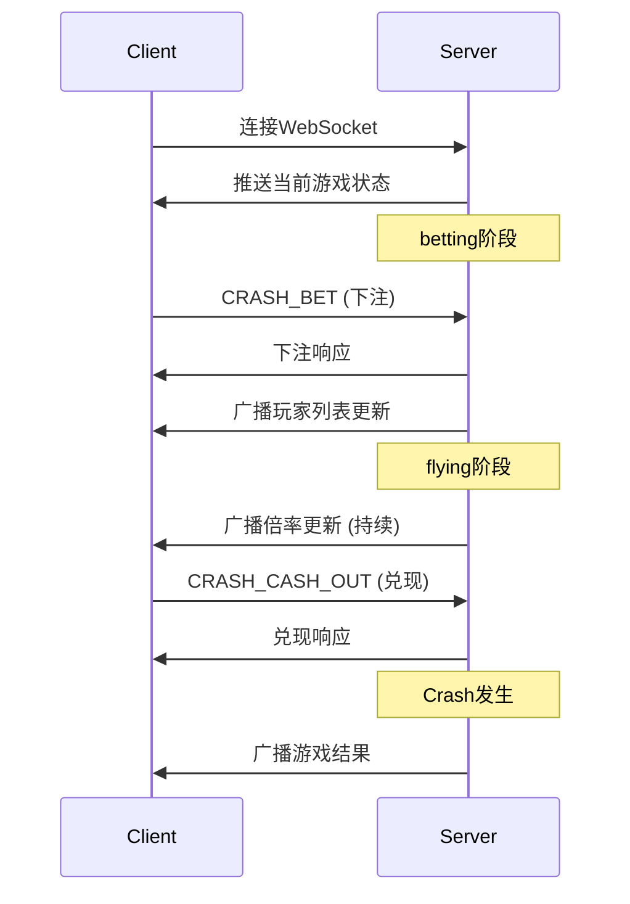

# Crash WebSocket API 文档

## 1. 概述

Crash是一款多人实时倍率游戏，通过WebSocket实现实时通信。本文档描述了Crash游戏的所有WebSocket消息格式和交互流程。

### 1.1 连接信息

- **端口**: 8001
- **路径**: `/ws`
- **协议**: WebSocket
- **认证**: JWT Token (Bearer)

### 1.2 消息格式

所有消息采用统一的WebSocket消息格式：

```json
{
  "i": "message-id",       // 消息ID
  "t": "message-type",     // 消息类型
  "p": {                   // 消息负载
    // 具体消息内容
  }
}
```

## 2. 游戏流程

### 2.1 游戏阶段

Crash游戏包含三个阶段，循环进行：

1. **betting** (5-8秒): 接受投注
2. **flying** (随机): 倍率上升，可以兑现
3. **waiting** (3-5秒): 显示结果，准备下一局

### 2.2 基本交互流程



## 3. 消息类型

### 3.1 客户端请求消息

| 消息类型 | 说明 | 可用阶段 |
|---------|------|----------|
| PLACE_BET | 下注（通过gameParams.crashParams） | betting |
| CASH_OUT | 兑现 | flying |
| GET_STATE | 获取当前状态 | 任何时候 |
| CANCEL_BET | 取消投注 | betting |
| CRASH_SUBSCRIBE | 订阅游戏事件 | 任何时候 |
| CRASH_UNSUBSCRIBE | 取消订阅 | 任何时候 |

### 3.2 服务端响应消息

| 消息类型 | 说明 | 触发时机 |
|---------|------|----------|
| PLACE_BET_RESPONSE | 下注响应 | 下注后 |
| CASH_OUT_RESPONSE | 兑现响应 | 兑现后 |
| GET_STATE_RESPONSE | 状态响应 | 请求状态后 |
| ERROR | 错误响应 | 发生错误时 |

### 3.3 服务端广播事件

| 事件类型 | 说明 | 广播频率 |
|---------|------|----------|
| CRASH_PHASE_CHANGE | 阶段变更 | 每次阶段切换 |
| CRASH_MULTIPLIER_UPDATE | 倍率更新 | Flying阶段20fps |
| CRASH_PLAYER_UPDATE | 玩家列表更新 | 有变化时 |
| CRASH_ROUND_END | 回合结束 | Crash发生时 |

## 4. 请求消息详情

### 4.1 PLACE_BET - 下注请求

**请求**:
```json
{
  "i": "msg-001",
  "t": "PLACE_BET",
  "p": {
    "amount": "150.00",  // 总投注金额（可选）
    "gameParams": {
      "crashParams": {
        "slots": [
          {
            "slotId": 1,
            "amount": "100.00"
          },
          {
            "slotId": 2,
            "amount": "50.00"
          }
        ]
      }
    }
  }
}
```

**字段说明**:
- `slots`: 投注槽位数组（最多3个）
  - `slotId`: 槽位ID (1, 2, 3)
  - `amount`: 投注金额

**响应**:
```json
{
  "i": "msg-001",
  "t": "PLACE_BET_RESPONSE",
  "p": {
    "roundId": "2024010112345678",
    "slots": [
      {
        "slotId": 1,
        "amount": "100.00",
        "status": "active"
      },
      {
        "slotId": 2,
        "amount": "50.00",
        "status": "active"
      }
    ],
    "balance": "9850.00",
    "timestamp": 1704096000000
  }
}
```

### 4.2 CASH_OUT - 兑现请求

**请求**:
```json
{
  "i": "msg-002",
  "t": "CASH_OUT",
  "p": {
    "slotId": 1,           // 指定槽位
    "cashOutAll": false    // 是否兑现所有槽位
  }
}
```

**响应**:
```json
{
  "i": "msg-002",
  "t": "CASH_OUT_RESPONSE",
  "p": {
    "results": [
      {
        "slotId": 1,
        "betAmount": "100.00",
        "multiplier": 2.35,
        "winAmount": "235.00",
        "profit": "135.00"
      }
    ],
    "balance": "10085.00",
    "timestamp": 1704096030000
  }
}
```

### 4.3 GET_STATE - 获取状态请求

**请求**:
```json
{
  "i": "msg-003",
  "t": "GET_STATE",
  "p": {}
}
```

**响应**:
```json
{
  "i": "msg-003",
  "t": "GET_STATE_RESPONSE",
  "p": {
    "roundId": "2024010112345678",
    "phase": "flying",
    "currentMultiplier": 1.85,
    "elapsedTime": 3500,
    "timeRemaining": null,
    "myBets": [
      {
        "slotId": 1,
        "amount": "100.00",
        "status": "active"
      }
    ],
    "players": [
      {
        "playerId": "player123",
        "nickname": "Alice",
        "bets": [
          {
            "amount": "100.00",
            "status": "active"
          }
        ]
      }
    ],
    "totalPlayers": 45,
    "totalBets": "15230.00",
    "timestamp": 1704096000000
  }
}
```

### 4.4 CANCEL_BET - 取消投注

**请求**:
```json
{
  "i": "msg-004",
  "t": "CANCEL_BET",
  "p": {
    "slotId": 1      // 0表示取消所有
  }
}
```

**响应**:
```json
{
  "i": "msg-004",
  "t": "CANCEL_BET_RESPONSE",
  "p": {
    "cancelled": [1],
    "refundAmount": "100.00",
    "balance": "9950.00"
  }
}
```

## 5. 广播事件详情

### 5.1 CRASH_PHASE_CHANGE - 阶段变更

```json
{
  "i": "event-001",
  "t": "CRASH_PHASE_CHANGE",
  "p": {
    "roundId": "2024010112345678",
    "phase": "betting",
    "duration": 5000,          // 阶段持续时间(ms)
    "nextPhase": "flying",
    "timestamp": 1704096000000
  }
}
```

### 5.2 CRASH_MULTIPLIER_UPDATE - 倍率更新

```json
{
  "i": "event-002",
  "t": "CRASH_MULTIPLIER_UPDATE",
  "p": {
    "multiplier": 1.85,
    "elapsedTime": 3500,       // 飞行时长(ms)
    "timestamp": 1704096003500
  }
}
```

### 5.3 CRASH_PLAYER_UPDATE - 玩家更新

```json
{
  "i": "event-003",
  "t": "CRASH_PLAYER_UPDATE",
  "p": {
    "action": "BET_PLACED",    // BET_PLACED, CASHED_OUT, LEFT
    "player": {
      "playerId": "player456",
      "nickname": "Bob",
      "avatar": "avatar_url",
      "isAnonymous": false,
      "bets": [
        {
          "slotId": 1,
          "amount": "200.00",
          "status": "active"
        }
      ]
    },
    "totalPlayers": 46,
    "totalBets": "15430.00",
    "timestamp": 1704096005000
  }
}
```

### 5.4 CRASH_ROUND_END - 回合结束

```json
{
  "i": "event-004",
  "t": "CRASH_ROUND_END",
  "p": {
    "roundId": "2024010112345678",
    "crashPoint": 3.45,
    "duration": 8523,           // 飞行持续时间
    "winners": [
      {
        "playerId": "player123",
        "nickname": "Alice",
        "betAmount": "100.00",
        "cashOutMultiplier": 2.35,
        "winAmount": "235.00",
        "profit": "135.00"
      }
    ],
    "losers": [
      {
        "playerId": "player456",
        "nickname": "Bob",
        "betAmount": "200.00",
        "lostAmount": "200.00"
      }
    ],
    "totalBets": "15430.00",
    "totalPayout": "8235.00",
    "nextRoundIn": 3000,        // 下一局倒计时
    "timestamp": 1704096008523
  }
}
```

## 6. 错误处理

### 6.1 错误响应格式

```json
{
  "i": "msg-xxx",
  "t": "ERROR",
  "p": {
    "code": "INSUFFICIENT_BALANCE",
    "message": "余额不足",
    "details": {
      "required": "150.00",
      "available": "100.00"
    },
    "timestamp": 1704096000000
  }
}
```

### 6.2 错误码

| 错误码 | 说明 | HTTP状态码 |
|--------|------|------------|
| UNAUTHORIZED | 未认证 | 401 |
| INSUFFICIENT_BALANCE | 余额不足 | 400 |
| INVALID_AMOUNT | 无效金额 | 400 |
| INVALID_PHASE | 阶段不匹配 | 400 |
| BET_NOT_FOUND | 投注不存在 | 404 |
| ALREADY_CASHED_OUT | 已经兑现 | 400 |
| ROUND_ENDED | 回合已结束 | 400 |
| MAX_BETS_EXCEEDED | 超过最大投注数 | 400 |
| INVALID_MULTIPLIER | 无效倍率 | 400 |
| RATE_LIMITED | 请求过于频繁 | 429 |
| INTERNAL_ERROR | 服务器内部错误 | 500 |

## 7. 实时统计

### 7.1 CRASH_STATS - 游戏统计

服务器定期推送游戏统计信息：

```json
{
  "i": "event-005",
  "t": "CRASH_STATS",
  "p": {
    "last24h": {
      "totalRounds": 8640,
      "averageCrashPoint": 2.03,
      "maxCrashPoint": 523.45,
      "minCrashPoint": 1.00,
      "totalBets": "1523450.00",
      "totalPayout": "1478126.50",
      "rtp": 0.9703
    },
    "currentStreak": {
      "below2x": 3,
      "above10x": 0
    },
    "recentCrashPoints": [
      1.23, 3.45, 2.67, 1.89, 5.23,
      1.00, 2.34, 4.56, 1.45, 3.21
    ],
    "timestamp": 1704096000000
  }
}
```

## 8. 连接管理

### 8.1 心跳机制

客户端应定期发送心跳以维持连接：

**请求**:
```json
{
  "i": "ping-001",
  "t": "PING",
  "p": {
    "timestamp": 1704096000000
  }
}
```

**响应**:
```json
{
  "i": "pong-001",
  "t": "PONG",
  "p": {
    "timestamp": 1704096000001
  }
}
```

### 8.2 断线重连

重连后，客户端应立即请求当前状态：

```javascript
// 重连示例
ws.onopen = () => {
  // 1. 发送认证
  ws.send(JSON.stringify({
    i: "auth-001",
    t: "AUTH",
    p: { token: "jwt-token" }
  }));

  // 2. 获取当前状态
  ws.send(JSON.stringify({
    i: "state-001",
    t: "CRASH_GET_STATE",
    p: {}
  }));
};
```

## 9. 订阅管理

### 9.1 订阅事件

客户端可以选择性订阅特定事件：

**请求**:
```json
{
  "i": "sub-001",
  "t": "SUBSCRIBE",
  "p": {
    "eventTypes": [
      "CRASH_MULTIPLIER_UPDATE",
      "CRASH_PLAYER_UPDATE"
    ]
  }
}
```

### 9.2 取消订阅

**请求**:
```json
{
  "i": "unsub-001",
  "t": "UNSUBSCRIBE",
  "p": {
    "eventTypes": ["CRASH_PLAYER_UPDATE"]
  }
}
```

## 10. 最佳实践

### 10.1 连接建立

```javascript
// 建立连接示例
const ws = new WebSocket('wss://api.example.com/ws');

ws.onopen = () => {
  console.log('Connected');

  // 发送认证
  ws.send(JSON.stringify({
    i: generateId(),
    t: 'AUTH',
    p: { token: getAuthToken() }
  }));
};

ws.onmessage = (event) => {
  const message = JSON.parse(event.data);
  handleMessage(message);
};

ws.onerror = (error) => {
  console.error('WebSocket error:', error);
};

ws.onclose = () => {
  console.log('Disconnected');
  // 实现重连逻辑
  setTimeout(reconnect, 1000);
};
```

### 10.2 消息处理

```javascript
function handleMessage(message) {
  switch(message.t) {
    case 'CRASH_PHASE_CHANGE':
      updatePhase(message.p);
      break;
    case 'CRASH_MULTIPLIER_UPDATE':
      updateMultiplier(message.p);
      break;
    case 'CRASH_ROUND_END':
      showResults(message.p);
      break;
    case 'ERROR':
      handleError(message.p);
      break;
    default:
      console.log('Unknown message type:', message.t);
  }
}
```

### 10.3 投注流程

```javascript
// 投注示例
async function placeBet(amount) {
  const message = {
    i: generateId(),
    t: 'PLACE_BET',
    p: {
      '@type': 'type.googleapis.com/api.game.v1.GameParams',
      crash: {
        slots: [{
          slotId: 1,
          amount: amount.toString()
        }]
      }
    }
  };

  ws.send(JSON.stringify(message));
}

// 兑现示例
async function cashOut(slotId) {
  const message = {
    i: generateId(),
    t: 'CASH_OUT',
    p: {
      '@type': 'type.googleapis.com/api.game.v1.CrashCashOutRequest',
      slotId: slotId
    }
  };

  ws.send(JSON.stringify(message));
}
```

## 11. 性能建议

### 11.1 消息频率限制

- 下注请求：最多5次/秒
- 兑现请求：最多10次/秒
- 状态查询：最多2次/秒
- 其他请求：最多5次/秒

### 11.2 数据优化

- 使用消息ID进行请求响应匹配
- 批量处理多个槽位操作
- 根据需要订阅/取消订阅事件
- 实现本地缓存减少重复查询

### 11.3 网络优化

- 启用WebSocket压缩
- 使用二进制格式传输大量数据
- 实现断线重连和消息队列
- 监控网络延迟并进行补偿

## 12. 安全考虑

### 12.1 认证

- 使用JWT Token进行身份验证
- Token应包含用户ID、过期时间等信息
- 定期刷新Token避免过期

### 12.2 数据验证

- 客户端应验证服务器消息格式
- 检查金额、倍率等数值的合理性
- 防止重放攻击

### 12.3 限流保护

- 实施请求频率限制
- 检测异常行为模式
- 必要时断开恶意连接

## 13. 测试环境

### 13.1 测试服务器

- URL: `wss://test-api.example.com/ws`
- 测试Token: 通过测试API获取

### 13.2 测试工具

可以使用以下工具测试WebSocket：
- Chrome DevTools
- wscat命令行工具
- Postman WebSocket功能
- 自定义HTML测试页面

### 13.3 模拟场景

测试环境支持以下模拟：
- 快速Crash（调试模式）
- 固定倍率序列
- 高并发玩家模拟
- 网络延迟模拟

## 14. 版本历史

| 版本 | 日期 | 更新内容 |
|------|------|----------|
| 1.0.0 | 2024-01-01 | 初始版本 |

## 附录：完整消息类型列表

### 客户端消息

- AUTH - 认证
- PING - 心跳
- PLACE_BET - 下注
- CASH_OUT - 兑现
- GET_STATE - 获取状态
- CANCEL_BET - 取消投注
- CRASH_SUBSCRIBE - 订阅Crash事件
- CRASH_UNSUBSCRIBE - 取消订阅

### 服务端消息

- AUTH_RESPONSE - 认证响应
- PONG - 心跳响应
- PLACE_BET_RESPONSE - 下注响应
- CASH_OUT_RESPONSE - 兑现响应
- GET_STATE_RESPONSE - 状态响应
- CANCEL_BET_RESPONSE - 取消响应
- ERROR - 错误响应

### 广播事件

- CRASH_PHASE_CHANGE - 阶段变更
- CRASH_MULTIPLIER_UPDATE - 倍率更新
- CRASH_PLAYER_UPDATE - 玩家更新
- CRASH_ROUND_END - 回合结束
- CRASH_STATS - 统计更新