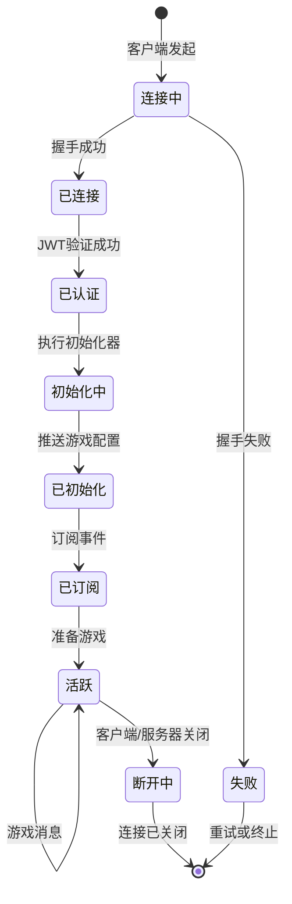
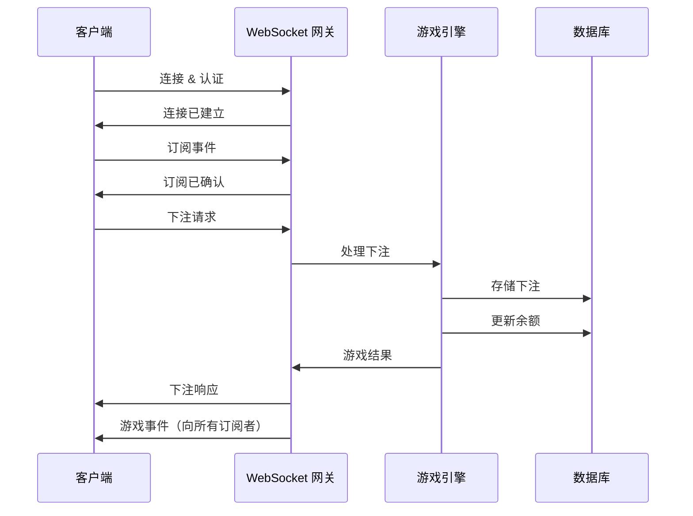
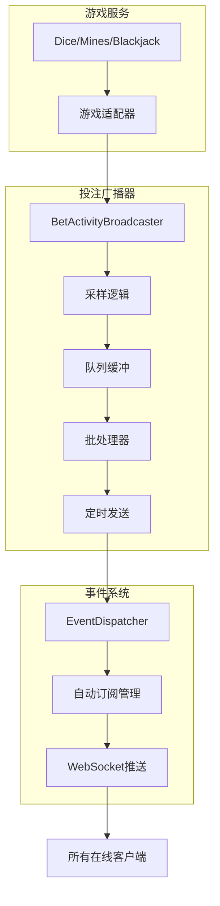
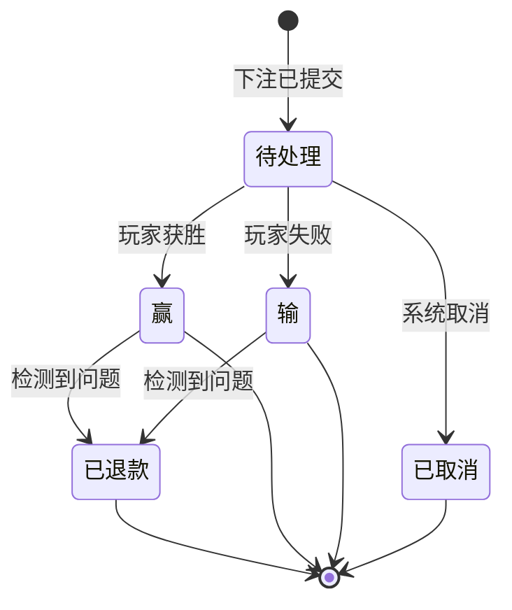
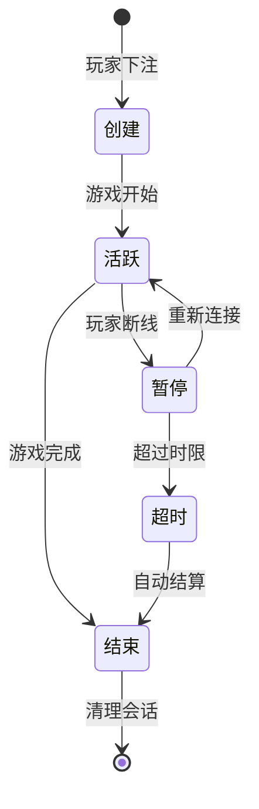
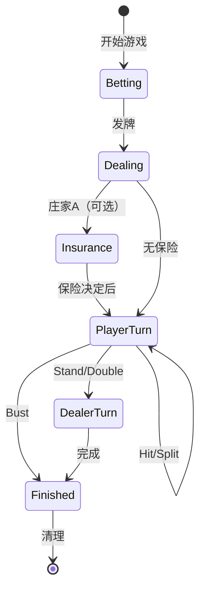
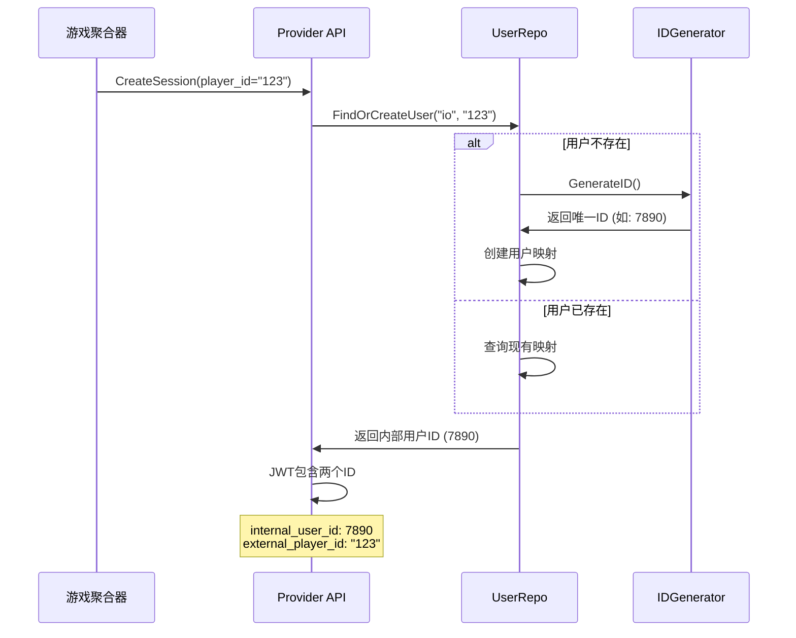
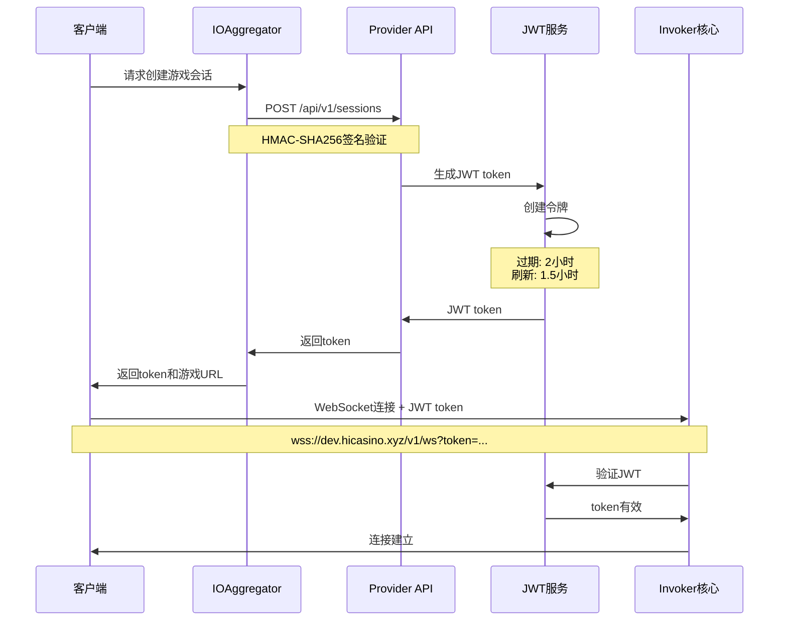

# 详细设计文档 - Invoker Server

## 目录
1. [概述](#概述)
2. [API 设计原则](#api-设计原则)
3. [Provider API 设计](#provider-api-设计) ✅ 新增
4. [WebSocket API 设计](#websocket-api-设计)
5. [HTTP/gRPC API 设计](#httpgrpc-api-设计)
6. [数据模型](#数据模型)
7. [游戏会话管理](#游戏会话管理)
8. [用户身份管理](#用户身份管理) ✅ 新增
9. [认证与授权](#认证与授权)
10. [错误处理](#错误处理)
11. [速率限制与节流](#速率限制与节流)
12. [监控与可观测性](#监控与可观测性)

## 概述

Invoker Server 是一个提供具有可证明公平机制的赌场游戏的微服务。系统暴露两个主要的 API 接口：

1. **Game API** - 统一的游戏接口，支持 WebSocket、HTTP 和 gRPC 协议
   - WebSocket: 实时游戏交互
   - HTTP/gRPC: RESTful 游戏操作
   - 为所有客户端（玩家、平台、聚合器）提供统一接口
2. **Aggregator API** - 聚合器管理接口
   - 管理接入的赌场平台
   - API 密钥和安全配置

> 📊 **系统架构详情**：完整的系统架构图和组件说明请参考 [架构文档](./architecture-zh.md)

## API 设计原则

### 1. 版本控制策略
- **URL 路径版本控制**：`/v1/`、`/v2/`
- **语义化版本控制**：主版本.次版本.补丁版本
- **向后兼容性**：弃用版本至少支持 6 个月
- **版本协商**：HTTP 通过 Accept 头，WebSocket 通过消息字段

### 2. 协议选择指南
| 使用场景 | 协议 | 理由 |
|----------|----------|-----------|
| 实时游戏事件 | WebSocket | 低延迟，双向通信 |
| 游戏配置 | HTTP/gRPC | 请求-响应模式 |
| 下注 | WebSocket/HTTP | 两种方式都支持以提供灵活性 |
| 集成 API | gRPC | 高性能，强类型 |

### 3. 消息格式标准
- **Protocol Buffers**：主要序列化格式
- **JSON**：Web 客户端的辅助格式
- **消息封装**：所有消息的一致性包装器

## Provider API 设计

### 概述
Provider API 是专门为游戏聚合器（GA）设计的标准化接口，运行在独立的端口（8002）上，提供完整的游戏集成功能。

### 核心特性

#### 1. 认证机制 ✅ *已实现*
- **HMAC-SHA256 签名验证**
  - 所有请求必须包含 `X-API-KEY` 和 `X-SIGNATURE` 头部
  - 签名算法：`HMAC-SHA256(message, API_KEY_SECRET)`
  - 支持请求时间戳验证，防止重放攻击
  - 中间件实现：`internal/middleware/auth/hmac.go`

#### 2. 会话管理 ✅ *已实现*
- **JWT Token 管理**
  - 使用JWT令牌代替传统会话
  - 2小时token过期时间
  - 1.5小时后自动刷新
  - 令牌包含session_id、user_id、aggregator_id、game_id、operator_id、currency信息
  - WebSocket连接通过URL参数传递token
  - JWT服务实现：`internal/service/jwt/jwt_service.go`

#### 3. 交易管理 ❌ *已移除*
- **架构更新**
  - 从 v1.0 开始，所有交易管理功能已移至游戏聚合器
  - Invoker 不再维护交易日志或处理余额变化
  - 游戏结果仅记录游戏逻辑数据，不涉及金钱交易
  - 聚合器负责所有BET、WIN、ROLLBACK的交易处理

#### 4. 幂等性保证 ❌ *不再需要*
- **架构更新说明**
  - 回滚功能已移至游戏聚合器处理
  - Provider API 的 `/rollback` 端点返回 `NOT_SUPPORTED`
  - 幂等性保证现在由聚合器负责实现
  - Invoker 专注于游戏逻辑的幂等性（如防止重复发牌）

#### 5. 游戏适配器 ✅ *已实现*
- **统一游戏接口**
  - GameAdapter 封装不同游戏的具体实现
  - 支持 Dice、Mines、Blackjack
  - 统一的请求/响应格式
  - 实现：`internal/service/provider/game_adapter.go`

### 增强功能

#### 1. 错误处理框架 ✅ *已实现*
```go
// 错误码分类
- 认证错误：MISSING_SIGNATURE, INVALID_SIGNATURE, EXPIRED_REQUEST
- 验证错误：MISSING_PARAMETER, INVALID_PARAMETER
- 会话错误：SESSION_NOT_FOUND, SESSION_EXPIRED, SESSION_INACTIVE
- 游戏错误：GAME_NOT_FOUND, GAME_IN_PROGRESS, INVALID_BET
- 余额错误：INSUFFICIENT_BALANCE, BALANCE_ERROR（注：余额管理已移至聚合器）
- 交易错误：TRANSACTION_NOT_FOUND, ROLLBACK_NOT_ALLOWED
- 服务器错误：INTERNAL_ERROR, DATABASE_ERROR, NETWORK_ERROR
```
实现：`internal/service/provider/errors.go`

#### 2. 结构化日志 ✅ *已实现*
- **RequestLogger**: API 请求响应日志
- **TransactionLogger**: 交易操作日志
- **GameLogger**: 游戏回合日志
- **SecurityLogger**: 安全事件日志
- **PerformanceLogger**: 性能监控日志

实现：`internal/service/provider/loggers.go`

#### 3. 游戏注册表 ✅ *已实现*
```go
// 动态游戏配置管理（简化版，实际结构更复杂）
type GameConfig struct {
    // 基本信息
    ID          int64    `json:"id"`
    GameID      string   `json:"gameId"`      // 如 "inhousegame:dice"
    Name        string   `json:"gameName"`
    Category    string   `json:"category"`
    Status      string   `json:"status"`  // active, coming_soon, maintenance
    Description string   `json:"description"`
    
    // 下注限制（从 betInfo 中提取）
    BetInfo     []BetInfo `json:"betInfo"`
    BetRange    string    `json:"betRange"`
    
    // 高级配置（包含 RTP 控制、新老用户策略等）
    RTPOptions   RTPOptions   `json:"rtpOptions"`
    NewUser      NewUserConfig `json:"newUser"`
    OldUser      OldUserConfig `json:"oldUser"`
    TotalControl TotalControl  `json:"totalControl"`
}
```
实现：`internal/service/provider/game_registry.go`
注：完整的 GameConfig 结构包含更多高级配置字段，用于游戏的精细化控制

#### 4. 余额缓存服务 ❌ *已移除*
- **架构更新**
  - 余额管理功能已完全移至游戏聚合器
  - Invoker 不再缓存或管理玩家余额
  - 所有余额查询通过聚合器的API进行
  - 相关代码已从代码库中移除

#### 5. 监控和指标 ⚠️ *部分实现*
- 请求计数和成功率 ⚠️ *未实现*
- 响应时间统计 ⚠️ *未实现*
- 错误分布分析 ⚠️ *未实现*
- 健康检查端点 ⚠️ *未实现*
- 性能日志记录 ✅ *已实现* (PerformanceLogger)

### CreateSession 业务逻辑

#### 请求验证流程
1. **参数验证**：
   - `player_id` 必需，不能为空
   - `game_id` 必需，不能为空
   - `currency` 必需，应为有效货币代码
   - `operator_id` 必需，标识运营商

2. **游戏验证**：
   - 检查 `game_id` 是否在游戏注册表中存在
   - 验证游戏状态是否为 "active"
   - 注意：游戏ID格式为 "inhousegame:游戏名"（如 "inhousegame:dice"）

3. **会话管理**：
   - 检查玩家是否已有该游戏的活跃会话
   - 如有，先关闭旧会话再创建新会话
   - 新会话有效期：2小时

4. **JWT 生成**：
   - JWT Claims 包含用户身份信息
   - `UserID`: 内部用户ID（Sony Flake生成的int64）
   - `AggregatorID`: 聚合器标识（如 "io", "ga1"）  
   - `GameID`: 游戏ID，用于自动配置下发
   - 其他业务信息：SessionID、OperatorID、Currency等

### 管理端点
- `/admin/health` - 系统健康检查
- `/admin/metrics` - 性能指标
- `/admin/games` - 游戏状态管理
- `/admin/metrics/reset` - 重置指标（需认证）

## WebSocket API 设计

### 连接生命周期



### 消息格式规范

所有 WebSocket 消息遵循统一结构：

```protobuf
message WebSocketMessage {
  string id = 1;           // 用于请求/响应关联的 UUID
  string type = 2;         // 消息类型标识符
  int64 timestamp = 3;     // Unix 时间戳（毫秒）
  oneof payload {          // 多态负载
    // ... 具体消息类型
  }
}
```

#### 消息类型
| 类型 | 方向 | 描述 |
|------|-----------|-------------|
| `game_config` | 服务器→客户端 | 游戏配置推送（自动） |
| `initialization_complete` | 服务器→客户端 | 初始化完成通知 |
| `PLACE_BET_REQUEST` | 客户端→服务器 | 发起下注 |
| `PLACE_BET_RESPONSE` | 服务器→客户端 | 下注结果 |
| `SUBSCRIBE_REQUEST` | 客户端→服务器 | 订阅事件 |
| `SUBSCRIBE_RESPONSE` | 服务器→客户端 | 订阅确认 |
| `GAME_EVENT` | 服务器→客户端 | 游戏状态更新 |
| `ERROR` | 服务器→客户端 | 错误通知 |
| `PING/PONG` | 双向 | 心跳 |
| `token_refresh` | 服务器→客户端 | JWT令牌自动刷新 |

### 连接初始化流程

WebSocket 连接建立后，系统会自动执行一系列初始化操作，确保客户端获得必要的配置信息。

#### 初始化器机制
系统采用初始化器链模式，支持灵活扩展：

1. **GameConfigInitializer**（优先级: 10）
   - 自动推送当前游戏的配置信息
   - 游戏ID来源优先级：JWT token 中的 `game_id` > URL 参数 `game_id`
   - 如果未指定游戏ID，则跳过配置推送

2. **初始化流程**
   ```
   1. 客户端连接 WebSocket（带 JWT token）
   2. 服务器验证 JWT token
   3. 执行初始化器链（按优先级排序）
   4. GameConfigInitializer 推送游戏配置（如有）
   5. 发送 initialization_complete 消息
   6. 客户端可以开始游戏操作
   ```

3. **游戏配置内容**
   - 基本信息：游戏ID、名称、类别、状态
   - 下注限制：最小/最大下注金额
   - RTP 配置：默认RTP、可选RTP范围
   - 特性列表：支持的功能（如 provably_fair）
   - 货币支持：从 betInfo 数组中提取支持的货币
   - 高级配置：新老用户差异化设置、总体控制参数等

### 事件类型枚举设计 ✅ *已实现*

WebSocket 系统从字符串事件类型迁移到 Protocol Buffers 枚举，提供更好的类型安全和开发体验。

#### 设计决策

1. **为什么使用枚举**
   - **类型安全**：编译时检查，避免拼写错误
   - **性能优势**：整数比较比字符串比较更快
   - **版本控制**：枚举值固定，便于向后兼容
   - **文档自动化**：从 proto 文件生成文档

2. **枚举命名规范**
   ```protobuf
   enum EventType {
     EVENT_TYPE_UNSPECIFIED = 0;      // 默认值，符合 proto3 规范
     EVENT_TYPE_BET_PLACED = 1;       // 前缀避免命名冲突
     EVENT_TYPE_GAME_RESULT = 2;      // 清晰的语义
     // ... 其他事件类型
   }
   ```

3. **字符串表示**
   - 枚举的 `String()` 方法返回完整名称（如 "EVENT_TYPE_BET_ACTIVITY_BATCH"）
   - 客户端需要使用这个字符串格式进行订阅和事件处理

### 事件订阅模型

```protobuf
message SubscribeRequest {
  string player_id = 1;
  repeated string event_types = 2;  // 使用枚举的字符串表示
  string filters = 3;               // JSON 编码的过滤器
}
```

支持的事件类型（使用 EventType 枚举）：
- `EVENT_TYPE_GAME_RESULT` - 单个游戏结果
- `EVENT_TYPE_BET_ACTIVITY_BATCH` - 批量投注活动（自动订阅）
- `EVENT_TYPE_LIVE_STATS` - 实时统计
- `EVENT_TYPE_JACKPOT` - 累积奖池变化
- `EVENT_TYPE_BIG_WIN` - 大额获胜通知

### 实时游戏流程



### 错误恢复机制

1. **自动重连**
   - 指数退避：1秒、2秒、4秒、8秒、16秒、30秒（最大）
   - 使用 session_id 恢复会话
   - 离线消息队列

2. **幂等性** - ❌ *未实现*
   - 所有下注请求包含幂等键
   - 服务器在 24 小时窗口内去重
   
> ⚠️ **实现状态**：
> - 无幂等键检查机制
> - 可能导致网络重试时重复下注

**JWT Token自动刷新** ✅ *已实现*
- TokenRefresher组件监控所有WebSocket连接
- 在token过期前30分钟自动刷新
- 通过`token_refresh`消息通知客户端（注意：小写）
- 客户端应保存新token用于重连
- 每分钟检查一次是否需要刷新

3. **状态同步** - *部分实现*
   - 重连后的 `GET_GAME_STATE` 请求 - ✅ 已实现基础版本
   - 服务器保留每个会话的最后 100 条消息 - ❌ *未实现*
   - JWT token重连验证 - ✅ *已实现*
   
> ⚠️ **实现状态**：
> - GameSession 管理已实现，但无消息历史保存
> - GET_GAME_STATE 返回简单状态，无历史消息
> - 重连时需使用有效的JWT token

### 实时投注活动广播架构 ✅ *已实现*

实时投注活动广播是增强游戏氛围的重要功能，让所有玩家都能看到其他人的投注活动。

#### 架构设计



#### 核心组件

1. **BetActivityBroadcaster**
   ```go
   type BetActivityBroadcaster struct {
       config          *BetBroadcastConfig
       activityQueue   chan *BetActivity     // 异步队列
       batchBuffer     []*BetActivityEvent   // 批次缓冲
       batchTimer      *time.Timer           // 定时器
       eventDispatcher *EventDispatcher      // 事件分发
       stats           *BroadcasterStats     // 统计信息
   }
   ```

2. **配置管理**
   ```yaml
   game:
     bet_broadcast:
       enabled: true
       queue_size: 5000           # 队列容量
       batch_interval: 500ms      # 批次间隔
       max_batch_size: 20         # 最大批次大小
       sampling:
         small_bet_threshold: 10.0   # 小额阈值
         small_bet_rate: 0.1         # 10% 采样率
         medium_bet_threshold: 100.0 # 中额阈值
         medium_bet_rate: 0.5        # 50% 采样率
   ```

#### 采样策略

```go
func (b *BetActivityBroadcaster) shouldBroadcast(activity *BetActivity) bool {
    // 1. 大赢特殊处理（10倍以上）
    if activity.IsWin && activity.WinAmount > activity.BetAmount * 10 {
        return true // 始终显示
    }
    
    // 2. 金额分级采样
    if activity.BetAmount < smallThreshold {
        return random() < 0.1  // 10%
    } else if activity.BetAmount < mediumThreshold {
        return random() < 0.5  // 50%
    } else {
        return true           // 100%
    }
}
```

#### 隐私保护

```go
func maskPlayerID(playerID string) string {
    if len(playerID) <= 6 {
        return "***"
    }
    // "player_123456" → "pla***456"
    return playerID[:3] + "***" + playerID[len(playerID)-3:]
}
```

#### 性能优化

1. **异步处理**
   - 非阻塞队列：`select` with `default` 避免阻塞游戏主流程
   - 背压控制：队列满时丢弃，记录统计

2. **批量发送**
   - 减少网络调用：500ms 收集一批
   - 减少消息数量：客户端处理更高效

3. **内存管理**
   - 预分配缓冲区：避免频繁分配
   - 重用消息对象：减少 GC 压力

#### 自动订阅机制 ✅ *已优化*

为了确保所有用户（包括未登录用户）都能接收到实时投注活动，系统采用了两层自动订阅机制：

1. **连接级自动订阅**（新增）
```go
// Connection.Start() - 在连接建立时立即订阅
func (c *Connection) Start() {
    // 自动订阅投注活动事件（包括未认证用户）
    eventTypes := []string{EventType_EVENT_TYPE_BET_ACTIVITY_BATCH.String()}
    if err := c.subscriptions.Subscribe(eventTypes); err != nil {
        c.logger.Errorf("Failed to auto-subscribe to bet activity events: %v", err)
    }
    // ...
}
```

2. **初始化器订阅**（已有，增加重复检测）
```go
// BetActivityInitializer 在用户认证后执行
type BetActivityInitializer struct {
    logger *log.Helper
}

func (b *BetActivityInitializer) Initialize(ctx context.Context, conn *Connection) error {
    eventType := EventType_EVENT_TYPE_BET_ACTIVITY_BATCH.String()
    
    // 检查是否已订阅，避免重复
    if conn.IsSubscribed(eventType) {
        b.logger.Infof("Connection %s already subscribed to bet activity events", conn.GetID())
        return nil
    }
    
    eventTypes := []string{eventType}
    return conn.subscriptions.Subscribe(eventTypes)
}

func (b *BetActivityInitializer) Priority() int {
    return 20 // 在游戏配置之后执行
}
```

> 📝 **实现说明**：
> - 未登录用户在连接建立时即可接收投注活动
> - 已登录用户保持原有的初始化器机制
> - 通过重复检测避免多次订阅同一事件

#### 监控指标

| 指标名称 | 描述 | 告警阈值 |
|---------|------|----------|
| total_received | 总接收投注数 | - |
| total_broadcasted | 总广播投注数 | - |
| total_dropped | 总丢弃投注数 | > 1% |
| queue_utilization | 队列使用率 | > 80% |
| batch_size_avg | 平均批次大小 | < 5 |

### 连接状态管理

```typescript
enum ConnectionState {
  CONNECTING = "CONNECTING",
  CONNECTED = "CONNECTED",
  AUTHENTICATED = "AUTHENTICATED",
  RECONNECTING = "RECONNECTING",
  DISCONNECTED = "DISCONNECTED",
  ERROR = "ERROR"
}
```

状态转换触发客户端事件以更新 UI。

## HTTP/gRPC API 设计

### RESTful 端点约定

基础 URL：`https://dev.hicasino.xyz/v1/`

| 方法 | 模式 | 描述 |
|--------|---------|-------------|
| GET | `/games` | 列出所有游戏 |
| GET | `/games/{id}` | 获取游戏详情 |
| POST | `/games/{id}/bets` | 下注 |
| GET | `/players/{id}/bets` | 获取下注历史 |
| GET | `/bets/{id}` | 获取下注详情 |

### 请求/响应格式

#### 标准响应封装
```json
{
  "data": { ... },
  "meta": {
    "request_id": "uuid",
    "timestamp": 1234567890,
    "version": "1.0"
  },
  "error": null
}
```

#### 错误响应
```json
{
  "data": null,
  "meta": { ... },
  "error": {
    "code": "INSUFFICIENT_BALANCE",
    "message": "玩家余额不足以进行此下注",
    "details": {
      "current_balance": 100.50,
      "required_amount": 200.00
    }
  }
}
```

### 分页标准

```protobuf
message PaginationRequest {
  int32 page_size = 1;   // 默认：20，最大：100
  string page_token = 2; // 不透明游标
}

message PaginationResponse {
  string next_page_token = 1;
  string prev_page_token = 2;
  int32 total_count = 3;
}
```

### 过滤和排序

查询参数：
- `filter[field]=value` - 字段过滤
- `filter[field][gte]=value` - 范围查询
- `sort=field,-field2` - 排序（- 表示降序）

示例：`/v1/players/123/bets?filter[game_id]=dice&filter[created_at][gte]=2024-01-01&sort=-created_at`


## 数据模型

### 核心实体

系统使用 GORM ORM 框架与 PostgreSQL 数据库交互，以下是主要的数据模型：

#### 游戏结果（GameResult）

```go
// GameResult 存储所有游戏的结果记录
type GameResult struct {
    gorm.Model                          // 包含 ID, CreatedAt, UpdatedAt, DeletedAt
    PlayerID      string                `gorm:"index"`        // 玩家ID，建立索引
    GameID        string                `gorm:"uniqueIndex"`  // 游戏唯一ID
    BetAmount     float64               // 下注金额
    WinAmount     float64               // 赢得金额（0表示输）
    IsWin         bool                  // 是否获胜
    GameOutcome   json.RawMessage       `gorm:"type:jsonb"`   // 游戏结果详情（JSON）
    ProvablyFair  json.RawMessage       `gorm:"type:jsonb"`   // 可证明公平信息（JSON）
}
```

#### 服务器种子（ServerSeed）

```go
// ServerSeed 用于可证明公平机制的服务器种子
type ServerSeed struct {
    SeedID       int64     `gorm:"primaryKey;column:seed_id"`
    UserID       string    `gorm:"column:user_id;type:varchar(255);not null;index"`
    SeedValue    string    `gorm:"column:seed_value;not null"`          // 服务端种子值
    SeedHash     string    `gorm:"column:seed_hash;not null"`           // 种子哈希（公开）
    CurrentNonce int64     `gorm:"column:current_nonce;default:0"`      // 当前nonce值
    CreatedAt    time.Time `gorm:"column:created_at;autoCreateTime"`
}
```

#### ⚠️ 已废弃的会话模型

> **注意**：以下 MinesSession 和 BlackjackSession 模型已被统一的 GameSession 模型替代。
> 这些模型已从系统中移除，仅保留文档用于历史参考。

### 数据类型定义

#### Blackjack 相关类型

```go
// BlackjackCard 表示一张扑克牌
type BlackjackCard struct {
    Suit       string `json:"suit"`       // hearts, diamonds, clubs, spades
    Rank       string `json:"rank"`       // 2-10, J, Q, K, A
    Value      int    `json:"value"`      // 数值
    IsFaceDown bool   `json:"face_down"`  // 是否暗牌（庄家）
}

// BlackjackHand 表示一手牌（支持分牌后的多手）
type BlackjackHand struct {
    HandID       string          `json:"hand_id"`
    Cards        []BlackjackCard `json:"cards"`
    BetAmount    float64         `json:"bet_amount"`
    IsDoubled    bool            `json:"is_doubled"`   // 是否加倍
    IsStood      bool            `json:"is_stood"`     // 是否停牌
    IsBusted     bool            `json:"is_busted"`    // 是否爆牌
    IsBlackjack  bool            `json:"is_blackjack"` // 是否21点
    FinalValue   int             `json:"final_value"`  // 最终点数
}
```

### 数据库索引设计

| 表名 | 索引字段 | 索引类型 | 用途 |
|------|----------|----------|------|
| game_results | player_id | INDEX | 查询玩家历史记录 |
| game_results | user_id | INDEX | 查询内部用户历史记录 |
| game_results | user_id, created_at | INDEX | 按时间查询用户历史 |
| game_results | aggregator_id, player_id | INDEX | 聚合器+玩家复合查询 |
| game_results | aggregator_id, created_at | INDEX | 聚合器统计查询 |
| game_results | game_id | UNIQUE | 防止重复记录 |
| server_seeds | user_id | INDEX | 查询用户种子 |
| mines_sessions | game_id | UNIQUE | 游戏唯一性约束 |
| mines_sessions | player_id | INDEX | 查询玩家活跃游戏 |
| blackjack_sessions | game_id | UNIQUE | 游戏唯一性约束 |
| blackjack_sessions | player_id | INDEX | 查询玩家活跃游戏 |

### 数据完整性约束

1. **外键约束**（当前未实现）
   - ServerSeedID 应关联到 server_seeds 表
   - PlayerID 理论上应关联到 players 表（但当前使用 MockWallet）

2. **唯一性约束**
   - GameID 在每个游戏会话表中必须唯一
   - 防止同一游戏被多次记录

3. **非空约束**
   - 所有关键字段（PlayerID、GameID、BetAmount）不能为空
   - ClientSeed 和 ServerSeedID 用于可证明公平验证

### 状态转换



### 验证规则

1. **金额验证**
   - 必须为正数
   - 在游戏最小/最大限制内
   - 最多 2 位小数

2. **游戏特定验证**
   - 骰子：目标值在 1-99 之间
   - Crash：兑现倍数 >= 1.0
   - 地雷：网格选择有效

3. **业务约束**
   - 玩家必须有足够余额
   - 游戏必须处于活跃状态
   - 无重复下注（幂等性）- *未实现*
   
> ⚠️ **实现状态**：
> - 余额检查已实现，但缺少资金冻结机制
> - 幂等性检查未实现，可能导致重复下注
> - 无并发控制，同一用户可能并发超支

### 统一游戏会话模型 ✅ *新增*

#### GameSession - 统一会话表

```go
// GameSession 统一的游戏会话模型，支持所有游戏类型
type GameSession struct {
    ID           uint      `gorm:"primaryKey"`
    GameID       string    `gorm:"uniqueIndex;not null"`    // 游戏实例唯一ID
    SessionID    string    `gorm:"index;not null"`          // JWT会话ID
    GameType     string    `gorm:"index;not null"`          // 游戏类型：blackjack, mines, dice
    
    // 玩家信息
    PlayerID     string    `gorm:"index;not null"`          // 外部玩家ID
    UserID       int64     `gorm:"index;not null"`          // 内部用户ID
    AggregatorID string    `gorm:"index;not null"`          // 聚合器ID
    
    // 游戏状态
    RoundID      string    `gorm:"index"`                   // 聚合器回合ID
    Status       string    `gorm:"not null"`                // 游戏特定状态
    
    // 财务信息
    BetAmount    float64   `gorm:"not null"`                // 下注金额
    Currency     string    `gorm:"not null;default:'USD'"`  // 币种
    TotalPayout  float64   `gorm:"default:0"`               // 总赔付
    
    // 可证明公平
    ClientSeed   string    `gorm:"not null"`                // 客户端种子
    ServerSeedID int64     `gorm:"not null"`                // 服务端种子ID
    Nonce        int64     `gorm:"not null"`                // 随机数
    
    // 游戏特定数据
    GameData     JSONB     `gorm:"type:jsonb"`              // 游戏特定数据（JSONB）
    Metadata     JSONB     `gorm:"type:jsonb"`              // 额外元数据
    
    // 时间戳
    LastActivity time.Time  `gorm:"not null"`               // 最后活动时间
    CreatedAt    time.Time                                  // 创建时间
    UpdatedAt    time.Time                                  // 更新时间
    CompletedAt  *time.Time                                 // 完成时间（可空）
}
```

#### 游戏特定数据结构

```go
// BlackjackGameData - 21点游戏数据
type BlackjackGameData struct {
    InsuranceAmount   float64         `json:"insurance_amount"`
    InsuranceOffered  bool            `json:"insurance_offered"`
    InsuranceAccepted bool            `json:"insurance_accepted"`
    DealerCards       json.RawMessage `json:"dealer_cards"`
    PlayerHands       json.RawMessage `json:"player_hands"`
    CurrentHandIndex  int             `json:"current_hand_index"`
    DeckState         json.RawMessage `json:"deck_state"`
}

// MinesGameData - 扫雷游戏数据
type MinesGameData struct {
    MinesCount    int             `json:"mines_count"`
    MinePositions json.RawMessage `json:"mine_positions"`
    RevealedTiles json.RawMessage `json:"revealed_tiles"`
    SafeRevealed  int             `json:"safe_revealed"`
    Multiplier    float64         `json:"multiplier"`
}

// DiceGameData - 骰子游戏数据
type DiceGameData struct {
    Target       float64 `json:"target"`
    IsOverMode   bool    `json:"is_over_mode"`
    RollResult   float64 `json:"roll_result"`
    Multiplier   float64 `json:"multiplier"`
    IsWin        bool    `json:"is_win"`
}
```


#### 统一的Repository接口

```go
type GameSessionRepo interface {
    // 基础CRUD操作
    CreateSession(ctx context.Context, session *GameSession) error
    GetSession(ctx context.Context, gameID string) (*GameSession, error)
    UpdateSession(ctx context.Context, session *GameSession) error
    DeleteSession(ctx context.Context, gameID string) error
    
    // 查询操作
    GetActiveSession(ctx context.Context, playerID string, gameType GameType) (*GameSession, error)
    GetActiveSessions(ctx context.Context, gameType GameType) ([]*GameSession, error)
    GetSessionsByPlayer(ctx context.Context, playerID string, gameType GameType, limit, offset int) ([]*GameSession, int64, error)
    
    // 批量操作
    BatchUpdateStatus(ctx context.Context, gameIDs []string, status string) error
    CleanupExpiredSessions(ctx context.Context, expiryTime time.Duration) (int64, error)
}
```

#### 数据库索引优化

```sql
-- 玩家和游戏类型复合索引
CREATE INDEX idx_game_sessions_player_type ON game_sessions(player_id, game_type);

-- 聚合器和游戏类型复合索引
CREATE INDEX idx_game_sessions_aggregator_type ON game_sessions(aggregator_id, game_type);

-- 防止同一用户在同一聚合器和游戏类型下有多个活跃会话
CREATE UNIQUE INDEX uk_game_sessions_active ON game_sessions(aggregator_id, user_id, game_type) 
WHERE completed_at IS NULL;
```

#### 实施状态 ✅ 已完成

统一的游戏会话管理系统已经完全实施：

1. **已创建**：
   - 统一的 `GameSession` 模型
   - 通用的 `GameSessionRepo` 接口和实现
   - 简化的 `UnifiedSessionManager` 管理器

2. **已删除**：
   - 旧的 `BlackjackSession` 和 `MinesSession` 模型
   - 旧的 Repository 实现文件
   - 适配器模式相关代码（不再需要兼容）

3. **优势**：
   - 简化了代码结构
   - 统一了会话管理逻辑
   - 提高了可维护性

## 游戏会话管理

游戏会话管理是系统的核心功能之一，负责维护游戏状态、处理断线重连、确保游戏的连续性和一致性。

### 会话生命周期



### WebSocket 会话管理

#### GameSession 结构

```go
type GameSession struct {
    ID            string                 // 会话唯一标识
    PlayerID      string                 // 玩家ID
    GameType      string                 // 游戏类型
    GameID        string                 // 当前游戏ID
    Connection    *websocket.Conn        // WebSocket连接
    State         interface{}            // 游戏状态（多态）
    LastActivity  time.Time              // 最后活动时间
    Subscriptions map[string]bool        // 事件订阅
    mu            sync.RWMutex           // 并发保护
}
```

#### 会话管理器功能

1. **会话创建与存储**
   ```go
   func (m *SessionManager) CreateSession(playerID, gameType string) *GameSession
   func (m *SessionManager) GetSession(playerID string) (*GameSession, bool)
   func (m *SessionManager) RemoveSession(playerID string)
   ```

2. **状态同步**
   - 每个游戏操作后自动更新会话状态
   - 支持获取当前游戏状态快照
   - 断线重连时恢复状态

3. **超时管理**
   - 默认超时时间：5分钟无活动
   - 超时后的处理策略：
     - Mines：自动提现
     - Blackjack：自动停牌
     - Dice：无需特殊处理（单次游戏）

### 游戏特定会话管理

#### Mines 会话管理

```go
// MinesSessionManager 处理地雷游戏的会话
type MinesSessionManager struct {
    repo     MinesSessionRepo
    timeout  time.Duration
}

// 主要功能：
// - CreateSession: 创建新游戏会话
// - RevealTile: 更新已揭示格子
// - CashOut: 结束游戏并结算
// - GetActiveSession: 获取玩家活跃游戏
// - HandleTimeout: 超时自动提现
```

**状态持久化**：
- 游戏创建时保存到 mines_sessions 表
- 每次揭示格子后更新数据库
- 支持从数据库恢复游戏状态

#### Blackjack 会话管理

```go
// BlackjackSessionManager 处理21点游戏的会话
type BlackjackSessionManager struct {
    repo     BlackjackSessionRepo
    timeout  time.Duration
}

// 主要功能：
// - CreateSession: 创建新游戏会话
// - PlayerAction: 处理玩家动作（Hit/Stand/Double/Split）
// - DealerTurn: 执行庄家回合
// - GetActiveSession: 获取玩家活跃游戏
// - HandleTimeout: 超时自动停牌
```

**状态机管理**：


### 断线重连机制

#### 重连流程

1. **客户端重连**
   ```javascript
   // 客户端保存 session_id
   const sessionId = localStorage.getItem('game_session_id');
   ws.connect(`/ws?session_id=${sessionId}&player_id=${playerId}`);
   ```

2. **服务端验证**
   ```go
   func (h *Hub) HandleReconnect(sessionID, playerID string) error {
       // 1. 验证 session_id 和 player_id 匹配
       // 2. 恢复会话状态
       // 3. 发送当前游戏状态
       // 4. 重新订阅事件
   }
   ```

3. **状态恢复**
   - 从内存缓存或数据库加载游戏状态
   - 发送 GET_GAME_STATE_RESPONSE 消息
   - 恢复事件订阅

#### 断线期间的消息处理

> ⚠️ **当前实现限制**：
> - 断线期间的消息不会缓存
> - 重连后需要主动查询状态
> - 可能丢失部分实时事件

**建议的改进方案**（未实现）：
```go
type MessageBuffer struct {
    messages  []WebSocketMessage
    capacity  int
    duration  time.Duration
}

// 为每个会话缓存最近的消息
func (b *MessageBuffer) Add(msg WebSocketMessage)
func (b *MessageBuffer) GetSince(timestamp int64) []WebSocketMessage
```

### 并发控制

#### 会话级锁机制

```go
// 每个 GameSession 都有独立的读写锁
func (s *GameSession) UpdateState(newState interface{}) {
    s.mu.Lock()
    defer s.mu.Unlock()
    s.State = newState
    s.LastActivity = time.Now()
}

func (s *GameSession) GetState() interface{} {
    s.mu.RLock()
    defer s.mu.RUnlock()
    return s.State
}
```

#### 防止并发游戏

1. **单游戏限制**
   - 每个玩家同时只能有一个活跃的 Mines 或 Blackjack 游戏
   - 新游戏开始前检查是否有未完成的游戏

2. **操作序列化**
   - 使用消息队列确保操作按顺序处理
   - 避免并发修改游戏状态

### 性能优化

1. **内存缓存**
   - 活跃会话保存在内存中
   - 使用 LRU 缓存淘汰不活跃会话

2. **批量更新**
   - 游戏状态变化批量写入数据库
   - 减少数据库操作频率

3. **连接池管理**
   - 复用 WebSocket 连接
   - 限制每个玩家的最大连接数

### 监控指标

| 指标名称 | 描述 | 告警阈值 |
|---------|------|----------|
| active_sessions | 活跃会话数 | > 10000 |
| session_timeout_rate | 会话超时率 | > 5% |
| reconnect_success_rate | 重连成功率 | < 95% |
| session_duration_p95 | 会话时长95分位 | > 30min |
| concurrent_games_per_player | 玩家并发游戏数 | > 1 |

## 用户身份管理 ✅ *新增*

> ✅ **实现状态**：ID生成器和用户映射体系已实现，解决了原有的用户身份冲突问题。

### 背景与问题

Invoker 系统原本完全依赖外部聚合器的用户ID，存在以下问题：
1. **身份冲突**：不同聚合器的相同 player_id 会冲突
2. **安全风险**：无本地身份验证机制
3. **数据归属混乱**：无法准确追踪用户行为
4. **功能受限**：无法实现独立的用户功能

### ID 生成器

基于 Sony Flake 算法实现的分布式唯一ID生成器，用于生成内部用户ID和其他需要全局唯一标识的场景。

#### Sony Flake 算法介绍

Sony Flake 是索尼开发的分布式ID生成算法，类似于 Twitter 的 Snowflake，但具有以下优势：
- 更长的时间位（39位），可以使用到2174年
- 更多的序列号位（8位），每10毫秒可生成256个ID
- 更多的机器ID位（16位），支持65536台机器

**ID结构（64位）**：
```
0        1         2         3         4         5         6
0123456789012345678901234567890123456789012345678901234567890123
|---------|-----------------|--------|-------------------------|
    未用        时间戳        序列号          机器ID
   (1位)       (39位)        (8位)          (16位)
```

#### 实现要点

- **起始时间**：2024年1月1日，作为ID生成的时间基准
- **机器ID**：当前固定为1，生产环境应从配置或环境变量读取
- **接口设计**：简单的 `GenerateID(ctx) (int64, error)` 接口
- **错误处理**：ID生成失败时返回错误，上层服务需要处理

**ID生成器特性**：
- **时间有序性**：ID按时间递增，便于排序和索引
- **高性能**：本地生成，无需网络请求
- **分布式唯一**：通过机器ID保证不同节点生成的ID不冲突
- **紧凑存储**：64位整数，数据库友好

**实现文件**：
- `internal/data/id_generator.go` - 数据层实现
- `internal/biz/idgen.go` - 业务逻辑层
- `internal/service/idgen.go` - 服务层接口

#### 依赖注入

- ID生成器在data层创建，通过Wire自动注入
- UserRepo依赖ID生成器来生成新用户的内部ID
- 其他需要生成ID的服务也可以注入使用

#### 使用场景

1. **用户ID生成**：为新用户生成内部ID
2. **会话ID生成**：生成唯一的会话标识符
3. **交易ID生成**：生成交易记录的唯一ID
4. **游戏回合ID**：生成游戏回合的唯一标识

#### 未来优化

1. **机器ID配置**：
   - 从环境变量或配置文件读取
   - 支持动态分配（如从Redis获取）
   - 添加机器ID冲突检测

2. **监控和告警**：
   - ID生成速率监控
   - 序列号耗尽告警
   - 时钟回拨检测

3. **备用方案**：
   - UUID v4 作为降级方案
   - 数据库序列作为备选

### 用户映射体系

建立内部用户ID与外部聚合器player_id的映射关系：

```sql
CREATE TABLE users (
    id BIGINT PRIMARY KEY,                    -- 内部用户ID（Sony Flake生成）
    aggregator_id VARCHAR(50) NOT NULL,       -- 聚合器标识（如 "io", "ga1"）
    external_player_id VARCHAR(100) NOT NULL, -- 外部玩家ID
    created_at TIMESTAMP DEFAULT NOW(),
    updated_at TIMESTAMP DEFAULT NOW(),
    UNIQUE KEY uk_aggregator_player (aggregator_id, external_player_id)
);
```

### 用户身份转换流程



### 并发安全处理

`FindOrCreateUser` 方法采用"先查询后创建"的模式，通过以下机制确保并发安全：

1. **先查询**：首先尝试查找现有用户映射
2. **创建新用户**：如果不存在，使用ID生成器创建新ID
3. **处理并发冲突**：利用数据库唯一索引约束
   - 如果发生唯一键冲突（并发创建），则重新查询
   - 保证最终只有一个用户映射被创建

### 向后兼容性

系统保持完全的向后兼容：
1. **API层面**：继续接受外部 player_id
2. **数据层面**：保留原有 player_id 字段
3. **JWT令牌**：同时包含内部和外部ID
4. **查询降级**：优先使用内部ID，降级到外部ID

### GameResult 表优化

为提升查询效率，GameResult 表已添加 user_id 字段：

```sql
ALTER TABLE game_results ADD COLUMN user_id BIGINT NOT NULL DEFAULT 0 COMMENT '内部用户ID';
CREATE INDEX idx_game_results_user_id ON game_results(user_id);
CREATE INDEX idx_game_results_user_created ON game_results(user_id, created_at DESC);
```

**数据迁移说明**：
- 新建的游戏记录会自动包含正确的 user_id
- 历史数据可通过 SQL 语句批量更新：
  ```sql
  UPDATE game_results gr
  SET user_id = u.id
  FROM users u
  WHERE gr.aggregator_id = u.aggregator_id
  AND gr.player_id = u.external_player_id
  AND gr.user_id = 0
  ```

### 未来扩展

用户映射体系为未来功能扩展奠定了基础：
- VIP 等级系统
- 用户偏好设置
- 成就系统
- 独立的用户统计

## 认证与授权

> ✅ **实现状态**：JWT认证已实现，下面为当前实际实现的认证流程。

**相关实现文件**:
- JWT服务：`internal/service/jwt/jwt_service.go`
- JWT认证器：`internal/transport/websocket/jwt_authenticator.go`
- Token刷新器：`internal/transport/websocket/token_refresher.go`

### 认证流程（当前实现）



### 令牌类型（已实现）

1. **JWT令牌** ✅ *已实现*
   - 由Invoker JWT服务签发
   - 包含user_id（内部ID）、aggregator_id、game_id、过期时间
   - 2小时有效期
   - 支持自动刷新

2. **Token刷新机制** ✅ *已实现*
   - WebSocket连接中自动刷新
   - 在1.5小时后触发
   - 通过TOKEN_REFRESH消息发送新token
   - 客户端需保存新token供重连使用

### 当前实现

```go
// JWT服务实现
type JWTService struct {
    secret       []byte        // 签名密钥
    expiresIn    time.Duration // 2小时
    refreshAfter time.Duration // 1.5小时
    issuer       string       // 签发者
}

// 生成JWT token
// 参数包含：会话ID、内部用户ID、聚合器ID、游戏ID等
// 返回签名后的JWT字符串

// WebSocket JWT认证器
type JWTAuthenticator struct {
    jwtService JWTService
}

// Authenticate 验证JWT并返回用户信息
// 从JWT claims中提取用户ID、聚合器ID等信息
// 构建User对象供WebSocket连接使用
```

### 授权矩阵

| 资源 | 匿名 | 玩家 | 管理员 |
|----------|-----------|---------|--------|
| 游戏列表 | 读取 | 读取 | 读取 |
| 下注 | ❌ | 创建 | 创建 |
| 下注历史 | ❌ | 仅限自己 | 全部 |
| 游戏配置 | 读取 | 读取 | 读写 |
| 玩家余额 | ❌ | 仅限自己 | 全部 |

## 错误处理

### 错误代码结构

格式：`领域_类别_具体错误`

示例：
- `GAME_VALIDATION_INVALID_AMOUNT`
- `PLAYER_BALANCE_INSUFFICIENT`
- `SYSTEM_RATE_LIMIT_EXCEEDED`

### 错误类别

| 类别 | 代码范围 | 描述 |
|----------|------------|-------------|
| 验证 | 1000-1999 | 输入验证错误 |
| 业务 | 2000-2999 | 业务规则违反 |
| 认证 | 3000-3999 | 认证/授权错误 |
| 系统 | 4000-4999 | 系统/基础设施错误 |
| 游戏特定 | 5000-5999 | 游戏特定错误 |

### 错误响应标准

```protobuf
message Error {
  string code = 1;         // 机器可读代码
  string message = 2;      // 人类可读消息
  string request_id = 3;   // 用于追踪
  map<string, string> details = 4;  // 额外上下文
  repeated Error errors = 5;        // 用于批量操作
}
```

### 重试指导

| 错误类型 | 可重试 | 策略 |
|------------|-----------|----------|
| 验证 | 否 | 修正输入 |
| 速率限制 | 是 | 指数退避 |
| 超时 | 是 | 立即重试（一次） |
| 服务器错误 | 是 | 指数退避 |
| 维护 | 是 | 等待维护窗口 |

## 速率限制与节流 ⚠️ *未实现*

> ⚠️ **实现状态**：速率限制和节流机制尚未实现，以下为设计方案。

### 端点限制（规划中）

| 端点类型 | 限制 | 窗口 | 范围 |
|---------------|--------|---------|--------|
| 游戏列表 | 100 | 1 分钟 | IP |
| 下注 | 60 | 1 分钟 | 玩家 |
| 下注历史 | 30 | 1 分钟 | 玩家 |
| WebSocket 连接 | 10 | 1 分钟 | IP |
| WebSocket 消息 | 120 | 1 分钟 | 连接 |

### 速率限制头

```
X-RateLimit-Limit: 60
X-RateLimit-Remaining: 45
X-RateLimit-Reset: 1640995200
X-RateLimit-Retry-After: 30
```

### 节流策略（规划中）

1. **令牌桶算法** - ❌ *未实现*
   - 突发容量：2倍速率限制
   - 补充速率：每个端点配置

2. **自适应节流** - ❌ *未实现*
   - 为 VIP 玩家提高限制
   - 高负载时降低限制

3. **断路器** - ❌ *未实现*
   - 连续 5 次错误后打开
   - 30 秒后半开
   - 3 次成功后关闭

> ⚠️ **风险**：
> - 无速率限制可能导致服务过载
> - 恶意用户可能发起拒绝服务攻击
> - 建议在生产环境前实现

## 监控与可观测性

### 关键指标

1. **API 指标**
   - 请求速率（req/s）
   - 响应时间（p50、p95、p99）
   - 按代码分类的错误率
   - 活跃 WebSocket 连接数

2. **业务指标**
   - 每分钟下注数
   - 赢/输比率
   - 平均下注大小
   - 玩家留存率

3. **系统指标**
   - CPU/内存使用率
   - 数据库查询时间
   - 消息队列深度
   - 缓存命中率

### 分布式追踪

用于追踪传播的头：
- `X-Trace-ID`：唯一追踪标识符
- `X-Span-ID`：当前跨度
- `X-Parent-Span-ID`：父跨度
- `X-Sampled`：采样决策

### 日志标准

```json
{
  "timestamp": "2024-01-01T12:00:00Z",
  "level": "INFO",
  "trace_id": "abc123",
  "player_id": "player123",
  "game_id": "dice",
  "method": "PlaceBet",
  "duration_ms": 45,
  "message": "下注成功",
  "metadata": {
    "bet_amount": 100.50,
    "win_amount": 201.00
  }
}
```

### 健康检查

```protobuf
service HealthService {
  rpc Check(HealthCheckRequest) returns (HealthCheckResponse);
  rpc Watch(HealthCheckRequest) returns (stream HealthCheckResponse);
}

message HealthCheckResponse {
  enum ServingStatus {
    UNKNOWN = 0;
    SERVING = 1;
    NOT_SERVING = 2;
  }
  ServingStatus status = 1;
  map<string, ServingStatus> dependencies = 2;
}
```

## 游戏赔率计算公式

### Dice（骰子）游戏

#### 赔率计算公式

Dice游戏支持两种玩法模式：

1. **Roll Over（大于模式）**
   - 玩家预测骰子结果将大于目标值
   - 赔率公式：`赔率 = 100 ÷ (100 - 目标值) × 0.97`

2. **Roll Under（小于等于模式）**  
   - 玩家预测骰子结果将小于或等于目标值
   - 赔率公式：`赔率 = 100 ÷ 目标值 × 0.97`

**公式说明：**
- 目标值范围：1-99
- 0.97系数：代表3%的庄家优势
- 赔率结果：玩家获胜时的倍数

#### 胜率计算

- **Roll Over胜率**：`(100 - 目标值) ÷ 100`
- **Roll Under胜率**：`目标值 ÷ 100`

#### 赔率对照表

| 玩法模式 | 目标值 | 获胜概率 | 理论赔率 | 实际赔率 |
|----------|--------|----------|----------|----------|
| Roll Under | 10 | 10% | 10.00× | 9.70× |
| Roll Under | 25 | 25% | 4.00× | 3.88× |
| Roll Under | 50 | 50% | 2.00× | 1.94× |
| Roll Under | 75 | 75% | 1.33× | 1.29× |
| Roll Under | 90 | 90% | 1.11× | 1.08× |
| Roll Over | 10 | 90% | 1.11× | 1.08× |
| Roll Over | 25 | 75% | 1.33× | 1.29× |
| Roll Over | 50 | 50% | 2.00× | 1.94× |
| Roll Over | 75 | 25% | 4.00× | 3.88× |
| Roll Over | 90 | 10% | 10.00× | 9.70× |

#### 输赢判定规则

- **Roll Over**：骰子结果严格大于目标值时获胜
- **Roll Under**：骰子结果小于或等于目标值时获胜

**特别说明：**
- Roll Under 模式包含"等于"的情况，符合行业标准
- 这种设计确保了数学期望的准确性和公平性

#### 前端实现建议

前端开发时可以：
1. 实时计算并显示当前目标值对应的赔率
2. 显示潜在赢利金额（投注金额 × 赔率）
3. 显示当前获胜概率百分比
4. 使用滑块或输入框让玩家调整目标值

---

## 相关文档
- [API 参考](./api-reference-zh.md) - 详细的端点文档
- [序列图](./sequence-diagrams-zh.md) - 可视化流程展示
- [集成指南](others/integration-guide-zh.md) - 平台集成说明
- [架构](./architecture-zh.md) - 系统架构概述