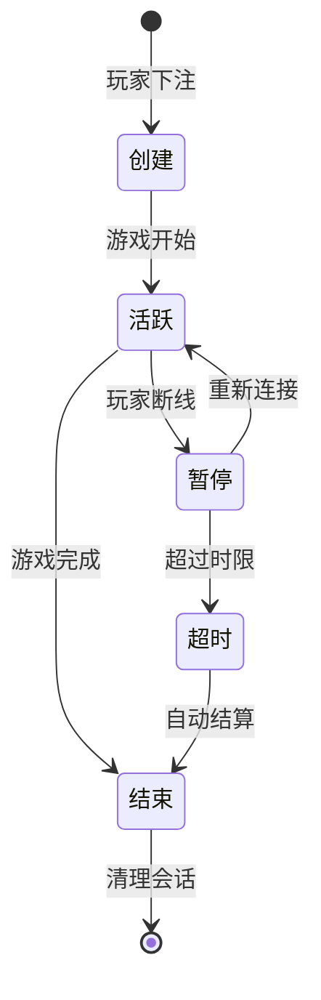
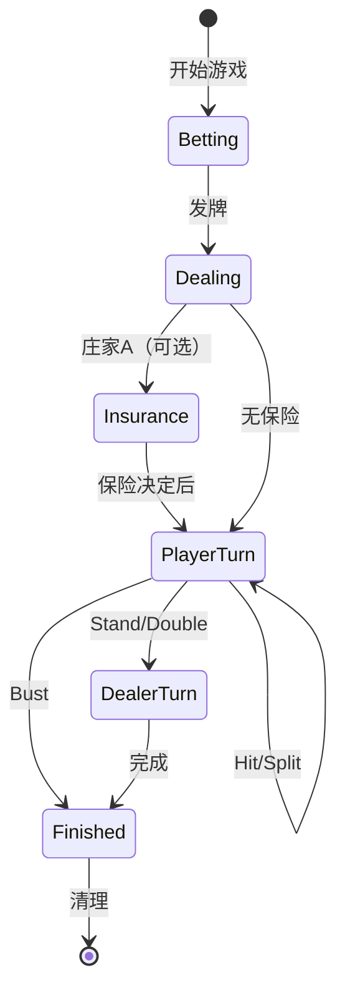
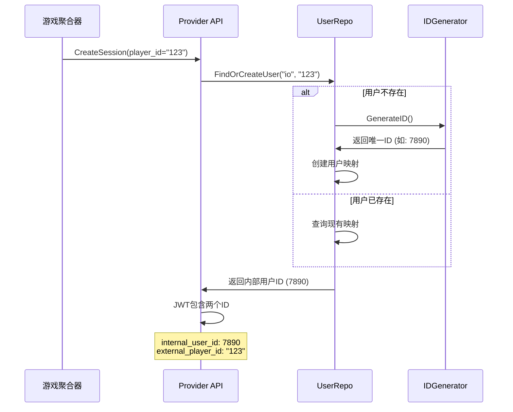
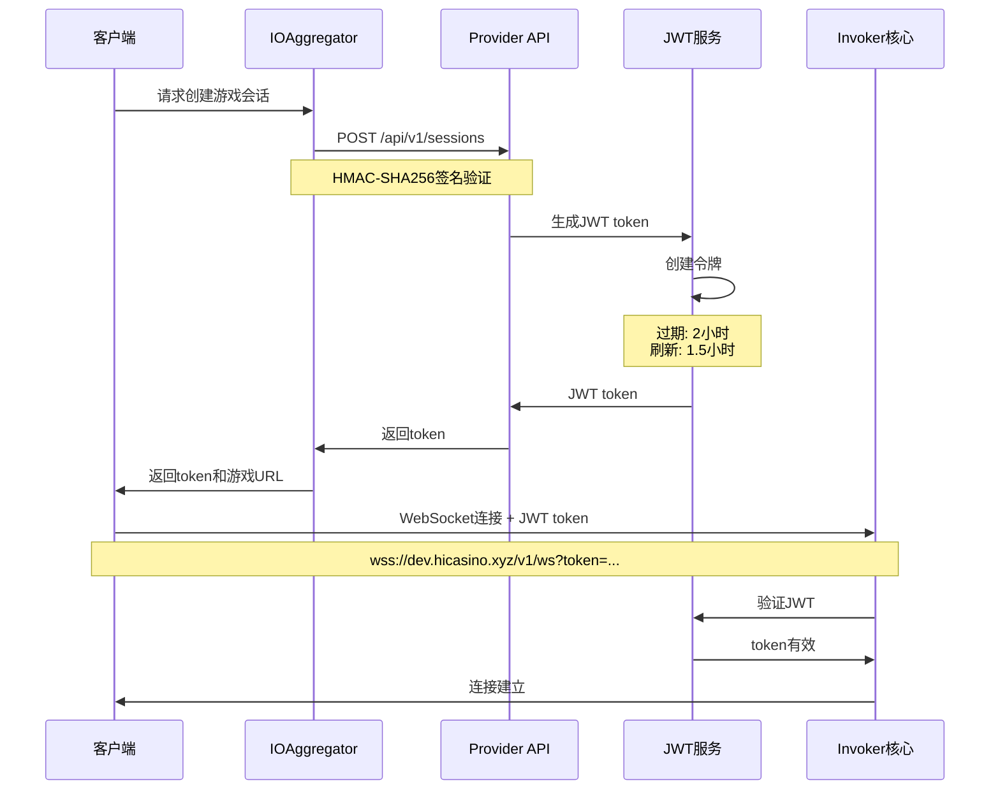
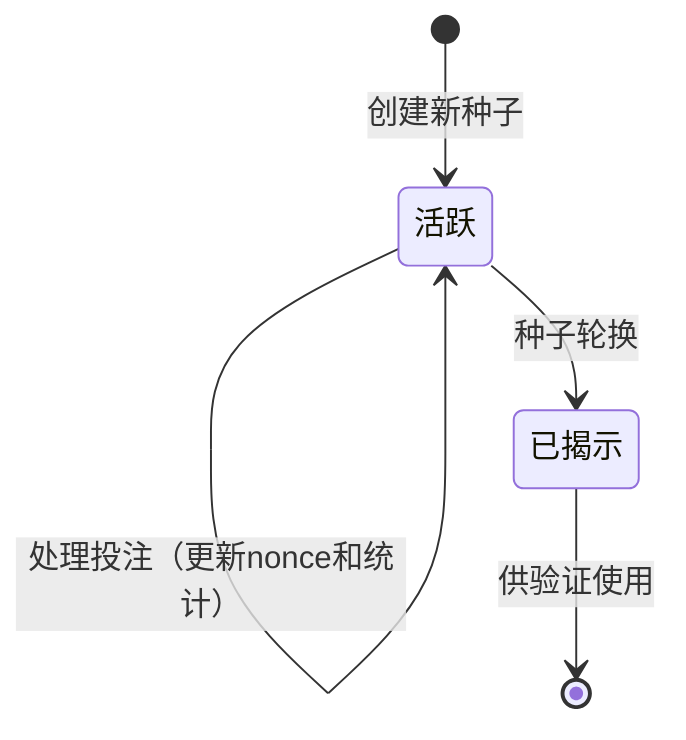

# 详细设计文档 - Invoker Server

## 目录
1. [概述](#概述)
2. [游戏会话管理](#游戏会话管理)
3. [用户身份管理](#用户身份管理) ✅ 新增
4. [JWT 认证中间件](#jwt-认证中间件) ✅ 新增
5. [认证与授权](#认证与授权)
6. [错误处理](#错误处理)
7. [速率限制与节流](#速率限制与节流)
8. [监控与可观测性](#监控与可观测性)
9. [服务端种子生命周期管理](#服务端种子生命周期管理) ✅ 新增
10. [游戏详细设计文档](#游戏详细设计文档)

## 概述

Invoker Server 是一个提供具有可证明公平机制的赌场游戏的微服务。系统暴露两个主要的 API 接口：

1. **Game API** - 统一的游戏接口，支持 WebSocket、HTTP 和 gRPC 协议
   - WebSocket: 实时游戏交互
   - HTTP/gRPC: RESTful 游戏操作
   - 为所有客户端（玩家、平台、聚合器）提供统一接口
2. **Aggregator API** - 聚合器管理接口
   - 管理接入的赌场平台
   - API 密钥和安全配置

> 📊 **系统架构详情**：完整的系统架构图和组件说明请参考 [架构文档](./architecture-zh.md)

## 游戏会话管理

游戏会话管理是系统的核心功能之一，负责维护游戏状态、处理断线重连、确保游戏的连续性和一致性。

### 会话生命周期



### WebSocket 会话管理

#### GameSession 结构

```go
type GameSession struct {
    ID            string                 // 会话唯一标识
    PlayerID      string                 // 玩家ID
    GameID        string                 // 游戏类型ID（如 "inhousegame:mines"）
    Connection    *websocket.Conn        // WebSocket连接
    State         interface{}            // 游戏状态（多态）
    LastActivity  time.Time              // 最后活动时间
    Subscriptions map[string]bool        // 事件订阅
    mu            sync.RWMutex           // 并发保护
}
```

#### 会话管理器功能

1. **会话创建与存储**
   ```go
   func (m *SessionManager) CreateSession(playerID, gameID string) *GameSession
   func (m *SessionManager) GetSession(playerID string) (*GameSession, bool)
   func (m *SessionManager) RemoveSession(playerID string)
   ```

2. **状态同步**
   - 每个游戏操作后自动更新会话状态
   - 支持获取当前游戏状态快照
   - 断线重连时恢复状态

3. **超时管理**
   - 默认超时时间：5分钟无活动
   - 超时后的处理策略：
     - Mines：自动提现
     - Blackjack：自动停牌
     - Dice：无需特殊处理（即时游戏，不创建会话记录）

### 游戏特定会话管理

**重要说明**：
- **即时游戏**（如 Dice）：不创建 GameSession 记录，直接处理投注并返回结果
- **会话游戏**（如 Mines、Blackjack）：需要创建和维护 GameSession 记录，支持多轮交互

#### Mines 会话管理 ✅ 已实现

```go
// MinesService 处理地雷游戏的服务
type MinesService struct {
    serverSeedRepo  ServerSeedRepo
    gameSessionRepo GameSessionRepo  // 使用统一的 GameSession
    gameResultRepo  GameResultRepo
    userRepo        UserRepo
    
    // 双索引缓存机制
    mu                 sync.RWMutex
    activeGamesByUser  map[int64]map[string]*GameInstance  // userID -> roundID -> instance
    activeGamesByRound map[string]*GameInstance            // roundID -> instance
}

// 主要功能：
// - PlaceBet: 创建新游戏（支持3×3、5×5、7×7网格）
// - RevealTile: 揭示格子
// - CashOut: 主动提现
// - ResumeGame: 恢复游戏
// - GetActiveGameForPlayer: 获取活跃游戏
// - CleanupInactiveGames: 清理非活跃游戏（5分钟自动提现）
```

**核心特性**：
- ✅ **多网格支持**：3×3（最多8雷）、5×5（最多24雷）、7×7（最多48雷）
- ✅ **双索引缓存**：提供O(1)的用户和回合查找性能
- ✅ **会话恢复**：支持断线重连，从数据库恢复完整游戏状态
- ✅ **自动提现**：5分钟无活动且有已揭示格子时自动提现
- ✅ **原子nonce**：使用PostgreSQL RETURNING确保并发安全
- ✅ **线性探测**：处理地雷位置生成时的碰撞

**状态持久化**：
- 使用统一的 `game_sessions` 表
- 游戏特定数据存储在 `game_data` JSONB 字段
- 支持完整的状态恢复（地雷位置、已揭示格子、倍数等）

#### Blackjack 会话管理

```go
// BlackjackSessionManager 处理21点游戏的会话
type BlackjackSessionManager struct {
    repo     BlackjackSessionRepo
    timeout  time.Duration
}

// 主要功能：
// - CreateSession: 创建新游戏会话
// - PlayerAction: 处理玩家动作（Hit/Stand/Double/Split）
// - DealerTurn: 执行庄家回合
// - GetActiveSession: 获取玩家活跃游戏
// - HandleTimeout: 超时自动停牌
```

**状态机管理**：


### 断线重连机制

#### 重连流程

1. **客户端重连**
   ```javascript
   // 客户端保存 session_id
   const sessionId = localStorage.getItem('game_session_id');
   ws.connect(`/ws?session_id=${sessionId}&player_id=${playerId}`);
   ```

2. **服务端验证**
   ```go
   func (h *Hub) HandleReconnect(sessionID, playerID string) error {
       // 1. 验证 session_id 和 player_id 匹配
       // 2. 恢复会话状态
       // 3. 发送当前游戏状态
       // 4. 重新订阅事件
   }
   ```

3. **状态恢复**
   - 从内存缓存或数据库加载游戏状态
   - 发送 GET_GAME_STATE_RESPONSE 消息
   - 恢复事件订阅

#### 断线期间的消息处理

- 断线期间的消息不会缓存
- 重连后需要主动查询状态
- 可能丢失部分实时事件


## 用户身份管理 ✅ *新增*

> ✅ **实现状态**：ID生成器和用户映射体系已实现，解决了原有的用户身份冲突问题。

### 背景与问题

Invoker 系统原本完全依赖外部聚合器的用户ID，存在以下问题：
1. **身份冲突**：不同聚合器的相同 player_id 会冲突
2. **安全风险**：无本地身份验证机制
3. **数据归属混乱**：无法准确追踪用户行为
4. **功能受限**：无法实现独立的用户功能

### ID 生成器

基于 Sony Flake 算法实现的分布式唯一ID生成器，用于生成内部用户ID和其他需要全局唯一标识的场景。

#### Sony Flake 算法介绍

Sony Flake 是索尼开发的分布式ID生成算法，类似于 Twitter 的 Snowflake，但具有以下优势：
- 更长的时间位（39位），可以使用到2174年
- 更多的序列号位（8位），每10毫秒可生成256个ID
- 更多的机器ID位（16位），支持65536台机器

**ID结构（64位）**：
```
0        1         2         3         4         5         6
0123456789012345678901234567890123456789012345678901234567890123
|---------|-----------------|--------|-------------------------|
    未用        时间戳        序列号          机器ID
   (1位)       (39位)        (8位)          (16位)
```

#### 实现要点

- **起始时间**：2024年1月1日，作为ID生成的时间基准
- **机器ID**：当前固定为1，生产环境应从配置或环境变量读取
- **接口设计**：简单的 `GenerateID(ctx) (int64, error)` 接口
- **错误处理**：ID生成失败时返回错误，上层服务需要处理

**ID生成器特性**：
- **时间有序性**：ID按时间递增，便于排序和索引
- **高性能**：本地生成，无需网络请求
- **分布式唯一**：通过机器ID保证不同节点生成的ID不冲突
- **紧凑存储**：64位整数，数据库友好

**实现文件**：
- `internal/data/id_generator.go` - 数据层实现
- `internal/biz/idgen.go` - 业务逻辑层
- `internal/service/idgen.go` - 服务层接口


#### 使用场景

1. **用户ID生成**：为新用户生成内部ID
2. **会话ID生成**：生成唯一的会话标识符
3. **交易ID生成**：生成交易记录的唯一ID
4. **游戏回合ID**：生成游戏回合的唯一标识


### 用户映射体系

建立内部用户ID与外部聚合器player_id的映射关系：

```sql
CREATE TABLE users (
    id BIGINT PRIMARY KEY,                    -- 内部用户ID（Sony Flake生成）
    aggregator_id VARCHAR(50) NOT NULL,       -- 聚合器标识（如 "io", "ga1"）
    external_player_id VARCHAR(100) NOT NULL, -- 外部玩家ID
    created_at TIMESTAMP DEFAULT NOW(),
    updated_at TIMESTAMP DEFAULT NOW(),
    UNIQUE KEY uk_aggregator_player (aggregator_id, external_player_id)
);
```

### 用户身份转换流程




### 向后兼容性 ✅ *更新*

系统的向后兼容策略已调整：
1. **API层面**：继续接受外部 player_id（仅用于创建会话）
2. **数据层面**：保留原有 player_id 字段（用于审计追踪）
3. **JWT令牌**：同时包含内部和外部ID
4. **查询策略**：
   - **历史查询**：已完全迁移到 UserID，不再支持 player_id 查询（2025年1月）
   - **会话创建**：仍接受 player_id，自动转换为内部 UserID

### GameResult 表优化

为提升查询效率，GameResult 表已添加 user_id 字段：

```sql
ALTER TABLE game_results ADD COLUMN user_id BIGINT NOT NULL DEFAULT 0 COMMENT '内部用户ID';
CREATE INDEX idx_game_results_user_id ON game_results(user_id);
CREATE INDEX idx_game_results_user_created ON game_results(user_id, created_at DESC);
```

**数据迁移说明**：
- 新建的游戏记录会自动包含正确的 user_id
- 历史数据可通过 SQL 语句批量更新：
  ```sql
  UPDATE game_results gr
  SET user_id = u.id
  FROM users u
  WHERE gr.aggregator_id = u.aggregator_id
  AND gr.player_id = u.external_player_id
  AND gr.user_id = 0
  ```


## JWT 认证中间件 ✅ *新增*

### 概述

从 2025年1月起，Game API 引入了 JWT 认证中间件，用于保护敏感的游戏操作接口。这个中间件从 HTTP Authorization header 中提取 Bearer token，验证其有效性，并将用户信息注入到请求上下文中。

### 实现架构

```go
// JWT 认证中间件
type JWTAuthMiddleware struct {
    jwtService *JWTService
}

// 中间件处理流程
func (m *JWTAuthMiddleware) Middleware() middleware.Middleware {
    return func(handler middleware.Handler) middleware.Handler {
        return func(ctx context.Context, req interface{}) (interface{}, error) {
            // 1. 从 header 提取 token
            // 2. 验证 token
            // 3. 注入用户信息到 context
            // 4. 继续处理请求
        }
    }
}
```

### 认证流程

1. **Token 提取**
   - 从 `Authorization: Bearer <token>` header 提取
   - 支持标准的 Bearer token 格式

2. **Token 验证**
   - 验证签名有效性
   - 检查过期时间
   - 验证 issuer 和其他 claims

3. **上下文注入**
   - 将 user_id（内部用户ID）注入到 context
   - 将 aggregator_id 注入到 context
   - 其他业务信息也可从 JWT claims 提取

### 应用范围

#### 需要认证的接口
- `/api/game/v1/history` - 历史记录查询
- `/api/game/v1/dice/*` - 骰子游戏操作
- `/api/game/v1/mines/*` - 扫雷游戏操作
- `/api/game/v1/blackjack/*` - 21点游戏操作

#### 不需要认证的接口
- `/api/game/v1/games` - 游戏列表（公开信息）
- `/api/game/v1/config` - 游戏配置（公开信息）

### 与历史查询的集成

HistoryService 已更新为优先从 JWT context 获取用户信息：

```go
func (s *HistoryService) GetPlayerHistory(ctx context.Context, req *pb.GetPlayerHistoryRequest) (*pb.GetPlayerHistoryResponse, error) {
    // 1. 尝试从 JWT context 获取 user_id
    if userID := auth.UserIDFromContext(ctx); userID > 0 {
        // 使用 JWT 中的 user_id
    } else if req.UserId > 0 {
        // 降级到请求参数中的 user_id
    } else {
        // 返回错误：需要有效的用户ID
    }
}
```


## 认证与授权

> ✅ **实现状态**：JWT认证已实现，下面为当前实际实现的认证流程。

**相关实现文件**:
- JWT服务：`internal/service/jwt/jwt_service.go`
- JWT认证器：`internal/transport/websocket/jwt_authenticator.go`
- Token刷新器：`internal/transport/websocket/token_refresher.go`

### 认证流程（当前实现）



### 令牌类型（已实现）

1. **JWT令牌**
   - 由Invoker JWT服务签发
   - 包含user_id（内部ID）、aggregator_id、game_id、过期时间
   - 2小时有效期
   - 支持自动刷新

2. **Token刷新机制**
   - WebSocket连接中自动刷新
   - 在1.5小时后触发
   - 通过TOKEN_REFRESH消息发送新token
   - 客户端需保存新token供重连使用

### 当前实现

```go
// JWT服务实现
type JWTService struct {
    secret       []byte        // 签名密钥
    expiresIn    time.Duration // 2小时
    refreshAfter time.Duration // 1.5小时
    issuer       string       // 签发者
}

// 生成JWT token
// 参数包含：会话ID、内部用户ID、聚合器ID、游戏ID等
// 返回签名后的JWT字符串

// WebSocket JWT认证器
type JWTAuthenticator struct {
    jwtService JWTService
}

// Authenticate 验证JWT并返回用户信息
// 从JWT claims中提取用户ID、聚合器ID等信息
// 构建User对象供WebSocket连接使用
```

### 授权矩阵

| 资源 | 匿名 | 玩家 | 管理员 |
|----------|-----------|---------|--------|
| 游戏列表 | 读取 | 读取 | 读取 |
| 下注 | ❌ | 创建 | 创建 |
| 下注历史 | ❌ | 仅限自己 | 全部 |
| 游戏配置 | 读取 | 读取 | 读写 |
| 玩家余额 | ❌ | 仅限自己 | 全部 |

## 错误处理

### 错误代码结构

格式：`领域_类别_具体错误`

示例：
- `GAME_VALIDATION_INVALID_AMOUNT`
- `PLAYER_BALANCE_INSUFFICIENT`
- `SYSTEM_RATE_LIMIT_EXCEEDED`

### 错误类别

| 类别 | 代码范围 | 描述 |
|----------|------------|-------------|
| 验证 | 1000-1999 | 输入验证错误 |
| 业务 | 2000-2999 | 业务规则违反 |
| 认证 | 3000-3999 | 认证/授权错误 |
| 系统 | 4000-4999 | 系统/基础设施错误 |
| 游戏特定 | 5000-5999 | 游戏特定错误 |

### 错误响应标准

```protobuf
message Error {
  string code = 1;         // 机器可读代码
  string message = 2;      // 人类可读消息
  string request_id = 3;   // 用于追踪
  map<string, string> details = 4;  // 额外上下文
  repeated Error errors = 5;        // 用于批量操作
}
```

### 重试指导

| 错误类型 | 可重试 | 策略 |
|------------|-----------|----------|
| 验证 | 否 | 修正输入 |
| 速率限制 | 是 | 指数退避 |
| 超时 | 是 | 立即重试（一次） |
| 服务器错误 | 是 | 指数退避 |
| 维护 | 是 | 等待维护窗口 |


## 监控与可观测性

### 关键指标

1. **API 指标**
   - 请求速率（req/s）
   - 响应时间（p50、p95、p99）
   - 按代码分类的错误率
   - 活跃 WebSocket 连接数

2. **业务指标**
   - 每分钟下注数
   - 赢/输比率
   - 平均下注大小
   - 玩家留存率

3. **系统指标**
   - CPU/内存使用率
   - 数据库查询时间
   - 消息队列深度
   - 缓存命中率

### 分布式追踪

用于追踪传播的头：
- `X-Trace-ID`：唯一追踪标识符
- `X-Span-ID`：当前跨度
- `X-Parent-Span-ID`：父跨度
- `X-Sampled`：采样决策

### 日志标准

```json
{
  "timestamp": "2024-01-01T12:00:00Z",
  "level": "INFO",
  "trace_id": "abc123",
  "player_id": "player123",
  "game_id": "dice",
  "method": "PlaceBet",
  "duration_ms": 45,
  "message": "下注成功",
  "metadata": {
    "bet_amount": 100.50,
    "win_amount": 201.00
  }
}
```

### 健康检查

```protobuf
service HealthService {
  rpc Check(HealthCheckRequest) returns (HealthCheckResponse);
  rpc Watch(HealthCheckRequest) returns (stream HealthCheckResponse);
}

message HealthCheckResponse {
  enum ServingStatus {
    UNKNOWN = 0;
    SERVING = 1;
    NOT_SERVING = 2;
  }
  ServingStatus status = 1;
  map<string, ServingStatus> dependencies = 2;
}
```

## 服务端种子生命周期管理 ✅ *新增*

### 概述

为了增强可证明公平机制的安全性，系统实现了完整的服务端种子生命周期管理。主要目标是防止种子预测攻击，确保游戏结果的真正随机性。

### 核心安全原则

1. **活跃种子不暴露**：活跃的服务端种子原始值永远不会返回给客户端
2. **延迟揭示**：种子只有在被替换（轮换）后才会揭示原始值
3. **完整记录**：记录每个种子的使用情况（投注次数、nonce值等）

### 种子状态流转



### 生命周期管理机制

#### 1. 种子创建
- 生成随机种子值
- 计算并存储种子哈希（SHA256）
- 标记为活跃状态（status = 'active'）
- 初始化统计信息（total_bets = 0, current_nonce = 0）

#### 2. 种子使用
- 每次投注时更新：
  - current_nonce++（递增nonce）
  - total_bets++（投注计数）
- 使用异步更新减少响应延迟

#### 3. 种子轮换
- 创建新的活跃种子
- 将旧种子标记为已揭示（status = 'revealed'）
- 记录揭示时间（revealed_at）
- 设置替换关系（replaced_by_seed_id）
- 返回旧种子的原始值供验证

#### 4. 种子查询
- 活跃种子：只返回哈希值，不返回原始值
- 非活跃种子：返回完整信息，包括原始值

### API 行为变化

#### PlaceDiceBet 响应
```json
{
  "provably_fair": {
    "client_seed": "player-seed",
    "server_seed": "",  // 活跃种子不返回原始值
    "hashed_server_seed": "sha256-hash",
    "nonce": 42,
    "seed_revealed": false
  }
}
```

#### GetBetHistory 响应
```json
{
  "provably_fair": {
    "client_seed": "player-seed",
    "server_seed": "revealed-seed",  // 历史记录中返回已揭示的种子
    "hashed_server_seed": "sha256-hash",
    "nonce": 42,
    "seed_revealed": true
  }
}
```

## 延迟结算机制（Plinko 专用）

### 概述

Plinko 游戏采用延迟结算机制，将下注和结算拆分为两个阶段，确保在动画播放期间 Invoker 前端和聚合器前端的余额保持一致。

### 设计原则

1. **余额一致性**：动画播放期间，两个前端显示相同的余额
2. **分阶段结算**：PLACE_BET 只扣款，SETTLE_BET 完成赔付
3. **异常兜底**：定时任务确保不会遗漏结算
4. **幂等性保护**：防止重复结算

### 三阶段流程

| 阶段 | API 调用 | 聚合器操作 | 前端余额 | 游戏状态 |
|------|----------|------------|----------|----------|
| 1. 下注 | PLACE_BET | Bet（扣款） | 不更新显示 | pending |
| 2. 动画 | - | - | 保持一致 | pending |
| 3. 结算 | SETTLE_BET | Win + End（赔付） | 同时更新 | completed |

#### 阶段详解

**阶段 1：下注（PLACE_BET）**
- 调用聚合器发送 Bet 扣款请求
- 本地计算游戏结果（路径、倍率、赔付）
- 保存游戏结果，状态为 `pending`
- 返回游戏结果，但**不返回余额**
- 前端**不更新余额显示**，保持与聚合器前端一致

**阶段 2：动画播放**
- 前端播放小球下落动画（约 2-5 秒）
- Invoker 前端和聚合器前端余额都显示扣款后的金额
- 两个前端保持一致，用户体验流畅
- 服务端无操作，游戏状态保持 `pending`

**阶段 3：结算（SETTLE_BET）**
- 动画完成后，前端发送 SETTLE_BET 请求
- 调用聚合器发送 Win（如果赢）+ End 请求
- 更新游戏状态为 `completed`
- 聚合器通过 WebSocket 同时推送余额到两个前端
- 两个前端同时更新余额显示

### 状态管理

```go
// GameResult.Status 字段
const (
    GameResultStatusPending   = "pending"   // 待结算
    GameResultStatusCompleted = "completed" // 已完成
)
```

**状态流转**：
```
pending（PLACE_BET 时）→ completed（SETTLE_BET 或定时任务后）
```

### 定时任务（PendingGameSettler）

**职责**：
- 扫描超时的 pending 游戏（超过 20 秒）
- 自动调用聚合器 API 完成结算
- 更新游戏状态为 completed
- 发布投注活动广播

**配置**：
```go
const (
    settlementTimeoutSeconds = 20   // 超时阈值
    batchSize                = 100  // 批量处理数量
    tickerInterval           = 20 * time.Second  // 扫描间隔
)
```

**实现文件**：`internal/service/scheduler/pending_game_settler.go`

**启动位置**：`cmd/server/main.go`
```go
func newApp(..., settler *scheduler.PendingGameSettler) *kratos.App {
    if err := settler.Start(context.Background()); err != nil {
        log.Fatalf("Failed to start pending game settler: %v", err)
    }
    // ...
}
```

### Handler 接口

```go
type IGameHandler interface {
    // ...
    NeedsDelayedSettlement() bool  // 返回 true 表示需要延迟结算
}
```

**当前支持延迟结算的游戏**：
- Plinko（`plinko.Handler.NeedsDelayedSettlement() = true`）

**其他游戏默认返回 false**：
- Dice、Keno、Limbo、DragonTiger、Roulette 等

### 安全性

1. **幂等性**：检查游戏状态，避免重复结算
2. **事务性**：状态更新使用数据库事务
3. **错误处理**：定时任务失败会记录日志并跳过，不影响其他游戏
4. **并发安全**：使用数据库锁防止并发结算

### 监控指标

建议监控以下指标：
- pending 状态游戏的平均停留时间
- 定时任务结算的游戏数量
- 结算失败率
- 前端 SETTLE_BET 调用比例

### 未来扩展

延迟结算机制设计为通用架构，其他有动画需求的游戏也可以使用：
1. 实现 `NeedsDelayedSettlement() bool` 返回 true
2. PLACE_BET 保存 pending 状态
3. 动画完成后调用 SETTLE_BET

### 相关文档

- [Plinko 详细设计](./plinko-detailed-design-zh.md#延迟结算机制) - Plinko 专用说明
- [Plinko WebSocket API](./plinko-websocket-api-zh.md#2-settle_bet---plinko-结算) - SETTLE_BET 接口文档
- [序列图](./sequence-diagrams-zh.md) - 延迟结算流程图

## 游戏详细设计文档

各游戏的详细设计文档已拆分为独立文档，请参考：

- [Dice（骰子）游戏详细设计](./dice-detailed-design-zh.md)
- [Keno（基诺）游戏详细设计](./keno-detailed-design-zh.md)
- [HiLo（高低牌）游戏详细设计](./hilo-detailed-design-zh.md)
- [Mines（扫雷）游戏详细设计](./mines-detailed-design-zh.md)
- [Plinko（弹珠台）游戏详细设计](./plinko-detailed-design-zh.md)
- [ChickenRoad（小鸡过马路）游戏详细设计](./chickenroad-detailed-design-zh.md)

---

## 相关文档
- [API 参考](./api-reference-zh.md) - 详细的端点文档
- [序列图](./sequence-diagrams-zh.md) - 可视化流程展示
