# 详细设计文档 - Invoker Server

## 目录
1. [概述](#概述)
2. [API 设计原则](#api-设计原则)
3. [Provider API 设计](#provider-api-设计) ✅ 新增
4. [WebSocket API 设计](#websocket-api-设计)
   - [连接生命周期](#连接生命周期)
   - [消息格式规范](#消息格式规范)
   - [连接初始化流程](#连接初始化流程)
   - [余额同步机制](#余额同步机制) ✅ 已实现
   - [事件类型枚举设计](#事件类型枚举设计)
5. [HTTP/gRPC API 设计](#httpgrpc-api-设计)
6. [数据模型](#数据模型)
7. [游戏会话管理](#游戏会话管理)
8. [用户身份管理](#用户身份管理) ✅ 新增
9. [JWT 认证中间件](#jwt-认证中间件) ✅ 新增
10. [认证与授权](#认证与授权)
11. [错误处理](#错误处理)
12. [速率限制与节流](#速率限制与节流)
13. [监控与可观测性](#监控与可观测性)

## 概述

Invoker Server 是一个提供具有可证明公平机制的赌场游戏的微服务。系统暴露两个主要的 API 接口：

1. **Game API** - 统一的游戏接口，支持 WebSocket、HTTP 和 gRPC 协议
   - WebSocket: 实时游戏交互
   - HTTP/gRPC: RESTful 游戏操作
   - 为所有客户端（玩家、平台、聚合器）提供统一接口
2. **Aggregator API** - 聚合器管理接口
   - 管理接入的赌场平台
   - API 密钥和安全配置

> 📊 **系统架构详情**：完整的系统架构图和组件说明请参考 [架构文档](./architecture-zh.md)

## API 设计原则

### 1. 版本控制策略
- **URL 路径版本控制**：`/v1/`、`/v2/`
- **语义化版本控制**：主版本.次版本.补丁版本
- **向后兼容性**：弃用版本至少支持 6 个月
- **版本协商**：HTTP 通过 Accept 头，WebSocket 通过消息字段

### 2. 协议选择指南
| 使用场景 | 协议 | 理由 |
|----------|----------|-----------|
| 实时游戏事件 | WebSocket | 低延迟，双向通信 |
| 游戏配置 | HTTP/gRPC | 请求-响应模式 |
| 下注 | WebSocket/HTTP | 两种方式都支持以提供灵活性 |
| 集成 API | gRPC | 高性能，强类型 |

### 3. 消息格式标准
- **Protocol Buffers**：主要序列化格式
- **JSON**：Web 客户端的辅助格式
- **消息封装**：所有消息的一致性包装器

## Provider API 设计

### 概述
Provider API 是专门为游戏聚合器（GA）设计的标准化接口，运行在独立的端口（8002）上，提供完整的游戏集成功能。

### 核心特性

#### 1. 认证机制
- **HMAC-SHA256 签名验证**
  - 所有请求必须包含 `X-API-KEY` 和 `X-SIGNATURE` 头部
  - 签名算法：`HMAC-SHA256(message, API_KEY_SECRET)`
  - 支持请求时间戳验证，防止重放攻击
  - 中间件实现：`internal/middleware/auth/hmac.go`

#### 2. 会话管理
- **JWT Token 管理**
  - 使用JWT令牌代替传统会话
  - 2小时token过期时间
  - 1.5小时后自动刷新
  - 令牌包含session_id、user_id、aggregator_id、game_id、operator_id、currency信息
  - WebSocket连接通过URL参数传递token
  - JWT服务实现：`internal/service/jwt/jwt_service.go`

#### 3. 游戏逻辑幂等性
- **幂等性保证**
  - 游戏逻辑幂等性：防止重复发牌、重复下注
  - Round ID 唯一性约束
  - 状态机验证
  - 交易级幂等性由聚合器负责

#### 4. 游戏适配器
- **统一游戏接口**
  - GameAdapter 封装不同游戏的具体实现
  - 支持 Dice、Mines、Blackjack
  - 统一的请求/响应格式
  - 实现：`internal/service/provider/game_adapter.go`

### 增强功能

#### 1. 错误处理框架
```go
// 错误码分类
- 认证错误：MISSING_SIGNATURE, INVALID_SIGNATURE, EXPIRED_REQUEST
- 验证错误：MISSING_PARAMETER, INVALID_PARAMETER
- 会话错误：SESSION_NOT_FOUND, SESSION_EXPIRED, SESSION_INACTIVE
- 游戏错误：GAME_NOT_FOUND, GAME_IN_PROGRESS, INVALID_BET
- 余额错误：INSUFFICIENT_BALANCE, BALANCE_ERROR
- 交易错误：TRANSACTION_NOT_FOUND, ROLLBACK_NOT_ALLOWED
- 服务器错误：INTERNAL_ERROR, DATABASE_ERROR, NETWORK_ERROR
```
实现：`internal/service/provider/errors.go`

#### 2. 结构化日志
- **RequestLogger**: API 请求响应日志
- **TransactionLogger**: 交易操作日志
- **GameLogger**: 游戏回合日志
- **SecurityLogger**: 安全事件日志
- **PerformanceLogger**: 性能监控日志

实现：`internal/service/provider/loggers.go`

#### 3. 游戏注册表
```go
// 动态游戏配置管理（简化版，实际结构更复杂）
type GameConfig struct {
    // 基本信息
    ID          int64    `json:"id"`
    GameID      string   `json:"gameId"`      // 如 "inhousegame:dice"
    Name        string   `json:"gameName"`
    Category    string   `json:"category"`
    Status      string   `json:"status"`  // active, coming_soon, maintenance
    Description string   `json:"description"`
    
    // 下注限制（从 betInfo 中提取）
    BetInfo     []BetInfo `json:"betInfo"`
    BetRange    string    `json:"betRange"`
    
    // 高级配置（包含 RTP 控制、新老用户策略等）
    RTPOptions   RTPOptions   `json:"rtpOptions"`
    NewUser      NewUserConfig `json:"newUser"`
    OldUser      OldUserConfig `json:"oldUser"`
    TotalControl TotalControl  `json:"totalControl"`
}
```
实现：`internal/service/provider/game_registry.go`
注：完整的 GameConfig 结构包含更多高级配置字段，用于游戏的精细化控制

#### 4. 监控和指标
- 请求计数和成功率
- 响应时间统计
- 错误分布分析
- 健康检查端点
- 性能日志记录 (PerformanceLogger)

### CreateSession 业务逻辑

#### 请求验证流程
1. **参数验证**：
   - `player_id` 必需，不能为空
   - `game_id` 必需，不能为空
   - `currency` 必需，应为有效货币代码
   - `operator_id` 必需，标识运营商

2. **游戏验证**：
   - 检查 `game_id` 是否在游戏注册表中存在
   - 验证游戏状态是否为 "active"
   - 注意：游戏ID格式为 "inhousegame:游戏名"（如 "inhousegame:dice"）

3. **会话管理**：
   - 检查玩家是否已有该游戏的活跃会话
   - 如有，先关闭旧会话再创建新会话
   - 新会话有效期：2小时

4. **JWT 生成**：
   - JWT Claims 包含用户身份信息
   - `UserID`: 内部用户ID（Sony Flake生成的int64）
   - `AggregatorID`: 聚合器标识（如 "io", "ga1"）  
   - `GameID`: 游戏ID，用于自动配置下发
   - 其他业务信息：SessionID、OperatorID、Currency等

### 管理端点
- `/admin/health` - 系统健康检查
- `/admin/metrics` - 性能指标
- `/admin/games` - 游戏状态管理
- `/admin/metrics/reset` - 重置指标（需认证）

## WebSocket API 设计

### 连接生命周期

```mermaid
stateDiagram-v2
    [*] --> 连接中: 客户端发起
    连接中 --> 已连接: 握手成功
    连接中 --> 失败: 握手失败
    已连接 --> 已认证: JWT验证成功
    已认证 --> 初始化中: 执行初始化器
    初始化中 --> 已初始化: 推送游戏配置
    已初始化 --> 已订阅: 订阅事件
    已订阅 --> 活跃: 准备游戏
    活跃 --> 活跃: 游戏消息
    活跃 --> 断开中: 客户端/服务器关闭
    断开中 --> [*]: 连接已关闭
    失败 --> [*]: 重试或终止
```



### 消息格式规范

所有 WebSocket 消息遵循统一结构：

```protobuf
message WebSocketMessage {
  string id = 1;           // 用于请求/响应关联的 UUID
  string type = 2;         // 消息类型标识符
  int64 timestamp = 3;     // Unix 时间戳（毫秒）
  oneof payload {          // 多态负载
    // ... 具体消息类型
  }
}
```

#### 消息类型
| 类型 | 方向 | 描述 |
|------|-----------|-------------|
| `game_config` | 服务器→客户端 | 游戏配置推送（自动） |
| `initialization_complete` | 服务器→客户端 | 初始化完成通知 |
| `PLACE_BET_REQUEST` | 客户端→服务器 | 发起下注 |
| `PLACE_BET_RESPONSE` | 服务器→客户端 | 下注结果 |
| `SUBSCRIBE_REQUEST` | 客户端→服务器 | 订阅事件 |
| `SUBSCRIBE_RESPONSE` | 服务器→客户端 | 订阅确认 |
| `GAME_EVENT` | 服务器→客户端 | 游戏状态更新 |
| `ERROR` | 服务器→客户端 | 错误通知 |
| `PING/PONG` | 双向 | 心跳 |
| `token_refresh` | 服务器→客户端 | JWT令牌自动刷新 |
| `BALANCE_UPDATE` | 服务器→客户端 | 余额变化通知 |

### 连接初始化流程

WebSocket 连接建立后，系统会自动执行一系列初始化操作，确保客户端获得必要的配置信息。

#### 初始化器机制
系统采用初始化器链模式，支持灵活扩展：

1. **GameConfigInitializer**（优先级: 10）
   - 自动推送当前游戏的配置信息
   - 游戏ID来源优先级：JWT token 中的 `game_id` > URL 参数 `game_id`
   - 如果未指定游戏ID，则跳过配置推送

2. **初始化流程**
   ```
   1. 客户端连接 WebSocket（带 JWT token）
   2. 服务器验证 JWT token
   3. 执行初始化器链（按优先级排序）
   4. GameConfigInitializer 推送游戏配置（如有）
   5. 发送 initialization_complete 消息
   6. 客户端可以开始游戏操作
   ```

3. **游戏配置内容**
   - 基本信息：游戏ID、名称、类别、状态
   - 下注限制：最小/最大下注金额
   - RTP 配置：默认RTP、可选RTP范围
   - 特性列表：支持的功能（如 provably_fair）
   - 货币支持：从 betInfo 数组中提取支持的货币
   - 高级配置：新老用户差异化设置、总体控制参数等

### 余额同步机制

v1.0 架构下，余额由聚合器管理，Invoker Server 实现了智能的余额同步机制，确保玩家看到的余额始终是最新的。

#### 设计目标

1. **实时性**：余额变化自动推送到客户端
2. **性能优化**：减少不必要的聚合器 API 调用
3. **准确性**：关键操作时确保余额的准确性
4. **用户体验**：无需手动刷新余额

#### 核心组件

##### 1. BalanceSyncer（余额同步器）

位于 `internal/transport/websocket/balance_syncer.go`，负责管理单个连接的余额同步：

```go
type BalanceSyncer struct {
    conn         *Connection      // WebSocket 连接
    clientPool   aggregator.ClientPool  // 聚合器客户端池
    timer        *time.Timer      // 可重置的定时器
    interval     time.Duration    // 同步间隔（默认30秒）
    lastBalance  string          // 缓存的余额
    lastCurrency string          // 缓存的币种
    // ...
}
```

**特性**：
- **定时同步**：每30秒自动从聚合器获取最新余额
- **强制同步**：在关键操作时立即同步
- **智能定时器**：每次同步后重置定时器，避免重复同步
- **最小间隔保护**：防止频繁同步（最小2秒间隔）

##### 2. 同步触发机制

```
登录认证 ──> 初始同步 ──> 启动定时器（30秒）
                            │
                            ├─> 定时触发 ──> 同步余额 ──> 重置定时器
                            │
                            ├─> 下注前 ──> 强制同步 ──> 重置定时器
                            │
                            └─> 结算后 ──> 强制同步 ──> 重置定时器
```

##### 3. 余额变化检测

同步时会比较新旧余额，仅在变化时发送通知：

```go
if balanceChanged && oldBalance != "" {  // 首次同步不发送
    // 发送 BALANCE_UPDATE 事件
    event := &v1.WebSocketMessage{
        Type: "BALANCE_UPDATE",
        P: &v1.WebSocketMessage_BalanceUpdateEvent{
            BalanceUpdateEvent: &v1.BalanceUpdateEvent{
                Balance:   balanceStr,
                Currency:  currency,
                Timestamp: time.Now().Unix(),
            },
        },
    }
}
```

#### 时序示例

```
00:00 - 用户登录，初始同步余额（1000 USD）
00:30 - 定时同步（余额未变，不发送通知）
00:45 - 用户下注，强制同步，重置定时器到 01:15
00:46 - 游戏结算，余额变为 950，发送 BALANCE_UPDATE
01:15 - 下次定时同步（而不是 01:00）
```

#### 与其他组件的集成

1. **WebSocket Connection**
   - 认证成功后自动创建 BalanceSyncer
   - 连接关闭时自动停止同步

2. **游戏适配器（如 DiceWebSocketAdapter）**
   - 下注前：`conn.GetBalanceSyncer().ForceSync()`
   - 结算后：异步触发同步

3. **GET_BALANCE 处理器**
   - 优先从 BalanceSyncer 缓存读取
   - 缓存未命中时才查询聚合器

#### 配置选项

```yaml
# 未来可配置化（当前硬编码）
websocket:
  balance_sync:
    enabled: true
    interval: 30s      # 定时同步间隔
    min_interval: 2s   # 最小同步间隔
```

#### 注意事项

1. **架构限制**
   - Invoker 不处理余额的增减，仅同步显示
   - 所有余额变更通过聚合器 API 完成
   - 下注验证最终由聚合器执行

2. **性能考虑**
   - 10K 连接 × 30秒 = 333 QPS（分散的）
   - 通过缓存和智能重置减少 API 调用
   - 未来可根据用户活跃度动态调整间隔

3. **错误处理**
   - 同步失败不影响游戏进行
   - 记录错误日志但不中断连接
   - 下次同步时自动重试

### WebSocket 模块架构 ✅ *已优化*

v1.0 版本对 WebSocket 模块进行了全面重构，提升了代码的可维护性和错误处理能力。

#### 模块化设计

1. **核心组件分离**
   - `handler.go` - 主处理器，负责消息路由
   - `connection.go` - 连接管理，处理单个客户端连接
   - `error_handler.go` - 统一错误处理
   - `balance_syncer.go` - 余额同步管理
   - `game_config_initializer.go` - 游戏配置初始化

2. **事件分发机制**
   - `event_dispatcher.go` - 事件分发中心
   - 解耦游戏逻辑与通信层
   - 支持多游戏类型扩展

3. **适配器模式**
   - `dice_adapter.go` - Dice游戏适配器
   - 统一游戏接口，便于新游戏接入

#### 错误处理优化

- 统一错误响应格式
- 详细的错误日志记录
- 优雅的错误恢复机制
- 自动处理序列化配置（如布尔字段的默认值输出）

### 事件类型枚举设计

WebSocket 系统从字符串事件类型迁移到 Protocol Buffers 枚举，提供更好的类型安全和开发体验。

#### 设计决策

1. **为什么使用枚举**
   - **类型安全**：编译时检查，避免拼写错误
   - **性能优势**：整数比较比字符串比较更快
   - **版本控制**：枚举值固定，便于向后兼容
   - **文档自动化**：从 proto 文件生成文档

2. **枚举命名规范**
   ```protobuf
   enum EventType {
     EVENT_TYPE_UNSPECIFIED = 0;      // 默认值，符合 proto3 规范
     EVENT_TYPE_BET_PLACED = 1;       // 前缀避免命名冲突
     EVENT_TYPE_GAME_RESULT = 2;      // 清晰的语义
     // ... 其他事件类型
   }
   ```

3. **字符串表示**
   - 枚举的 `String()` 方法返回完整名称（如 "EVENT_TYPE_BET_ACTIVITY_BATCH"）
   - 客户端需要使用这个字符串格式进行订阅和事件处理

### 事件订阅模型

```protobuf
message SubscribeRequest {
  string player_id = 1;
  repeated string event_types = 2;  // 使用枚举的字符串表示
  string filters = 3;               // JSON 编码的过滤器
}
```

支持的事件类型（使用 EventType 枚举）：
- `EVENT_TYPE_GAME_RESULT` - 单个游戏结果
- `EVENT_TYPE_BET_ACTIVITY_BATCH` - 批量投注活动（自动订阅）
- `EVENT_TYPE_LIVE_STATS` - 实时统计
- `EVENT_TYPE_JACKPOT` - 累积奖池变化
- `EVENT_TYPE_BIG_WIN` - 大额获胜通知

### 实时游戏流程

```mermaid
sequenceDiagram
    participant C as 客户端
    participant WS as WebSocket 网关
    participant GE as 游戏引擎
    participant DB as 数据库
    
    C->>WS: 连接 & 认证
    WS->>C: 连接已建立
    
    C->>WS: 订阅事件
    WS->>C: 订阅已确认
    
    C->>WS: 下注请求
    WS->>GE: 处理下注
    GE->>DB: 存储下注
    GE->>DB: 更新余额
    GE->>WS: 游戏结果
    WS->>C: 下注响应
    WS->>C: 游戏事件（向所有订阅者）
```



### 错误恢复机制

1. **自动重连**
   - 指数退避：1秒、2秒、4秒、8秒、16秒、30秒（最大）
   - 使用 session_id 恢复会话
   - 离线消息队列

2. **幂等性** - ❌ *未实现*
   - 所有下注请求包含幂等键
   - 服务器在 24 小时窗口内去重
   
> ⚠️ **实现状态**：
> - 无幂等键检查机制
> - 可能导致网络重试时重复下注

**JWT Token自动刷新**
- TokenRefresher组件监控所有WebSocket连接
- 在token过期前30分钟自动刷新
- 通过`token_refresh`消息通知客户端（注意：小写）
- 客户端应保存新token用于重连
- 每分钟检查一次是否需要刷新

3. **状态同步** - *部分实现*
   - 重连后的 `GET_GAME_STATE` 请求 - ✅ 已实现基础版本
   - 服务器保留每个会话的最后 100 条消息 - ❌ *未实现*
   - JWT token重连验证
   
> ⚠️ **实现状态**：
> - GameSession 管理已实现，但无消息历史保存
> - GET_GAME_STATE 返回简单状态，无历史消息
> - 重连时需使用有效的JWT token

### 实时投注活动广播架构

实时投注活动广播是增强游戏氛围的重要功能，让所有玩家都能看到其他人的投注活动。

#### 架构设计

```mermaid
graph TB
    subgraph 游戏服务
        A[Dice/Mines/Blackjack] --> B[游戏适配器]
    end
    
    subgraph 投注广播器
        B --> C[BetActivityBroadcaster]
        C --> D[采样逻辑]
        D --> E[队列缓冲]
        E --> F[批处理器]
        F --> G[定时发送]
    end
    
    subgraph 事件系统
        G --> H[EventDispatcher]
        H --> I[自动订阅管理]
        I --> J[WebSocket推送]
    end
    
    J --> K[所有在线客户端]
```

#### 核心组件

1. **BetActivityBroadcaster**
   ```go
   type BetActivityBroadcaster struct {
       config          *BetBroadcastConfig
       activityQueue   chan *BetActivity     // 异步队列
       batchBuffer     []*BetActivityEvent   // 批次缓冲
       batchTimer      *time.Timer           // 定时器
       eventDispatcher *EventDispatcher      // 事件分发
       stats           *BroadcasterStats     // 统计信息
   }
   ```

2. **配置管理**
   ```yaml
   game:
     bet_broadcast:
       enabled: true
       queue_size: 5000           # 队列容量
       batch_interval: 500ms      # 批次间隔
       max_batch_size: 20         # 最大批次大小
       sampling:
         small_bet_threshold: 10.0   # 小额阈值
         small_bet_rate: 0.1         # 10% 采样率
         medium_bet_threshold: 100.0 # 中额阈值
         medium_bet_rate: 0.5        # 50% 采样率
   ```

#### 采样策略

```go
func (b *BetActivityBroadcaster) shouldBroadcast(activity *BetActivity) bool {
    // 1. 大赢特殊处理（10倍以上）
    if activity.IsWin && activity.WinAmount > activity.BetAmount * 10 {
        return true // 始终显示
    }
    
    // 2. 金额分级采样
    if activity.BetAmount < smallThreshold {
        return random() < 0.1  // 10%
    } else if activity.BetAmount < mediumThreshold {
        return random() < 0.5  // 50%
    } else {
        return true           // 100%
    }
}
```

#### 隐私保护

```go
func maskPlayerID(playerID string) string {
    if len(playerID) <= 6 {
        return "***"
    }
    // "player_123456" → "pla***456"
    return playerID[:3] + "***" + playerID[len(playerID)-3:]
}
```

#### 性能优化

1. **异步处理**
   - 非阻塞队列：`select` with `default` 避免阻塞游戏主流程
   - 背压控制：队列满时丢弃，记录统计

2. **批量发送**
   - 减少网络调用：500ms 收集一批
   - 减少消息数量：客户端处理更高效

3. **内存管理**
   - 预分配缓冲区：避免频繁分配
   - 重用消息对象：减少 GC 压力

#### 自动订阅机制 ✅ *已优化*

为了确保所有用户（包括未登录用户）都能接收到实时投注活动，系统采用了两层自动订阅机制：

1. **连接级自动订阅**（新增）
```go
// Connection.Start() - 在连接建立时立即订阅
func (c *Connection) Start() {
    // 自动订阅投注活动事件（包括未认证用户）
    eventTypes := []string{EventType_EVENT_TYPE_BET_ACTIVITY_BATCH.String()}
    if err := c.subscriptions.Subscribe(eventTypes); err != nil {
        c.logger.Errorf("Failed to auto-subscribe to bet activity events: %v", err)
    }
    // ...
}
```

2. **初始化器订阅**（已有，增加重复检测）
```go
// BetActivityInitializer 在用户认证后执行
type BetActivityInitializer struct {
    logger *log.Helper
}

func (b *BetActivityInitializer) Initialize(ctx context.Context, conn *Connection) error {
    eventType := EventType_EVENT_TYPE_BET_ACTIVITY_BATCH.String()
    
    // 检查是否已订阅，避免重复
    if conn.IsSubscribed(eventType) {
        b.logger.Infof("Connection %s already subscribed to bet activity events", conn.GetID())
        return nil
    }
    
    eventTypes := []string{eventType}
    return conn.subscriptions.Subscribe(eventTypes)
}

func (b *BetActivityInitializer) Priority() int {
    return 20 // 在游戏配置之后执行
}
```

> 📝 **实现说明**：
> - 未登录用户在连接建立时即可接收投注活动
> - 已登录用户保持原有的初始化器机制
> - 通过重复检测避免多次订阅同一事件

#### 历史数据缓存机制 ✅ *新增*

为了支持新用户快速获取最近的投注活动，系统实现了环形缓冲区（Ring Buffer）来缓存历史数据：

##### RecentActivityBuffer 设计

```go
type RecentActivityBuffer struct {
    activities []*v1.BetActivityEvent
    capacity   int        // 默认200条
    head       int        // 写入位置
    size       int        // 当前大小
    mutex      sync.RWMutex
}

// 添加新活动（O(1)时间复杂度）
func (r *RecentActivityBuffer) Add(activity *v1.BetActivityEvent) {
    r.mutex.Lock()
    defer r.mutex.Unlock()
    
    r.activities[r.head] = activity
    r.head = (r.head + 1) % r.capacity
    
    if r.size < r.capacity {
        r.size++
    }
}

// 获取最近的N条活动
func (r *RecentActivityBuffer) GetRecent(limit int) []*v1.BetActivityEvent {
    r.mutex.RLock()
    defer r.mutex.RUnlock()
    
    if limit > r.size {
        limit = r.size
    }
    
    result := make([]*v1.BetActivityEvent, 0, limit)
    // 从最新的开始返回
    for i := 0; i < limit; i++ {
        idx := (r.head - 1 - i + r.capacity) % r.capacity
        if r.activities[idx] != nil {
            result = append(result, r.activities[idx])
        }
    }
    return result
}
```

##### 混合推拉模式

系统采用推（Push）和拉（Pull）相结合的混合模式：

1. **拉模式（GET_BET_ACTIVITIES）**
   - 客户端主动请求历史数据
   - 适用于新连接的用户
   - 不需要认证，支持游客查看
   - 按游戏ID过滤，显示所有货币

2. **推模式（实时事件）**
   - 服务端主动推送新活动
   - 适用于已连接的用户
   - 通过订阅机制管理
   - 批量推送优化性能

```mermaid
sequenceDiagram
    participant C as 客户端
    participant WS as WebSocket服务器
    participant BA as BetActivityBroadcaster
    participant RB as RecentActivityBuffer
    
    Note over C,RB: 新用户连接流程
    C->>WS: 建立WebSocket连接
    C->>WS: GET_BET_ACTIVITIES请求
    WS->>BA: GetRecentActivities(gameId, limit)
    BA->>RB: GetRecent(limit)
    RB-->>BA: 历史活动列表
    BA-->>WS: 过滤后的活动
    WS-->>C: 返回历史活动
    
    Note over C,RB: 实时推送流程
    C->>WS: 订阅BET_ACTIVITY事件
    BA->>RB: Add(新活动)
    BA->>WS: 批量推送新活动
    WS-->>C: 实时活动事件
```



##### 配置参数

```yaml
game:
  bet_broadcast:
    history_buffer_size: 200    # 历史缓存大小
    default_query_limit: 50     # 默认查询数量
    max_query_limit: 100        # 最大查询数量
```

#### 监控指标

| 指标名称 | 描述 | 告警阈值 |
|---------|------|----------|
| total_received | 总接收投注数 | - |
| total_broadcasted | 总广播投注数 | - |
| total_dropped | 总丢弃投注数 | > 1% |
| queue_utilization | 队列使用率 | > 80% |
| batch_size_avg | 平均批次大小 | < 5 |
| buffer_hit_rate | 缓存命中率 | < 90% |
| query_latency_p99 | 查询延迟P99 | > 100ms |

### 连接状态管理

```typescript
enum ConnectionState {
  CONNECTING = "CONNECTING",
  CONNECTED = "CONNECTED",
  AUTHENTICATED = "AUTHENTICATED",
  RECONNECTING = "RECONNECTING",
  DISCONNECTED = "DISCONNECTED",
  ERROR = "ERROR"
}
```

状态转换触发客户端事件以更新 UI。

## HTTP/gRPC API 设计

### RESTful 端点约定

基础 URL：`https://dev.hicasino.xyz/v1/`

| 方法 | 模式 | 描述 |
|--------|---------|-------------|
| GET | `/games` | 列出所有游戏 |
| GET | `/games/{id}` | 获取游戏详情 |
| POST | `/games/{id}/bets` | 下注 |
| GET | `/players/{id}/bets` | 获取下注历史 |
| GET | `/bets/{id}` | 获取下注详情 |

### 请求/响应格式

#### 标准响应封装
```json
{
  "data": { ... },
  "meta": {
    "request_id": "uuid",
    "timestamp": 1234567890,
    "version": "1.0"
  },
  "error": null
}
```

#### 错误响应
```json
{
  "data": null,
  "meta": { ... },
  "error": {
    "code": "INSUFFICIENT_BALANCE",
    "message": "玩家余额不足以进行此下注",
    "details": {
      "current_balance": 100.50,
      "required_amount": 200.00
    }
  }
}
```

### 分页标准

```protobuf
message PaginationRequest {
  int32 page_size = 1;   // 默认：20，最大：100
  string page_token = 2; // 不透明游标
}

message PaginationResponse {
  string next_page_token = 1;
  string prev_page_token = 2;
  int32 total_count = 3;
}
```

### 过滤和排序

查询参数：
- `filter[field]=value` - 字段过滤
- `filter[field][gte]=value` - 范围查询
- `sort=field,-field2` - 排序（- 表示降序）

示例：`/v1/players/123/bets?filter[game_id]=dice&filter[created_at][gte]=2024-01-01&sort=-created_at`


## 数据模型

### 核心实体

系统使用 GORM ORM 框架与 PostgreSQL 数据库交互，以下是主要的数据模型：

#### 游戏结果（GameResult）

```go
// GameResult 存储所有游戏的结果记录
type GameResult struct {
    gorm.Model                          // 包含 ID, CreatedAt, UpdatedAt, DeletedAt
    PlayerID      string                `gorm:"index"`        // 玩家ID，建立索引
    GameID        string                `gorm:"uniqueIndex"`  // 游戏唯一ID
    BetAmount     float64               // 下注金额
    WinAmount     float64               // 赢得金额（0表示输）
    IsWin         bool                  // 是否获胜
    GameOutcome   json.RawMessage       `gorm:"type:jsonb"`   // 游戏结果详情（存储为JSON，API返回结构化类型）
    ProvablyFair  json.RawMessage       `gorm:"type:jsonb"`   // 可证明公平信息（JSON）
}
```

#### 服务器种子（ServerSeed） ✅ *更新*

```go
// ServerSeed 用于可证明公平机制的服务器种子
type ServerSeed struct {
    SeedID           int64  `gorm:"primaryKey;column:seed_id"`
    UserID           string `gorm:"column:user_id;type:varchar(255);not null;index"`
    SeedValue        string `gorm:"column:seed_value;not null"`                        // 服务端种子值
    SeedHash         string `gorm:"column:seed_hash;not null"`                         // 种子哈希（公开）
    CurrentNonce     int64  `gorm:"column:current_nonce;default:0"`                    // 当前nonce值
    Status           string `gorm:"column:status;type:varchar(20);default:'pending'"` // 种子状态:pending/active/revealed
    TotalBets        int64  `gorm:"column:total_bets;default:0"`                       // 使用该种子的总投注次数
    RevealedAt       *int64 `gorm:"column:revealed_at;type:bigint"`                    // 种子揭示时间（Unix时间戳）
    ReplacedBySeedID *int64 `gorm:"column:replaced_by_seed_id"`                        // 被哪个种子替换
    CreatedAt        int64  `gorm:"column:created_at;type:bigint;autoCreateTime"`     // 创建时间（Unix时间戳）
}
```

> ✅ **安全升级**（2025年1月）：
> - 添加种子生命周期管理字段（status、total_bets、revealed_at）
> - 时间字段改为 bigint 类型，与其他表保持一致
> - 支持种子轮换和安全揭示机制

#### ⚠️ 已废弃的会话模型

> **注意**：以下 MinesSession 和 BlackjackSession 模型已被统一的 GameSession 模型替代。
> 这些模型已从系统中移除，仅保留文档用于历史参考。

### 数据类型定义

#### Blackjack 相关类型

```go
// BlackjackCard 表示一张扑克牌
type BlackjackCard struct {
    Suit       string `json:"suit"`       // hearts, diamonds, clubs, spades
    Rank       string `json:"rank"`       // 2-10, J, Q, K, A
    Value      int    `json:"value"`      // 数值
    IsFaceDown bool   `json:"face_down"`  // 是否暗牌（庄家）
}

// BlackjackHand 表示一手牌（支持分牌后的多手）
type BlackjackHand struct {
    HandID       string          `json:"hand_id"`
    Cards        []BlackjackCard `json:"cards"`
    BetAmount    float64         `json:"bet_amount"`
    IsDoubled    bool            `json:"is_doubled"`   // 是否加倍
    IsStood      bool            `json:"is_stood"`     // 是否停牌
    IsBusted     bool            `json:"is_busted"`    // 是否爆牌
    IsBlackjack  bool            `json:"is_blackjack"` // 是否21点
    FinalValue   int             `json:"final_value"`  // 最终点数
}
```

### 数据库索引设计

| 表名 | 索引字段 | 索引类型 | 用途 |
|------|----------|----------|------|
| game_results | player_id | INDEX | 查询玩家历史记录 |
| game_results | user_id | INDEX | 查询内部用户历史记录 |
| game_results | user_id, created_at | INDEX | 按时间查询用户历史 |
| game_results | aggregator_id, player_id | INDEX | 聚合器+玩家复合查询 |
| game_results | aggregator_id, created_at | INDEX | 聚合器统计查询 |
| game_results | game_id | UNIQUE | 防止重复记录 |
| server_seeds | user_id | INDEX | 查询用户种子 |
| mines_sessions | game_id | UNIQUE | 游戏唯一性约束 |
| mines_sessions | player_id | INDEX | 查询玩家活跃游戏 |
| blackjack_sessions | game_id | UNIQUE | 游戏唯一性约束 |
| blackjack_sessions | player_id | INDEX | 查询玩家活跃游戏 |

### 数据完整性约束

1. **外键约束**（当前未实现）
   - ServerSeedID 应关联到 server_seeds 表
   - PlayerID 理论上应关联到 players 表（但当前使用 MockWallet）

2. **唯一性约束**
   - GameID 在每个游戏会话表中必须唯一
   - 防止同一游戏被多次记录

3. **非空约束**
   - 所有关键字段（PlayerID、GameID、BetAmount）不能为空
   - ClientSeed 和 ServerSeedID 用于可证明公平验证

### 状态转换

```mermaid
stateDiagram-v2
    [*] --> 待处理: 下注已提交
    待处理 --> 赢 : 玩家获胜
    待处理 --> 输 : 玩家失败
    待处理 --> 已取消: 系统取消
    赢 --> 已退款: 检测到问题
    输 --> 已退款: 检测到问题
    已退款 --> [*]
    赢 --> [*]
    输 --> [*]
    已取消 --> [*]
```



### 验证规则

1. **金额验证**
   - 必须为正数
   - 在游戏最小/最大限制内
   - 最多 2 位小数

2. **游戏特定验证**
   - 骰子：目标值在 4-96 之间（避免赔率小于1）
   - Crash：兑现倍数 >= 1.0
   - 地雷：
     - 网格类型：3×3、5×5、7×7
     - 地雷数量：3×3(1-8)、5×5(1-24)、7×7(1-48)
     - 客户端种子：8-256字符
     - 格子索引：0 <= index < 网格大小

3. **业务约束**
   - 玩家必须有足够余额
   - 游戏必须处于活跃状态
   - 无重复下注（幂等性）- *未实现*
   
> ⚠️ **实现状态**：
> - 余额检查已实现，但缺少资金冻结机制
> - 幂等性检查未实现，可能导致重复下注
> - 无并发控制，同一用户可能并发超支

### 统一游戏会话模型 ✅ *新增*

#### GameSession - 统一会话表

```go
// GameSession 统一的游戏会话模型，支持所有游戏类型
type GameSession struct {
    // 主键
    ID           uint      `gorm:"primaryKey"`
    
    // 会话标识
    GameID       string    `gorm:"index;not null"`          // 游戏类型ID（如 "inhousegame:mines"）
    SessionID    string    `gorm:"index;not null"`          // JWT会话ID
    
    // 玩家信息
    PlayerID     string    `gorm:"index;not null"`          // 外部玩家ID
    UserID       int64     `gorm:"index;not null"`          // 内部用户ID
    AggregatorID string    `gorm:"index;not null"`          // 聚合器ID
    
    // 游戏状态
    RoundID      string    `gorm:"index"`                   // 聚合器回合ID
    Status       string    `gorm:"not null"`                // 游戏特定状态（active/completed/expired/cancelled）
    
    // 财务信息
    BetAmount    float64   `gorm:"not null"`                // 下注金额
    Currency     string    `gorm:"not null;default:'USD'"`  // 币种
    TotalPayout  float64   `gorm:"default:0"`               // 总赔付
    
    // 可证明公平
    ClientSeed   string    `gorm:"not null"`                // 客户端种子
    ServerSeedID int64     `gorm:"not null"`                // 服务端种子ID
    Nonce        int64     `gorm:"not null"`                // 随机数
    
    // 游戏特定数据
    GameData     GameData  `gorm:"type:jsonb"`              // 游戏特定数据（JSONB）
    Metadata     JSONB     `gorm:"type:jsonb"`              // 额外元数据
    
    // 时间戳（使用 Unix 毫秒时间戳）
    LastActivity int64   `gorm:"type:bigint;not null"`      // 最后活动时间戳（Unix毫秒）
    CreatedAt    int64   `gorm:"type:bigint;not null"`      // 创建时间戳（Unix毫秒）
    UpdatedAt    int64   `gorm:"type:bigint;not null"`      // 更新时间戳（Unix毫秒）
    CompletedAt  *int64  `gorm:"type:bigint"`               // 完成时间戳（可为空，Unix毫秒）
}
```

#### 游戏特定数据结构

```go
// BlackjackGameData - 21点游戏数据
type BlackjackGameData struct {
    InsuranceAmount   float64         `json:"insurance_amount"`
    InsuranceOffered  bool            `json:"insurance_offered"`
    InsuranceAccepted bool            `json:"insurance_accepted"`
    DealerCards       json.RawMessage `json:"dealer_cards"`
    PlayerHands       json.RawMessage `json:"player_hands"`
    CurrentHandIndex  int             `json:"current_hand_index"`
    DeckState         json.RawMessage `json:"deck_state"`
}

// MinesGameData - 扫雷游戏数据
type MinesGameData struct {
    MinesCount    int             `json:"mines_count"`
    MinePositions json.RawMessage `json:"mine_positions"`
    RevealedTiles json.RawMessage `json:"revealed_tiles"`
    SafeRevealed  int             `json:"safe_revealed"`
    Multiplier    float64         `json:"multiplier"`
}

// DiceGameData - 骰子游戏数据
type DiceGameData struct {
    Target       float64 `json:"target"`
    IsOverMode   bool    `json:"is_over_mode"`
    RollResult   float64 `json:"roll_result"`
    Multiplier   float64 `json:"multiplier"`
    IsWin        bool    `json:"is_win"`
}
```


#### 统一的Repository接口

```go
type GameSessionRepo interface {
    // 基础CRUD操作
    CreateSession(ctx context.Context, session *GameSession) error
    GetSession(ctx context.Context, gameID string) (*GameSession, error)
    UpdateSession(ctx context.Context, session *GameSession) error
    DeleteSession(ctx context.Context, gameID string) error
    
    // 查询操作
    GetActiveSession(ctx context.Context, playerID string, gameType GameType) (*GameSession, error)
    GetActiveSessions(ctx context.Context, gameType GameType) ([]*GameSession, error)
    GetSessionsByPlayer(ctx context.Context, playerID string, gameType GameType, limit, offset int) ([]*GameSession, int64, error)
    
    // 批量操作
    BatchUpdateStatus(ctx context.Context, gameIDs []string, status string) error
    CleanupExpiredSessions(ctx context.Context, expiryTime time.Duration) (int64, error)
}
```

#### 数据库索引优化

```sql
-- 玩家和游戏类型复合索引
CREATE INDEX idx_game_sessions_player_type ON game_sessions(player_id, game_type);

-- 聚合器和游戏类型复合索引
CREATE INDEX idx_game_sessions_aggregator_type ON game_sessions(aggregator_id, game_type);

-- 防止同一用户在同一聚合器和游戏类型下有多个活跃会话
CREATE UNIQUE INDEX uk_game_sessions_active ON game_sessions(aggregator_id, user_id, game_type) 
WHERE completed_at IS NULL;
```

#### 实施状态 ✅ 已完成

统一的游戏会话管理系统已经完全实施：

1. **已创建**：
   - 统一的 `GameSession` 模型
   - 通用的 `GameSessionRepo` 接口和实现
   - 简化的 `UnifiedSessionManager` 管理器

2. **已删除**：
   - 旧的 `BlackjackSession` 和 `MinesSession` 模型
   - 旧的 Repository 实现文件
   - 适配器模式相关代码（不再需要兼容）

3. **优势**：
   - 简化了代码结构
   - 统一了会话管理逻辑
   - 提高了可维护性

## 游戏会话管理

游戏会话管理是系统的核心功能之一，负责维护游戏状态、处理断线重连、确保游戏的连续性和一致性。

### 会话生命周期

```mermaid
stateDiagram-v2
    [*] --> 创建: 玩家下注
    创建 --> 活跃: 游戏开始
    活跃 --> 暂停: 玩家断线
    暂停 --> 活跃: 重新连接
    活跃 --> 结束: 游戏完成
    暂停 --> 超时: 超过时限
    超时 --> 结束: 自动结算
    结束 --> [*]: 清理会话
```



### WebSocket 会话管理

#### GameSession 结构

```go
type GameSession struct {
    ID            string                 // 会话唯一标识
    PlayerID      string                 // 玩家ID
    GameID        string                 // 游戏类型ID（如 "inhousegame:mines"）
    Connection    *websocket.Conn        // WebSocket连接
    State         interface{}            // 游戏状态（多态）
    LastActivity  time.Time              // 最后活动时间
    Subscriptions map[string]bool        // 事件订阅
    mu            sync.RWMutex           // 并发保护
}
```

#### 会话管理器功能

1. **会话创建与存储**
   ```go
   func (m *SessionManager) CreateSession(playerID, gameID string) *GameSession
   func (m *SessionManager) GetSession(playerID string) (*GameSession, bool)
   func (m *SessionManager) RemoveSession(playerID string)
   ```

2. **状态同步**
   - 每个游戏操作后自动更新会话状态
   - 支持获取当前游戏状态快照
   - 断线重连时恢复状态

3. **超时管理**
   - 默认超时时间：5分钟无活动
   - 超时后的处理策略：
     - Mines：自动提现
     - Blackjack：自动停牌
     - Dice：无需特殊处理（即时游戏，不创建会话记录）

### 游戏特定会话管理

**重要说明**：
- **即时游戏**（如 Dice）：不创建 GameSession 记录，直接处理投注并返回结果
- **会话游戏**（如 Mines、Blackjack）：需要创建和维护 GameSession 记录，支持多轮交互

#### Mines 会话管理 ✅ 已实现

```go
// MinesService 处理地雷游戏的服务
type MinesService struct {
    serverSeedRepo  ServerSeedRepo
    gameSessionRepo GameSessionRepo  // 使用统一的 GameSession
    gameResultRepo  GameResultRepo
    userRepo        UserRepo
    
    // 双索引缓存机制
    mu                 sync.RWMutex
    activeGamesByUser  map[int64]map[string]*GameInstance  // userID -> roundID -> instance
    activeGamesByRound map[string]*GameInstance            // roundID -> instance
}

// 主要功能：
// - PlaceBet: 创建新游戏（支持3×3、5×5、7×7网格）
// - RevealTile: 揭示格子
// - CashOut: 主动提现
// - ResumeGame: 恢复游戏
// - GetActiveGameForPlayer: 获取活跃游戏
// - CleanupInactiveGames: 清理非活跃游戏（5分钟自动提现）
```

**核心特性**：
- ✅ **多网格支持**：3×3（最多8雷）、5×5（最多24雷）、7×7（最多48雷）
- ✅ **双索引缓存**：提供O(1)的用户和回合查找性能
- ✅ **会话恢复**：支持断线重连，从数据库恢复完整游戏状态
- ✅ **自动提现**：5分钟无活动且有已揭示格子时自动提现
- ✅ **原子nonce**：使用PostgreSQL RETURNING确保并发安全
- ✅ **线性探测**：处理地雷位置生成时的碰撞

**状态持久化**：
- 使用统一的 `game_sessions` 表
- 游戏特定数据存储在 `game_data` JSONB 字段
- 支持完整的状态恢复（地雷位置、已揭示格子、倍数等）

#### Blackjack 会话管理

```go
// BlackjackSessionManager 处理21点游戏的会话
type BlackjackSessionManager struct {
    repo     BlackjackSessionRepo
    timeout  time.Duration
}

// 主要功能：
// - CreateSession: 创建新游戏会话
// - PlayerAction: 处理玩家动作（Hit/Stand/Double/Split）
// - DealerTurn: 执行庄家回合
// - GetActiveSession: 获取玩家活跃游戏
// - HandleTimeout: 超时自动停牌
```

**状态机管理**：

```mermaid
stateDiagram-v2
    [*] --> Betting: 开始游戏
    Betting --> Dealing: 发牌
    Dealing --> Insurance: 庄家A（可选）
    Insurance --> PlayerTurn: 保险决定后
    Dealing --> PlayerTurn: 无保险
    PlayerTurn --> PlayerTurn: Hit/Split
    PlayerTurn --> DealerTurn: Stand/Double
    PlayerTurn --> Finished: Bust
    DealerTurn --> Finished: 完成
    Finished --> [*]: 清理
```


### 断线重连机制

#### 重连流程

1. **客户端重连**
   ```javascript
   // 客户端保存 session_id
   const sessionId = localStorage.getItem('game_session_id');
   ws.connect(`/ws?session_id=${sessionId}&player_id=${playerId}`);
   ```

2. **服务端验证**
   ```go
   func (h *Hub) HandleReconnect(sessionID, playerID string) error {
       // 1. 验证 session_id 和 player_id 匹配
       // 2. 恢复会话状态
       // 3. 发送当前游戏状态
       // 4. 重新订阅事件
   }
   ```

3. **状态恢复**
   - 从内存缓存或数据库加载游戏状态
   - 发送 GET_GAME_STATE_RESPONSE 消息
   - 恢复事件订阅

#### 断线期间的消息处理

> ⚠️ **当前实现限制**：
> - 断线期间的消息不会缓存
> - 重连后需要主动查询状态
> - 可能丢失部分实时事件

**建议的改进方案**（未实现）：
```go
type MessageBuffer struct {
    messages  []WebSocketMessage
    capacity  int
    duration  time.Duration
}

// 为每个会话缓存最近的消息
func (b *MessageBuffer) Add(msg WebSocketMessage)
func (b *MessageBuffer) GetSince(timestamp int64) []WebSocketMessage
```

### 并发控制

#### 会话级锁机制

```go
// 每个 GameSession 都有独立的读写锁
func (s *GameSession) UpdateState(newState interface{}) {
    s.mu.Lock()
    defer s.mu.Unlock()
    s.State = newState
    s.LastActivity = time.Now()
}

func (s *GameSession) GetState() interface{} {
    s.mu.RLock()
    defer s.mu.RUnlock()
    return s.State
}
```

#### 防止并发游戏

1. **单游戏限制**
   - 每个玩家同时只能有一个活跃的 Mines 或 Blackjack 游戏
   - 新游戏开始前检查是否有未完成的游戏

2. **操作序列化**
   - 使用消息队列确保操作按顺序处理
   - 避免并发修改游戏状态

### 性能优化

1. **内存缓存**
   - 活跃会话保存在内存中
   - 使用 LRU 缓存淘汰不活跃会话

2. **批量更新**
   - 游戏状态变化批量写入数据库
   - 减少数据库操作频率

3. **连接池管理**
   - 复用 WebSocket 连接
   - 限制每个玩家的最大连接数

### 监控指标

| 指标名称 | 描述 | 告警阈值 |
|---------|------|----------|
| active_sessions | 活跃会话数 | > 10000 |
| session_timeout_rate | 会话超时率 | > 5% |
| reconnect_success_rate | 重连成功率 | < 95% |
| session_duration_p95 | 会话时长95分位 | > 30min |
| concurrent_games_per_player | 玩家并发游戏数 | > 1 |

## 用户身份管理 ✅ *新增*

> ✅ **实现状态**：ID生成器和用户映射体系已实现，解决了原有的用户身份冲突问题。

### 背景与问题

Invoker 系统原本完全依赖外部聚合器的用户ID，存在以下问题：
1. **身份冲突**：不同聚合器的相同 player_id 会冲突
2. **安全风险**：无本地身份验证机制
3. **数据归属混乱**：无法准确追踪用户行为
4. **功能受限**：无法实现独立的用户功能

### ID 生成器

基于 Sony Flake 算法实现的分布式唯一ID生成器，用于生成内部用户ID和其他需要全局唯一标识的场景。

#### Sony Flake 算法介绍

Sony Flake 是索尼开发的分布式ID生成算法，类似于 Twitter 的 Snowflake，但具有以下优势：
- 更长的时间位（39位），可以使用到2174年
- 更多的序列号位（8位），每10毫秒可生成256个ID
- 更多的机器ID位（16位），支持65536台机器

**ID结构（64位）**：
```
0        1         2         3         4         5         6
0123456789012345678901234567890123456789012345678901234567890123
|---------|-----------------|--------|-------------------------|
    未用        时间戳        序列号          机器ID
   (1位)       (39位)        (8位)          (16位)
```

#### 实现要点

- **起始时间**：2024年1月1日，作为ID生成的时间基准
- **机器ID**：当前固定为1，生产环境应从配置或环境变量读取
- **接口设计**：简单的 `GenerateID(ctx) (int64, error)` 接口
- **错误处理**：ID生成失败时返回错误，上层服务需要处理

**ID生成器特性**：
- **时间有序性**：ID按时间递增，便于排序和索引
- **高性能**：本地生成，无需网络请求
- **分布式唯一**：通过机器ID保证不同节点生成的ID不冲突
- **紧凑存储**：64位整数，数据库友好

**实现文件**：
- `internal/data/id_generator.go` - 数据层实现
- `internal/biz/idgen.go` - 业务逻辑层
- `internal/service/idgen.go` - 服务层接口

#### 依赖注入

- ID生成器在data层创建，通过Wire自动注入
- UserRepo依赖ID生成器来生成新用户的内部ID
- 其他需要生成ID的服务也可以注入使用

#### 使用场景

1. **用户ID生成**：为新用户生成内部ID
2. **会话ID生成**：生成唯一的会话标识符
3. **交易ID生成**：生成交易记录的唯一ID
4. **游戏回合ID**：生成游戏回合的唯一标识

#### 未来优化

1. **机器ID配置**：
   - 从环境变量或配置文件读取
   - 支持动态分配（如从Redis获取）
   - 添加机器ID冲突检测

2. **监控和告警**：
   - ID生成速率监控
   - 序列号耗尽告警
   - 时钟回拨检测

3. **备用方案**：
   - UUID v4 作为降级方案
   - 数据库序列作为备选

### 用户映射体系

建立内部用户ID与外部聚合器player_id的映射关系：

```sql
CREATE TABLE users (
    id BIGINT PRIMARY KEY,                    -- 内部用户ID（Sony Flake生成）
    aggregator_id VARCHAR(50) NOT NULL,       -- 聚合器标识（如 "io", "ga1"）
    external_player_id VARCHAR(100) NOT NULL, -- 外部玩家ID
    created_at TIMESTAMP DEFAULT NOW(),
    updated_at TIMESTAMP DEFAULT NOW(),
    UNIQUE KEY uk_aggregator_player (aggregator_id, external_player_id)
);
```

### 用户身份转换流程


### 并发安全处理

`FindOrCreateUser` 方法采用"先查询后创建"的模式，通过以下机制确保并发安全：

1. **先查询**：首先尝试查找现有用户映射
2. **创建新用户**：如果不存在，使用ID生成器创建新ID
3. **处理并发冲突**：利用数据库唯一索引约束
   - 如果发生唯一键冲突（并发创建），则重新查询
   - 保证最终只有一个用户映射被创建

### 向后兼容性 ✅ *更新*

系统的向后兼容策略已调整：
1. **API层面**：继续接受外部 player_id（仅用于创建会话）
2. **数据层面**：保留原有 player_id 字段（用于审计追踪）
3. **JWT令牌**：同时包含内部和外部ID
4. **查询策略**：
   - **历史查询**：已完全迁移到 UserID，不再支持 player_id 查询（2025年1月）
   - **会话创建**：仍接受 player_id，自动转换为内部 UserID

### GameResult 表优化

为提升查询效率，GameResult 表已添加 user_id 字段：

```sql
ALTER TABLE game_results ADD COLUMN user_id BIGINT NOT NULL DEFAULT 0 COMMENT '内部用户ID';
CREATE INDEX idx_game_results_user_id ON game_results(user_id);
CREATE INDEX idx_game_results_user_created ON game_results(user_id, created_at DESC);
```

**数据迁移说明**：
- 新建的游戏记录会自动包含正确的 user_id
- 历史数据可通过 SQL 语句批量更新：
  ```sql
  UPDATE game_results gr
  SET user_id = u.id
  FROM users u
  WHERE gr.aggregator_id = u.aggregator_id
  AND gr.player_id = u.external_player_id
  AND gr.user_id = 0
  ```

### 未来扩展

用户映射体系为未来功能扩展奠定了基础：
- VIP 等级系统
- 用户偏好设置
- 成就系统
- 独立的用户统计

## JWT 认证中间件 ✅ *新增*

### 概述

从 2025年1月起，Game API 引入了 JWT 认证中间件，用于保护敏感的游戏操作接口。这个中间件从 HTTP Authorization header 中提取 Bearer token，验证其有效性，并将用户信息注入到请求上下文中。

### 实现架构

```go
// JWT 认证中间件
type JWTAuthMiddleware struct {
    jwtService *JWTService
}

// 中间件处理流程
func (m *JWTAuthMiddleware) Middleware() middleware.Middleware {
    return func(handler middleware.Handler) middleware.Handler {
        return func(ctx context.Context, req interface{}) (interface{}, error) {
            // 1. 从 header 提取 token
            // 2. 验证 token
            // 3. 注入用户信息到 context
            // 4. 继续处理请求
        }
    }
}
```

### 认证流程

1. **Token 提取**
   - 从 `Authorization: Bearer <token>` header 提取
   - 支持标准的 Bearer token 格式

2. **Token 验证**
   - 验证签名有效性
   - 检查过期时间
   - 验证 issuer 和其他 claims

3. **上下文注入**
   - 将 user_id（内部用户ID）注入到 context
   - 将 aggregator_id 注入到 context
   - 其他业务信息也可从 JWT claims 提取

### 应用范围

#### 需要认证的接口
- `/api/game/v1/history` - 历史记录查询
- `/api/game/v1/dice/*` - 骰子游戏操作
- `/api/game/v1/mines/*` - 扫雷游戏操作
- `/api/game/v1/blackjack/*` - 21点游戏操作

#### 不需要认证的接口
- `/api/game/v1/games` - 游戏列表（公开信息）
- `/api/game/v1/config` - 游戏配置（公开信息）

### 与历史查询的集成

HistoryService 已更新为优先从 JWT context 获取用户信息：

```go
func (s *HistoryService) GetPlayerHistory(ctx context.Context, req *pb.GetPlayerHistoryRequest) (*pb.GetPlayerHistoryResponse, error) {
    // 1. 尝试从 JWT context 获取 user_id
    if userID := auth.UserIDFromContext(ctx); userID > 0 {
        // 使用 JWT 中的 user_id
    } else if req.UserId > 0 {
        // 降级到请求参数中的 user_id
    } else {
        // 返回错误：需要有效的用户ID
    }
}
```

### 安全优势

1. **数据隔离**：每个用户只能访问自己的数据
2. **防止篡改**：用户ID从可信的 JWT 中提取，而非请求参数
3. **统一认证**：所有 Game API 使用相同的认证机制
4. **审计追踪**：所有操作都有明确的用户身份

## 认证与授权

> ✅ **实现状态**：JWT认证已实现，下面为当前实际实现的认证流程。

**相关实现文件**:
- JWT服务：`internal/service/jwt/jwt_service.go`
- JWT认证器：`internal/transport/websocket/jwt_authenticator.go`
- Token刷新器：`internal/transport/websocket/token_refresher.go`

### 认证流程（当前实现）

```mermaid
sequenceDiagram
    participant C as 客户端
    participant S as IOAggregator
    participant P as Provider API
    participant J as JWT服务
    participant I as Invoker核心
    
    C->>S: 请求创建游戏会话
    S->>P: POST /api/v1/sessions
    Note over S,P: HMAC-SHA256签名验证
    
    P->>J: 生成JWT token
    J->>J: 创建令牌
    Note over J: 过期: 2小时<br/>刷新: 1.5小时
    J->>P: JWT token
    
    P->>S: 返回token
    S->>C: 返回token和游戏URL
    
    C->>I: WebSocket连接 + JWT token
    Note over C,I: wss://dev.hicasino.xyz/v1/ws?token=...
    I->>J: 验证JWT
    J->>I: token有效
    I->>C: 连接建立
```



### 令牌类型（已实现）

1. **JWT令牌**
   - 由Invoker JWT服务签发
   - 包含user_id（内部ID）、aggregator_id、game_id、过期时间
   - 2小时有效期
   - 支持自动刷新

2. **Token刷新机制**
   - WebSocket连接中自动刷新
   - 在1.5小时后触发
   - 通过TOKEN_REFRESH消息发送新token
   - 客户端需保存新token供重连使用

### 当前实现

```go
// JWT服务实现
type JWTService struct {
    secret       []byte        // 签名密钥
    expiresIn    time.Duration // 2小时
    refreshAfter time.Duration // 1.5小时
    issuer       string       // 签发者
}

// 生成JWT token
// 参数包含：会话ID、内部用户ID、聚合器ID、游戏ID等
// 返回签名后的JWT字符串

// WebSocket JWT认证器
type JWTAuthenticator struct {
    jwtService JWTService
}

// Authenticate 验证JWT并返回用户信息
// 从JWT claims中提取用户ID、聚合器ID等信息
// 构建User对象供WebSocket连接使用
```

### 授权矩阵

| 资源 | 匿名 | 玩家 | 管理员 |
|----------|-----------|---------|--------|
| 游戏列表 | 读取 | 读取 | 读取 |
| 下注 | ❌ | 创建 | 创建 |
| 下注历史 | ❌ | 仅限自己 | 全部 |
| 游戏配置 | 读取 | 读取 | 读写 |
| 玩家余额 | ❌ | 仅限自己 | 全部 |

## 错误处理

### 错误代码结构

格式：`领域_类别_具体错误`

示例：
- `GAME_VALIDATION_INVALID_AMOUNT`
- `PLAYER_BALANCE_INSUFFICIENT`
- `SYSTEM_RATE_LIMIT_EXCEEDED`

### 错误类别

| 类别 | 代码范围 | 描述 |
|----------|------------|-------------|
| 验证 | 1000-1999 | 输入验证错误 |
| 业务 | 2000-2999 | 业务规则违反 |
| 认证 | 3000-3999 | 认证/授权错误 |
| 系统 | 4000-4999 | 系统/基础设施错误 |
| 游戏特定 | 5000-5999 | 游戏特定错误 |

### 错误响应标准

```protobuf
message Error {
  string code = 1;         // 机器可读代码
  string message = 2;      // 人类可读消息
  string request_id = 3;   // 用于追踪
  map<string, string> details = 4;  // 额外上下文
  repeated Error errors = 5;        // 用于批量操作
}
```

### 重试指导

| 错误类型 | 可重试 | 策略 |
|------------|-----------|----------|
| 验证 | 否 | 修正输入 |
| 速率限制 | 是 | 指数退避 |
| 超时 | 是 | 立即重试（一次） |
| 服务器错误 | 是 | 指数退避 |
| 维护 | 是 | 等待维护窗口 |

## 速率限制与节流 ⚠️ *未实现*

> ⚠️ **实现状态**：速率限制和节流机制尚未实现，以下为设计方案。

### 端点限制（规划中）

| 端点类型 | 限制 | 窗口 | 范围 |
|---------------|--------|---------|--------|
| 游戏列表 | 100 | 1 分钟 | IP |
| 下注 | 60 | 1 分钟 | 玩家 |
| 下注历史 | 30 | 1 分钟 | 玩家 |
| WebSocket 连接 | 10 | 1 分钟 | IP |
| WebSocket 消息 | 120 | 1 分钟 | 连接 |

### 速率限制头

```
X-RateLimit-Limit: 60
X-RateLimit-Remaining: 45
X-RateLimit-Reset: 1640995200
X-RateLimit-Retry-After: 30
```

### 节流策略（规划中）

1. **令牌桶算法** - ❌ *未实现*
   - 突发容量：2倍速率限制
   - 补充速率：每个端点配置

2. **自适应节流** - ❌ *未实现*
   - 为 VIP 玩家提高限制
   - 高负载时降低限制

3. **断路器** - ❌ *未实现*
   - 连续 5 次错误后打开
   - 30 秒后半开
   - 3 次成功后关闭

> ⚠️ **风险**：
> - 无速率限制可能导致服务过载
> - 恶意用户可能发起拒绝服务攻击
> - 建议在生产环境前实现

## 监控与可观测性

### 关键指标

1. **API 指标**
   - 请求速率（req/s）
   - 响应时间（p50、p95、p99）
   - 按代码分类的错误率
   - 活跃 WebSocket 连接数

2. **业务指标**
   - 每分钟下注数
   - 赢/输比率
   - 平均下注大小
   - 玩家留存率

3. **系统指标**
   - CPU/内存使用率
   - 数据库查询时间
   - 消息队列深度
   - 缓存命中率

### 分布式追踪

用于追踪传播的头：
- `X-Trace-ID`：唯一追踪标识符
- `X-Span-ID`：当前跨度
- `X-Parent-Span-ID`：父跨度
- `X-Sampled`：采样决策

### 日志标准

```json
{
  "timestamp": "2024-01-01T12:00:00Z",
  "level": "INFO",
  "trace_id": "abc123",
  "player_id": "player123",
  "game_id": "dice",
  "method": "PlaceBet",
  "duration_ms": 45,
  "message": "下注成功",
  "metadata": {
    "bet_amount": 100.50,
    "win_amount": 201.00
  }
}
```

### 健康检查

```protobuf
service HealthService {
  rpc Check(HealthCheckRequest) returns (HealthCheckResponse);
  rpc Watch(HealthCheckRequest) returns (stream HealthCheckResponse);
}

message HealthCheckResponse {
  enum ServingStatus {
    UNKNOWN = 0;
    SERVING = 1;
    NOT_SERVING = 2;
  }
  ServingStatus status = 1;
  map<string, ServingStatus> dependencies = 2;
}
```

## 服务端种子生命周期管理 ✅ *新增*

### 概述

为了增强可证明公平机制的安全性，系统实现了完整的服务端种子生命周期管理。主要目标是防止种子预测攻击，确保游戏结果的真正随机性。

### 核心安全原则

1. **活跃种子不暴露**：活跃的服务端种子原始值永远不会返回给客户端
2. **延迟揭示**：种子只有在被替换（轮换）后才会揭示原始值
3. **完整记录**：记录每个种子的使用情况（投注次数、nonce值等）

### 种子状态流转

```mermaid
stateDiagram-v2
    [*] --> 活跃: 创建新种子
    活跃 --> 活跃: 处理投注（更新nonce和统计）
    活跃 --> 已揭示: 种子轮换
    已揭示 --> [*]: 供验证使用
```



### 生命周期管理机制

#### 1. 种子创建
- 生成随机种子值
- 计算并存储种子哈希（SHA256）
- 标记为活跃状态（status = 'active'）
- 初始化统计信息（total_bets = 0, current_nonce = 0）

#### 2. 种子使用
- 每次投注时更新：
  - current_nonce++（递增nonce）
  - total_bets++（投注计数）
- 使用异步更新减少响应延迟

#### 3. 种子轮换
- 创建新的活跃种子
- 将旧种子标记为已揭示（status = 'revealed'）
- 记录揭示时间（revealed_at）
- 设置替换关系（replaced_by_seed_id）
- 返回旧种子的原始值供验证

#### 4. 种子查询
- 活跃种子：只返回哈希值，不返回原始值
- 非活跃种子：返回完整信息，包括原始值

### API 行为变化

#### PlaceDiceBet 响应
```json
{
  "provably_fair": {
    "client_seed": "player-seed",
    "server_seed": "",  // 活跃种子不返回原始值
    "hashed_server_seed": "sha256-hash",
    "nonce": 42,
    "seed_revealed": false
  }
}
```

#### GetBetHistory 响应
```json
{
  "provably_fair": {
    "client_seed": "player-seed",
    "server_seed": "revealed-seed",  // 历史记录中返回已揭示的种子
    "hashed_server_seed": "sha256-hash",
    "nonce": 42,
    "seed_revealed": true
  }
}
```

### 性能优化

1. **异步更新统计**
   - 投注时异步更新 total_bets 和 current_nonce
   - 减少主流程的响应时间

2. **索引优化**
   - user_id + game_id 复合索引
   - 快速查询用户在特定游戏的种子

3. **ID 生成器**
   - 使用 Sony Flake 生成种子ID
   - 避免数据库自增主键的性能瓶颈

### 安全性提升

1. **防止预测攻击**
   - 攻击者无法获得当前活跃种子的值
   - 无法预测未来的游戏结果

2. **完整审计追踪**
   - 每个种子的完整使用历史
   - 支持事后验证所有游戏结果

3. **灵活的轮换策略**
   - 支持手动轮换（用户请求）
   - 可配置自动轮换（如每1000次投注）

## 游戏赔率计算公式

### Dice（骰子）游戏

#### 赔率计算公式

Dice游戏支持两种玩法模式：

1. **Roll Over（大于模式）**
   - 玩家预测骰子结果将大于目标值
   - 赔率公式：`赔率 = 100 ÷ (100 - 目标值) × 0.97`

2. **Roll Under（小于等于模式）**  
   - 玩家预测骰子结果将小于或等于目标值
   - 赔率公式：`赔率 = 100 ÷ 目标值 × 0.97`

**公式说明：**
- 目标值范围：1-99
- 0.97系数：代表3%的庄家优势
- 赔率结果：玩家获胜时的倍数

#### 胜率计算

- **Roll Over胜率**：`(100 - 目标值) ÷ 100`
- **Roll Under胜率**：`目标值 ÷ 100`

#### 赔率对照表

| 玩法模式 | 目标值 | 获胜概率 | 理论赔率 | 实际赔率 |
|----------|--------|----------|----------|----------|
| Roll Under | 10 | 10% | 10.00× | 9.70× |
| Roll Under | 25 | 25% | 4.00× | 3.88× |
| Roll Under | 50 | 50% | 2.00× | 1.94× |
| Roll Under | 75 | 75% | 1.33× | 1.29× |
| Roll Under | 90 | 90% | 1.11× | 1.08× |
| Roll Over | 10 | 90% | 1.11× | 1.08× |
| Roll Over | 25 | 75% | 1.33× | 1.29× |
| Roll Over | 50 | 50% | 2.00× | 1.94× |
| Roll Over | 75 | 25% | 4.00× | 3.88× |
| Roll Over | 90 | 10% | 10.00× | 9.70× |

#### 输赢判定规则

- **Roll Over**：骰子结果严格大于目标值时获胜
- **Roll Under**：骰子结果小于或等于目标值时获胜

**特别说明：**
- Roll Under 模式包含"等于"的情况，符合行业标准
- 这种设计确保了数学期望的准确性和公平性

#### 前端实现建议

前端开发时可以：
1. 实时计算并显示当前目标值对应的赔率
2. 显示潜在赢利金额（投注金额 × 赔率）
3. 显示当前获胜概率百分比
4. 使用滑块或输入框让玩家调整目标值

### Keno（基诺）游戏 ✅ 已实现

#### 游戏规则

Keno是一种类似彩票的即时游戏：

1. **数字选择**：玩家从1-40的数字池中选择1-10个数字（称为spots）
2. **系统开奖**：系统随机抽取10个中奖数字
3. **结果判定**：根据玩家选中的数字与开奖数字的匹配数量决定赔率
4. **快速选号**：支持系统自动随机选择数字
5. **难度模式**：支持4种难度模式（low、classic、medium、high），不同难度有不同的赔率表

#### 难度模式与赔率

Keno支持4种难度模式，每种模式有不同的风险与回报特性：

1. **Low（低风险）**：较高的中奖概率，但最高赔率较低
2. **Classic（经典）**：平衡的风险与回报（默认模式）
3. **Medium（中等风险）**：中等的风险与回报
4. **High（高风险）**：较低的中奖概率，但最高赔率更高

**赔率表示例（选择5个数字，Classic难度）**：

| 匹配数量 | Low | Classic | Medium | High |
|---------|-----|---------|--------|------|
| 0 | 0 | 0 | 0 | 0 |
| 1 | 0 | 0 | 0 | 0 |
| 2 | 0 | 0 | 0 | 0 |
| 3 | 0.5× | 1× | 1.5× | 2.5× |
| 4 | 5× | 10× | 25× | 50× |
| 5 | 50× | 100× | 250× | 500× |

**完整赔率表示例（选择10个数字，Classic难度）**：
| 匹配数量 | 赔率 |
|---------|------|
| 0 | 0 |
| 1 | 0 |
| 2 | 0 |
| 3 | 0 |
| 4 | 0 |
| 5 | 3× |
| 6 | 10× |
| 7 | 50× |
| 8 | 250× |
| 9 | 1000× |
| 10 | 10000× |

**难度特性对比**：
| 难度 | 特点 | 适合玩家 | 最高赔率 |
|------|------|---------|----------|
| Low | 高频小奖 | 保守型 | 较低 |
| Classic | 平衡模式 | 大众型 | 中等 |
| Medium | 中等风险 | 进取型 | 较高 |
| High | 高风险高回报 | 冒险型 | 最高 |

#### 概率计算公式

匹配k个数字的概率计算：

```
P(X = k) = C(m, k) × C(40-m, n-k) / C(40, n)
```

其中：
- m = 玩家选择的数字数量
- n = 10（系统抽取的数字数量）
- k = 匹配的数字数量
- C(n, k) = 组合数（从n个中选k个）

#### 随机数生成算法

使用可证明公平的Fisher-Yates洗牌算法从1-40中抽取10个不重复数字：

```go
func DrawKenoNumbers(clientSeed, serverSeed string, nonce int64) []int {
    // 1. 生成种子哈希
    seedStr := fmt.Sprintf("%s:%s:%d:keno", clientSeed, serverSeed, nonce)
    hash := sha256.Sum256([]byte(seedStr))
    
    // 2. 初始化数字池（1-40）
    numbers := make([]int, 40)
    for i := 0; i < 40; i++ {
        numbers[i] = i + 1
    }
    
    // 3. Fisher-Yates洗牌抽取前10个
    for i := 0; i < 10; i++ {
        // 使用哈希生成随机索引
        hashOffset := i * 4
        randomBytes := hash[hashOffset:hashOffset+4]
        randomIndex := binary.BigEndian.Uint32(randomBytes) % uint32(40-i)
        
        // 交换
        numbers[i], numbers[i+int(randomIndex)] = numbers[i+int(randomIndex)], numbers[i]
    }
    
    // 4. 返回前10个数字并排序
    result := numbers[:10]
    sort.Ints(result)
    return result
}
```

#### 游戏流程

1. **玩家选择数字**
   - 手动选择1-10个数字
   - 或使用快速选号功能

2. **下注**
   - 验证选择的数字数量（1-10个）
   - 验证数字范围（1-40）
   - 验证下注金额
   - 验证难度模式（low/classic/medium/high）

3. **开奖**
   - 使用可证明公平算法生成10个随机数字
   - 计算匹配数量

4. **结算**
   - 根据选择的难度模式和匹配数量查找赔率
   - 计算奖金（下注金额 × 赔率）
   - 更新余额

#### 前端实现建议

1. **数字选择界面**
   - 5×8的数字网格（1-40）
   - 显示已选择的数字数量
   - 难度选择器（Low/Classic/Medium/High）
   - 快速选号按钮

2. **赔率显示**
   - 根据选择的数字数量和难度动态显示赔率表
   - 高亮显示当前选择对应的所有可能赔率
   - 显示不同难度的对比

3. **开奖动画**
   - 逐个展示10个开奖数字
   - 匹配的数字特殊高亮
   - 显示最终匹配数量和赔率
   - 显示使用的难度模式

4. **历史记录**
   - 显示玩家选择的数字
   - 显示开奖数字
   - 显示匹配情况和赔率

#### 系统实现细节

##### 1. 服务架构
```go
// internal/service/games/keno_service.go
type KenoService struct {
    gameRepo     GameRepository
    userRepo     UserRepository 
    seedService  ServerSeedService
    engineConfig *engine.Config
}
```

##### 2. 核心数据结构
```go
// api/game/v1/game_params.proto
message KenoParams {
    repeated int32 selected_numbers = 1 [json_name = "selectedNumbers"];  // 玩家选择的数字（1-10个，范围1-40）
    string difficulty = 2;  // 难度模式: "low", "classic", "medium", "high"
}

// api/game/v1/types.proto
message KenoOutcome {
    repeated int32 selected_numbers = 1 [json_name = "selectedNumbers"];  // 玩家选择的数字
    repeated int32 drawn_numbers = 2 [json_name = "drawnNumbers"];     // 系统开出的10个数字
    repeated int32 matched_numbers = 3 [json_name = "matchedNumbers"];   // 匹配的数字
    int32 match_count = 4 [json_name = "matchCount"];                    // 匹配数量
    int32 spots_count = 5 [json_name = "spotsCount"];                    // 选择数量
    string multiplier = 6;                                               // 赔率倍数
    string difficulty = 7;                                               // 使用的难度模式
}
```

##### 3. WebSocket接口集成
- **消息类型**: `PLACE_BET` with `kenoParams`
- **无需会话管理**: Keno是即时游戏，一次请求完成所有操作
- **RoundID生成**: 使用Sony Flake ID生成器，纯数字格式

##### 4. 验证规则
```go
func ValidateKenoParams(params *v1.KenoParams) error {
    // 数量验证：1-10个
    if len(params.SelectedNumbers) < 1 || len(params.SelectedNumbers) > 10 {
        return ErrInvalidNumberCount
    }
    
    // 范围验证：1-40
    for _, num := range params.SelectedNumbers {
        if num < 1 || num > 40 {
            return ErrInvalidNumberRange
        }
    }
    
    // 重复验证
    seen := make(map[int32]bool)
    for _, num := range params.SelectedNumbers {
        if seen[num] {
            return ErrDuplicateNumbers
        }
        seen[num] = true
    }
    
    // 难度验证（可选，默认为classic）
    if params.Difficulty != "" {
        validDifficulties := map[string]bool{
            "low": true, "classic": true, 
            "medium": true, "high": true,
        }
        if !validDifficulties[params.Difficulty] {
            return ErrInvalidDifficulty
        }
    }
    
    return nil
}
```

##### 5. 性能优化
- **预计算赔率表**: 启动时加载所有赔率组合到内存
- **批量处理**: 支持并发处理多个Keno投注
- **缓存优化**: 使用LRU缓存最近的游戏结果

##### 6. 监控指标
| 指标名称 | 描述 | 告警阈值 |
|---------|------|----------|
| keno_bet_count | 总投注数 | - |
| keno_win_rate | 中奖率 | 异常偏离30% |
| keno_avg_payout | 平均赔付 | > 1.5x |
| keno_processing_time | 处理时间 | > 100ms |

### HiLo（高低牌）游戏 ✅ 已实现

#### 游戏规则

HiLo 是一个经典的卡牌预测游戏，玩家需要预测下一张牌比当前牌高还是低。

1. **牌值大小**：A(1) < 2 < 3 < 4 < 5 < 6 < 7 < 8 < 9 < 10 < J(11) < Q(12) < K(13)
2. **预测选项**：
   - Higher（更高）：预测下一张牌比当前牌大
   - Lower（更低）：预测下一张牌比当前牌小
   - Same（相同）：预测下一张牌与当前牌相同
   - Skip（跳过）：更换当前牌（仅在首次猜测前可用）
3. **特殊规则**：
   - 当前牌为 A 时，选择 "lower" 自动变为 "same"
   - 当前牌为 K 时，选择 "higher" 自动变为 "same"
4. **RTP**：99%

#### 赔率计算公式

赔率基于概率动态计算，确保 99% 的 RTP：

```go
// 计算概率
func calculateProbability(currentCard int, choice string) float64 {
    switch choice {
    case "higher":
        return float64(13-currentCard) / 13.0
    case "lower":
        return float64(currentCard-1) / 13.0
    case "same":
        return 1.0 / 13.0
    }
}

// 计算乘数
func calculateMultiplier(probability float64) float64 {
    if probability == 0 {
        return 0
    }
    // RTP = 99%
    multiplier := 0.99 / probability
    return math.Round(multiplier*10000) / 10000  // 保留4位小数
}
```

**赔率示例**：
| 当前牌 | Higher概率 | Higher乘数 | Lower概率 | Lower乘数 |
|--------|-----------|-----------|----------|----------|
| A (1)  | 92.3%     | 1.0725x   | 0% (same) | 7.6154x  |
| 7      | 46.15%    | 2.1450x   | 46.15%   | 2.1450x  |
| K (13) | 0% (same) | 7.6154x   | 92.3%    | 1.0725x  |

#### 游戏流程

1. **开始游戏**
   - 玩家设置投注金额和客户端种子
   - 系统发第一张牌
   - 游戏进入 playing 状态

2. **做出选择**
   - 玩家选择 higher/lower/skip/same
   - 系统生成下一张牌
   - 如果猜对，乘数累积，可以继续或兑现
   - 如果猜错，游戏结束，失去投注

3. **兑现**
   - 至少猜对一次后可兑现
   - 最终赔付 = 投注金额 × 累积乘数

4. **游戏恢复**
   - 支持断线重连
   - 保存完整游戏状态
   - 可恢复未完成的游戏

#### 系统实现细节

##### 1. 服务架构
```go
// internal/service/games/hilo/hilo.go
type GameService struct {
    serverSeedRepo  data.ServerSeedRepo
    gameSessionRepo data.GameSessionRepo
    gameResultRepo  data.GameResultRepo
    userRepo        data.UserRepo
    aggregatorRepo  data.AggregatorRepo
    clientManager   *aggregator.ClientManager
    idGenerator     *biz.IDGeneratorUsecase
    
    // 双索引缓存
    activeGamesByUser  map[int64]map[string]*GameInstance
    activeGamesByRound map[string]*GameInstance
}
```

##### 2. 核心数据结构
```go
// internal/biz/game/hilo/hilo.go
type HiloGame struct {
    Status            GameStatus
    RoundID           string
    BetAmount         float64
    CurrentCard       int      // 当前牌 (1-13)
    CardHistory       []int    // 历史牌序列
    CurrentMultiplier float64  // 当前累积乘数
    MultiplierHistory []float64 // 乘数历史
    CanCashout        bool     // 是否可兑现
    GuessCount        int      // 猜测次数
    ClientSeed        string
    serverSeed        string   // 私密
    Nonce             int64
    FinalPayout       float64
    IsProfitable      bool
}

type HiloOutcome struct {
    CardHistory       []int     `json:"card_history"`
    MultiplierHistory []float64 `json:"multiplier_history"`
    FinalMultiplier   float64   `json:"final_multiplier"`
    GuessCount        int       `json:"guess_count"`
    FinalCard         int       `json:"final_card"`
    Status            string    `json:"status"`
}
```

##### 3. WebSocket 接口集成
- **HILO_START_GAME**: 开始新游戏
- **HILO_MAKE_CHOICE**: 做出选择（higher/lower/skip/same）
- **HILO_CASH_OUT**: 兑现赢利
- **HILO_GET_STATE**: 获取游戏状态
- **HILO_CHECK_ACTIVE**: 检查活跃游戏
- **HILO_RESUME_GAME**: 恢复游戏

##### 4. 会话管理特性
- **双索引缓存**：按用户ID和回合ID索引，提高查询效率
- **状态恢复**：支持从数据库恢复游戏状态
- **自动清理**：定期清理非活跃游戏，超时自动兑现
- **并发控制**：防止单用户多个并发游戏

##### 5. 可证明公平实现
```go
func generateCardSequence(serverSeed, clientSeed string, nonce int64) []int {
    sequenceLength := 100  // 预生成100张牌
    cards := make([]int, sequenceLength)
    
    for i := 0; i < sequenceLength; i++ {
        // 创建哈希输入
        hashInput := fmt.Sprintf("%s:%s:%d:%d", serverSeed, clientSeed, nonce, i)
        hash := sha256.Sum256([]byte(hashInput))
        hashHex := hex.EncodeToString(hash[:])
        
        // 取前8字符转换为数字
        hashPart := hashHex[:8]
        num := new(big.Int)
        num.SetString(hashPart, 16)
        
        // 映射到牌值 (1-13)
        cardValue := num.Mod(num, big.NewInt(13)).Int64() + 1
        cards[i] = int(cardValue)
    }
    return cards
}
```

#### 前端实现建议

1. **牌面显示**
   - 数字转换：1→A, 11→J, 12→Q, 13→K
   - 视觉效果：当前牌突出显示
   - 历史记录：显示所有已发的牌

2. **概率和乘数显示**
   - 实时显示 higher/lower 的概率
   - 动态更新可能获得的乘数
   - 特殊牌（A/K）的提示

3. **游戏控制**
   - Higher/Lower 按钮
   - Skip 按钮（首次猜测前）
   - Cash Out 按钮（至少猜对一次后）

4. **状态指示**
   - 当前累积乘数
   - 潜在赢利金额
   - 猜测次数统计

#### 监控指标
| 指标名称 | 描述 | 告警阈值 |
|---------|------|----------|
| hilo_active_games | 活跃游戏数 | > 1000 |
| hilo_avg_round_duration | 平均回合时长 | > 5分钟 |
| hilo_cashout_rate | 兑现率 | < 20% |
| hilo_rtp | 实际RTP | 偏离99%超过2% |

---

## 相关文档
- [API 参考](./api-reference-zh.md) - 详细的端点文档
- [序列图](./sequence-diagrams-zh.md) - 可视化流程展示
- [集成指南](others/integration-guide-zh.md) - 平台集成说明
- [架构](./architecture-zh.md) - 系统架构概述