# 序列图 - Invoker Server

## 目录
1. [玩家认证流程](#玩家认证流程)
2. [WebSocket 连接流程](#websocket-连接流程)
3. [WebSocket 连接初始化流程](#websocket-连接初始化流程)
4. [骰子游戏下注序列](#骰子游戏下注序列)
5. [21点(Blackjack)游戏流程](#21点blackjack游戏流程)
6. [地雷(Mines)游戏流程](#地雷mines游戏流程)
7. [事件订阅流程](#事件订阅流程)
8. [实时投注活动广播流程](#实时投注活动广播流程)
9. [错误处理场景](#错误处理场景)
10. [可证明公平验证](#可证明公平验证)
11. [服务端种子轮换流程](#服务端种子轮换流程)
12. [集成 API 流程](#集成-api-流程)
13. [Game Aggregator Provider API 集成](#game-aggregator-provider-api-集成)

## 玩家认证流程

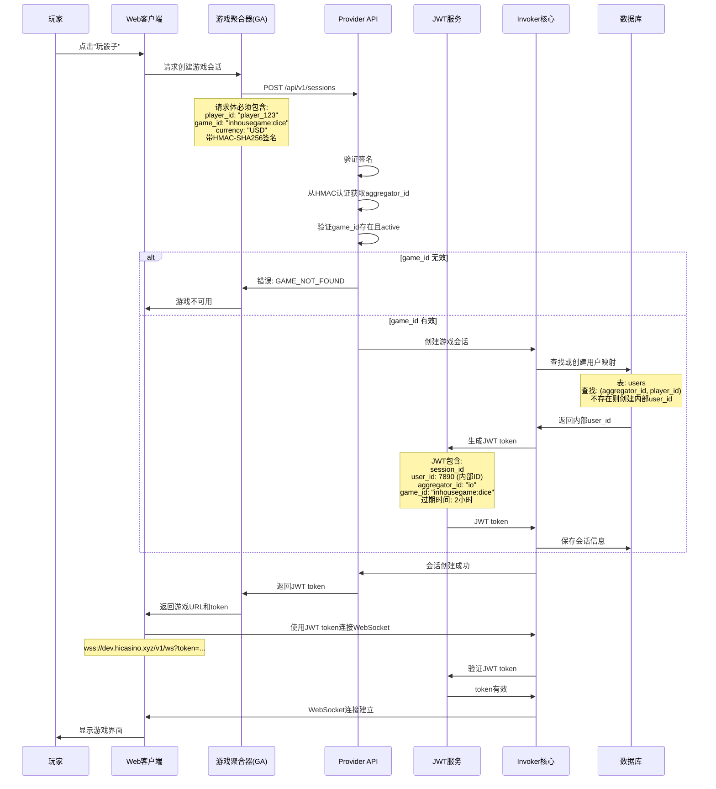
```mermaid
sequenceDiagram
    participant Player as 玩家
    participant WebClient as Web客户端
    participant GA as 游戏聚合器(GA)
    participant ProviderAPI as Provider API
    participant JWTService as JWT服务
    participant InvokerCore as Invoker核心
    participant Database as 数据库

    Player->>WebClient: 点击"玩骰子"
    WebClient->>GA: 请求创建游戏会话
    GA->>ProviderAPI: POST /api/v1/sessions
    Note over GA: 请求体必须包含:<br/>player_id: "player_123"<br/>game_id: "inhousegame:dice"<br/>currency: "USD"<br/>带HMAC-SHA256签名
    
    ProviderAPI->>ProviderAPI: 验证签名
    ProviderAPI->>ProviderAPI: 从HMAC认证获取aggregator_id
    ProviderAPI->>ProviderAPI: 验证game_id存在且active
    
    alt game_id 无效
        ProviderAPI->>GA: 错误: GAME_NOT_FOUND
        GA->>WebClient: 游戏不可用
    else game_id 有效
        ProviderAPI->>InvokerCore: 创建游戏会话
        
        InvokerCore->>Database: 查找或创建用户映射
        Note over Database: 表: users<br/>查找: (aggregator_id, player_id)<br/>不存在则创建内部user_id
        Database->>InvokerCore: 返回内部user_id
        
        InvokerCore->>JWTService: 生成JWT token
        Note over JWTService: JWT包含:<br/>session_id<br/>user_id: 7890 (内部ID)<br/>aggregator_id: "io"<br/>game_id: "inhousegame:dice"<br/>过期时间: 2小时
        JWTService->>InvokerCore: JWT token
        InvokerCore->>Database: 保存会话信息
    end
    
    InvokerCore->>ProviderAPI: 会话创建成功
    ProviderAPI->>GA: 返回JWT token
    GA->>WebClient: 返回游戏URL和token
    
    WebClient->>InvokerCore: 使用JWT token连接WebSocket
    Note over WebClient: wss://dev.hicasino.xyz/v1/ws?token=...
    
    InvokerCore->>JWTService: 验证JWT token
    JWTService->>InvokerCore: token有效
    
    InvokerCore->>WebClient: WebSocket连接建立
    WebClient->>Player: 显示游戏界面
```

## WebSocket 连接流程

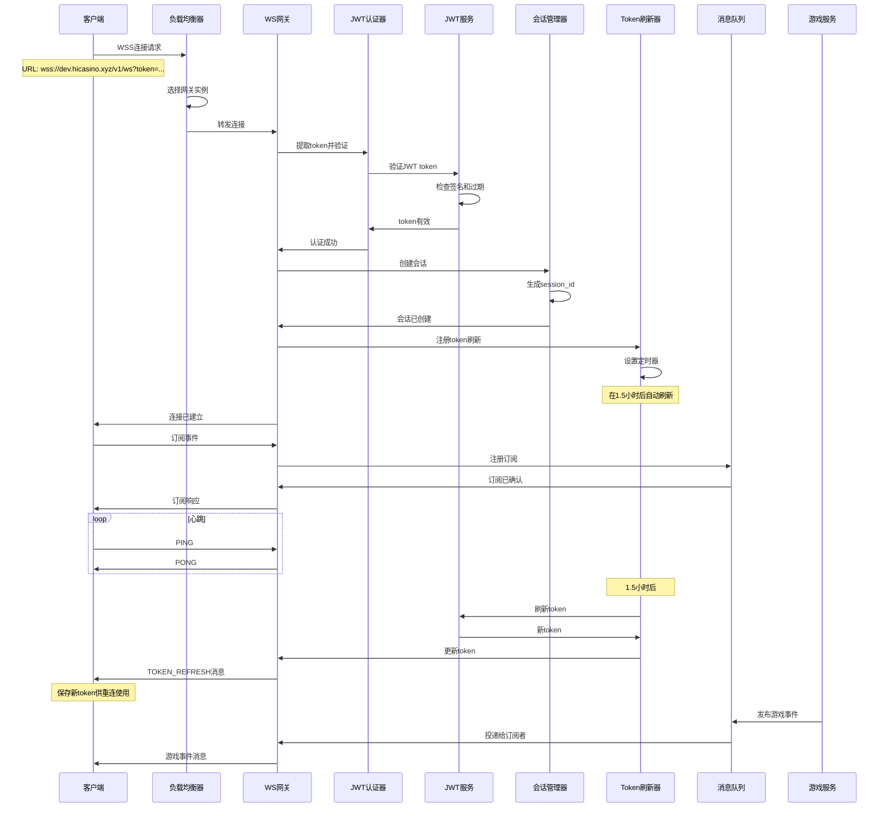
```mermaid
sequenceDiagram
    participant Client as 客户端
    participant LoadBalancer as 负载均衡器
    participant WSGateway as WS网关
    participant JWTAuth as JWT认证器
    participant JWTService as JWT服务
    participant SessionManager as 会话管理器
    participant TokenRefresher as Token刷新器
    participant MessageQueue as 消息队列
    participant GameService as 游戏服务

    Client->>LoadBalancer: WSS连接请求
    Note over Client: URL: wss://dev.hicasino.xyz/v1/ws?token=...
    LoadBalancer->>LoadBalancer: 选择网关实例
    LoadBalancer->>WSGateway: 转发连接
    
    WSGateway->>JWTAuth: 提取token并验证
    JWTAuth->>JWTService: 验证JWT token
    JWTService->>JWTService: 检查签名和过期
    JWTService->>JWTAuth: token有效
    JWTAuth->>WSGateway: 认证成功
    
    WSGateway->>SessionManager: 创建会话
    SessionManager->>SessionManager: 生成session_id
    SessionManager->>WSGateway: 会话已创建
    
    WSGateway->>TokenRefresher: 注册token刷新
    TokenRefresher->>TokenRefresher: 设置定时器
    Note over TokenRefresher: 在1.5小时后自动刷新
    
    WSGateway->>Client: 连接已建立
    
    Client->>WSGateway: 订阅事件
    WSGateway->>MessageQueue: 注册订阅
    MessageQueue->>WSGateway: 订阅已确认
    WSGateway->>Client: 订阅响应
    
    loop 心跳
        Client->>WSGateway: PING
        WSGateway->>Client: PONG
    end
    
    Note over TokenRefresher: 1.5小时后
    TokenRefresher->>JWTService: 刷新token
    JWTService->>TokenRefresher: 新token
    TokenRefresher->>WSGateway: 更新token
    WSGateway->>Client: TOKEN_REFRESH消息
    Note over Client: 保存新token供重连使用
    
    GameService->>MessageQueue: 发布游戏事件
    MessageQueue->>WSGateway: 投递给订阅者
    WSGateway->>Client: 游戏事件消息
```

## WebSocket 连接初始化流程

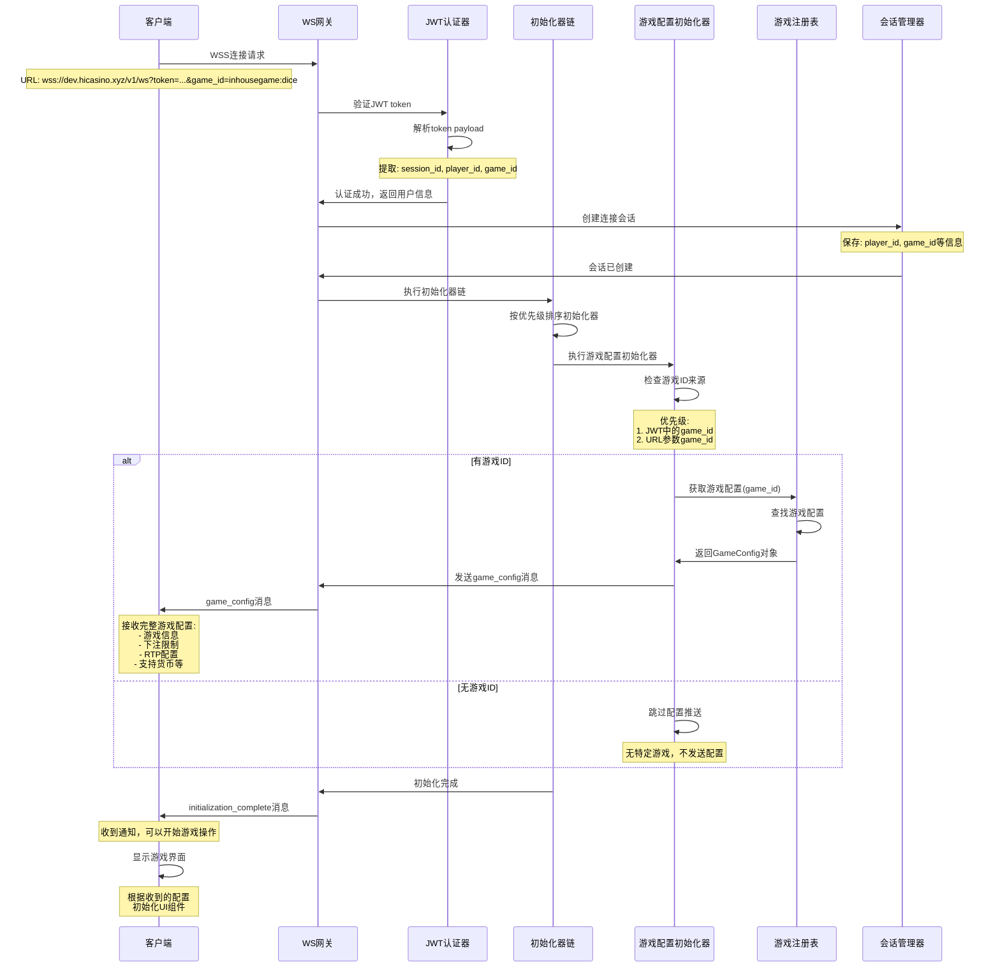
```mermaid
sequenceDiagram
    participant Client as 客户端
    participant WSGateway as WS网关
    participant JWTAuth as JWT认证器
    participant InitChain as 初始化器链
    participant GameConfigInit as 游戏配置初始化器
    participant GameRegistry as 游戏注册表
    participant SessionManager as 会话管理器

    Client->>WSGateway: WSS连接请求
    Note over Client: URL: wss://dev.hicasino.xyz/v1/ws?token=...&game_id=inhousegame:dice
    
    WSGateway->>JWTAuth: 验证JWT token
    JWTAuth->>JWTAuth: 解析token payload
    Note over JWTAuth: 提取: session_id, player_id, game_id
    JWTAuth->>WSGateway: 认证成功，返回用户信息
    
    WSGateway->>SessionManager: 创建连接会话
    Note over SessionManager: 保存: player_id, game_id等信息
    SessionManager->>WSGateway: 会话已创建
    
    WSGateway->>InitChain: 执行初始化器链
    InitChain->>InitChain: 按优先级排序初始化器
    
    InitChain->>GameConfigInit: 执行游戏配置初始化器
    GameConfigInit->>GameConfigInit: 检查游戏ID来源
    Note over GameConfigInit: 优先级:<br/>1. JWT中的game_id<br/>2. URL参数game_id
    
    alt 有游戏ID
        GameConfigInit->>GameRegistry: 获取游戏配置(game_id)
        GameRegistry->>GameRegistry: 查找游戏配置
        GameRegistry->>GameConfigInit: 返回GameConfig对象
        
        GameConfigInit->>WSGateway: 发送game_config消息
        WSGateway->>Client: game_config消息
        Note over Client: 接收完整游戏配置:<br/>- 游戏信息<br/>- 下注限制<br/>- RTP配置<br/>- 支持货币等
    else 无游戏ID
        GameConfigInit->>GameConfigInit: 跳过配置推送
        Note over GameConfigInit: 无特定游戏，不发送配置
    end
    
    InitChain->>WSGateway: 初始化完成
    WSGateway->>Client: initialization_complete消息
    Note over Client: 收到通知，可以开始游戏操作
    
    Client->>Client: 显示游戏界面
    Note over Client: 根据收到的配置<br/>初始化UI组件
```

## 骰子游戏下注序列

> **注意**：余额管理由聚合器（GA）负责，游戏服务专注于游戏逻辑

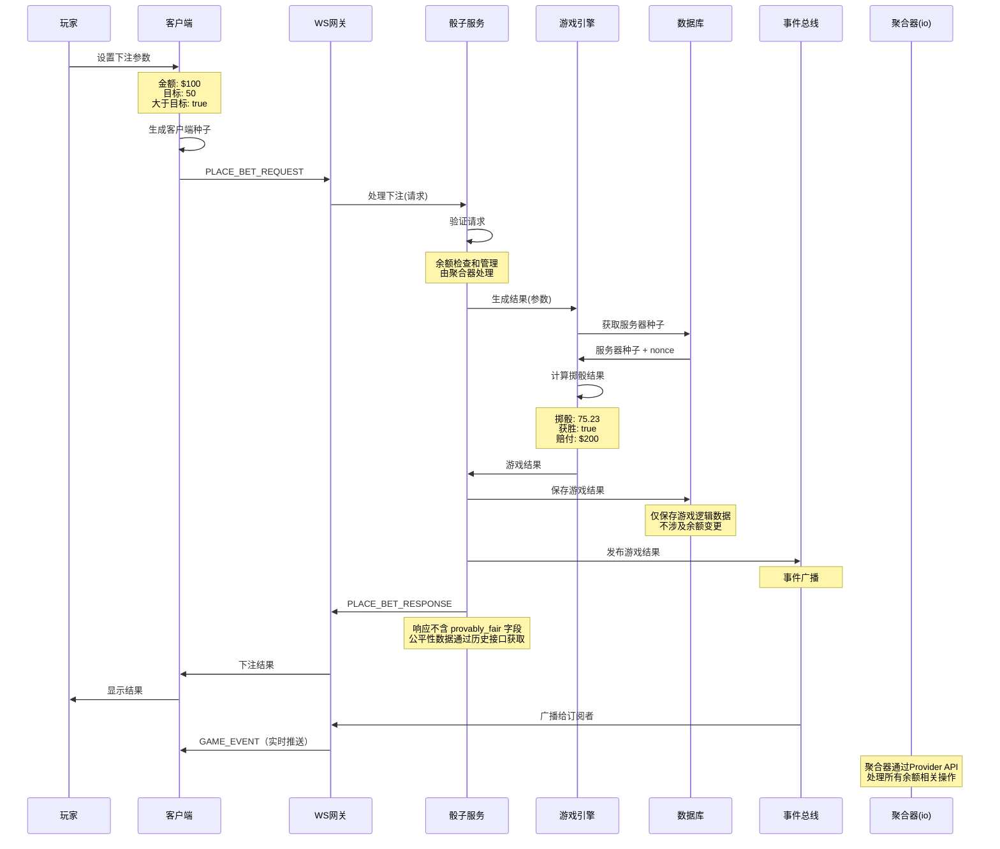
```mermaid
sequenceDiagram
    participant Player as 玩家
    participant Client as 客户端
    participant WSGateway as WS网关
    participant DiceService as 骰子服务
    participant GameEngine as 游戏引擎
    participant Database as 数据库
    participant EventBus as 事件总线
    participant Aggregator as 聚合器(io)

    Player->>Client: 设置下注参数
    Note over Client: 金额: $100<br/>目标: 50<br/>大于目标: true
    
    Client->>Client: 生成客户端种子
    Client->>WSGateway: PLACE_BET_REQUEST
    
    WSGateway->>DiceService: 处理下注(请求)
    
    DiceService->>DiceService: 验证请求
    Note over DiceService: 余额检查和管理<br/>由聚合器处理
    
    DiceService->>GameEngine: 生成结果(参数)
    GameEngine->>Database: 获取服务器种子
    Database->>GameEngine: 服务器种子 + nonce
    GameEngine->>GameEngine: 计算掷骰结果
    Note over GameEngine: 掷骰: 75.23<br/>获胜: true<br/>赔付: $200
    
    GameEngine->>DiceService: 游戏结果
    
    DiceService->>Database: 保存游戏结果
    Note over Database: 仅保存游戏逻辑数据<br/>不涉及余额变更
    
    DiceService->>EventBus: 发布游戏结果
    Note over EventBus: 事件广播
    
    DiceService->>WSGateway: PLACE_BET_RESPONSE
    Note over DiceService: 响应不含 provably_fair 字段<br/>公平性数据通过历史接口获取
    WSGateway->>Client: 下注结果
    Client->>Player: 显示结果
    
    EventBus->>WSGateway: 广播给订阅者
    WSGateway->>Client: GAME_EVENT（实时推送）

    Note over Aggregator: 聚合器通过Provider API<br/>处理所有余额相关操作
```

### 架构改进总结

| 组件 | 变更 | 优势 |
|------|------|------|
| 余额管理 | 移至聚合器 | 职责分离，专注游戏逻辑 |
| 事务一致性 | 聚合器负责 | 避免游戏与金钱耦合 |
| 游戏服务 | 仅处理游戏逻辑 | 简化架构，提高可维护性 |
| Provider API | 接收聚合器调用 | 标准化接口 |

## 21点(Blackjack)游戏流程

### 完整游戏流程

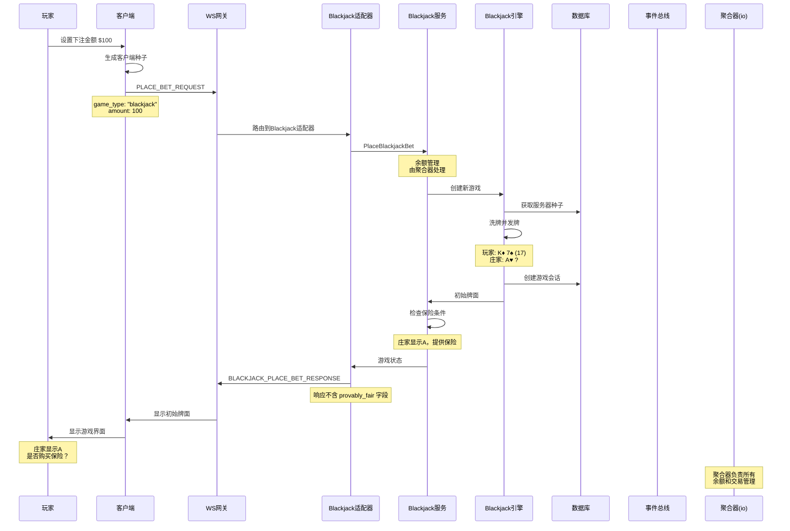
```mermaid
sequenceDiagram
    participant Player as 玩家
    participant Client as 客户端
    participant WSGateway as WS网关
    participant BJAdapter as Blackjack适配器
    participant BJService as Blackjack服务
    participant BJEngine as Blackjack引擎
    participant Database as 数据库
    participant EventBus as 事件总线
    participant Aggregator as 聚合器(io)

    Player->>Client: 设置下注金额 $100
    Client->>Client: 生成客户端种子
    Client->>WSGateway: PLACE_BET_REQUEST
    Note over Client: game_type: "blackjack"<br/>amount: 100

    WSGateway->>BJAdapter: 路由到Blackjack适配器
    BJAdapter->>BJService: PlaceBlackjackBet
    
    Note over BJService: 余额管理<br/>由聚合器处理
    
    BJService->>BJEngine: 创建新游戏
    BJEngine->>Database: 获取服务器种子
    BJEngine->>BJEngine: 洗牌并发牌
    Note over BJEngine: 玩家: K♦ 7♠ (17)<br/>庄家: A♥ ?
    
    BJEngine->>Database: 创建游戏会话
    BJEngine->>BJService: 初始牌面
    
    BJService->>BJService: 检查保险条件
    Note over BJService: 庄家显示A，提供保险
    
    BJService->>BJAdapter: 游戏状态
    BJAdapter->>WSGateway: BLACKJACK_PLACE_BET_RESPONSE
    Note over BJAdapter: 响应不含 provably_fair 字段
    WSGateway->>Client: 显示初始牌面
    
    Client->>Player: 显示游戏界面
    Note over Player: 庄家显示A<br/>是否购买保险？

    Note over Aggregator: 聚合器负责所有<br/>余额和交易管理
```

### 保险决策流程

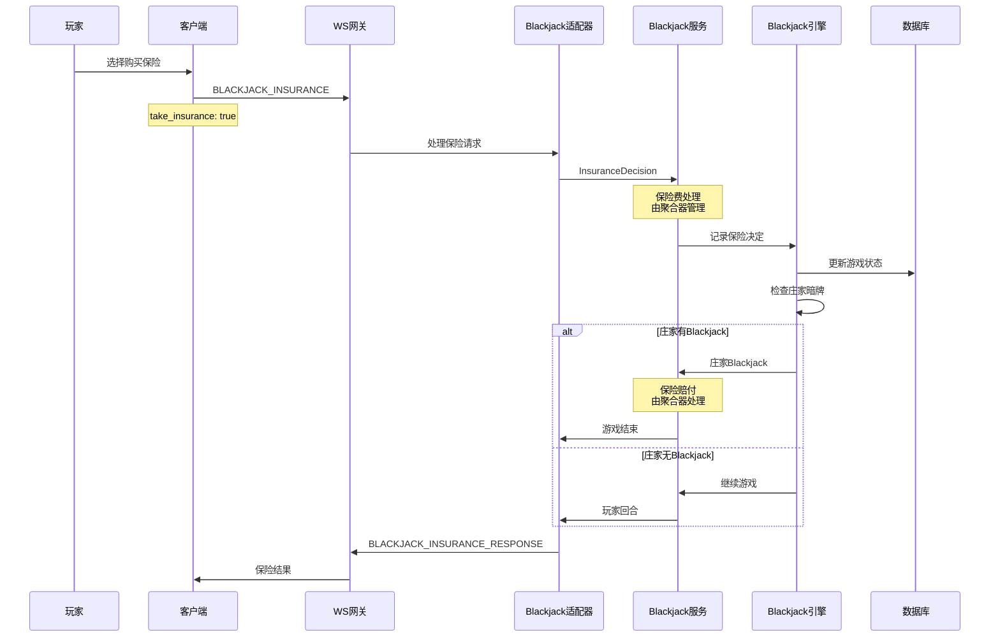
```mermaid
sequenceDiagram
    participant Player as 玩家
    participant Client as 客户端
    participant WSGateway as WS网关
    participant BJAdapter as Blackjack适配器
    participant BJService as Blackjack服务
    participant BJEngine as Blackjack引擎
    participant Database as 数据库

    Player->>Client: 选择购买保险
    Client->>WSGateway: BLACKJACK_INSURANCE
    Note over Client: take_insurance: true
    
    WSGateway->>BJAdapter: 处理保险请求
    BJAdapter->>BJService: InsuranceDecision
    
    Note over BJService: 保险费处理<br/>由聚合器管理
    
    BJService->>BJEngine: 记录保险决定
    BJEngine->>Database: 更新游戏状态
    
    BJEngine->>BJEngine: 检查庄家暗牌
    
    alt 庄家有Blackjack
        BJEngine->>BJService: 庄家Blackjack
        Note over BJService: 保险赔付<br/>由聚合器处理
        BJService->>BJAdapter: 游戏结束
    else 庄家无Blackjack
        BJEngine->>BJService: 继续游戏
        BJService->>BJAdapter: 玩家回合
    end
    
    BJAdapter->>WSGateway: BLACKJACK_INSURANCE_RESPONSE
    WSGateway->>Client: 保险结果
```

### 玩家动作流程

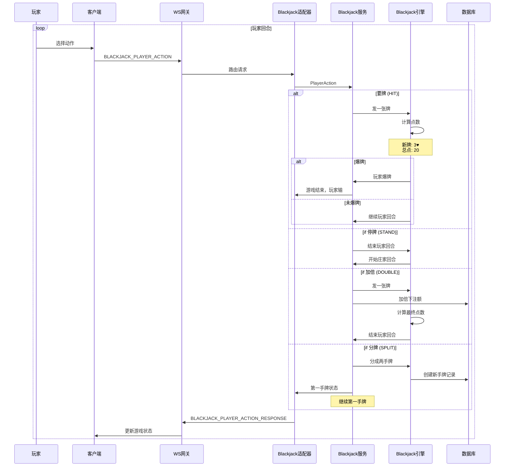
```mermaid
sequenceDiagram
    participant Player as 玩家
    participant Client as 客户端
    participant WSGateway as WS网关
    participant BJAdapter as Blackjack适配器
    participant BJService as Blackjack服务
    participant BJEngine as Blackjack引擎
    participant Database as 数据库

    loop 玩家回合
        Player->>Client: 选择动作
        Client->>WSGateway: BLACKJACK_PLAYER_ACTION
        WSGateway->>BJAdapter: 路由请求
        BJAdapter->>BJService: PlayerAction
        
        alt 要牌 (HIT)
            BJService->>BJEngine: 发一张牌
            BJEngine->>BJEngine: 计算点数
            Note over BJEngine: 新牌: 3♥<br/>总点: 20
            
            alt 爆牌
                BJEngine->>BJService: 玩家爆牌
                BJService->>BJAdapter: 游戏结束，玩家输
            else 未爆牌
                BJEngine->>BJService: 继续玩家回合
            end
            
        else if 停牌 (STAND)
            BJService->>BJEngine: 结束玩家回合
            BJEngine->>BJService: 开始庄家回合
            
        else if 加倍 (DOUBLE)
            BJService->>BJEngine: 发一张牌
            BJService->>Database: 加倍下注额
            BJEngine->>BJEngine: 计算最终点数
            BJEngine->>BJService: 结束玩家回合
            
        else if 分牌 (SPLIT)
            BJService->>BJEngine: 分成两手牌
            BJEngine->>Database: 创建新手牌记录
            BJService->>BJAdapter: 第一手牌状态
            Note over BJService: 继续第一手牌
        end
        
        BJAdapter->>WSGateway: BLACKJACK_PLAYER_ACTION_RESPONSE
        WSGateway->>Client: 更新游戏状态
    end
```

### 庄家回合和结算

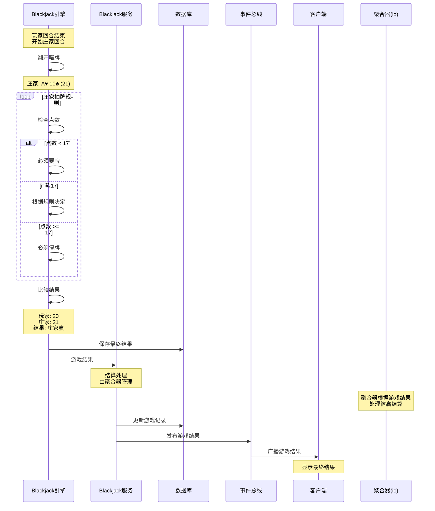
```mermaid
sequenceDiagram
    participant BJEngine as Blackjack引擎
    participant BJService as Blackjack服务
    participant Database as 数据库
    participant EventBus as 事件总线
    participant Client as 客户端
    participant Aggregator as 聚合器(io)

    Note over BJEngine: 玩家回合结束<br/>开始庄家回合
    
    BJEngine->>BJEngine: 翻开暗牌
    Note over BJEngine: 庄家: A♥ 10♣ (21)
    
    loop 庄家抽牌规则
        BJEngine->>BJEngine: 检查点数
        
        alt 点数 < 17
            BJEngine->>BJEngine: 必须要牌
        else if 软17
            BJEngine->>BJEngine: 根据规则决定
        else 点数 >= 17
            BJEngine->>BJEngine: 必须停牌
        end
    end
    
    BJEngine->>BJEngine: 比较结果
    Note over BJEngine: 玩家: 20<br/>庄家: 21<br/>结果: 庄家赢
    
    BJEngine->>Database: 保存最终结果
    BJEngine->>BJService: 游戏结果
    
    Note over BJService: 结算处理<br/>由聚合器管理
    Note over Aggregator: 聚合器根据游戏结果<br/>处理输赢结算
    
    BJService->>Database: 更新游戏记录
    BJService->>EventBus: 发布游戏结果
    
    EventBus->>Client: 广播游戏结果
    Note over Client: 显示最终结果
```

## 地雷(Mines)游戏流程 ✅ 已实现

### 游戏开始流程

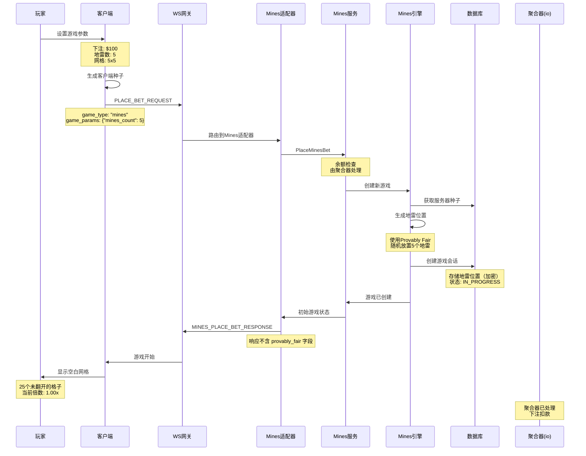
```mermaid
sequenceDiagram
    participant Player as 玩家
    participant Client as 客户端
    participant WSGateway as WS网关
    participant MinesAdapter as Mines适配器
    participant MinesService as Mines服务
    participant MinesEngine as Mines引擎
    participant Database as 数据库
    participant Aggregator as 聚合器(io)

    Player->>Client: 设置游戏参数
    Note over Client: 下注: $100<br/>地雷数: 5<br/>网格: 5x5
    
    Client->>Client: 生成客户端种子
    Client->>WSGateway: PLACE_BET_REQUEST
    Note over Client: game_type: "mines"<br/>game_params: {"mines_count": 5}
    
    WSGateway->>MinesAdapter: 路由到Mines适配器
    MinesAdapter->>MinesService: PlaceMinesBet
    
    Note over MinesService: 余额检查<br/>由聚合器处理
    
    MinesService->>MinesEngine: 创建新游戏
    MinesEngine->>Database: 获取服务器种子
    MinesEngine->>MinesEngine: 生成地雷位置
    Note over MinesEngine: 使用Provably Fair<br/>随机放置5个地雷
    
    MinesEngine->>Database: 创建游戏会话
    Note over Database: 存储地雷位置（加密）<br/>状态: IN_PROGRESS
    
    MinesEngine->>MinesService: 游戏已创建
    MinesService->>MinesAdapter: 初始游戏状态
    
    MinesAdapter->>WSGateway: MINES_PLACE_BET_RESPONSE
    Note over MinesAdapter: 响应不含 provably_fair 字段
    WSGateway->>Client: 游戏开始
    
    Client->>Player: 显示空白网格
    Note over Player: 25个未翻开的格子<br/>当前倍数: 1.00x

    Note over Aggregator: 聚合器已处理<br/>下注扣款
```

### 揭示瓦片流程

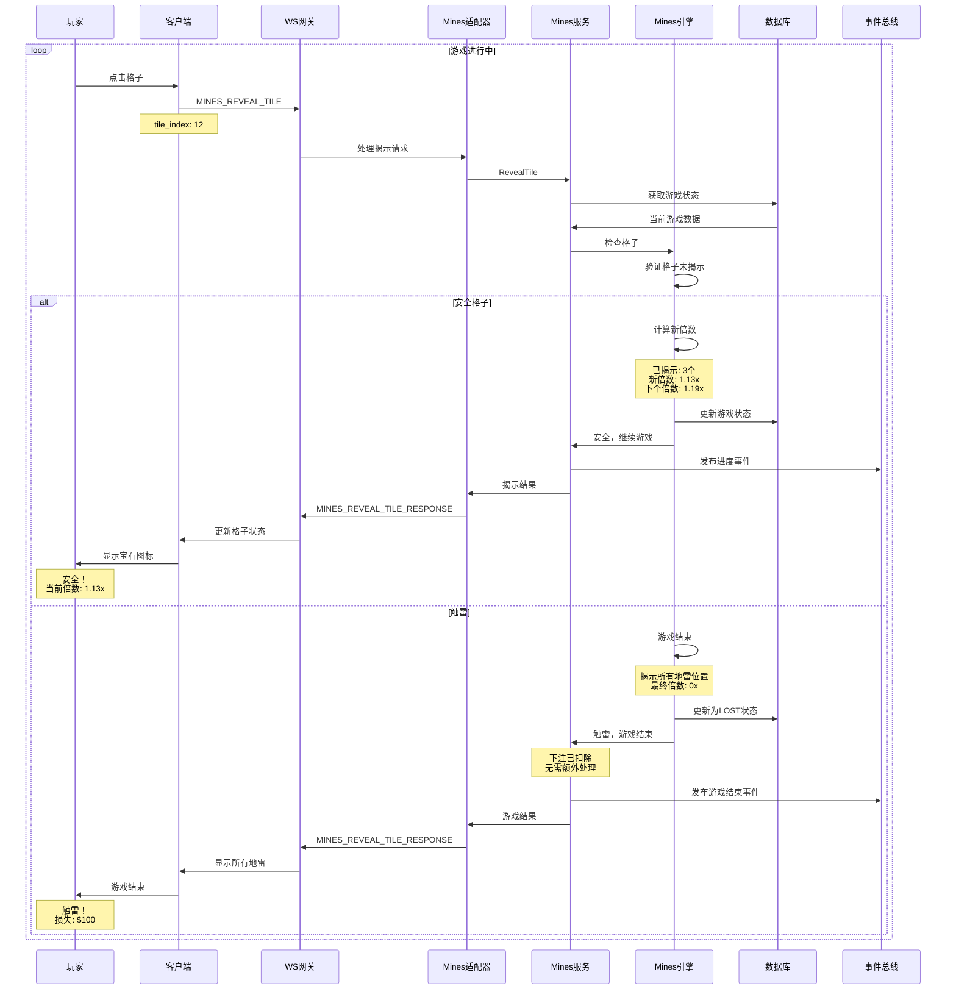
```mermaid
sequenceDiagram
    participant Player as 玩家
    participant Client as 客户端
    participant WSGateway as WS网关
    participant MinesAdapter as Mines适配器
    participant MinesService as Mines服务
    participant MinesEngine as Mines引擎
    participant Database as 数据库
    participant EventBus as 事件总线

    loop 游戏进行中
        Player->>Client: 点击格子 #12
        Client->>WSGateway: MINES_REVEAL_TILE
        Note over Client: tile_index: 12
        
        WSGateway->>MinesAdapter: 处理揭示请求
        MinesAdapter->>MinesService: RevealTile
        
        MinesService->>Database: 获取游戏状态
        Database->>MinesService: 当前游戏数据
        
        MinesService->>MinesEngine: 检查格子
        MinesEngine->>MinesEngine: 验证格子未揭示
        
        alt 安全格子
            MinesEngine->>MinesEngine: 计算新倍数
            Note over MinesEngine: 已揭示: 3个<br/>新倍数: 1.13x<br/>下个倍数: 1.19x
            
            MinesEngine->>Database: 更新游戏状态
            MinesEngine->>MinesService: 安全，继续游戏
            
            MinesService->>EventBus: 发布进度事件
            MinesService->>MinesAdapter: 揭示结果
            
            MinesAdapter->>WSGateway: MINES_REVEAL_TILE_RESPONSE
            WSGateway->>Client: 更新格子状态
            
            Client->>Player: 显示宝石图标
            Note over Player: 安全！<br/>当前倍数: 1.13x
            
        else 触雷
            MinesEngine->>MinesEngine: 游戏结束
            Note over MinesEngine: 揭示所有地雷位置<br/>最终倍数: 0x
            
            MinesEngine->>Database: 更新为LOST状态
            MinesEngine->>MinesService: 触雷，游戏结束
            
            Note over MinesService: 下注已扣除<br/>无需额外处理
            MinesService->>EventBus: 发布游戏结束事件
            
            MinesService->>MinesAdapter: 游戏结果
            MinesAdapter->>WSGateway: MINES_REVEAL_TILE_RESPONSE
            WSGateway->>Client: 显示所有地雷
            
            Client->>Player: 游戏结束
            Note over Player: 触雷！<br/>损失: $100
        end
    end
```

### 现金提取流程

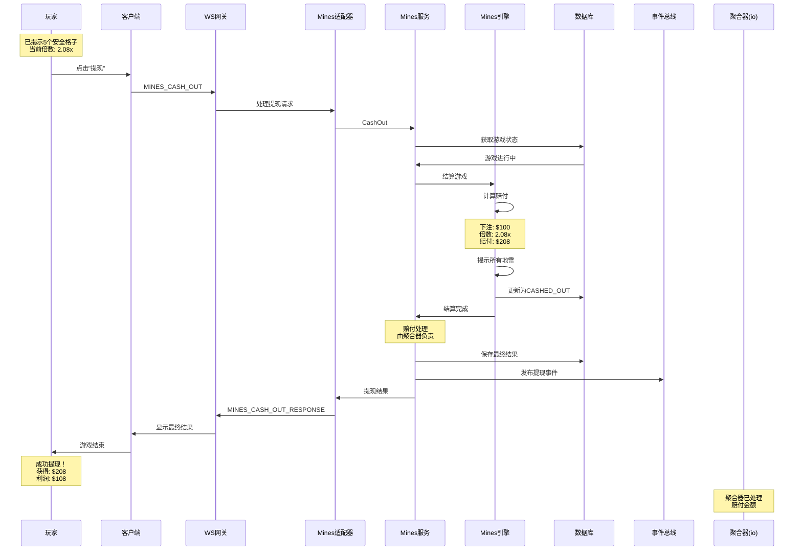
```mermaid
sequenceDiagram
    participant Player as 玩家
    participant Client as 客户端
    participant WSGateway as WS网关
    participant MinesAdapter as Mines适配器
    participant MinesService as Mines服务
    participant MinesEngine as Mines引擎
    participant Database as 数据库
    participant EventBus as 事件总线
    participant Aggregator as 聚合器(io)

    Note over Player: 已揭示5个安全格子<br/>当前倍数: 2.08x
    
    Player->>Client: 点击"提现"
    Client->>WSGateway: MINES_CASH_OUT
    
    WSGateway->>MinesAdapter: 处理提现请求
    MinesAdapter->>MinesService: CashOut
    
    MinesService->>Database: 获取游戏状态
    Database->>MinesService: 游戏进行中
    
    MinesService->>MinesEngine: 结算游戏
    MinesEngine->>MinesEngine: 计算赔付
    Note over MinesEngine: 下注: $100<br/>倍数: 2.08x<br/>赔付: $208
    
    MinesEngine->>MinesEngine: 揭示所有地雷
    MinesEngine->>Database: 更新为CASHED_OUT
    
    MinesEngine->>MinesService: 结算完成
    Note over MinesService: 赔付处理<br/>由聚合器负责
    
    MinesService->>Database: 保存最终结果
    MinesService->>EventBus: 发布提现事件
    
    MinesService->>MinesAdapter: 提现结果
    MinesAdapter->>WSGateway: MINES_CASH_OUT_RESPONSE
    WSGateway->>Client: 显示最终结果
    
    Client->>Player: 游戏结束
    Note over Player: 成功提现！<br/>获得: $208<br/>利润: $108

    Note over Aggregator: 聚合器已处理<br/>赔付金额
```

### Mines 游戏状态查询

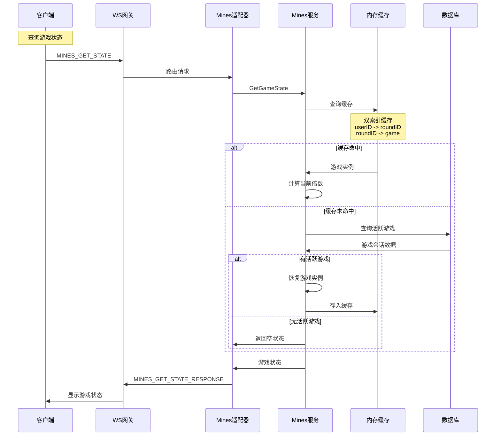
```mermaid
sequenceDiagram
    participant Client as 客户端
    participant WSGateway as WS网关
    participant MinesAdapter as Mines适配器
    participant MinesService as Mines服务
    participant Cache as 内存缓存
    participant Database as 数据库

    Note over Client: 查询游戏状态
    
    Client->>WSGateway: MINES_GET_STATE
    
    WSGateway->>MinesAdapter: 路由请求
    MinesAdapter->>MinesService: GetGameState
    
    MinesService->>Cache: 查询缓存
    Note over Cache: 双索引缓存<br/>userID -> roundID<br/>roundID -> game
    
    alt 缓存命中
        Cache->>MinesService: 游戏实例
        MinesService->>MinesService: 计算当前倍数
    else 缓存未命中
        MinesService->>Database: 查询活跃游戏
        Database->>MinesService: 游戏会话数据
        
        alt 有活跃游戏
            MinesService->>MinesService: 恢复游戏实例
            MinesService->>Cache: 存入缓存
        else 无活跃游戏
            MinesService->>MinesAdapter: 返回空状态
        end
    end
    
    MinesService->>MinesAdapter: 游戏状态
    MinesAdapter->>WSGateway: MINES_GET_STATE_RESPONSE
    WSGateway->>Client: 显示游戏状态
```

### 游戏会话恢复流程

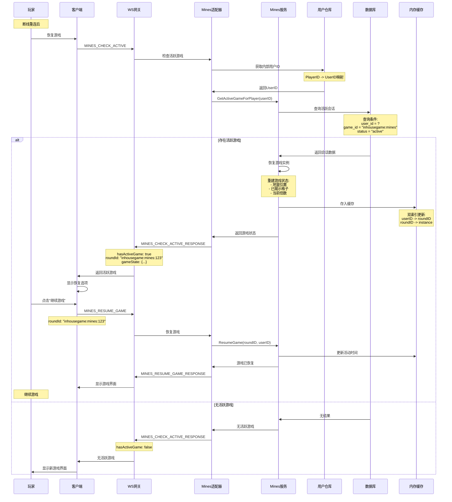
```mermaid
sequenceDiagram
    participant Player as 玩家
    participant Client as 客户端
    participant WSGateway as WS网关
    participant MinesAdapter as Mines适配器
    participant MinesService as Mines服务
    participant UserRepo as 用户仓库
    participant Database as 数据库
    participant Cache as 内存缓存

    Note over Player: 断线重连后
    
    Player->>Client: 恢复游戏
    Client->>WSGateway: MINES_CHECK_ACTIVE
    
    WSGateway->>MinesAdapter: 检查活跃游戏
    MinesAdapter->>UserRepo: 获取内部用户ID
    Note over UserRepo: PlayerID -> UserID映射
    
    UserRepo->>MinesAdapter: 返回UserID
    MinesAdapter->>MinesService: GetActiveGameForPlayer(userID)
    
    MinesService->>Database: 查询活跃会话
    Note over Database: 查询条件:<br/>user_id = ?<br/>game_id = "inhousegame:mines"<br/>status = "active"
    
    alt 存在活跃游戏
        Database->>MinesService: 返回会话数据
        MinesService->>MinesService: 恢复游戏实例
        Note over MinesService: 重建游戏状态:<br/>- 地雷位置<br/>- 已揭示格子<br/>- 当前倍数
        
        MinesService->>Cache: 存入缓存
        Note over Cache: 双索引更新:<br/>userID -> roundID<br/>roundID -> instance
        
        MinesService->>MinesAdapter: 返回游戏状态
        MinesAdapter->>WSGateway: MINES_CHECK_ACTIVE_RESPONSE
        Note over WSGateway: hasActiveGame: true<br/>roundId: "inhousegame:mines:123"<br/>gameState: {...}
        
        WSGateway->>Client: 返回活跃游戏
        Client->>Client: 显示恢复选项
        
        Player->>Client: 点击"继续游戏"
        Client->>WSGateway: MINES_RESUME_GAME
        Note over Client: roundId: "inhousegame:mines:123"
        
        WSGateway->>MinesAdapter: 恢复游戏
        MinesAdapter->>MinesService: ResumeGame(roundID, userID)
        
        MinesService->>Cache: 更新活动时间
        MinesService->>MinesAdapter: 游戏已恢复
        MinesAdapter->>WSGateway: MINES_RESUME_GAME_RESPONSE
        WSGateway->>Client: 显示游戏界面
        
        Note over Player: 继续游戏
        
    else 无活跃游戏
        Database->>MinesService: 无结果
        MinesService->>MinesAdapter: 无活跃游戏
        MinesAdapter->>WSGateway: MINES_CHECK_ACTIVE_RESPONSE
        Note over WSGateway: hasActiveGame: false
        
        WSGateway->>Client: 无活跃游戏
        Client->>Player: 显示新游戏界面
    end
```

### 游戏放弃流程

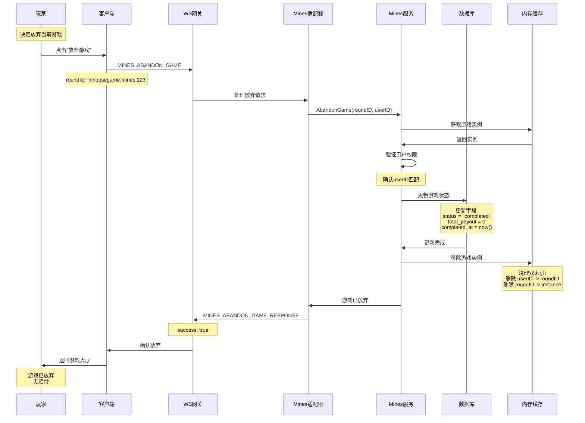
```mermaid
sequenceDiagram
    participant Player as 玩家
    participant Client as 客户端
    participant WSGateway as WS网关
    participant MinesAdapter as Mines适配器
    participant MinesService as Mines服务
    participant Database as 数据库
    participant Cache as 内存缓存

    Note over Player: 决定放弃当前游戏
    
    Player->>Client: 点击"放弃游戏"
    Client->>WSGateway: MINES_ABANDON_GAME
    Note over Client: roundId: "inhousegame:mines:123"
    
    WSGateway->>MinesAdapter: 处理放弃请求
    MinesAdapter->>MinesService: AbandonGame(roundID, userID)
    
    MinesService->>Cache: 获取游戏实例
    Cache->>MinesService: 返回实例
    
    MinesService->>MinesService: 验证用户权限
    Note over MinesService: 确认userID匹配
    
    MinesService->>Database: 更新游戏状态
    Note over Database: 更新字段:<br/>status = "completed"<br/>total_payout = 0<br/>completed_at = now()
    
    Database->>MinesService: 更新完成
    
    MinesService->>Cache: 移除游戏实例
    Note over Cache: 清理双索引:<br/>删除 userID -> roundID<br/>删除 roundID -> instance
    
    MinesService->>MinesAdapter: 游戏已放弃
    MinesAdapter->>WSGateway: MINES_ABANDON_GAME_RESPONSE
    Note over WSGateway: success: true
    
    WSGateway->>Client: 确认放弃
    Client->>Player: 返回游戏大厅
    
    Note over Player: 游戏已放弃<br/>无赔付
```

### 自动提现流程

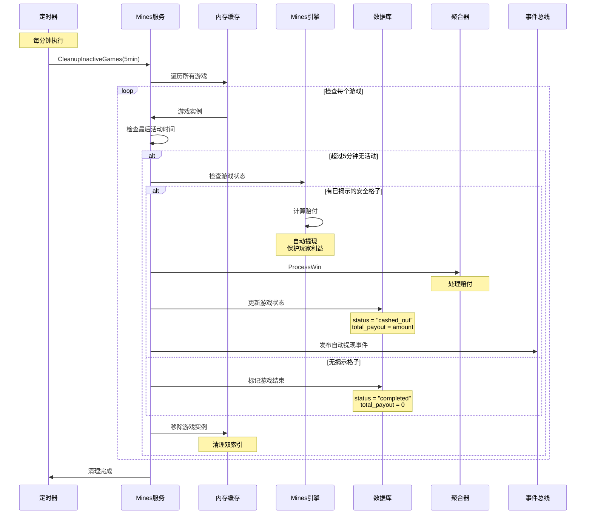
```mermaid
sequenceDiagram
    participant Timer as 定时器
    participant MinesService as Mines服务
    participant Cache as 内存缓存
    participant MinesEngine as Mines引擎
    participant Database as 数据库
    participant Aggregator as 聚合器
    participant EventBus as 事件总线

    Note over Timer: 每分钟执行
    
    Timer->>MinesService: CleanupInactiveGames(5min)
    
    MinesService->>Cache: 遍历所有游戏
    
    loop 检查每个游戏
        Cache->>MinesService: 游戏实例
        MinesService->>MinesService: 检查最后活动时间
        
        alt 超过5分钟无活动
            MinesService->>MinesEngine: 检查游戏状态
            
            alt 有已揭示的安全格子
                MinesEngine->>MinesEngine: 计算赔付
                Note over MinesEngine: 自动提现<br/>保护玩家利益
                
                MinesService->>Aggregator: ProcessWin
                Note over Aggregator: 处理赔付
                
                MinesService->>Database: 更新游戏状态
                Note over Database: status = "cashed_out"<br/>total_payout = amount
                
                MinesService->>EventBus: 发布自动提现事件
                
            else 无揭示格子
                MinesService->>Database: 标记游戏结束
                Note over Database: status = "completed"<br/>total_payout = 0
            end
            
            MinesService->>Cache: 移除游戏实例
            Note over Cache: 清理双索引
        end
    end
    
    MinesService->>Timer: 清理完成
```

## 事件订阅流程

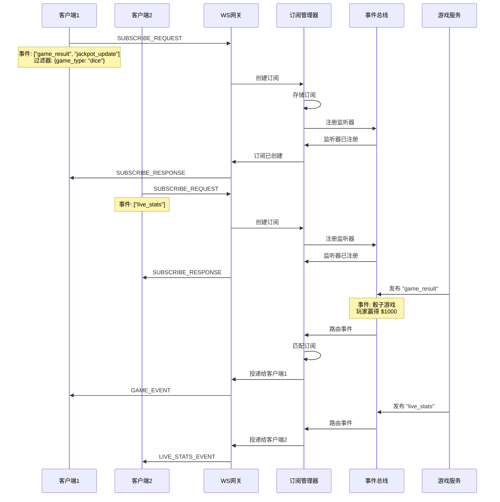
```mermaid
sequenceDiagram
    participant Client1 as 客户端1
    participant Client2 as 客户端2
    participant WSGateway as WS网关
    participant SubscriptionManager as 订阅管理器
    participant EventBus as 事件总线
    participant GameService as 游戏服务

    Client1->>WSGateway: SUBSCRIBE_REQUEST
    Note over Client1: 事件: ["game_result", "jackpot_update"]<br/>过滤器: {game_type: "dice"}
    
    WSGateway->>SubscriptionManager: 创建订阅
    SubscriptionManager->>SubscriptionManager: 存储订阅
    SubscriptionManager->>EventBus: 注册监听器
    EventBus->>SubscriptionManager: 监听器已注册
    SubscriptionManager->>WSGateway: 订阅已创建
    WSGateway->>Client1: SUBSCRIBE_RESPONSE
    
    Client2->>WSGateway: SUBSCRIBE_REQUEST
    Note over Client2: 事件: ["live_stats"]
    WSGateway->>SubscriptionManager: 创建订阅
    SubscriptionManager->>EventBus: 注册监听器
    EventBus->>SubscriptionManager: 监听器已注册
    WSGateway->>Client2: SUBSCRIBE_RESPONSE
    
    GameService->>EventBus: 发布 "game_result"
    Note over EventBus: 事件: 骰子游戏<br/>玩家赢得 $1000
    
    EventBus->>SubscriptionManager: 路由事件
    SubscriptionManager->>SubscriptionManager: 匹配订阅
    SubscriptionManager->>WSGateway: 投递给客户端1
    WSGateway->>Client1: GAME_EVENT
    
    GameService->>EventBus: 发布 "live_stats"
    EventBus->>SubscriptionManager: 路由事件
    SubscriptionManager->>WSGateway: 投递给客户端2
    WSGateway->>Client2: LIVE_STATS_EVENT
```

## 余额更新推送流程

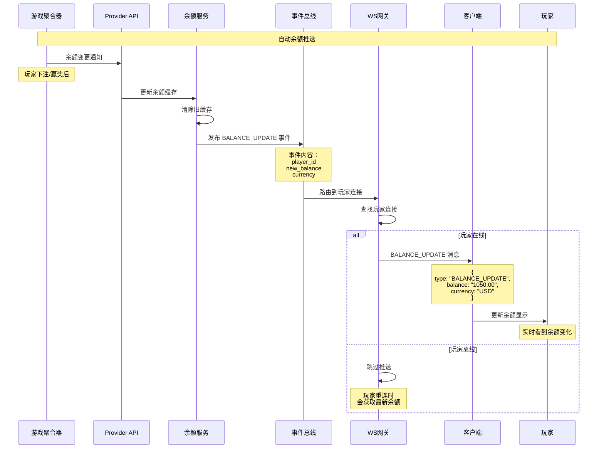
```mermaid
sequenceDiagram
    participant GA as 游戏聚合器
    participant ProviderAPI as Provider API
    participant BalanceService as 余额服务
    participant EventBus as 事件总线
    participant WSGateway as WS网关
    participant Client as 客户端
    participant Player as 玩家

    Note over GA,Player: 自动余额推送

    GA->>ProviderAPI: 余额变更通知
    Note over GA: 玩家下注/赢奖后
    
    ProviderAPI->>BalanceService: 更新余额缓存
    BalanceService->>BalanceService: 清除旧缓存
    
    BalanceService->>EventBus: 发布 BALANCE_UPDATE 事件
    Note over EventBus: 事件内容：<br/>player_id<br/>new_balance<br/>currency
    
    EventBus->>WSGateway: 路由到玩家连接
    WSGateway->>WSGateway: 查找玩家连接
    
    alt 玩家在线
        WSGateway->>Client: BALANCE_UPDATE 消息
        Note over Client: {<br/>  type: "BALANCE_UPDATE",<br/>  balance: "1050.00",<br/>  currency: "USD"<br/>}
        Client->>Player: 更新余额显示
        Note over Player: 实时看到余额变化
    else 玩家离线
        WSGateway->>WSGateway: 跳过推送
        Note over WSGateway: 玩家重连时<br/>会获取最新余额
    end
```

## 实时投注活动广播流程

### 投注活动发布和广播

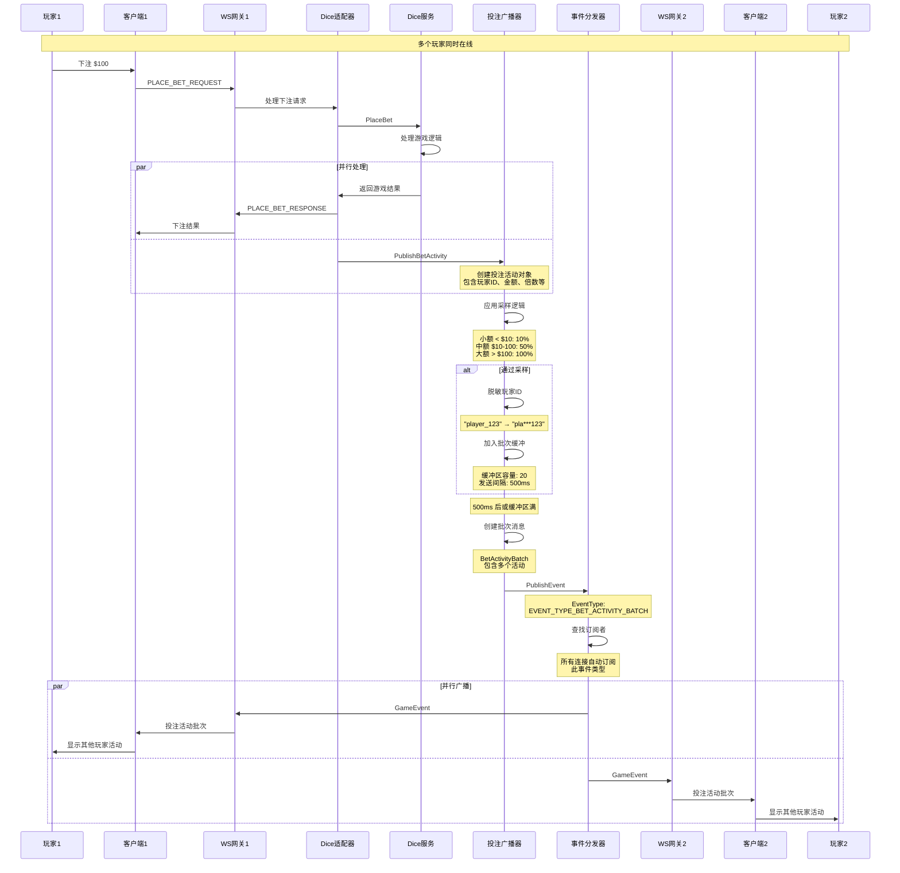
```mermaid
sequenceDiagram
    participant Player1 as 玩家1
    participant Client1 as 客户端1
    participant WSGateway1 as WS网关1
    participant DiceAdapter as Dice适配器
    participant DiceService as Dice服务
    participant BetBroadcaster as 投注广播器
    participant EventDispatcher as 事件分发器
    participant WSGateway2 as WS网关2
    participant Client2 as 客户端2
    participant Player2 as 玩家2

    Note over Player1,Player2: 多个玩家同时在线
    
    Player1->>Client1: 下注 $100
    Client1->>WSGateway1: PLACE_BET_REQUEST
    WSGateway1->>DiceAdapter: 处理下注请求
    
    DiceAdapter->>DiceService: PlaceBet
    DiceService->>DiceService: 处理游戏逻辑
    
    par 并行处理
        DiceService->>DiceAdapter: 返回游戏结果
        DiceAdapter->>WSGateway1: PLACE_BET_RESPONSE
        WSGateway1->>Client1: 下注结果
    and
        DiceAdapter->>BetBroadcaster: PublishBetActivity
        Note over BetBroadcaster: 创建投注活动对象<br/>包含玩家ID、金额、倍数等
    end
    
    BetBroadcaster->>BetBroadcaster: 应用采样逻辑
    Note over BetBroadcaster: 小额 < $10: 10%<br/>中额 $10-100: 50%<br/>大额 > $100: 100%
    
    alt 通过采样
        BetBroadcaster->>BetBroadcaster: 脱敏玩家ID
        Note over BetBroadcaster: "player_123" → "pla***123"
        
        BetBroadcaster->>BetBroadcaster: 加入批次缓冲
        Note over BetBroadcaster: 缓冲区容量: 20<br/>发送间隔: 500ms
    end
    
    Note over BetBroadcaster: 500ms 后或缓冲区满
    
    BetBroadcaster->>BetBroadcaster: 创建批次消息
    Note over BetBroadcaster: BetActivityBatch<br/>包含多个活动
    
    BetBroadcaster->>EventDispatcher: PublishEvent
    Note over EventDispatcher: EventType:<br/>EVENT_TYPE_BET_ACTIVITY_BATCH
    
    EventDispatcher->>EventDispatcher: 查找订阅者
    Note over EventDispatcher: 所有连接自动订阅<br/>此事件类型
    
    par 并行广播
        EventDispatcher->>WSGateway1: GameEvent
        WSGateway1->>Client1: 投注活动批次
        Client1->>Player1: 显示其他玩家活动
    and
        EventDispatcher->>WSGateway2: GameEvent
        WSGateway2->>Client2: 投注活动批次
        Client2->>Player2: 显示其他玩家活动
    end
```

### 自动订阅机制

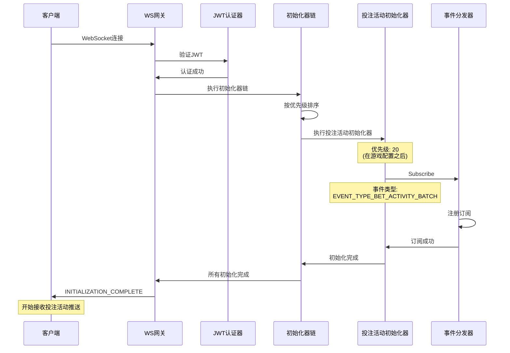
```mermaid
sequenceDiagram
    participant Client as 客户端
    participant WSGateway as WS网关
    participant JWTAuth as JWT认证器
    participant InitChain as 初始化器链
    participant BetActivityInit as 投注活动初始化器
    participant EventDispatcher as 事件分发器

    Client->>WSGateway: WebSocket连接
    WSGateway->>JWTAuth: 验证JWT
    JWTAuth->>WSGateway: 认证成功
    
    WSGateway->>InitChain: 执行初始化器链
    InitChain->>InitChain: 按优先级排序
    
    InitChain->>BetActivityInit: 执行投注活动初始化器
    Note over BetActivityInit: 优先级: 20<br/>(在游戏配置之后)
    
    BetActivityInit->>EventDispatcher: Subscribe
    Note over BetActivityInit: 事件类型:<br/>EVENT_TYPE_BET_ACTIVITY_BATCH
    
    EventDispatcher->>EventDispatcher: 注册订阅
    EventDispatcher->>BetActivityInit: 订阅成功
    
    BetActivityInit->>InitChain: 初始化完成
    InitChain->>WSGateway: 所有初始化完成
    
    WSGateway->>Client: INITIALIZATION_COMPLETE
    Note over Client: 开始接收投注活动推送
```

### 大额获胜特殊处理

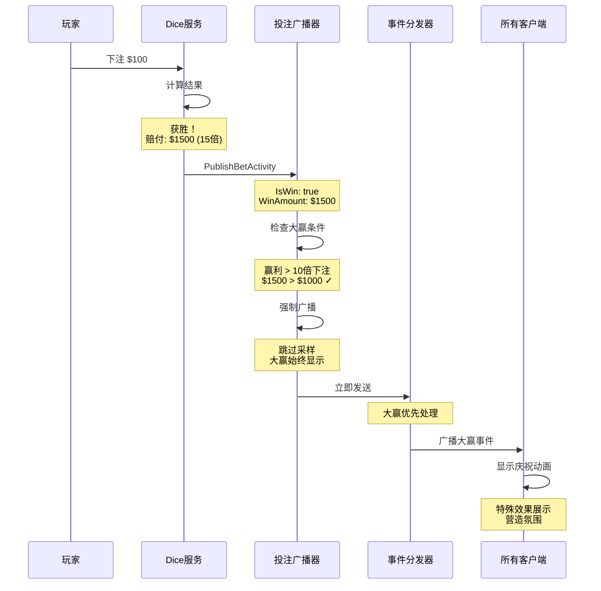
```mermaid
sequenceDiagram
    participant Player as 玩家
    participant DiceService as Dice服务
    participant BetBroadcaster as 投注广播器
    participant EventDispatcher as 事件分发器
    participant AllClients as 所有客户端

    Player->>DiceService: 下注 $100
    DiceService->>DiceService: 计算结果
    Note over DiceService: 获胜！<br/>赔付: $1500 (15倍)
    
    DiceService->>BetBroadcaster: PublishBetActivity
    Note over BetBroadcaster: IsWin: true<br/>WinAmount: $1500
    
    BetBroadcaster->>BetBroadcaster: 检查大赢条件
    Note over BetBroadcaster: 赢利 > 10倍下注<br/>$1500 > $1000 ✓
    
    BetBroadcaster->>BetBroadcaster: 强制广播
    Note over BetBroadcaster: 跳过采样<br/>大赢始终显示
    
    BetBroadcaster->>EventDispatcher: 立即发送
    Note over EventDispatcher: 大赢优先处理
    
    EventDispatcher->>AllClients: 广播大赢事件
    AllClients->>AllClients: 显示庆祝动画
    Note over AllClients: 特殊效果展示<br/>营造氛围
```

## 错误处理场景

### 余额不足错误

```mermaid
sequenceDiagram
    participant Client as 客户端
    participant WSGateway as WS网关
    participant DiceService as 骰子服务
    participant Aggregator as 聚合器(io)

    Client->>WSGateway: PLACE_BET_REQUEST
    Note over Client: 金额: $1000
    
    WSGateway->>DiceService: 处理下注
    
    Note over DiceService: 余额检查<br/>由聚合器处理
    Note over Aggregator: 聚合器在Provider API<br/>调用时已验证余额
    
    DiceService->>DiceService: 创建错误响应
    Note over DiceService: 如果聚合器调用失败<br/>返回相应错误
    
    DiceService->>WSGateway: 错误响应
    WSGateway->>Client: ERROR_MESSAGE
    Note over Client: 代码: GAME_ERROR<br/>消息: 游戏处理失败
```

### 连接恢复

```mermaid
sequenceDiagram
    participant Client as 客户端
    participant WSGateway as WS网关
    participant SessionManager as 会话管理器
    participant MessageBuffer as 消息缓冲

    Note over Client,WSGateway: 活跃连接
    
    Client->>WSGateway: 游戏消息
    WSGateway->>Client: 响应
    
    Note over Client,WSGateway: 网络中断
    Client-->WSGateway: 连接丢失
    
    WSGateway->>SessionManager: 标记会话离线
    SessionManager->>MessageBuffer: 开始缓冲
    
    Client->>Client: 检测到断开
    Client->>Client: 等待（指数退避）
    
    Client->>WSGateway: 使用 session_id 重连
    WSGateway->>SessionManager: 验证会话
    SessionManager->>WSGateway: 会话有效
    
    WSGateway->>MessageBuffer: 获取缓冲消息
    MessageBuffer->>WSGateway: 缓冲的消息
    
    WSGateway->>Client: 连接已恢复
    WSGateway->>Client: 缓冲的消息
    
    Client->>WSGateway: GET_GAME_STATE_REQUEST
    WSGateway->>Client: 当前状态
```

## 可证明公平验证

```mermaid
sequenceDiagram
    participant Player as 玩家
    participant Client as 客户端
    participant API
    participant GameEngine as 游戏引擎
    participant Database as 数据库
    participant Verifier as 验证器

    Note over Player,Database: 下注前
    
    Player->>Client: 请求新种子
    Client->>API: 创建服务器种子
    API->>GameEngine: 生成服务器种子
    GameEngine->>GameEngine: 生成随机种子
    GameEngine->>GameEngine: 哈希种子 (SHA256)
    GameEngine->>Database: 存储种子（隐藏）
    GameEngine->>API: 返回哈希
    API->>Client: 哈希后的种子
    Client->>Player: 显示哈希
    
    Note over Player,Database: 下注时
    
    Player->>Client: 下注
    Client->>Client: 选择客户端种子
    Client->>API: 带客户端种子下注
    API->>GameEngine: 处理下注
    
    GameEngine->>Database: 获取服务器种子
    GameEngine->>GameEngine: 组合种子
    Note over GameEngine: 组合 = sha256(服务器 + 客户端 + nonce)
    GameEngine->>GameEngine: 生成随机数
    Note over GameEngine: 随机数 = 组合 % 10000 / 100
    
    GameEngine->>Database: 保存结果
    GameEngine->>Database: 异步更新种子统计
    Note over Database: current_nonce++<br/>total_bets++
    
    GameEngine->>API: 结果（不含种子原始值）
    API->>Client: 游戏结果
    Note over Client: server_seed: "" // 活跃种子不返回
    
    Note over Player,Database: 下注后（验证）
    
    Player->>Verifier: 输入种子 + nonce
    Verifier->>Verifier: 重新创建组合
    Verifier->>Verifier: 计算结果
    Verifier->>Player: 验证结果
    Note over Player: 结果匹配！✓
```

## 服务端种子轮换流程

### 种子轮换序列图

```mermaid
sequenceDiagram
    participant Player as 玩家
    participant Client as 客户端
    participant API as Dice API
    participant SeedService as 种子服务
    participant Database as 数据库
    participant IDGen as ID生成器

    Player->>Client: 请求轮换种子
    Client->>API: POST /rotate-seed
    Note over Client: player_id: "player123"
    
    API->>SeedService: RotateServerSeed(player_id)
    
    SeedService->>Database: 查询当前活跃种子
    Database->>SeedService: 返回活跃种子
    Note over SeedService: seed_id: 12345<br/>is_active: true
    
    alt 没有活跃种子
        SeedService->>API: 错误：未找到活跃种子
        API->>Client: 400 Bad Request
    else 有活跃种子
        SeedService->>IDGen: 生成新种子ID
        IDGen->>SeedService: 新ID: 12346
        
        SeedService->>SeedService: 生成新种子值
        SeedService->>SeedService: 计算新种子哈希
        
        SeedService->>Database: 开始事务
        
        par 并行操作
            SeedService->>Database: 创建新种子
            Note over Database: seed_id: 12346<br/>is_active: true<br/>total_bets: 0
        and
            SeedService->>Database: 更新旧种子
            Note over Database: is_active: false<br/>revealed_at: now()<br/>replaced_by: 12346
        end
        
        SeedService->>Database: 提交事务
        
        SeedService->>API: 返回轮换结果
        API->>Client: 200 OK
        Note over Client: old_seed: {<br/>  seed_value: "revealed-old-seed",<br/>  total_bets: 42<br/>}<br/>new_seed: {<br/>  seed_hash: "new-hash",<br/>  seed_value: "" // 不返回<br/>}
    end
    
    Client->>Player: 显示轮换结果
    Note over Player: 旧种子已揭示<br/>可以验证历史游戏
```

### 种子安全验证流程

```mermaid
sequenceDiagram
    participant Player as 玩家
    participant Client as 客户端
    participant API as Game API
    participant SeedService as 种子服务
    participant GameEngine as 游戏引擎
    participant Database as 数据库

    Note over Player: 玩家下注时的种子处理
    
    Player->>Client: 下注请求
    Client->>API: PlaceBet
    
    API->>SeedService: 获取活跃种子
    SeedService->>Database: 查询活跃种子
    Database->>SeedService: 返回种子信息
    
    SeedService->>SeedService: 验证种子状态
    Note over SeedService: 只返回哈希值<br/>不返回原始值
    
    SeedService->>GameEngine: 传递种子信息
    GameEngine->>GameEngine: 生成游戏结果
    
    GameEngine->>API: 返回结果
    API->>Client: 下注响应
    Note over Client: provably_fair: {<br/>  server_seed: "", // 空<br/>  hashed_server_seed: "hash",<br/>  seed_revealed: false<br/>}
    
    Note over Player: 查询历史记录时的种子处理
    
    Player->>Client: 查询历史
    Client->>API: GetBetHistory
    
    API->>Database: 查询历史记录
    Database->>API: 返回历史数据
    
    API->>SeedService: 检查种子状态
    SeedService->>Database: 查询种子信息
    
    alt 种子已揭示
        Database->>SeedService: is_active: false
        SeedService->>API: 返回完整种子
        API->>Client: 历史记录（含种子）
        Note over Client: server_seed: "revealed-value"<br/>seed_revealed: true
    else 种子仍活跃
        Database->>SeedService: is_active: true
        SeedService->>API: 只返回哈希
        API->>Client: 历史记录（无种子）
        Note over Client: server_seed: ""<br/>seed_revealed: false
    end
```

## 集成 API 流程

### 未实现的组件：
- ❌ GameIntegrationService - API 定义存在但无实现，未在HTTP服务器中注册
- ❌ AuthService - 无 API Key 认证机制（但Provider API有HMAC认证）
- ❌ WalletAdapter - 仅有 MockWalletService
- ❌ WebhookService - 完全未实现
- ❌ 平台回调机制 - 未实现

**注意**：如需集成，请使用已实现的 Provider API 或 WebSocket API

```mermaid
sequenceDiagram
    participant CasinoPlatform as 赌场平台
    participant InvokerAPI
    participant AuthService as 认证服务
    participant GameService as 游戏服务
    participant WalletAdapter as 钱包适配器
    participant Database as 数据库
    participant WebhookService as Webhook服务

    Note over CasinoPlatform,Database: 初始设置（未实现）
    
    CasinoPlatform->>InvokerAPI: 注册 webhook 端点
    InvokerAPI->>Database: 存储 webhook 配置
    InvokerAPI->>CasinoPlatform: 注册已确认
    
    Note over CasinoPlatform,Database: 下注（设计方案）
    
    CasinoPlatform->>InvokerAPI: POST /v1/bets
    Note over InvokerAPI: 头部: X-API-Key ❌未实现
    
    InvokerAPI->>AuthService: 验证 API 密钥
    Note over AuthService: ❌ AuthService 未实现
    AuthService->>Database: 检查 API 密钥
    Database->>AuthService: 密钥有效
    AuthService->>InvokerAPI: 已授权
    
    InvokerAPI->>GameService: 处理下注
    GameService->>WalletAdapter: 扣除玩家余额
    Note over WalletAdapter: ❌ 仅有 MockWalletService
    
    WalletAdapter->>CasinoPlatform: POST /wallet/debit
    Note over WalletAdapter: ❌ 平台回调未实现
    CasinoPlatform->>CasinoPlatform: 更新余额
    CasinoPlatform->>WalletAdapter: 扣款已确认
    
    WalletAdapter->>GameService: 资金已锁定
    GameService->>GameService: 生成结果
    
    alt 玩家获胜
        GameService->>WalletAdapter: 给玩家加钱
        WalletAdapter->>CasinoPlatform: POST /wallet/credit
        CasinoPlatform->>WalletAdapter: 加钱已确认
    end
    
    GameService->>Database: 保存下注记录
    GameService->>InvokerAPI: 下注结果
    
    InvokerAPI->>CasinoPlatform: 200 OK + 结果
    
    Note over WebhookService: ❌ WebhookService 未实现
    InvokerAPI->>WebhookService: 队列 webhook
    WebhookService->>CasinoPlatform: POST /webhooks/bet-completed
    CasinoPlatform->>WebhookService: 200 OK
```

## Game Aggregator Provider API 集成

### 集成架构概览

```mermaid
sequenceDiagram
    participant Player as 玩家
    participant Operator as 运营商平台
    participant GA as Game Aggregator
    participant InvokerProvider as Invoker Provider API
    participant InvokerCore as Invoker 核心系统
    participant Database as 数据库

    Note over Player,Database: 三层架构关系
    Player->>Operator: 访问游戏
    Operator->>GA: 请求游戏服务
    GA->>InvokerProvider: 转发游戏请求
    InvokerProvider->>InvokerCore: 调用内部服务
```

### 创建游戏会话流程

```mermaid
sequenceDiagram
    participant GA as Game Aggregator
    participant ProviderAPI as Provider API
    participant AuthMiddleware as 认证中间件
    participant SessionService as 会话服务
    participant JWTService as JWT服务
    participant GameEngine as 游戏引擎
    participant Database as 数据库

    GA->>ProviderAPI: POST /api/v1/sessions
    Note over GA: Headers:<br/>X-API-KEY: xxx<br/>X-SIGNATURE: xxx<br/>Body: {player_id, game_id, currency}

    ProviderAPI->>AuthMiddleware: 验证签名
    AuthMiddleware->>AuthMiddleware: 获取 API_KEY_SECRET
    AuthMiddleware->>AuthMiddleware: HMAC-SHA256 验证
    
    alt 签名无效
        AuthMiddleware->>ProviderAPI: 403 Forbidden
        ProviderAPI->>GA: 认证失败
    else 签名有效
        AuthMiddleware->>ProviderAPI: 继续处理
    end

    ProviderAPI->>SessionService: 创建会话
    SessionService->>Database: 检查玩家状态
    
    alt 玩家已有活跃会话
        SessionService->>SessionService: 终止旧会话
    end
    
    SessionService->>GameEngine: 初始化游戏
    GameEngine->>Database: 创建游戏记录
    
    SessionService->>Database: 保存会话信息
    Note over Database: session_id, player_id<br/>game_id, created_at<br/>expires_at, status<br/>时间戳为毫秒格式

    SessionService->>JWTService: 生成JWT token
    JWTService->>SessionService: JWT token
    SessionService->>ProviderAPI: 会话创建成功
    ProviderAPI->>GA: 200 OK
    Note over GA: Response:<br/>{<br/>  token: "eyJ...",<br/>  expiresAt: 1722688014660,<br/>  expiresIn: 7200<br/>}<br/>时间戳为毫秒格式
```

### 下注和游戏流程

```mermaid
sequenceDiagram
    participant GA as Game Aggregator
    participant ProviderAPI as Provider API
    participant PlayService as 游戏服务
    participant BalanceService as 余额服务
    participant GameEngine as 游戏引擎
    participant Database as 数据库
    participant TransactionLog as 交易日志

    GA->>ProviderAPI: POST /api/v1/play
    Note over GA: Body: {<br/>session_id, round_id<br/>bet_amount, game_params<br/>}

    ProviderAPI->>PlayService: 处理游戏请求
    PlayService->>Database: 验证会话
    
    alt 会话无效或过期
        PlayService->>ProviderAPI: 会话错误
        ProviderAPI->>GA: 401 Unauthorized
    end

    Note over PlayService: 余额由聚合器处理<br/>游戏仅处理逻辑

    PlayService->>TransactionLog: 记录交易开始
    Note over TransactionLog: transaction_id, status: PENDING

    PlayService->>GameEngine: 执行游戏逻辑
    GameEngine->>GameEngine: 生成游戏结果
    Note over GameEngine: 使用 Provably Fair<br/>计算输赢

    GameEngine->>PlayService: 游戏结果
    
    PlayService->>Database: 开始事务
    PlayService->>Database: 保存游戏结果
    PlayService->>TransactionLog: 更新交易状态
    PlayService->>Database: 提交事务

    Note over PlayService: 余额更新由聚合器处理<br/>根据游戏结果结算
    
    PlayService->>ProviderAPI: 游戏完成
    ProviderAPI->>GA: 200 OK
    Note over GA: Response: {<br/>round_id, result<br/>win_amount, balance<br/>}
```

### 交易回滚机制

```mermaid
sequenceDiagram
    participant GA as Game Aggregator
    participant ProviderAPI as Provider API
    participant RollbackService as 回滚服务
    participant TransactionLog as 交易日志
    participant BalanceService as 余额服务
    participant Database as 数据库

    Note over GA: 检测到异常需要回滚

    GA->>ProviderAPI: POST /api/v1/rollback
    Note over GA: Body: {<br/>transaction_id,<br/>reason: "NETWORK_ERROR"<br/>}

    ProviderAPI->>RollbackService: 处理回滚请求
    RollbackService->>TransactionLog: 查询交易记录
    
    alt 交易不存在
        RollbackService->>ProviderAPI: 交易未找到
        ProviderAPI->>GA: 404 Not Found
    end

    TransactionLog->>RollbackService: 交易详情
    
    alt 交易已回滚
        RollbackService->>ProviderAPI: 幂等返回
        ProviderAPI->>GA: 200 OK
        Note over GA: {status: "ALREADY_ROLLED_BACK"}
    end

    RollbackService->>Database: 开始事务
    
    RollbackService->>Database: 恢复游戏状态
    Note over Database: 撤销游戏结果

    Note over RollbackService: 余额回滚由聚合器处理<br/>游戏仅返回不支持提示

    RollbackService->>TransactionLog: 标记为已回滚
    RollbackService->>Database: 提交事务

    RollbackService->>ProviderAPI: 回滚成功
    ProviderAPI->>GA: 200 OK
    Note over GA: {<br/>transaction_id,<br/>status: "ROLLED_BACK"<br/>}
```

### 游戏状态查询

```mermaid
sequenceDiagram
    participant GA as Game Aggregator
    participant ProviderAPI as Provider API
    participant GameService as 游戏服务
    participant Database as 数据库

    GA->>ProviderAPI: GET /api/v1/games
    Note over GA: 查询可用游戏列表

    ProviderAPI->>GameService: 获取游戏列表
    GameService->>Database: 查询启用的游戏
    
    Database->>GameService: 游戏数据
    GameService->>GameService: 格式化响应
    
    GameService->>ProviderAPI: 游戏列表
    ProviderAPI->>GA: 200 OK
    Note over GA: Response: [{<br/>game_id: "inhousegame:dice",<br/>name: "Dice Game",<br/>status: "ACTIVE",<br/>min_bet: 1,<br/>max_bet: 10000<br/>}]

    Note over GA: 查询玩家游戏状态

    GA->>ProviderAPI: GET /api/v1/sessions/{session_id}
    
    ProviderAPI->>GameService: 查询会话状态
    GameService->>Database: 获取会话和游戏数据
    
    alt 会话不存在
        GameService->>ProviderAPI: 会话未找到
        ProviderAPI->>GA: 404 Not Found
    end

    Database->>GameService: 会话和游戏状态
    GameService->>ProviderAPI: 返回状态
    ProviderAPI->>GA: 200 OK
    Note over GA: Response: {<br/>session_id, status,<br/>game_state, last_round<br/>}
```

### 错误处理和重试机制

```mermaid
sequenceDiagram
    participant GA as Game Aggregator
    participant ProviderAPI as Provider API
    participant RetryManager as 重试管理器
    participant CircuitBreaker as 熔断器
    participant ErrorLogger as 错误记录

    GA->>ProviderAPI: 任意 API 请求
    
    ProviderAPI->>ProviderAPI: 处理请求
    
    alt 内部错误
        ProviderAPI->>ErrorLogger: 记录错误
        ProviderAPI->>CircuitBreaker: 记录失败
        
        alt 熔断器开启
            CircuitBreaker->>ProviderAPI: 快速失败
            ProviderAPI->>GA: 503 Service Unavailable
        end
        
        ProviderAPI->>GA: 500 Internal Error
        Note over GA: {error: "INTERNAL_ERROR", retry_after: 5}
    end

    Note over GA: 重试逻辑

    IOAggregator->>RetryManager: 配置重试
    loop 指数退避重试
        RetryManager->>ProviderAPI: 重试请求
        Note over RetryManager: 等待: 1s, 2s, 4s...
        
        alt 成功
            ProviderAPI->>RetryManager: 200 OK
            RetryManager->>IOAggregator: 请求成功
        else 继续失败
            ProviderAPI->>RetryManager: 错误响应
        end
    end
    
    RetryManager->>IOAggregator: 最终失败
    Note over GA: 触发回滚流程
```

---

## 相关文档
- [详细设计](./detailed-design-zh.md) - 架构和设计原则
- [API 参考](./api-reference-zh.md) - 详细的端点文档
- [集成指南](others/integration-guide-zh.md) - 分步集成说明