# åºåˆ—图 - Invoker Server

## 目录
1. [ç©å®¶è®¤è¯æµç¨‹](#ç©å®¶è®¤è¯æµç¨‹)
2. [WebSocket è¿æ¥æµç¨‹](#websocket-è¿æ¥æµç¨‹)
3. [WebSocket è¿æ¥åˆå§‹åŒ–æµç¨‹](#websocket-è¿æ¥åˆå§‹åŒ–æµç¨‹)
4. [骰å­æ¸¸æˆä¸‹æ³¨åºåˆ—](#骰å­æ¸¸æˆä¸‹æ³¨åºåˆ—)
5. [21点(Blackjack)游æˆæµç¨‹](#21点blackjack游æˆæµç¨‹)
6. [地雷(Mines)游æˆæµç¨‹](#地雷mines游æˆæµç¨‹)
7. [Keno游æˆæµç¨‹](#keno-游æˆæµç¨‹-å·²å®ç°)
8. [Plinko 游æˆä½™é¢å»¶è¿Ÿç»“ç®—æµç¨‹](#plinko-游æˆä½™é¢å»¶è¿Ÿç»“ç®—æµç¨‹)
9. [事件订阅æµç¨‹](#事件订阅æµç¨‹)
10. [å®æ—¶æŠ•æ³¨æ´»åŠ¨å¹¿æ’­æµç¨‹](#å®æ—¶æŠ•æ³¨æ´»åŠ¨å¹¿æ’­æµç¨‹)
11. [投注活动å†å²è·å–æµç¨‹](#投注活动å†å²è·å–æµç¨‹-å·²å®ç°)
12. [错误处ç†åœºæ™¯](#错误处ç†åœºæ™¯)
13. [å¯è¯æ˜å…¬å¹³éªŒè¯](#å¯è¯æ˜å…¬å¹³éªŒè¯)
14. [æœåŠ¡ç«¯ç§å­è½®æ¢æµç¨‹](#æœåŠ¡ç«¯ç§å­è½®æ¢æµç¨‹)
15. [é›†æˆ API æµç¨‹](#集æˆ-api-æµç¨‹)
16. [Game Aggregator Provider API 集æˆ](#game-aggregator-provider-api-集æˆ)

## ç©å®¶è®¤è¯æµç¨‹

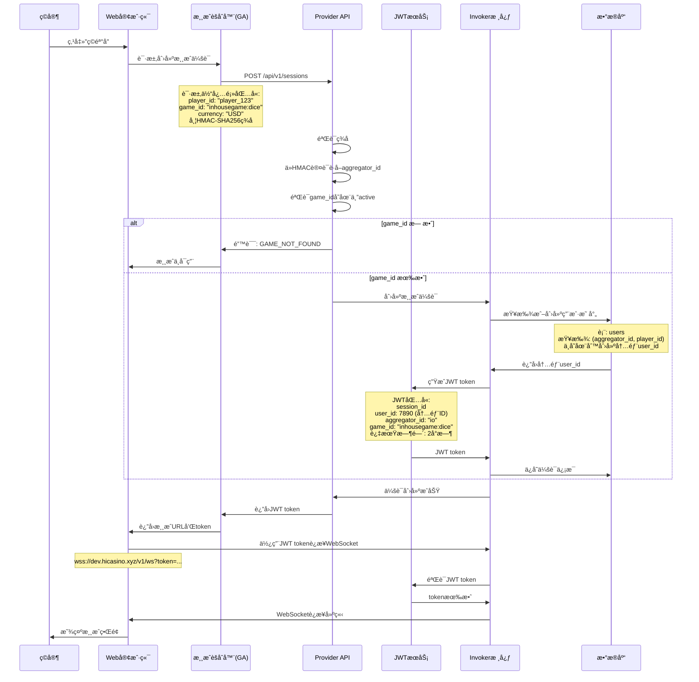
```mermaid
sequenceDiagram
    participant Player as ç©å®¶
    participant WebClient as Web客户端
    participant GA as 游æˆèšåˆå™¨(GA)
    participant ProviderAPI as Provider API
    participant JWTService as JWTæœåŠ¡
    participant InvokerCore as Invoker核心
    participant Database as æ•°æ®åº“

    Player->>WebClient: 点击"ç©éª°å­"
    WebClient->>GA: 请求创建游æˆä¼šè¯
    GA->>ProviderAPI: POST /api/v1/sessions
    Note over GA: 请求体必须包å«:<br/>player_id: "player_123"<br/>game_id: "inhousegame:dice"<br/>currency: "USD"<br/>带HMAC-SHA256ç­¾å
    
    ProviderAPI->>ProviderAPI: 验è¯ç­¾å
    ProviderAPI->>ProviderAPI: ä»HMAC认è¯è·å–aggregator_id
    ProviderAPI->>ProviderAPI: 验è¯game_id存在且active
    
    alt game_id 无效
        ProviderAPI->>GA: 错误: GAME_NOT_FOUND
        GA->>WebClient: 游æˆä¸å¯ç”¨
    else game_id 有效
        ProviderAPI->>InvokerCore: 创建游æˆä¼šè¯
        
        InvokerCore->>Database: 查找或创建用户映射
        Note over Database: 表: users<br/>查找: (aggregator_id, player_id)<br/>ä¸å­˜åœ¨åˆ™åˆ›å»ºå†…部user_id
        Database->>InvokerCore: è¿”å›å†…部user_id
        
        InvokerCore->>JWTService: 生æˆJWT token
        Note over JWTService: JWT包å«:<br/>session_id<br/>user_id: 7890 (内部ID)<br/>aggregator_id: "io"<br/>game_id: "inhousegame:dice"<br/>过期时间: 2å°æ—¶
        JWTService->>InvokerCore: JWT token
        InvokerCore->>Database: ä¿å­˜ä¼šè¯ä¿¡æ¯
    end
    
    InvokerCore->>ProviderAPI: 会è¯åˆ›å»ºæˆåŠŸ
    ProviderAPI->>GA: è¿”å›JWT token
    GA->>WebClient: è¿”å›æ¸¸æˆURLå’Œtoken
    
    WebClient->>InvokerCore: 使用JWT tokenè¿æ¥WebSocket
    Note over WebClient: wss://dev.hicasino.xyz/v1/ws?token=...
    
    InvokerCore->>JWTService: 验è¯JWT token
    JWTService->>InvokerCore: token有效
    
    InvokerCore->>WebClient: WebSocketè¿æ¥å»ºç«‹
    WebClient->>Player: 显示游æˆç•Œé¢
```

## WebSocket è¿æ¥æµç¨‹

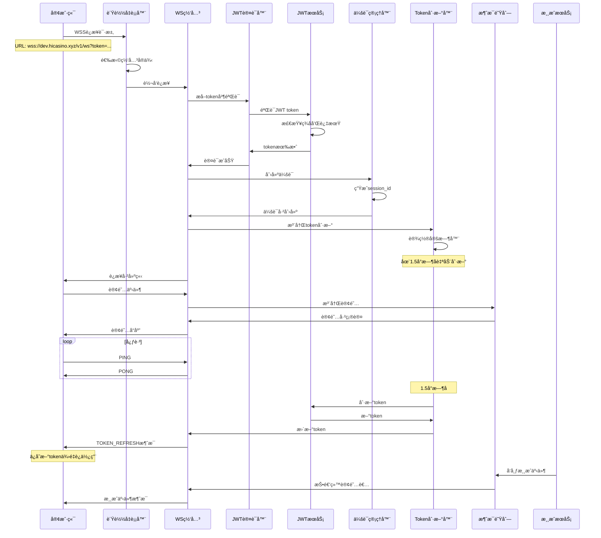
```mermaid
sequenceDiagram
    participant Client as 客户端
    participant LoadBalancer as è´Ÿè½½å‡è¡¡å™¨
    participant WSGateway as WS网关
    participant JWTAuth as JWT认è¯å™¨
    participant JWTService as JWTæœåŠ¡
    participant SessionManager as 会è¯ç®¡ç†å™¨
    participant TokenRefresher as Token刷新器
    participant MessageQueue as 消æ¯é˜Ÿåˆ—
    participant GameService as 游æˆæœåŠ¡

    Client->>LoadBalancer: WSSè¿æ¥è¯·æ±‚
    Note over Client: URL: wss://dev.hicasino.xyz/v1/ws?token=...
    LoadBalancer->>LoadBalancer: 选择网关å®ä¾‹
    LoadBalancer->>WSGateway: 转å‘è¿æ¥
    
    WSGateway->>JWTAuth: æå–token并验è¯
    JWTAuth->>JWTService: 验è¯JWT token
    JWTService->>JWTService: 检查签å和过期
    JWTService->>JWTAuth: token有效
    JWTAuth->>WSGateway: 认è¯æˆåŠŸ
    
    WSGateway->>SessionManager: 创建会è¯
    SessionManager->>SessionManager: 生æˆsession_id
    SessionManager->>WSGateway: 会è¯å·²åˆ›å»º
    
    WSGateway->>TokenRefresher: 注册token刷新
    TokenRefresher->>TokenRefresher: 设置定时器
    Note over TokenRefresher: 在1.5å°æ—¶å自动刷新
    
    WSGateway->>Client: è¿æ¥å·²å»ºç«‹
    
    Client->>WSGateway: 订阅事件
    WSGateway->>MessageQueue: 注册订阅
    MessageQueue->>WSGateway: 订阅已确认
    WSGateway->>Client: 订阅å“应
    
    loop 心跳
        Client->>WSGateway: PING
        WSGateway->>Client: PONG
    end
    
    Note over TokenRefresher: 1.5å°æ—¶å
    TokenRefresher->>JWTService: 刷新token
    JWTService->>TokenRefresher: æ–°token
    TokenRefresher->>WSGateway: æ›´æ–°token
    WSGateway->>Client: TOKEN_REFRESH消æ¯
    Note over Client: ä¿å­˜æ–°tokenä¾›é‡è¿ä½¿ç”¨
    
    GameService->>MessageQueue: å‘布游æˆäº‹ä»¶
    MessageQueue->>WSGateway: 投递给订阅者
    WSGateway->>Client: 游æˆäº‹ä»¶æ¶ˆæ¯
```

## WebSocket è¿æ¥åˆå§‹åŒ–æµç¨‹

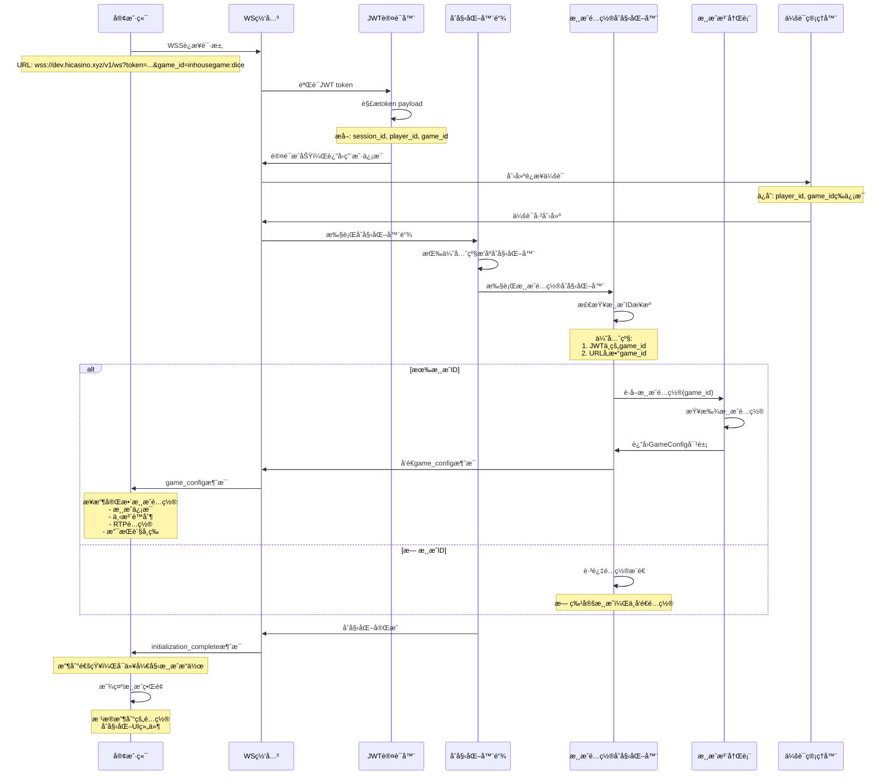
```mermaid
sequenceDiagram
    participant Client as 客户端
    participant WSGateway as WS网关
    participant JWTAuth as JWT认è¯å™¨
    participant InitChain as åˆå§‹åŒ–器链
    participant GameConfigInit as 游æˆé…ç½®åˆå§‹åŒ–器
    participant GameRegistry as 游æˆæ³¨å†Œè¡¨
    participant SessionManager as 会è¯ç®¡ç†å™¨

    Client->>WSGateway: WSSè¿æ¥è¯·æ±‚
    Note over Client: URL: wss://dev.hicasino.xyz/v1/ws?token=...&game_id=inhousegame:dice
    
    WSGateway->>JWTAuth: 验è¯JWT token
    JWTAuth->>JWTAuth: 解ætoken payload
    Note over JWTAuth: æå–: session_id, player_id, game_id
    JWTAuth->>WSGateway: 认è¯æˆåŠŸï¼Œè¿”å›ç”¨æˆ·ä¿¡æ¯
    
    WSGateway->>SessionManager: 创建è¿æ¥ä¼šè¯
    Note over SessionManager: ä¿å­˜: player_id, game_id等信æ¯
    SessionManager->>WSGateway: 会è¯å·²åˆ›å»º
    
    WSGateway->>InitChain: 执行åˆå§‹åŒ–器链
    InitChain->>InitChain: 按优先级æ’åºåˆå§‹åŒ–器
    
    InitChain->>GameConfigInit: 执行游æˆé…ç½®åˆå§‹åŒ–器
    GameConfigInit->>GameConfigInit: 检查游æˆIDæ¥æº
    Note over GameConfigInit: 优先级:<br/>1. JWT中的game_id<br/>2. URLå‚æ•°game_id
    
    alt 有游æˆID
        GameConfigInit->>GameRegistry: è·å–游æˆé…ç½®(game_id)
        GameRegistry->>GameRegistry: 查找游æˆé…ç½®
        GameRegistry->>GameConfigInit: è¿”å›GameConfig对象
        
        GameConfigInit->>WSGateway: å‘é€game_config消æ¯
        WSGateway->>Client: game_config消æ¯
        Note over Client: æ¥æ”¶å®Œæ•´æ¸¸æˆé…ç½®:<br/>- 游æˆä¿¡æ¯<br/>- 下注é™åˆ¶<br/>- RTPé…ç½®<br/>- 支æŒè´§å¸ç­‰
    else 无游æˆID
        GameConfigInit->>GameConfigInit: 跳过é…ç½®æ¨é€
        Note over GameConfigInit: 无特定游æˆï¼Œä¸å‘é€é…ç½®
    end
    
    InitChain->>WSGateway: åˆå§‹åŒ–完æˆ
    WSGateway->>Client: initialization_complete消æ¯
    Note over Client: 收到通知，å¯ä»¥å¼€å§‹æ¸¸æˆæ“作
    
    Client->>Client: 显示游æˆç•Œé¢
    Note over Client: æ ¹æ®æ”¶åˆ°çš„é…ç½®<br/>åˆå§‹åŒ–UI组件
```

## 骰å­æ¸¸æˆä¸‹æ³¨åºåˆ—

> **注æ„**：余é¢ç®¡ç†ç”±èšåˆå™¨ï¼ˆGA）负责，游æˆæœåŠ¡ä¸“注äºæ¸¸æˆé€»è¾‘

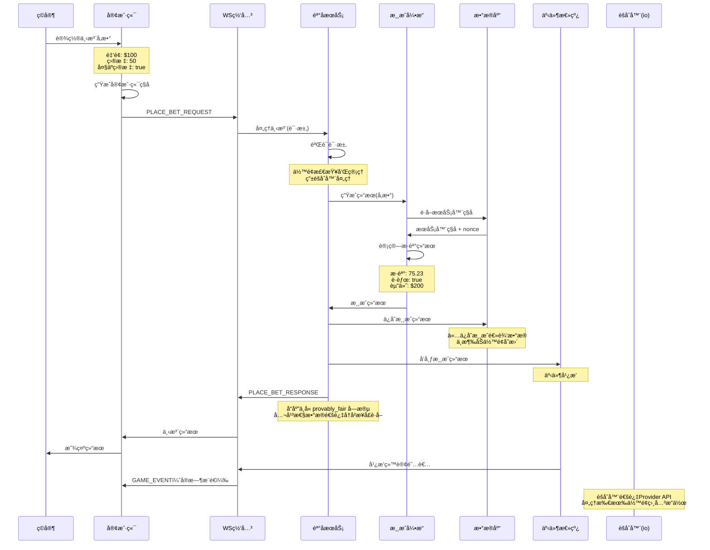
```mermaid
sequenceDiagram
    participant Player as ç©å®¶
    participant Client as 客户端
    participant WSGateway as WS网关
    participant DiceService as 骰å­æœåŠ¡
    participant GameEngine as 游æˆå¼•æ“
    participant Database as æ•°æ®åº“
    participant EventBus as 事件总线
    participant Aggregator as èšåˆå™¨(io)

    Player->>Client: 设置下注å‚æ•°
    Note over Client: 金é¢: $100<br/>目标: 50<br/>大äºç›®æ ‡: true
    
    Client->>Client: 生æˆå®¢æˆ·ç«¯ç§å­
    Client->>WSGateway: PLACE_BET_REQUEST
    
    WSGateway->>DiceService: 处ç†ä¸‹æ³¨(请求)
    
    DiceService->>DiceService: 验è¯è¯·æ±‚
    Note over DiceService: ä½™é¢æ£€æŸ¥å’Œç®¡ç†<br/>ç”±èšåˆå™¨å¤„ç†
    
    DiceService->>GameEngine: 生æˆç»“æœ(å‚æ•°)
    GameEngine->>Database: è·å–æœåŠ¡å™¨ç§å­
    Database->>GameEngine: æœåŠ¡å™¨ç§å­ + nonce
    GameEngine->>GameEngine: 计算æ·éª°ç»“æœ
    Note over GameEngine: æ·éª°: 75.23<br/>è·èƒœ: true<br/>赔付: $200
    
    GameEngine->>DiceService: 游æˆç»“æœ
    
    DiceService->>Database: ä¿å­˜æ¸¸æˆç»“æœ
    Note over Database: ä»…ä¿å­˜æ¸¸æˆé€»è¾‘æ•°æ®<br/>ä¸æ¶‰åŠä½™é¢å˜æ›´
    
    DiceService->>EventBus: å‘布游æˆç»“æœ
    Note over EventBus: 事件广播
    
    DiceService->>WSGateway: PLACE_BET_RESPONSE
    Note over DiceService: å“应ä¸å« provably_fair 字段<br/>公平性数æ®é€šè¿‡å†å²æ¥å£è·å–
    WSGateway->>Client: 下注结æœ
    Client->>Player: 显示结æœ
    
    EventBus->>WSGateway: 广播给订阅者
    WSGateway->>Client: GAME_EVENT（å®æ—¶æ¨é€ï¼‰

    Note over Aggregator: èšåˆå™¨é€šè¿‡Provider API<br/>处ç†æ‰€æœ‰ä½™é¢ç›¸å…³æ“作
```

### æ¶æ„改进总结

| 组件 | å˜æ›´ | 优势 |
|------|------|------|
| ä½™é¢ç®¡ç† | 移至èšåˆå™¨ | èŒè´£åˆ†ç¦»ï¼Œä¸“注游æˆé€»è¾‘ |
| 事务一致性 | èšåˆå™¨è´Ÿè´£ | é¿å…游æˆä¸é‡‘é’±è€¦åˆ |
| 游æˆæœåŠ¡ | 仅处ç†æ¸¸æˆé€»è¾‘ | 简化æ¶æ„，æ高å¯ç»´æŠ¤æ€§ |
| Provider API | æ¥æ”¶èšåˆå™¨è°ƒç”¨ | 标准化æ¥å£ |

## 21点(Blackjack)游æˆæµç¨‹

### 完整游æˆæµç¨‹

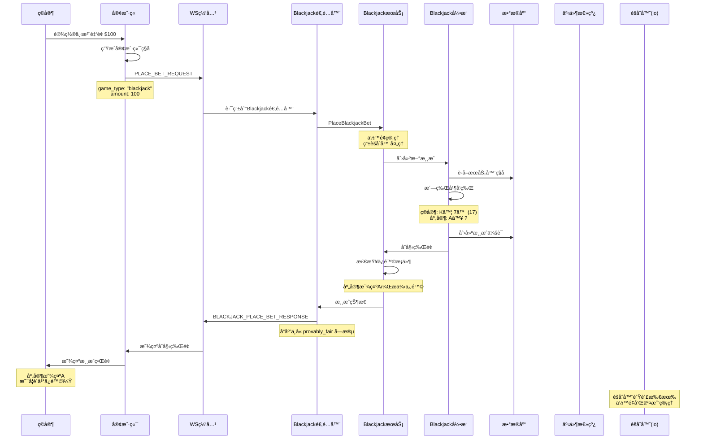
```mermaid
sequenceDiagram
    participant Player as ç©å®¶
    participant Client as 客户端
    participant WSGateway as WS网关
    participant BJAdapter as Blackjack适é…器
    participant BJService as BlackjackæœåŠ¡
    participant BJEngine as Blackjack引æ“
    participant Database as æ•°æ®åº“
    participant EventBus as 事件总线
    participant Aggregator as èšåˆå™¨(io)

    Player->>Client: è®¾ç½®ä¸‹æ³¨é‡‘é¢ $100
    Client->>Client: 生æˆå®¢æˆ·ç«¯ç§å­
    Client->>WSGateway: PLACE_BET_REQUEST
    Note over Client: game_type: "blackjack"<br/>amount: 100

    WSGateway->>BJAdapter: 路由到Blackjack适é…器
    BJAdapter->>BJService: PlaceBlackjackBet
    
    Note over BJService: ä½™é¢ç®¡ç†<br/>ç”±èšåˆå™¨å¤„ç†
    
    BJService->>BJEngine: 创建新游æˆ
    BJEngine->>Database: è·å–æœåŠ¡å™¨ç§å­
    BJEngine->>BJEngine: 洗牌并å‘牌
    Note over BJEngine: ç©å®¶: K♦ 7â™  (17)<br/>庄家: A♥ ?
    
    BJEngine->>Database: 创建游æˆä¼šè¯
    BJEngine->>BJService: åˆå§‹ç‰Œé¢
    
    BJService->>BJService: 检查ä¿é™©æ¡ä»¶
    Note over BJService: 庄家显示A，æä¾›ä¿é™©
    
    BJService->>BJAdapter: 游æˆçŠ¶æ€
    BJAdapter->>WSGateway: BLACKJACK_PLACE_BET_RESPONSE
    Note over BJAdapter: å“应ä¸å« provably_fair 字段
    WSGateway->>Client: 显示åˆå§‹ç‰Œé¢
    
    Client->>Player: 显示游æˆç•Œé¢
    Note over Player: 庄家显示A<br/>是å¦è´­ä¹°ä¿é™©ï¼Ÿ

    Note over Aggregator: èšåˆå™¨è´Ÿè´£æ‰€æœ‰<br/>ä½™é¢å’Œäº¤æ˜“管ç†
```

### ä¿é™©å†³ç­–æµç¨‹

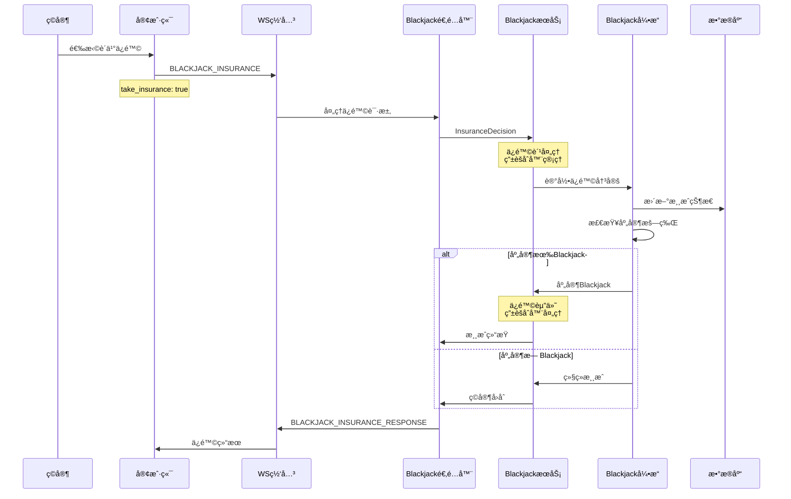
```mermaid
sequenceDiagram
    participant Player as ç©å®¶
    participant Client as 客户端
    participant WSGateway as WS网关
    participant BJAdapter as Blackjack适é…器
    participant BJService as BlackjackæœåŠ¡
    participant BJEngine as Blackjack引æ“
    participant Database as æ•°æ®åº“

    Player->>Client: 选择购买ä¿é™©
    Client->>WSGateway: BLACKJACK_INSURANCE
    Note over Client: take_insurance: true
    
    WSGateway->>BJAdapter: 处ç†ä¿é™©è¯·æ±‚
    BJAdapter->>BJService: InsuranceDecision
    
    Note over BJService: ä¿é™©è´¹å¤„ç†<br/>ç”±èšåˆå™¨ç®¡ç†
    
    BJService->>BJEngine: 记录ä¿é™©å†³å®š
    BJEngine->>Database: 更新游æˆçŠ¶æ€
    
    BJEngine->>BJEngine: 检查庄家暗牌
    
    alt 庄家有Blackjack
        BJEngine->>BJService: 庄家Blackjack
        Note over BJService: ä¿é™©èµ”付<br/>ç”±èšåˆå™¨å¤„ç†
        BJService->>BJAdapter: 游æˆç»“æŸ
    else 庄家无Blackjack
        BJEngine->>BJService: 继续游æˆ
        BJService->>BJAdapter: ç©å®¶å›åˆ
    end
    
    BJAdapter->>WSGateway: BLACKJACK_INSURANCE_RESPONSE
    WSGateway->>Client: ä¿é™©ç»“æœ
```

### ç©å®¶åŠ¨ä½œæµç¨‹

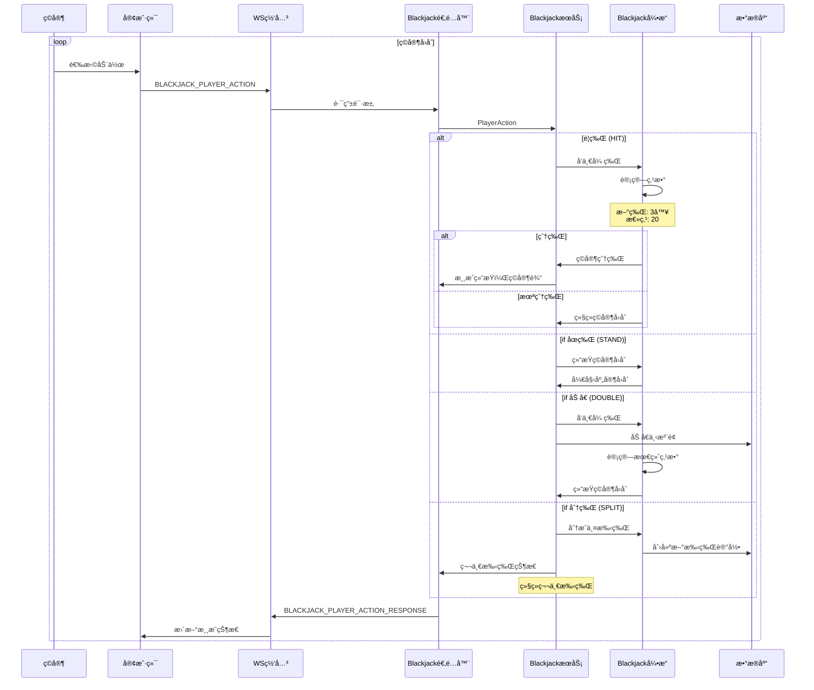
```mermaid
sequenceDiagram
    participant Player as ç©å®¶
    participant Client as 客户端
    participant WSGateway as WS网关
    participant BJAdapter as Blackjack适é…器
    participant BJService as BlackjackæœåŠ¡
    participant BJEngine as Blackjack引æ“
    participant Database as æ•°æ®åº“

    loop ç©å®¶å›åˆ
        Player->>Client: 选择动作
        Client->>WSGateway: BLACKJACK_PLAYER_ACTION
        WSGateway->>BJAdapter: 路由请求
        BJAdapter->>BJService: PlayerAction
        
        alt è¦ç‰Œ (HIT)
            BJService->>BJEngine: å‘一张牌
            BJEngine->>BJEngine: 计算点数
            Note over BJEngine: 新牌: 3♥<br/>总点: 20
            
            alt 爆牌
                BJEngine->>BJService: ç©å®¶çˆ†ç‰Œ
                BJService->>BJAdapter: 游æˆç»“æŸï¼Œç©å®¶è¾“
            else 未爆牌
                BJEngine->>BJService: 继续ç©å®¶å›åˆ
            end
            
        else if åœç‰Œ (STAND)
            BJService->>BJEngine: 结æŸç©å®¶å›åˆ
            BJEngine->>BJService: 开始庄家å›åˆ
            
        else if åŠ å€ (DOUBLE)
            BJService->>BJEngine: å‘一张牌
            BJService->>Database: 加å€ä¸‹æ³¨é¢
            BJEngine->>BJEngine: 计算最终点数
            BJEngine->>BJService: 结æŸç©å®¶å›åˆ
            
        else if 分牌 (SPLIT)
            BJService->>BJEngine: 分æˆä¸¤æ‰‹ç‰Œ
            BJEngine->>Database: 创建新手牌记录
            BJService->>BJAdapter: 第一手牌状æ€
            Note over BJService: 继续第一手牌
        end
        
        BJAdapter->>WSGateway: BLACKJACK_PLAYER_ACTION_RESPONSE
        WSGateway->>Client: 更新游æˆçŠ¶æ€
    end
```

### 庄家å›åˆå’Œç»“ç®—

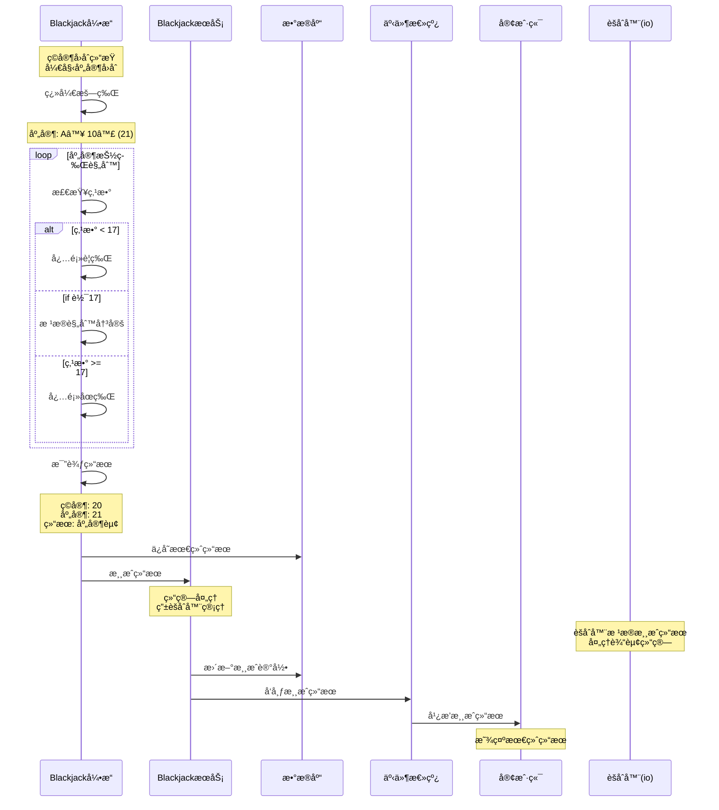
```mermaid
sequenceDiagram
    participant BJEngine as Blackjack引æ“
    participant BJService as BlackjackæœåŠ¡
    participant Database as æ•°æ®åº“
    participant EventBus as 事件总线
    participant Client as 客户端
    participant Aggregator as èšåˆå™¨(io)

    Note over BJEngine: ç©å®¶å›åˆç»“æŸ<br/>开始庄家å›åˆ
    
    BJEngine->>BJEngine: 翻开暗牌
    Note over BJEngine: 庄家: A♥ 10♣ (21)
    
    loop 庄家抽牌规则
        BJEngine->>BJEngine: 检查点数
        
        alt 点数 < 17
            BJEngine->>BJEngine: å¿…é¡»è¦ç‰Œ
        else if 软17
            BJEngine->>BJEngine: æ ¹æ®è§„则决定
        else 点数 >= 17
            BJEngine->>BJEngine: å¿…é¡»åœç‰Œ
        end
    end
    
    BJEngine->>BJEngine: 比较结æœ
    Note over BJEngine: ç©å®¶: 20<br/>庄家: 21<br/>结æœ: 庄家赢
    
    BJEngine->>Database: ä¿å­˜æœ€ç»ˆç»“æœ
    BJEngine->>BJService: 游æˆç»“æœ
    
    Note over BJService: 结算处ç†<br/>ç”±èšåˆå™¨ç®¡ç†
    Note over Aggregator: èšåˆå™¨æ ¹æ®æ¸¸æˆç»“æœ<br/>处ç†è¾“赢结算
    
    BJService->>Database: 更新游æˆè®°å½•
    BJService->>EventBus: å‘布游æˆç»“æœ
    
    EventBus->>Client: 广播游æˆç»“æœ
    Note over Client: 显示最终结æœ
```

## 地雷(Mines)游æˆæµç¨‹ ✅ å·²å®ç°

### 游æˆå¼€å§‹æµç¨‹

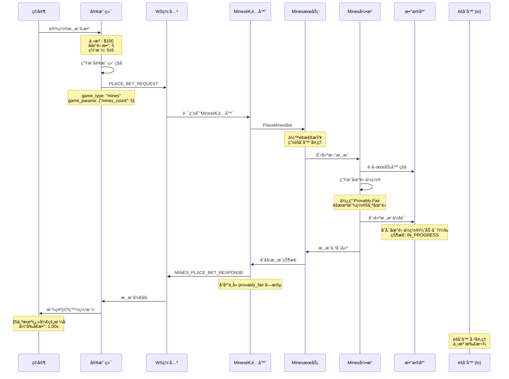
```mermaid
sequenceDiagram
    participant Player as ç©å®¶
    participant Client as 客户端
    participant WSGateway as WS网关
    participant MinesAdapter as Mines适é…器
    participant MinesService as MinesæœåŠ¡
    participant MinesEngine as Mines引æ“
    participant Database as æ•°æ®åº“
    participant Aggregator as èšåˆå™¨(io)

    Player->>Client: 设置游æˆå‚æ•°
    Note over Client: 下注: $100<br/>地雷数: 5<br/>网格: 5x5
    
    Client->>Client: 生æˆå®¢æˆ·ç«¯ç§å­
    Client->>WSGateway: PLACE_BET_REQUEST
    Note over Client: game_type: "mines"<br/>game_params: {"mines_count": 5}
    
    WSGateway->>MinesAdapter: 路由到Mines适é…器
    MinesAdapter->>MinesService: PlaceMinesBet
    
    Note over MinesService: ä½™é¢æ£€æŸ¥<br/>ç”±èšåˆå™¨å¤„ç†
    
    MinesService->>MinesEngine: 创建新游æˆ
    MinesEngine->>Database: è·å–æœåŠ¡å™¨ç§å­
    MinesEngine->>MinesEngine: 生æˆåœ°é›·ä½ç½®
    Note over MinesEngine: 使用Provably Fair<br/>éšæœºæ”¾ç½®5个地雷
    
    MinesEngine->>Database: 创建游æˆä¼šè¯
    Note over Database: 存储地雷ä½ç½®ï¼ˆåŠ å¯†ï¼‰<br/>状æ€: IN_PROGRESS
    
    MinesEngine->>MinesService: 游æˆå·²åˆ›å»º
    MinesService->>MinesAdapter: åˆå§‹æ¸¸æˆçŠ¶æ€
    
    MinesAdapter->>WSGateway: MINES_PLACE_BET_RESPONSE
    Note over MinesAdapter: å“应ä¸å« provably_fair 字段
    WSGateway->>Client: 游æˆå¼€å§‹
    
    Client->>Player: 显示空白网格
    Note over Player: 25个未翻开的格å­<br/>当å‰å€æ•°: 1.00x

    Note over Aggregator: èšåˆå™¨å·²å¤„ç†<br/>下注扣款
```

### æ­ç¤ºç“¦ç‰‡æµç¨‹

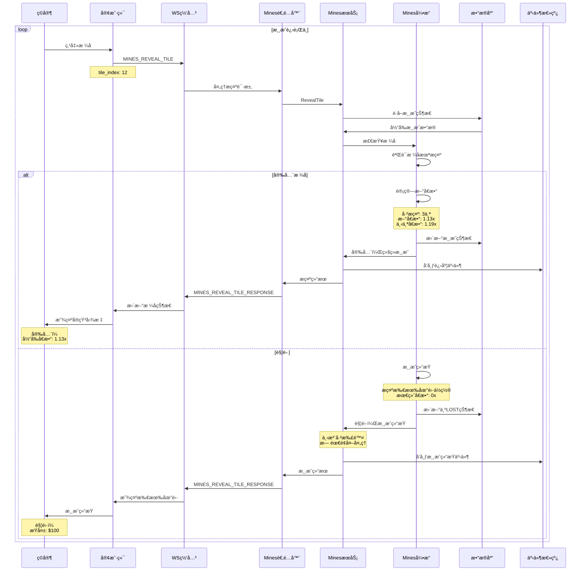
```mermaid
sequenceDiagram
    participant Player as ç©å®¶
    participant Client as 客户端
    participant WSGateway as WS网关
    participant MinesAdapter as Mines适é…器
    participant MinesService as MinesæœåŠ¡
    participant MinesEngine as Mines引æ“
    participant Database as æ•°æ®åº“
    participant EventBus as 事件总线

    loop 游æˆè¿›è¡Œä¸­
        Player->>Client: ç‚¹å‡»æ ¼å­ #12
        Client->>WSGateway: MINES_REVEAL_TILE
        Note over Client: tile_index: 12
        
        WSGateway->>MinesAdapter: 处ç†æ­ç¤ºè¯·æ±‚
        MinesAdapter->>MinesService: RevealTile
        
        MinesService->>Database: è·å–游æˆçŠ¶æ€
        Database->>MinesService: 当å‰æ¸¸æˆæ•°æ®
        
        MinesService->>MinesEngine: 检查格å­
        MinesEngine->>MinesEngine: 验è¯æ ¼å­æœªæ­ç¤º
        
        alt 安全格å­
            MinesEngine->>MinesEngine: 计算新å€æ•°
            Note over MinesEngine: å·²æ­ç¤º: 3个<br/>æ–°å€æ•°: 1.13x<br/>下个å€æ•°: 1.19x
            
            MinesEngine->>Database: 更新游æˆçŠ¶æ€
            MinesEngine->>MinesService: 安全，继续游æˆ
            
            MinesService->>EventBus: å‘布进度事件
            MinesService->>MinesAdapter: æ­ç¤ºç»“æœ
            
            MinesAdapter->>WSGateway: MINES_REVEAL_TILE_RESPONSE
            WSGateway->>Client: æ›´æ–°æ ¼å­çŠ¶æ€
            
            Client->>Player: 显示å®çŸ³å›¾æ ‡
            Note over Player: 安全ï¼<br/>当å‰å€æ•°: 1.13x
            
        else 触雷
            MinesEngine->>MinesEngine: 游æˆç»“æŸ
            Note over MinesEngine: æ­ç¤ºæ‰€æœ‰åœ°é›·ä½ç½®<br/>最终å€æ•°: 0x
            
            MinesEngine->>Database: 更新为LOST状æ€
            MinesEngine->>MinesService: 触雷，游æˆç»“æŸ
            
            Note over MinesService: 下注已扣除<br/>无需é¢å¤–处ç†
            MinesService->>EventBus: å‘布游æˆç»“æŸäº‹ä»¶
            
            MinesService->>MinesAdapter: 游æˆç»“æœ
            MinesAdapter->>WSGateway: MINES_REVEAL_TILE_RESPONSE
            WSGateway->>Client: 显示所有地雷
            
            Client->>Player: 游æˆç»“æŸ
            Note over Player: 触雷ï¼<br/>æŸå¤±: $100
        end
    end
```

### ç°é‡‘æå–æµç¨‹

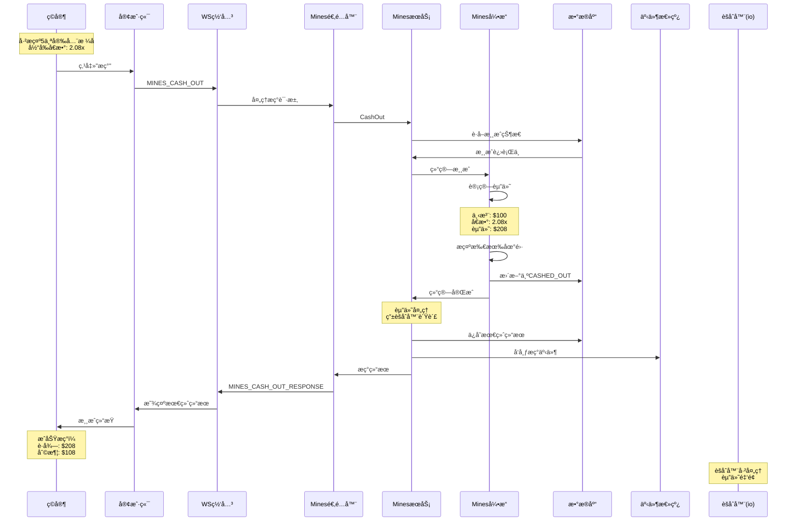
```mermaid
sequenceDiagram
    participant Player as ç©å®¶
    participant Client as 客户端
    participant WSGateway as WS网关
    participant MinesAdapter as Mines适é…器
    participant MinesService as MinesæœåŠ¡
    participant MinesEngine as Mines引æ“
    participant Database as æ•°æ®åº“
    participant EventBus as 事件总线
    participant Aggregator as èšåˆå™¨(io)

    Note over Player: å·²æ­ç¤º5个安全格å­<br/>当å‰å€æ•°: 2.08x
    
    Player->>Client: 点击"æç°"
    Client->>WSGateway: MINES_CASH_OUT
    
    WSGateway->>MinesAdapter: 处ç†æç°è¯·æ±‚
    MinesAdapter->>MinesService: CashOut
    
    MinesService->>Database: è·å–游æˆçŠ¶æ€
    Database->>MinesService: 游æˆè¿›è¡Œä¸­
    
    MinesService->>MinesEngine: 结算游æˆ
    MinesEngine->>MinesEngine: 计算赔付
    Note over MinesEngine: 下注: $100<br/>å€æ•°: 2.08x<br/>赔付: $208
    
    MinesEngine->>MinesEngine: æ­ç¤ºæ‰€æœ‰åœ°é›·
    MinesEngine->>Database: 更新为CASHED_OUT
    
    MinesEngine->>MinesService: 结算完æˆ
    Note over MinesService: 赔付处ç†<br/>ç”±èšåˆå™¨è´Ÿè´£
    
    MinesService->>Database: ä¿å­˜æœ€ç»ˆç»“æœ
    MinesService->>EventBus: å‘布æç°äº‹ä»¶
    
    MinesService->>MinesAdapter: æç°ç»“æœ
    MinesAdapter->>WSGateway: MINES_CASH_OUT_RESPONSE
    WSGateway->>Client: 显示最终结æœ
    
    Client->>Player: 游æˆç»“æŸ
    Note over Player: æˆåŠŸæç°ï¼<br/>è·å¾—: $208<br/>利润: $108

    Note over Aggregator: èšåˆå™¨å·²å¤„ç†<br/>赔付金é¢
```

### Mines 游æˆçŠ¶æ€æŸ¥è¯¢

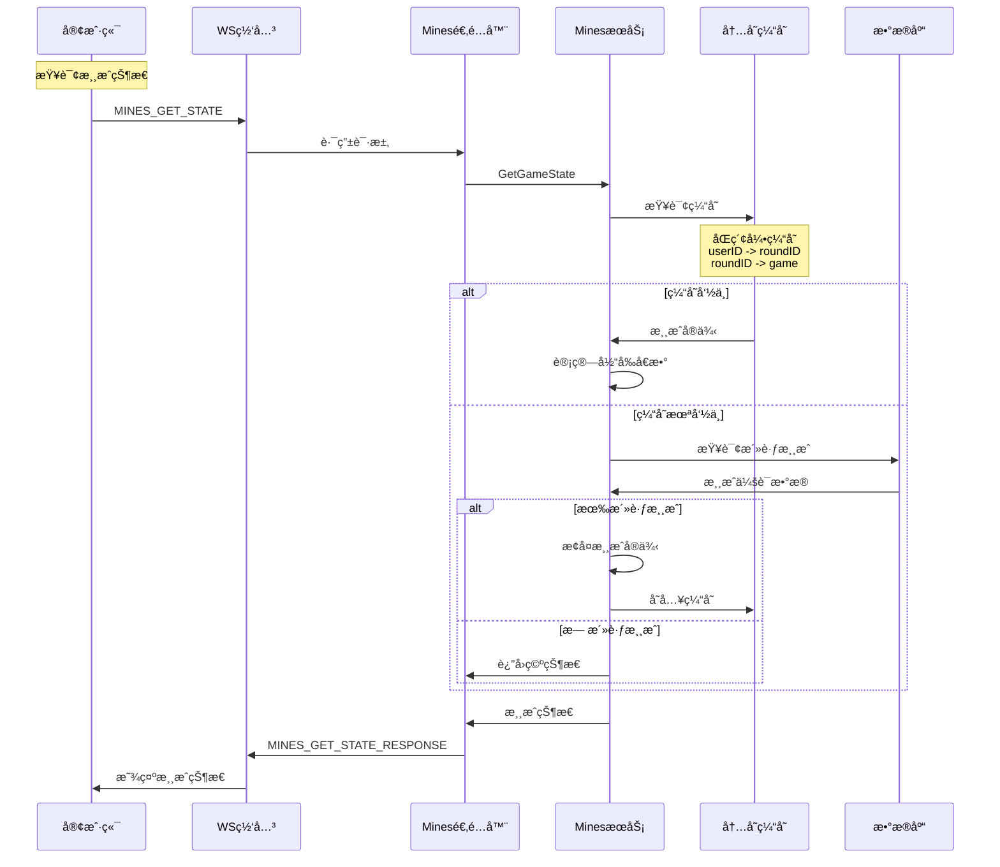
```mermaid
sequenceDiagram
    participant Client as 客户端
    participant WSGateway as WS网关
    participant MinesAdapter as Mines适é…器
    participant MinesService as MinesæœåŠ¡
    participant Cache as 内存缓存
    participant Database as æ•°æ®åº“

    Note over Client: 查询游æˆçŠ¶æ€
    
    Client->>WSGateway: MINES_GET_STATE
    
    WSGateway->>MinesAdapter: 路由请求
    MinesAdapter->>MinesService: GetGameState
    
    MinesService->>Cache: 查询缓存
    Note over Cache: åŒç´¢å¼•ç¼“å­˜<br/>userID -> roundID<br/>roundID -> game
    
    alt 缓存命中
        Cache->>MinesService: 游æˆå®ä¾‹
        MinesService->>MinesService: 计算当å‰å€æ•°
    else 缓存未命中
        MinesService->>Database: 查询活跃游æˆ
        Database->>MinesService: 游æˆä¼šè¯æ•°æ®
        
        alt 有活跃游æˆ
            MinesService->>MinesService: æ¢å¤æ¸¸æˆå®ä¾‹
            MinesService->>Cache: 存入缓存
        else 无活跃游æˆ
            MinesService->>MinesAdapter: è¿”å›ç©ºçŠ¶æ€
        end
    end
    
    MinesService->>MinesAdapter: 游æˆçŠ¶æ€
    MinesAdapter->>WSGateway: MINES_GET_STATE_RESPONSE
    WSGateway->>Client: 显示游æˆçŠ¶æ€
```

### 游æˆä¼šè¯æ¢å¤æµç¨‹

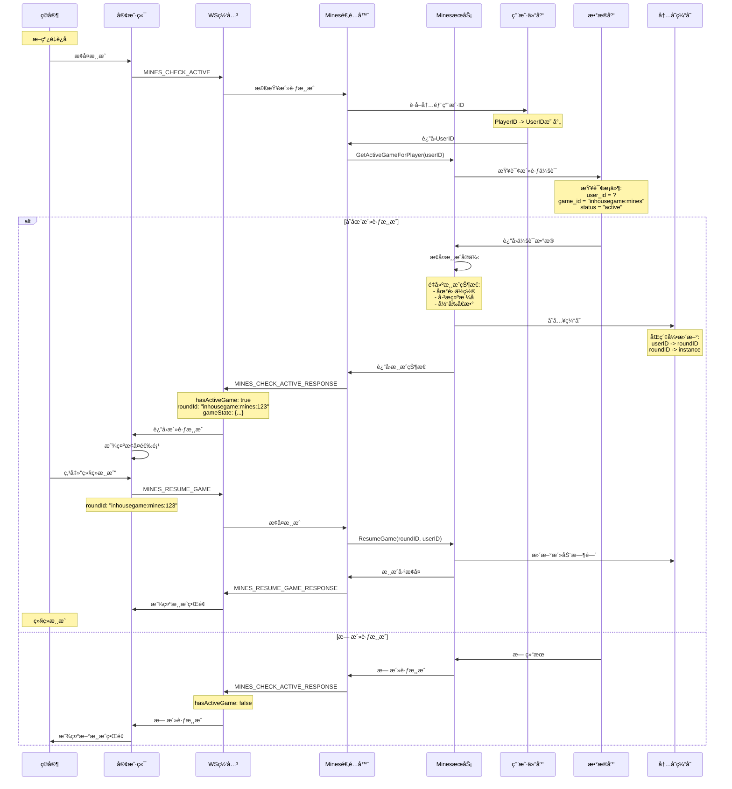
```mermaid
sequenceDiagram
    participant Player as ç©å®¶
    participant Client as 客户端
    participant WSGateway as WS网关
    participant MinesAdapter as Mines适é…器
    participant MinesService as MinesæœåŠ¡
    participant UserRepo as 用户仓库
    participant Database as æ•°æ®åº“
    participant Cache as 内存缓存

    Note over Player: 断线é‡è¿å
    
    Player->>Client: æ¢å¤æ¸¸æˆ
    Client->>WSGateway: MINES_CHECK_ACTIVE
    
    WSGateway->>MinesAdapter: 检查活跃游æˆ
    MinesAdapter->>UserRepo: è·å–内部用户ID
    Note over UserRepo: PlayerID -> UserID映射
    
    UserRepo->>MinesAdapter: è¿”å›UserID
    MinesAdapter->>MinesService: GetActiveGameForPlayer(userID)
    
    MinesService->>Database: 查询活跃会è¯
    Note over Database: 查询æ¡ä»¶:<br/>user_id = ?<br/>game_id = "inhousegame:mines"<br/>status = "active"
    
    alt 存在活跃游æˆ
        Database->>MinesService: è¿”å›ä¼šè¯æ•°æ®
        MinesService->>MinesService: æ¢å¤æ¸¸æˆå®ä¾‹
        Note over MinesService: é‡å»ºæ¸¸æˆçŠ¶æ€:<br/>- 地雷ä½ç½®<br/>- å·²æ­ç¤ºæ ¼å­<br/>- 当å‰å€æ•°
        
        MinesService->>Cache: 存入缓存
        Note over Cache: åŒç´¢å¼•æ›´æ–°:<br/>userID -> roundID<br/>roundID -> instance
        
        MinesService->>MinesAdapter: è¿”å›æ¸¸æˆçŠ¶æ€
        MinesAdapter->>WSGateway: MINES_CHECK_ACTIVE_RESPONSE
        Note over WSGateway: hasActiveGame: true<br/>roundId: "inhousegame:mines:123"<br/>gameState: {...}
        
        WSGateway->>Client: è¿”å›æ´»è·ƒæ¸¸æˆ
        Client->>Client: 显示æ¢å¤é€‰é¡¹
        
        Player->>Client: 点击"继续游æˆ"
        Client->>WSGateway: MINES_RESUME_GAME
        Note over Client: roundId: "inhousegame:mines:123"
        
        WSGateway->>MinesAdapter: æ¢å¤æ¸¸æˆ
        MinesAdapter->>MinesService: ResumeGame(roundID, userID)
        
        MinesService->>Cache: 更新活动时间
        MinesService->>MinesAdapter: 游æˆå·²æ¢å¤
        MinesAdapter->>WSGateway: MINES_RESUME_GAME_RESPONSE
        WSGateway->>Client: 显示游æˆç•Œé¢
        
        Note over Player: 继续游æˆ
        
    else 无活跃游æˆ
        Database->>MinesService: 无结æœ
        MinesService->>MinesAdapter: 无活跃游æˆ
        MinesAdapter->>WSGateway: MINES_CHECK_ACTIVE_RESPONSE
        Note over WSGateway: hasActiveGame: false
        
        WSGateway->>Client: 无活跃游æˆ
        Client->>Player: 显示新游æˆç•Œé¢
    end
```

### 自动æç°æµç¨‹

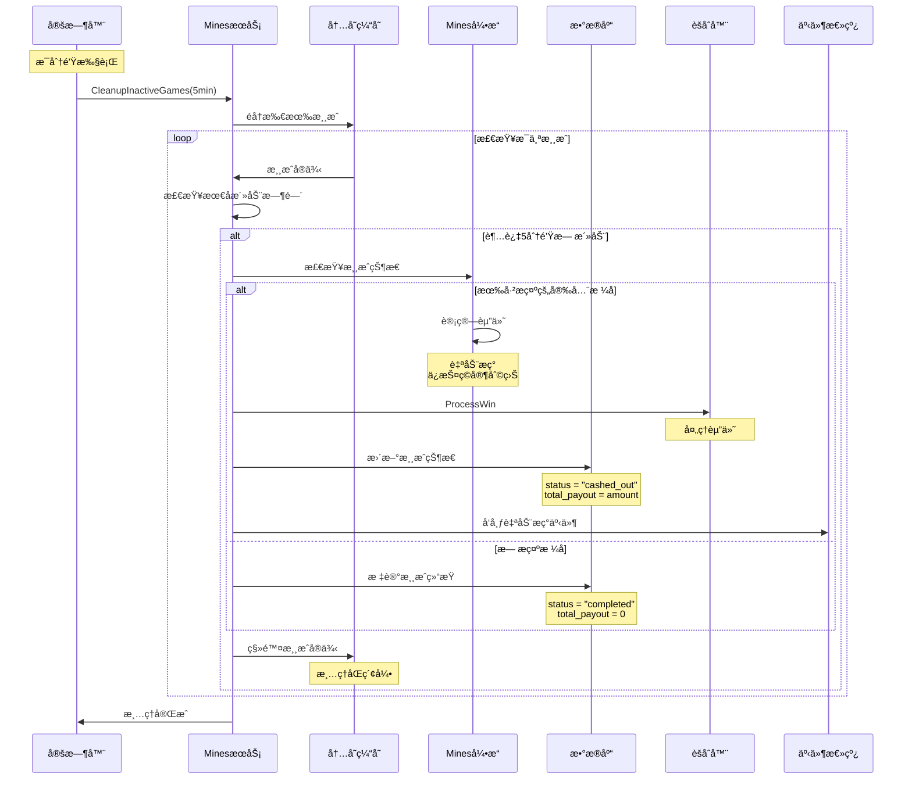
```mermaid
sequenceDiagram
    participant Timer as 定时器
    participant MinesService as MinesæœåŠ¡
    participant Cache as 内存缓存
    participant MinesEngine as Mines引æ“
    participant Database as æ•°æ®åº“
    participant Aggregator as èšåˆå™¨
    participant EventBus as 事件总线

    Note over Timer: æ¯åˆ†é’Ÿæ‰§è¡Œ
    
    Timer->>MinesService: CleanupInactiveGames(5min)
    
    MinesService->>Cache: éå†æ‰€æœ‰æ¸¸æˆ
    
    loop 检查æ¯ä¸ªæ¸¸æˆ
        Cache->>MinesService: 游æˆå®ä¾‹
        MinesService->>MinesService: 检查最å活动时间
        
        alt 超过5分钟无活动
            MinesService->>MinesEngine: 检查游æˆçŠ¶æ€
            
            alt 有已æ­ç¤ºçš„安全格å­
                MinesEngine->>MinesEngine: 计算赔付
                Note over MinesEngine: 自动æç°<br/>ä¿æŠ¤ç©å®¶åˆ©ç›Š
                
                MinesService->>Aggregator: ProcessWin
                Note over Aggregator: 处ç†èµ”付
                
                MinesService->>Database: 更新游æˆçŠ¶æ€
                Note over Database: status = "cashed_out"<br/>total_payout = amount
                
                MinesService->>EventBus: å‘布自动æç°äº‹ä»¶
                
            else æ— æ­ç¤ºæ ¼å­
                MinesService->>Database: 标记游æˆç»“æŸ
                Note over Database: status = "completed"<br/>total_payout = 0
            end
            
            MinesService->>Cache: 移除游æˆå®ä¾‹
            Note over Cache: 清ç†åŒç´¢å¼•
        end
    end
    
    MinesService->>Timer: 清ç†å®Œæˆ
```

## Keno 游æˆæµç¨‹ ✅ å·²å®ç°

### 完整游æˆæµç¨‹

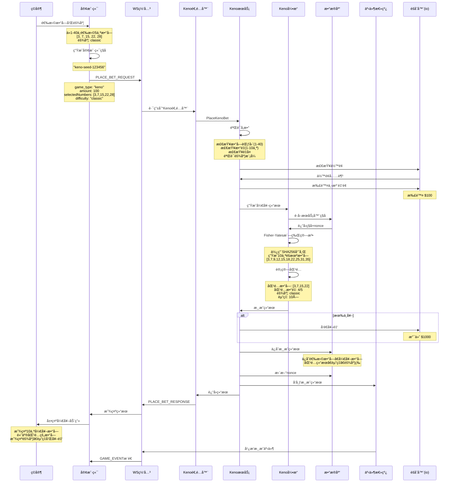
```mermaid
sequenceDiagram
    participant Player as ç©å®¶
    participant Client as 客户端
    participant WSGateway as WS网关
    participant KenoAdapter as Keno适é…器
    participant KenoService as KenoæœåŠ¡
    participant KenoEngine as Keno引æ“
    participant Database as æ•°æ®åº“
    participant EventBus as 事件总线
    participant Aggregator as èšåˆå™¨(io)

    Player->>Client: 选择数字和难度
    Note over Client: ä»1-40中选择5个数字<br/>[3, 7, 15, 22, 28]<br/>难度: classic
    
    Client->>Client: 生æˆå®¢æˆ·ç«¯ç§å­
    Note over Client: "keno-seed-123456"
    
    Client->>WSGateway: PLACE_BET_REQUEST
    Note over Client: game_type: "keno"<br/>amount: 100<br/>selectedNumbers: [3,7,15,22,28]<br/>difficulty: "classic"
    
    WSGateway->>KenoAdapter: 路由到Keno适é…器
    KenoAdapter->>KenoService: PlaceKenoBet
    
    KenoService->>KenoService: 验è¯å‚æ•°
    Note over KenoService: 检查数字范围(1-40)<br/>检查数é‡(1-10个)<br/>检查é‡å¤<br/>验è¯éš¾åº¦æ¨¡å¼

    KenoService->>Aggregator: 检查余é¢
    Aggregator->>KenoService: ä½™é¢å……足
    
    KenoService->>Aggregator: 扣除下注金é¢
    Note over Aggregator: 扣除 $100
    
    KenoService->>KenoEngine: 生æˆå¼€å¥–结æœ
    KenoEngine->>Database: è·å–æœåŠ¡å™¨ç§å­
    Database->>KenoEngine: è¿”å›ç§å­+nonce
    
    KenoEngine->>KenoEngine: Fisher-Yates洗牌算法
    Note over KenoEngine: 使用SHA256哈希<br/>生æˆ10个éšæœºæ•°å­—<br/>[3,7,9,12,15,18,22,25,31,35]
    
    KenoEngine->>KenoEngine: 计算匹é…
    Note over KenoEngine: 匹é…æ•°å­—: [3,7,15,22]<br/>匹é…æ•°é‡: 4/5<br/>难度: classic<br/>èµ”ç‡: 10×
    
    KenoEngine->>KenoService: 游æˆç»“æœ
    
    alt 有中奖
        KenoService->>Aggregator: å‘é€å¥–金
        Note over Aggregator: 支付 $1000
    end
    
    KenoService->>Database: ä¿å­˜æ¸¸æˆç»“æœ
    Note over Database: ä¿å­˜é€‰æ‹©æ•°å­—ã€å¼€å¥–æ•°å­—<br/>匹é…结æœã€èµ”ç‡ã€éš¾åº¦ç­‰
    
    KenoService->>Database: æ›´æ–°nonce
    
    KenoService->>EventBus: å‘布游æˆç»“æœ
    
    KenoService->>KenoAdapter: è¿”å›ç»“æœ
    KenoAdapter->>WSGateway: PLACE_BET_RESPONSE
    WSGateway->>Client: 显示结æœ
    
    Client->>Player: 展示开奖动画
    Note over Player: 显示10个开奖数字<br/>高亮匹é…çš„æ•°å­—<br/>显示难度ã€èµ”ç‡å’Œå¥–金
    
    EventBus->>WSGateway: 广播游æˆäº‹ä»¶
    WSGateway->>Client: GAME_EVENTæ¨é€
```

### 快速选å·æµç¨‹

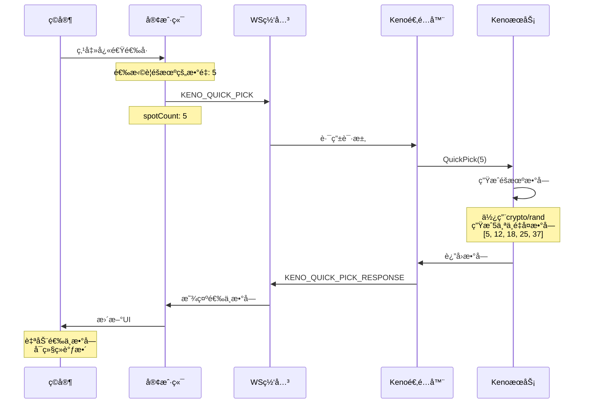
```mermaid
sequenceDiagram
    participant Player as ç©å®¶
    participant Client as 客户端
    participant WSGateway as WS网关
    participant KenoAdapter as Keno适é…器
    participant KenoService as KenoæœåŠ¡

    Player->>Client: 点击快速选å·
    Note over Client: 选择è¦éšæœºçš„æ•°é‡: 5
    
    Client->>WSGateway: KENO_QUICK_PICK
    Note over Client: spotCount: 5
    
    WSGateway->>KenoAdapter: 路由请求
    KenoAdapter->>KenoService: QuickPick(5)
    
    KenoService->>KenoService: 生æˆéšæœºæ•°å­—
    Note over KenoService: 使用crypto/rand<br/>生æˆ5个ä¸é‡å¤æ•°å­—<br/>[5, 12, 18, 25, 37]
    
    KenoService->>KenoAdapter: è¿”å›æ•°å­—
    KenoAdapter->>WSGateway: KENO_QUICK_PICK_RESPONSE
    WSGateway->>Client: 显示选中数字
    
    Client->>Player: æ›´æ–°UI
    Note over Player: 自动选中数字<br/>å¯ç»§ç»­è°ƒæ•´
```

### Keno游æˆç‰¹ç‚¹

| 特性 | è¯´æ˜ |
|------|------|
| 游æˆç±»å‹ | å³æ—¶æ¸¸æˆï¼Œæ— éœ€ä¼šè¯ç®¡ç† |
| 数字范围 | 1-40 |
| é€‰æ‹©æ•°é‡ | 1-10个数字 |
| å¼€å¥–æ•°é‡ | 10个数字 |
| éš¾åº¦æ¨¡å¼ | low, classic, medium, high |
| éšæœºç®—法 | Fisher-Yates洗牌 |
| å¯è¯æ˜å…¬å¹³ | SHA256 + 客户端ç§å­ |
| èµ”ç‡è®¡ç®— | 基äºé€‰æ‹©æ•°é‡ã€åŒ¹é…æ•°é‡å’Œéš¾åº¦ |
| æœ€é«˜èµ”ç‡ | 10000× (选10中10，Classic难度) |

## Plinko 游æˆä½™é¢å»¶è¿Ÿç»“ç®—æµç¨‹

### 延迟结算完整æµç¨‹ï¼ˆå«å¼‚常处ç†ï¼‰

Plinko 游æˆé‡‡ç”¨å»¶è¿Ÿç»“算机制，分为三个阶段：下注（PLACE_BET）ã€åŠ¨ç”»æ’­æ”¾ã€ç»“算（SETTLE_BET）。这ç§è®¾è®¡ç¡®ä¿åœ¨åŠ¨ç”»æ’­æ”¾æœŸé—´ï¼ŒInvoker å‰ç«¯å’Œèšåˆå™¨å‰ç«¯çš„ä½™é¢å§‹ç»ˆä¿æŒä¸€è‡´ã€‚

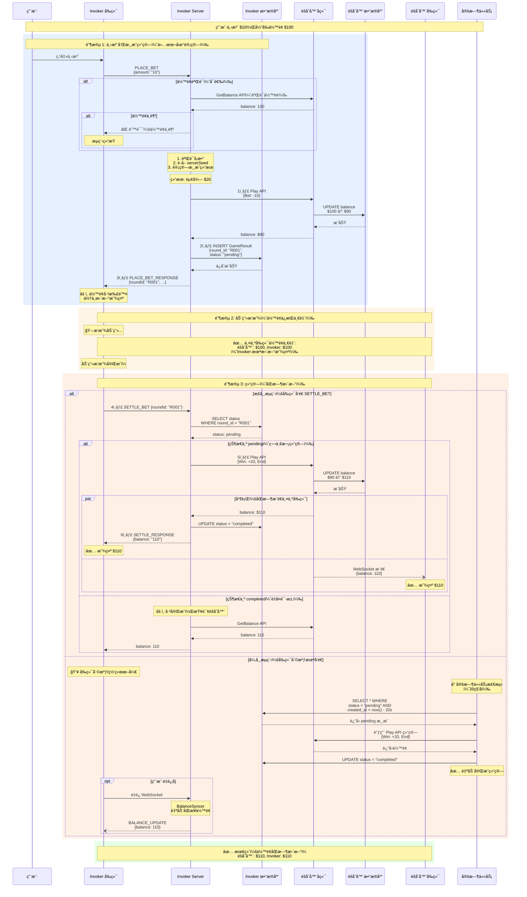
```mermaid
sequenceDiagram
    participant User as 用户
    participant InvokerFE as Invoker å‰ç«¯
    participant InvokerBE as Invoker Server
    participant DB as Invoker æ•°æ®åº“
    participant AggBE as èšåˆå™¨å端
    participant AggDB as èšåˆå™¨æ•°æ®åº“
    participant AggFE as èšåˆå™¨å‰ç«¯
    participant Scheduler as 定时任务

    Note over User,Scheduler: 用户下注 $10，当å‰ä½™é¢ $100

    %% ========== 阶段 1: PLACE_BET ==========
    rect rgb(230, 240, 255)
        Note over User,DB: 阶段 1: 下注和游æˆç»“算（仅本地计算）

        User->>InvokerFE: 点击下注
        InvokerFE->>InvokerBE: PLACE_BET<br/>{amount: "10"}

        alt ä½™é¢éªŒè¯ï¼ˆå¯é€‰ï¼‰
            InvokerBE->>AggBE: GetBalance API（验è¯ä½™é¢ï¼‰
            AggBE-->>InvokerBE: balance: 100

            alt ä½™é¢ä¸è¶³
                InvokerBE-->>InvokerFE: ⌠错误：余é¢ä¸è¶³
                Note over InvokerFE: æµç¨‹ç»“æŸ
            end
        end

        Note over InvokerBE: 1. 验è¯å‚æ•°<br/>2. è·å– serverSeed<br/>3. 计算游æˆç»“æœ
        Note over InvokerBE: 结æœ: 赢得 $20

        InvokerBE->>AggBE: 1ï¸âƒ£ Play API<br/>{Bet: -10}
        AggBE->>AggDB: UPDATE balance<br/>$100 → $90
        AggDB-->>AggBE: æˆåŠŸ
        AggBE-->>InvokerBE: balance: $90

        InvokerBE->>DB: 2ï¸âƒ£ INSERT GameResult<br/>{round_id: "R001",<br/>status: "pending"}
        DB-->>InvokerBE: ä¿å­˜æˆåŠŸ

        InvokerBE-->>InvokerFE: 3ï¸âƒ£ PLACE_BET_RESPONSE<br/>{roundId: "R001", ...}

        Note over InvokerFE: âš ï¸ ä½™é¢å·²æ‰£é™¤<br/>但ä¸æ›´æ–°æ˜¾ç¤º
    end

    %% ========== 阶段 2: 动画播放 ==========
    rect rgb(255, 245, 230)
        Note over InvokerFE,AggFE: 阶段 2: 动画播放（余é¢ä¿æŒä¸€è‡´ï¼‰

        Note over InvokerFE: 🬠播放动画...

        Note over AggFE,InvokerFE: ✅ 两个å‰ç«¯ä½™é¢ä¸€è‡´:<br/>èšåˆå™¨: $100, Invoker: $100<br/>（Invoker 未更新显示）

        Note over InvokerFE: 动画播放完æˆï¼
    end

    %% ========== 阶段 3: SETTLE_BET ==========
    rect rgb(255, 240, 230)
        Note over InvokerFE,AggFE: 阶段 3: 结算（åŒæ—¶æ›´æ–°ï¼‰

        alt 正常æµç¨‹ï¼šå‰ç«¯å‘é€ SETTLE_BET
            InvokerFE->>InvokerBE: 4ï¸âƒ£ SETTLE_BET {roundId: "R001"}

            InvokerBE->>DB: SELECT status<br/>WHERE round_id = "R001"
            DB-->>InvokerBE: status: pending

            alt 状æ€ä¸º pending（第一次结算）
                InvokerBE->>AggBE: 5ï¸âƒ£ Play API<br/>{Win: +20, End}

                AggBE->>AggDB: UPDATE balance<br/>$90 → $110
                AggDB-->>AggBE: æˆåŠŸ

                par 并行：åŒæ—¶æ¨é€ä¸¤ä¸ªå‰ç«¯
                    AggBE-->>InvokerBE: balance: $110
                    InvokerBE->>DB: UPDATE status = "completed"
                    InvokerBE-->>InvokerFE: 6ï¸âƒ£ SETTLE_RESPONSE<br/>{balance: "110"}
                    Note over InvokerFE: ✅ 显示 $110
                and
                    AggBE--)AggFE: WebSocket æ¨é€<br/>{balance: 110}
                    Note over AggFE: ✅ 显示 $110
                end

            else 状æ€ä¸º completed（é‡å¤è¯·æ±‚）
                Note over InvokerBE: âš ï¸ å·²å®Œæˆï¼ŒæŸ¥è¯¢èšåˆå™¨
                InvokerBE->>AggBE: GetBalance API
                AggBE-->>InvokerBE: balance: 110
                InvokerBE-->>InvokerFE: balance: 110
            end

        else 异常æµç¨‹ï¼šå‰ç«¯å´©æºƒæœªå‘é€
            Note over InvokerFE: 💥 å‰ç«¯å´©æºƒ/网络断开

            Note over Scheduler: Ⱐ定时任务检测<br/>（20秒å）

            Scheduler->>DB: SELECT * WHERE<br/>status = "pending" AND<br/>created_at < now() - 20s
            DB-->>Scheduler: è¿”å› pending 游æˆ

            Scheduler->>AggBE: 调用 Play API 结算<br/>{Win: +20, End}
            AggBE-->>Scheduler: è¿”å›ä½™é¢

            Scheduler->>DB: UPDATE status = "completed"

            Note over Scheduler: ✅ 自动完æˆç»“ç®—

            opt 用户é‡è¿å
                InvokerFE->>InvokerBE: é‡è¿ WebSocket
                Note over InvokerBE: BalanceSyncer<br/>自动åŒæ­¥ä½™é¢
                InvokerBE--)InvokerFE: BALANCE_UPDATE<br/>{balance: 110}
            end
        end
    end

    %% ========== æœ€ç»ˆçŠ¶æ€ ==========
    rect rgb(230, 255, 230)
        Note over AggFE,InvokerFE: ✅ 最终：余é¢åŒæ—¶æ›´æ–°ï¼<br/>èšåˆå™¨: $110, Invoker: $110
    end
```

### 延迟结算关键特性

| 特性 | è¯´æ˜ |
|------|------|
| 分阶段结算 | PLACE_BET åªå‘é€ Bet 扣款，SETTLE_BET å‘é€ Win+End |
| å‰ç«¯ä½™é¢æ§åˆ¶ | Invoker å‰ç«¯åœ¨åŠ¨ç”»æœŸé—´ä¸æ›´æ–°ä½™é¢æ˜¾ç¤ºï¼Œä¿æŒä¸èšåˆå™¨ä¸€è‡´ |
| 幂等性ä¿æŠ¤ | é‡å¤çš„ SETTLE_BET 请求查询èšåˆå™¨ä½™é¢è¿”å› |
| 异常兜底 | å®šæ—¶ä»»åŠ¡æ¯ 20 秒扫æ超时游æˆï¼Œè‡ªåŠ¨ç»“ç®— |
| 状æ€ç®¡ç† | GameResult.Status: pending → completed |
| 并行æ¨é€ | 结算时èšåˆå™¨é€šè¿‡ WebSocket åŒæ—¶æ¨é€ä¸¤ä¸ªå‰ç«¯ |

## 事件订阅æµç¨‹

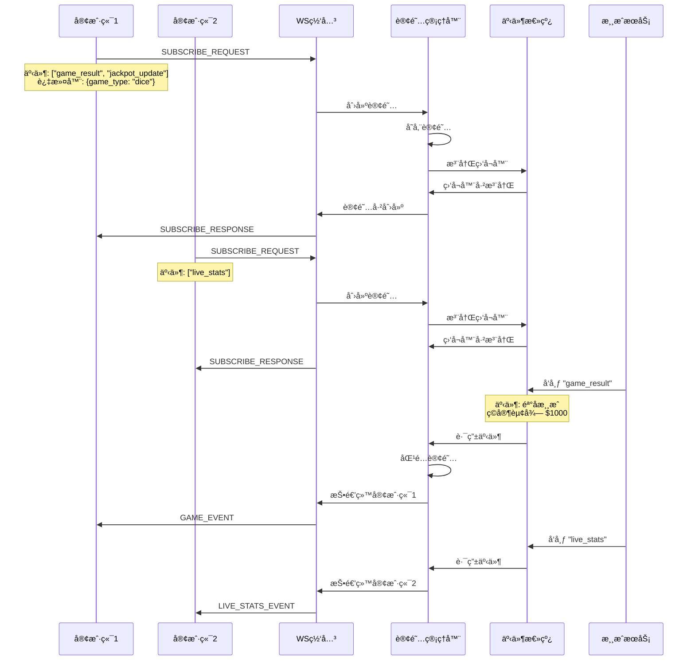
```mermaid
sequenceDiagram
    participant Client1 as 客户端1
    participant Client2 as 客户端2
    participant WSGateway as WS网关
    participant SubscriptionManager as 订阅管ç†å™¨
    participant EventBus as 事件总线
    participant GameService as 游æˆæœåŠ¡

    Client1->>WSGateway: SUBSCRIBE_REQUEST
    Note over Client1: 事件: ["game_result", "jackpot_update"]<br/>过滤器: {game_type: "dice"}
    
    WSGateway->>SubscriptionManager: 创建订阅
    SubscriptionManager->>SubscriptionManager: 存储订阅
    SubscriptionManager->>EventBus: 注册监å¬å™¨
    EventBus->>SubscriptionManager: 监å¬å™¨å·²æ³¨å†Œ
    SubscriptionManager->>WSGateway: 订阅已创建
    WSGateway->>Client1: SUBSCRIBE_RESPONSE
    
    Client2->>WSGateway: SUBSCRIBE_REQUEST
    Note over Client2: 事件: ["live_stats"]
    WSGateway->>SubscriptionManager: 创建订阅
    SubscriptionManager->>EventBus: 注册监å¬å™¨
    EventBus->>SubscriptionManager: 监å¬å™¨å·²æ³¨å†Œ
    WSGateway->>Client2: SUBSCRIBE_RESPONSE
    
    GameService->>EventBus: å‘布 "game_result"
    Note over EventBus: 事件: 骰å­æ¸¸æˆ<br/>ç©å®¶èµ¢å¾— $1000
    
    EventBus->>SubscriptionManager: 路由事件
    SubscriptionManager->>SubscriptionManager: 匹é…订阅
    SubscriptionManager->>WSGateway: 投递给客户端1
    WSGateway->>Client1: GAME_EVENT
    
    GameService->>EventBus: å‘布 "live_stats"
    EventBus->>SubscriptionManager: 路由事件
    SubscriptionManager->>WSGateway: 投递给客户端2
    WSGateway->>Client2: LIVE_STATS_EVENT
```

## ä½™é¢æ›´æ–°æ¨é€æµç¨‹

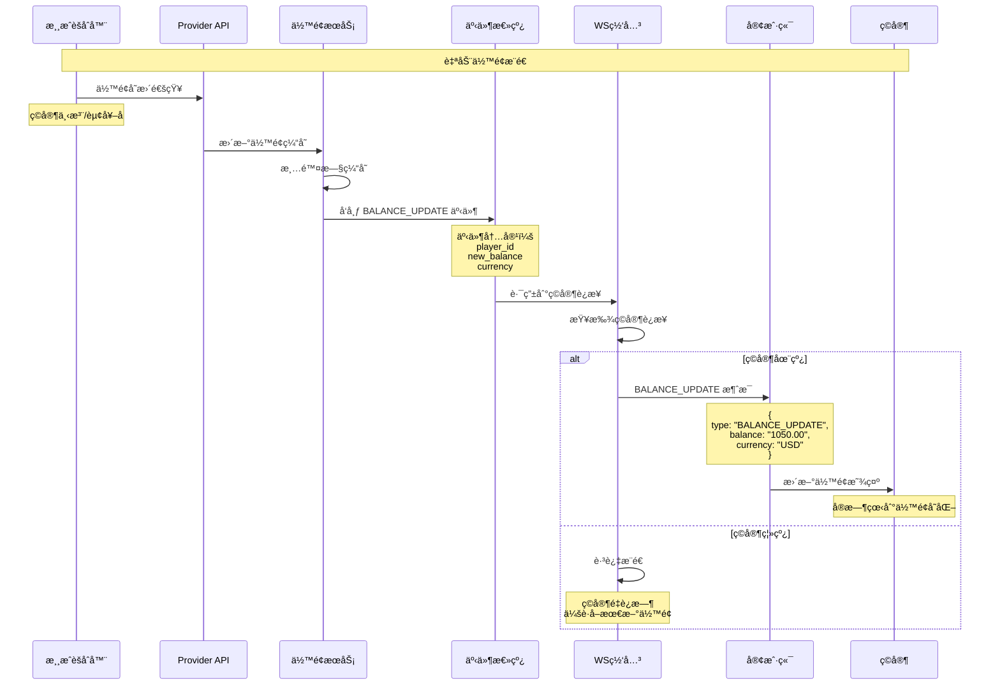
```mermaid
sequenceDiagram
    participant GA as 游æˆèšåˆå™¨
    participant ProviderAPI as Provider API
    participant BalanceService as ä½™é¢æœåŠ¡
    participant EventBus as 事件总线
    participant WSGateway as WS网关
    participant Client as 客户端
    participant Player as ç©å®¶

    Note over GA,Player: 自动余é¢æ¨é€

    GA->>ProviderAPI: ä½™é¢å˜æ›´é€šçŸ¥
    Note over GA: ç©å®¶ä¸‹æ³¨/赢奖å
    
    ProviderAPI->>BalanceService: æ›´æ–°ä½™é¢ç¼“å­˜
    BalanceService->>BalanceService: 清除旧缓存
    
    BalanceService->>EventBus: å‘布 BALANCE_UPDATE 事件
    Note over EventBus: 事件内容：<br/>player_id<br/>new_balance<br/>currency
    
    EventBus->>WSGateway: 路由到ç©å®¶è¿æ¥
    WSGateway->>WSGateway: 查找ç©å®¶è¿æ¥
    
    alt ç©å®¶åœ¨çº¿
        WSGateway->>Client: BALANCE_UPDATE 消æ¯
        Note over Client: {<br/>  type: "BALANCE_UPDATE",<br/>  balance: "1050.00",<br/>  currency: "USD"<br/>}
        Client->>Player: æ›´æ–°ä½™é¢æ˜¾ç¤º
        Note over Player: å®æ—¶çœ‹åˆ°ä½™é¢å˜åŒ–
    else ç©å®¶ç¦»çº¿
        WSGateway->>WSGateway: 跳过æ¨é€
        Note over WSGateway: ç©å®¶é‡è¿æ—¶<br/>会è·å–最新余é¢
    end
```

## å®æ—¶æŠ•æ³¨æ´»åŠ¨å¹¿æ’­æµç¨‹

### 投注活动å‘布和广播

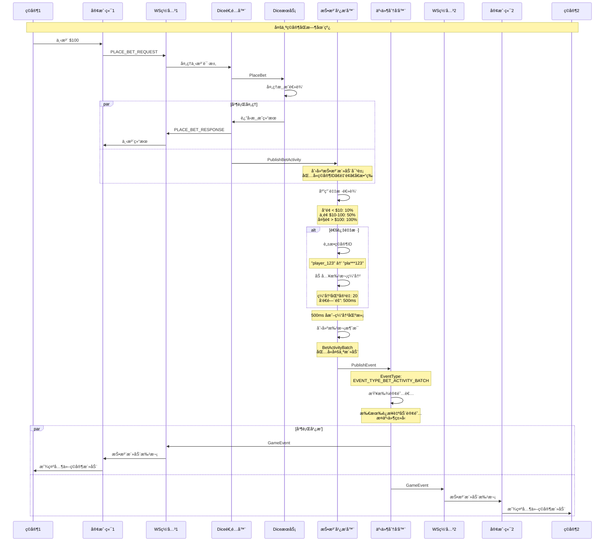
```mermaid
sequenceDiagram
    participant Player1 as ç©å®¶1
    participant Client1 as 客户端1
    participant WSGateway1 as WS网关1
    participant DiceAdapter as Dice适é…器
    participant DiceService as DiceæœåŠ¡
    participant BetBroadcaster as 投注广播器
    participant EventDispatcher as 事件分å‘器
    participant WSGateway2 as WS网关2
    participant Client2 as 客户端2
    participant Player2 as ç©å®¶2

    Note over Player1,Player2: 多个ç©å®¶åŒæ—¶åœ¨çº¿
    
    Player1->>Client1: 下注 $100
    Client1->>WSGateway1: PLACE_BET_REQUEST
    WSGateway1->>DiceAdapter: 处ç†ä¸‹æ³¨è¯·æ±‚
    
    DiceAdapter->>DiceService: PlaceBet
    DiceService->>DiceService: 处ç†æ¸¸æˆé€»è¾‘
    
    par 并行处ç†
        DiceService->>DiceAdapter: è¿”å›æ¸¸æˆç»“æœ
        DiceAdapter->>WSGateway1: PLACE_BET_RESPONSE
        WSGateway1->>Client1: 下注结æœ
    and
        DiceAdapter->>BetBroadcaster: PublishBetActivity
        Note over BetBroadcaster: 创建投注活动对象<br/>包å«ç©å®¶IDã€é‡‘é¢ã€å€æ•°ç­‰
    end
    
    BetBroadcaster->>BetBroadcaster: 应用采样逻辑
    Note over BetBroadcaster: å°é¢ < $10: 10%<br/>ä¸­é¢ $10-100: 50%<br/>å¤§é¢ > $100: 100%
    
    alt 通过采样
        BetBroadcaster->>BetBroadcaster: 脱æ•ç©å®¶ID
        Note over BetBroadcaster: "player_123" → "pla***123"
        
        BetBroadcaster->>BetBroadcaster: 加入批次缓冲
        Note over BetBroadcaster: 缓冲区容é‡: 20<br/>å‘é€é—´éš”: 500ms
    end
    
    Note over BetBroadcaster: 500ms å或缓冲区满
    
    BetBroadcaster->>BetBroadcaster: 创建批次消æ¯
    Note over BetBroadcaster: BetActivityBatch<br/>包å«å¤šä¸ªæ´»åŠ¨
    
    BetBroadcaster->>EventDispatcher: PublishEvent
    Note over EventDispatcher: EventType:<br/>EVENT_TYPE_BET_ACTIVITY_BATCH
    
    EventDispatcher->>EventDispatcher: 查找订阅者
    Note over EventDispatcher: 所有è¿æ¥è‡ªåŠ¨è®¢é˜…<br/>此事件类å‹
    
    par 并行广播
        EventDispatcher->>WSGateway1: GameEvent
        WSGateway1->>Client1: 投注活动批次
        Client1->>Player1: 显示其他ç©å®¶æ´»åŠ¨
    and
        EventDispatcher->>WSGateway2: GameEvent
        WSGateway2->>Client2: 投注活动批次
        Client2->>Player2: 显示其他ç©å®¶æ´»åŠ¨
    end
```

### 自动订阅机制

```mermaid
sequenceDiagram
    participant Client as 客户端
    participant WSGateway as WS网关
    participant JWTAuth as JWT认è¯å™¨
    participant InitChain as åˆå§‹åŒ–器链
    participant BetActivityInit as 投注活动åˆå§‹åŒ–器
    participant EventDispatcher as 事件分å‘器

    Client->>WSGateway: WebSocketè¿æ¥
    WSGateway->>JWTAuth: 验è¯JWT
    JWTAuth->>WSGateway: 认è¯æˆåŠŸ
    
    WSGateway->>InitChain: 执行åˆå§‹åŒ–器链
    InitChain->>InitChain: 按优先级æ’åº
    
    InitChain->>BetActivityInit: 执行投注活动åˆå§‹åŒ–器
    Note over BetActivityInit: 优先级: 20<br/>(在游æˆé…置之å)
    
    BetActivityInit->>EventDispatcher: Subscribe
    Note over BetActivityInit: 事件类å‹:<br/>EVENT_TYPE_BET_ACTIVITY_BATCH
    
    EventDispatcher->>EventDispatcher: 注册订阅
    EventDispatcher->>BetActivityInit: 订阅æˆåŠŸ
    
    BetActivityInit->>InitChain: åˆå§‹åŒ–完æˆ
    InitChain->>WSGateway: 所有åˆå§‹åŒ–完æˆ
    
    WSGateway->>Client: INITIALIZATION_COMPLETE
    Note over Client: 开始æ¥æ”¶æŠ•æ³¨æ´»åŠ¨æ¨é€
```

### 大é¢è·èƒœç‰¹æ®Šå¤„ç†

```mermaid
sequenceDiagram
    participant Player as ç©å®¶
    participant DiceService as DiceæœåŠ¡
    participant BetBroadcaster as 投注广播器
    participant EventDispatcher as 事件分å‘器
    participant AllClients as 所有客户端

    Player->>DiceService: 下注 $100
    DiceService->>DiceService: 计算结æœ
    Note over DiceService: è·èƒœï¼<br/>赔付: $1500 (15å€)
    
    DiceService->>BetBroadcaster: PublishBetActivity
    Note over BetBroadcaster: IsWin: true<br/>WinAmount: $1500
    
    BetBroadcaster->>BetBroadcaster: 检查大赢æ¡ä»¶
    Note over BetBroadcaster: 赢利 > 10å€ä¸‹æ³¨<br/>$1500 > $1000 ✓
    
    BetBroadcaster->>BetBroadcaster: 强制广播
    Note over BetBroadcaster: 跳过采样<br/>大赢始终显示
    
    BetBroadcaster->>EventDispatcher: ç«‹å³å‘é€
    Note over EventDispatcher: 大赢优先处ç†
    
    EventDispatcher->>AllClients: 广播大赢事件
    AllClients->>AllClients: 显示庆ç¥åŠ¨ç”»
    Note over AllClients: 特殊效æœå±•ç¤º<br/>è¥é€ æ°›å›´
```

## 投注活动å†å²è·å–æµç¨‹ ✅ å·²å®ç°

### GET_BET_ACTIVITIES 请求æµç¨‹

```mermaid
sequenceDiagram
    participant Player as ç©å®¶ï¼ˆæ–°è¿æ¥ï¼‰
    participant Client as 客户端
    participant WSGateway as WS网关
    participant Handler as 消æ¯å¤„ç†å™¨
    participant BetBroadcaster as 投注广播器
    participant Buffer as ç¯å½¢ç¼“冲区

    Player->>Client: 打开游æˆå¤§å…
    Client->>WSGateway: 建立WebSocketè¿æ¥
    Note over Client: 无需认è¯
    
    WSGateway->>Client: è¿æ¥ç¡®è®¤
    
    Client->>Client: 请求å†å²æŠ•æ³¨æ´»åŠ¨
    Note over Client: 显示游æˆçƒ­åº¦
    
    Client->>WSGateway: GET_BET_ACTIVITIES
    Note over Client: {<br/>  gameId: "inhousegame:dice",<br/>  limit: 50<br/>}
    
    WSGateway->>Handler: 路由消æ¯
    
    Handler->>Handler: 验è¯å‚æ•°
    Note over Handler: gameId 必需<br/>limit 1-100
    
    alt gameId 缺失
        Handler->>WSGateway: 错误å“应
        Note over Handler: MISSING_GAME_ID
        WSGateway->>Client: å‚数错误
    else å‚数有效
        Handler->>BetBroadcaster: GetRecentActivities
        Note over Handler: gameId: "inhousegame:dice"<br/>limit: 50
        
        BetBroadcaster->>Buffer: GetRecent(200)
        Note over Buffer: è·å–最近200æ¡
        
        Buffer->>Buffer: 读å–ç¯å½¢ç¼“冲区
        Note over Buffer: O(1)时间å¤æ‚度<br/>è¿”å›æŒ‰æ—¶é—´å€’åº
        
        Buffer->>BetBroadcaster: è¿”å›æ´»åŠ¨åˆ—表
        
        BetBroadcaster->>BetBroadcaster: 过滤游æˆID
        Note over BetBroadcaster: åªè¿”å›dice游æˆ<br/>包å«æ‰€æœ‰è´§å¸
        
        BetBroadcaster->>BetBroadcaster: é™åˆ¶æ•°é‡
        Note over BetBroadcaster: 最多返å›50æ¡
        
        BetBroadcaster->>Handler: 过滤å的活动
        
        Handler->>WSGateway: GET_BET_ACTIVITIES_RESPONSE
        WSGateway->>Client: è¿”å›å†å²æ´»åŠ¨
        
        Client->>Player: 显示投注活动
        Note over Player: 展示游æˆçƒ­åº¦<br/>其他ç©å®¶æŠ•æ³¨æƒ…况
    end
    
    Note over Client: 订阅å®æ—¶æ¨é€
    Client->>WSGateway: SUBSCRIBE
    Note over Client: eventTypes: ["BET_ACTIVITY"]
    
    WSGateway->>Client: 订阅æˆåŠŸ
    
    Note over Client: 开始æ¥æ”¶å®æ—¶æ´»åŠ¨
```

### æ··åˆæ¨æ‹‰æ¨¡å¼å·¥ä½œæµç¨‹

```mermaid
sequenceDiagram
    participant NewPlayer as æ–°ç©å®¶
    participant OldPlayer as è€ç©å®¶
    participant WSGateway as WS网关
    participant BetBroadcaster as 投注广播器
    participant RingBuffer as ç¯å½¢ç¼“冲区
    participant EventBus as 事件总线

    Note over NewPlayer,OldPlayer: æ–°è€ç©å®¶ä¸åŒæµç¨‹
    
    rect rgb(200, 230, 201)
        Note over NewPlayer: æ–°ç©å®¶è¿æ¥æµç¨‹
        NewPlayer->>WSGateway: 建立è¿æ¥
        NewPlayer->>WSGateway: GET_BET_ACTIVITIES
        WSGateway->>BetBroadcaster: 请求å†å²
        BetBroadcaster->>RingBuffer: 读å–缓存
        RingBuffer-->>BetBroadcaster: å†å²æ•°æ®
        BetBroadcaster-->>WSGateway: è¿”å›å†å²
        WSGateway-->>NewPlayer: 显示å†å²æ´»åŠ¨
        
        NewPlayer->>WSGateway: 订阅å®æ—¶äº‹ä»¶
        WSGateway->>EventBus: 注册订阅
    end
    
    rect rgb(200, 201, 230)
        Note over OldPlayer: è€ç©å®¶å·²è¿æ¥
        Note over OldPlayer: 已订阅å®æ—¶äº‹ä»¶
    end
    
    Note over BetBroadcaster: 新投注产生
    
    BetBroadcaster->>RingBuffer: 添加到缓存
    Note over RingBuffer: ä¿å­˜æœ€è¿‘200æ¡
    
    BetBroadcaster->>EventBus: æ¨é€æ–°æ´»åŠ¨
    
    par 并行æ¨é€
        EventBus->>NewPlayer: å®æ—¶æ´»åŠ¨æ¨é€
        NewPlayer->>NewPlayer: 更新显示
    and
        EventBus->>OldPlayer: å®æ—¶æ´»åŠ¨æ¨é€
        OldPlayer->>OldPlayer: 更新显示
    end
```

### ç¯å½¢ç¼“冲区å®ç°ç»†èŠ‚

```mermaid
graph LR
    subgraph "ç¯å½¢ç¼“冲区 (容é‡=5)"
        A[索引0] --> B[索引1]
        B --> C[索引2]
        C --> D[索引3]
        D --> E[索引4]
        E --> A
    end
    
    subgraph "写入过程"
        W1[head=0<br/>写入Act1] --> W2[head=1<br/>写入Act2]
        W2 --> W3[head=2<br/>写入Act3]
        W3 --> W4[head=3<br/>写入Act4]
        W4 --> W5[head=4<br/>写入Act5]
        W5 --> W6[head=0<br/>覆盖Act1<br/>写入Act6]
    end
    
    subgraph "读å–过程"
        R1[ä»head-1开始] --> R2[å‘å‰è¯»å–N个]
        R2 --> R3[è¿”å›å€’åºåˆ—表]
    end
```

## 错误处ç†åœºæ™¯

### ä½™é¢ä¸è¶³é”™è¯¯

```mermaid
sequenceDiagram
    participant Client as 客户端
    participant WSGateway as WS网关
    participant DiceService as 骰å­æœåŠ¡
    participant Aggregator as èšåˆå™¨(io)

    Client->>WSGateway: PLACE_BET_REQUEST
    Note over Client: 金é¢: $1000
    
    WSGateway->>DiceService: 处ç†ä¸‹æ³¨
    
    Note over DiceService: ä½™é¢æ£€æŸ¥<br/>ç”±èšåˆå™¨å¤„ç†
    Note over Aggregator: èšåˆå™¨åœ¨Provider API<br/>调用时已验è¯ä½™é¢
    
    DiceService->>DiceService: 创建错误å“应
    Note over DiceService: 如æœèšåˆå™¨è°ƒç”¨å¤±è´¥<br/>è¿”å›ç›¸åº”错误
    
    DiceService->>WSGateway: 错误å“应
    WSGateway->>Client: ERROR_MESSAGE
    Note over Client: 代ç : GAME_ERROR<br/>消æ¯: 游æˆå¤„ç†å¤±è´¥
```

### è¿æ¥æ¢å¤

```mermaid
sequenceDiagram
    participant Client as 客户端
    participant WSGateway as WS网关
    participant SessionManager as 会è¯ç®¡ç†å™¨
    participant MessageBuffer as 消æ¯ç¼“冲

    Note over Client,WSGateway: 活跃è¿æ¥
    
    Client->>WSGateway: 游æˆæ¶ˆæ¯
    WSGateway->>Client: å“应
    
    Note over Client,WSGateway: 网络中断
    Client-->WSGateway: è¿æ¥ä¸¢å¤±
    
    WSGateway->>SessionManager: 标记会è¯ç¦»çº¿
    SessionManager->>MessageBuffer: 开始缓冲
    
    Client->>Client: 检测到断开
    Client->>Client: 等待（指数退é¿ï¼‰
    
    Client->>WSGateway: 使用 session_id é‡è¿
    WSGateway->>SessionManager: 验è¯ä¼šè¯
    SessionManager->>WSGateway: 会è¯æœ‰æ•ˆ
    
    WSGateway->>MessageBuffer: è·å–缓冲消æ¯
    MessageBuffer->>WSGateway: 缓冲的消æ¯
    
    WSGateway->>Client: è¿æ¥å·²æ¢å¤
    WSGateway->>Client: 缓冲的消æ¯
    
    Client->>WSGateway: GET_GAME_STATE_REQUEST
    WSGateway->>Client: 当å‰çŠ¶æ€
```

## å¯è¯æ˜å…¬å¹³éªŒè¯

```mermaid
sequenceDiagram
    participant Player as ç©å®¶
    participant Client as 客户端
    participant API
    participant GameEngine as 游æˆå¼•æ“
    participant Database as æ•°æ®åº“
    participant Verifier as 验è¯å™¨

    Note over Player,Database: 下注å‰
    
    Player->>Client: 请求新ç§å­
    Client->>API: 创建æœåŠ¡å™¨ç§å­
    API->>GameEngine: 生æˆæœåŠ¡å™¨ç§å­
    GameEngine->>GameEngine: 生æˆéšæœºç§å­
    GameEngine->>GameEngine: 哈希ç§å­ (SHA256)
    GameEngine->>Database: 存储ç§å­ï¼ˆéšè—）
    GameEngine->>API: è¿”å›å“ˆå¸Œ
    API->>Client: 哈希åçš„ç§å­
    Client->>Player: 显示哈希
    
    Note over Player,Database: 下注时
    
    Player->>Client: 下注
    Client->>Client: 选择客户端ç§å­
    Client->>API: 带客户端ç§å­ä¸‹æ³¨
    API->>GameEngine: 处ç†ä¸‹æ³¨
    
    GameEngine->>Database: è·å–æœåŠ¡å™¨ç§å­
    GameEngine->>GameEngine: 组åˆç§å­
    Note over GameEngine: ç»„åˆ = sha256(æœåŠ¡å™¨ + 客户端 + nonce)
    GameEngine->>GameEngine: 生æˆéšæœºæ•°
    Note over GameEngine: éšæœºæ•° = ç»„åˆ % 10000 / 100
    
    GameEngine->>Database: ä¿å­˜ç»“æœ
    GameEngine->>Database: 异步更新ç§å­ç»Ÿè®¡
    Note over Database: current_nonce++<br/>total_bets++
    
    GameEngine->>API: 结æœï¼ˆä¸å«ç§å­åŸå§‹å€¼ï¼‰
    API->>Client: 游æˆç»“æœ
    Note over Client: server_seed: "" // 活跃ç§å­ä¸è¿”å›
    
    Note over Player,Database: 下注å（验è¯ï¼‰
    
    Player->>Verifier: 输入ç§å­ + nonce
    Verifier->>Verifier: é‡æ–°åˆ›å»ºç»„åˆ
    Verifier->>Verifier: 计算结æœ
    Verifier->>Player: 验è¯ç»“æœ
    Note over Player: 结æœåŒ¹é…ï¼âœ“
```

## æœåŠ¡ç«¯ç§å­è½®æ¢æµç¨‹

### ç§å­è½®æ¢åºåˆ—图

```mermaid
sequenceDiagram
    participant Player as ç©å®¶
    participant Client as 客户端
    participant API as Dice API
    participant SeedService as ç§å­æœåŠ¡
    participant Database as æ•°æ®åº“
    participant IDGen as ID生æˆå™¨

    Player->>Client: 请求轮æ¢ç§å­
    Client->>API: POST /rotate-seed
    Note over Client: player_id: "player123"
    
    API->>SeedService: RotateServerSeed(player_id)
    
    SeedService->>Database: 查询当å‰æ´»è·ƒç§å­
    Database->>SeedService: è¿”å›æ´»è·ƒç§å­
    Note over SeedService: seed_id: 12345<br/>is_active: true
    
    alt 没有活跃ç§å­
        SeedService->>API: 错误：未找到活跃ç§å­
        API->>Client: 400 Bad Request
    else 有活跃ç§å­
        SeedService->>IDGen: 生æˆæ–°ç§å­ID
        IDGen->>SeedService: æ–°ID: 12346
        
        SeedService->>SeedService: 生æˆæ–°ç§å­å€¼
        SeedService->>SeedService: 计算新ç§å­å“ˆå¸Œ
        
        SeedService->>Database: 开始事务
        
        par 并行æ“作
            SeedService->>Database: 创建新ç§å­
            Note over Database: seed_id: 12346<br/>is_active: true<br/>total_bets: 0
        and
            SeedService->>Database: æ›´æ–°æ—§ç§å­
            Note over Database: is_active: false<br/>revealed_at: now()<br/>replaced_by: 12346
        end
        
        SeedService->>Database: æ交事务
        
        SeedService->>API: è¿”å›è½®æ¢ç»“æœ
        API->>Client: 200 OK
        Note over Client: old_seed: {<br/>  seed_value: "revealed-old-seed",<br/>  total_bets: 42<br/>}<br/>new_seed: {<br/>  seed_hash: "new-hash",<br/>  seed_value: "" // ä¸è¿”å›<br/>}
    end
    
    Client->>Player: 显示轮æ¢ç»“æœ
    Note over Player: æ—§ç§å­å·²æ­ç¤º<br/>å¯ä»¥éªŒè¯å†å²æ¸¸æˆ
```

### ç§å­å®‰å…¨éªŒè¯æµç¨‹

```mermaid
sequenceDiagram
    participant Player as ç©å®¶
    participant Client as 客户端
    participant API as Game API
    participant SeedService as ç§å­æœåŠ¡
    participant GameEngine as 游æˆå¼•æ“
    participant Database as æ•°æ®åº“

    Note over Player: ç©å®¶ä¸‹æ³¨æ—¶çš„ç§å­å¤„ç†
    
    Player->>Client: 下注请求
    Client->>API: PlaceBet
    
    API->>SeedService: è·å–活跃ç§å­
    SeedService->>Database: 查询活跃ç§å­
    Database->>SeedService: è¿”å›ç§å­ä¿¡æ¯
    
    SeedService->>SeedService: 验è¯ç§å­çŠ¶æ€
    Note over SeedService: åªè¿”å›å“ˆå¸Œå€¼<br/>ä¸è¿”å›åŸå§‹å€¼
    
    SeedService->>GameEngine: 传递ç§å­ä¿¡æ¯
    GameEngine->>GameEngine: 生æˆæ¸¸æˆç»“æœ
    
    GameEngine->>API: è¿”å›ç»“æœ
    API->>Client: 下注å“应
    Note over Client: provably_fair: {<br/>  server_seed: "", // 空<br/>  hashed_server_seed: "hash",<br/>  seed_revealed: false<br/>}
    
    Note over Player: 查询å†å²è®°å½•æ—¶çš„ç§å­å¤„ç†
    
    Player->>Client: 查询å†å²
    Client->>API: GetBetHistory
    
    API->>Database: 查询å†å²è®°å½•
    Database->>API: è¿”å›å†å²æ•°æ®
    
    API->>SeedService: 检查ç§å­çŠ¶æ€
    SeedService->>Database: 查询ç§å­ä¿¡æ¯
    
    alt ç§å­å·²æ­ç¤º
        Database->>SeedService: is_active: false
        SeedService->>API: è¿”å›å®Œæ•´ç§å­
        API->>Client: å†å²è®°å½•ï¼ˆå«ç§å­ï¼‰
        Note over Client: server_seed: "revealed-value"<br/>seed_revealed: true
    else ç§å­ä»æ´»è·ƒ
        Database->>SeedService: is_active: true
        SeedService->>API: åªè¿”å›å“ˆå¸Œ
        API->>Client: å†å²è®°å½•ï¼ˆæ— ç§å­ï¼‰
        Note over Client: server_seed: ""<br/>seed_revealed: false
    end
```

## é›†æˆ API æµç¨‹

### 未å®ç°çš„组件：
- ⌠GameIntegrationService - API 定义存在但无å®ç°ï¼Œæœªåœ¨HTTPæœåŠ¡å™¨ä¸­æ³¨å†Œ
- ⌠AuthService - æ—  API Key 认è¯æœºåˆ¶ï¼ˆä½†Provider API有HMAC认è¯ï¼‰
- ⌠WalletAdapter - 仅有 MockWalletService
- ⌠WebhookService - 完全未å®ç°
- ⌠平å°å›è°ƒæœºåˆ¶ - 未å®ç°

**注æ„**：如需集æˆï¼Œè¯·ä½¿ç”¨å·²å®ç°çš„ Provider API 或 WebSocket API

```mermaid
sequenceDiagram
    participant CasinoPlatform as 赌场平å°
    participant InvokerAPI
    participant AuthService as 认è¯æœåŠ¡
    participant GameService as 游æˆæœåŠ¡
    participant WalletAdapter as 钱包适é…器
    participant Database as æ•°æ®åº“
    participant WebhookService as WebhookæœåŠ¡

    Note over CasinoPlatform,Database: åˆå§‹è®¾ç½®ï¼ˆæœªå®ç°ï¼‰
    
    CasinoPlatform->>InvokerAPI: 注册 webhook 端点
    InvokerAPI->>Database: 存储 webhook é…ç½®
    InvokerAPI->>CasinoPlatform: 注册已确认
    
    Note over CasinoPlatform,Database: 下注（设计方案）
    
    CasinoPlatform->>InvokerAPI: POST /v1/bets
    Note over InvokerAPI: 头部: X-API-Key âŒæœªå®ç°
    
    InvokerAPI->>AuthService: éªŒè¯ API 密钥
    Note over AuthService: ⌠AuthService 未å®ç°
    AuthService->>Database: 检查 API 密钥
    Database->>AuthService: 密钥有效
    AuthService->>InvokerAPI: å·²æˆæƒ
    
    InvokerAPI->>GameService: 处ç†ä¸‹æ³¨
    GameService->>WalletAdapter: 扣除ç©å®¶ä½™é¢
    Note over WalletAdapter: ⌠仅有 MockWalletService
    
    WalletAdapter->>CasinoPlatform: POST /wallet/debit
    Note over WalletAdapter: ⌠平å°å›è°ƒæœªå®ç°
    CasinoPlatform->>CasinoPlatform: æ›´æ–°ä½™é¢
    CasinoPlatform->>WalletAdapter: 扣款已确认
    
    WalletAdapter->>GameService: 资金已é”定
    GameService->>GameService: 生æˆç»“æœ
    
    alt ç©å®¶è·èƒœ
        GameService->>WalletAdapter: ç»™ç©å®¶åŠ é’±
        WalletAdapter->>CasinoPlatform: POST /wallet/credit
        CasinoPlatform->>WalletAdapter: 加钱已确认
    end
    
    GameService->>Database: ä¿å­˜ä¸‹æ³¨è®°å½•
    GameService->>InvokerAPI: 下注结æœ
    
    InvokerAPI->>CasinoPlatform: 200 OK + 结æœ
    
    Note over WebhookService: ⌠WebhookService 未å®ç°
    InvokerAPI->>WebhookService: 队列 webhook
    WebhookService->>CasinoPlatform: POST /webhooks/bet-completed
    CasinoPlatform->>WebhookService: 200 OK
```

## Game Aggregator Provider API 集æˆ

### 集æˆæ¶æ„概览

```mermaid
sequenceDiagram
    participant Player as ç©å®¶
    participant Operator as è¿è¥å•†å¹³å°
    participant GA as Game Aggregator
    participant InvokerProvider as Invoker Provider API
    participant InvokerCore as Invoker 核心系统
    participant Database as æ•°æ®åº“

    Note over Player,Database: 三层æ¶æ„关系
    Player->>Operator: 访问游æˆ
    Operator->>GA: 请求游æˆæœåŠ¡
    GA->>InvokerProvider: 转å‘游æˆè¯·æ±‚
    InvokerProvider->>InvokerCore: 调用内部æœåŠ¡
```

### 创建游æˆä¼šè¯æµç¨‹

```mermaid
sequenceDiagram
    participant GA as Game Aggregator
    participant ProviderAPI as Provider API
    participant AuthMiddleware as 认è¯ä¸­é—´ä»¶
    participant SessionService as 会è¯æœåŠ¡
    participant JWTService as JWTæœåŠ¡
    participant GameEngine as 游æˆå¼•æ“
    participant Database as æ•°æ®åº“

    GA->>ProviderAPI: POST /api/v1/sessions
    Note over GA: Headers:<br/>X-API-KEY: xxx<br/>X-SIGNATURE: xxx<br/>Body: {player_id, game_id, currency}

    ProviderAPI->>AuthMiddleware: 验è¯ç­¾å
    AuthMiddleware->>AuthMiddleware: è·å– API_KEY_SECRET
    AuthMiddleware->>AuthMiddleware: HMAC-SHA256 验è¯
    
    alt ç­¾å无效
        AuthMiddleware->>ProviderAPI: 403 Forbidden
        ProviderAPI->>GA: 认è¯å¤±è´¥
    else ç­¾å有效
        AuthMiddleware->>ProviderAPI: 继续处ç†
    end

    ProviderAPI->>SessionService: 创建会è¯
    SessionService->>Database: 检查ç©å®¶çŠ¶æ€
    
    alt ç©å®¶å·²æœ‰æ´»è·ƒä¼šè¯
        SessionService->>SessionService: 终止旧会è¯
    end
    
    SessionService->>GameEngine: åˆå§‹åŒ–游æˆ
    GameEngine->>Database: 创建游æˆè®°å½•
    
    SessionService->>Database: ä¿å­˜ä¼šè¯ä¿¡æ¯
    Note over Database: session_id, player_id<br/>game_id, created_at<br/>expires_at, status<br/>时间戳为毫秒格å¼

    SessionService->>JWTService: 生æˆJWT token
    JWTService->>SessionService: JWT token
    SessionService->>ProviderAPI: 会è¯åˆ›å»ºæˆåŠŸ
    ProviderAPI->>GA: 200 OK
    Note over GA: Response:<br/>{<br/>  token: "eyJ...",<br/>  expiresAt: 1722688014660,<br/>  expiresIn: 7200<br/>}<br/>时间戳为毫秒格å¼
```

### 下注和游æˆæµç¨‹

```mermaid
sequenceDiagram
    participant GA as Game Aggregator
    participant ProviderAPI as Provider API
    participant PlayService as 游æˆæœåŠ¡
    participant BalanceService as ä½™é¢æœåŠ¡
    participant GameEngine as 游æˆå¼•æ“
    participant Database as æ•°æ®åº“
    participant TransactionLog as 交易日志

    GA->>ProviderAPI: POST /api/v1/play
    Note over GA: Body: {<br/>session_id, round_id<br/>bet_amount, game_params<br/>}

    ProviderAPI->>PlayService: 处ç†æ¸¸æˆè¯·æ±‚
    PlayService->>Database: 验è¯ä¼šè¯
    
    alt 会è¯æ— æ•ˆæˆ–过期
        PlayService->>ProviderAPI: 会è¯é”™è¯¯
        ProviderAPI->>GA: 401 Unauthorized
    end

    Note over PlayService: ä½™é¢ç”±èšåˆå™¨å¤„ç†<br/>游æˆä»…处ç†é€»è¾‘

    PlayService->>TransactionLog: 记录交易开始
    Note over TransactionLog: transaction_id, status: PENDING

    PlayService->>GameEngine: 执行游æˆé€»è¾‘
    GameEngine->>GameEngine: 生æˆæ¸¸æˆç»“æœ
    Note over GameEngine: 使用 Provably Fair<br/>计算输赢

    GameEngine->>PlayService: 游æˆç»“æœ
    
    PlayService->>Database: 开始事务
    PlayService->>Database: ä¿å­˜æ¸¸æˆç»“æœ
    PlayService->>TransactionLog: 更新交易状æ€
    PlayService->>Database: æ交事务

    Note over PlayService: ä½™é¢æ›´æ–°ç”±èšåˆå™¨å¤„ç†<br/>æ ¹æ®æ¸¸æˆç»“æœç»“ç®—
    
    PlayService->>ProviderAPI: 游æˆå®Œæˆ
    ProviderAPI->>GA: 200 OK
    Note over GA: Response: {<br/>round_id, result<br/>win_amount, balance<br/>}
```

### 交易å›æ»šæœºåˆ¶

```mermaid
sequenceDiagram
    participant GA as Game Aggregator
    participant ProviderAPI as Provider API
    participant RollbackService as å›æ»šæœåŠ¡
    participant TransactionLog as 交易日志
    participant BalanceService as ä½™é¢æœåŠ¡
    participant Database as æ•°æ®åº“

    Note over GA: 检测到异常需è¦å›æ»š

    GA->>ProviderAPI: POST /api/v1/rollback
    Note over GA: Body: {<br/>transaction_id,<br/>reason: "NETWORK_ERROR"<br/>}

    ProviderAPI->>RollbackService: 处ç†å›æ»šè¯·æ±‚
    RollbackService->>TransactionLog: 查询交易记录
    
    alt 交易ä¸å­˜åœ¨
        RollbackService->>ProviderAPI: 交易未找到
        ProviderAPI->>GA: 404 Not Found
    end

    TransactionLog->>RollbackService: 交易详情
    
    alt 交易已å›æ»š
        RollbackService->>ProviderAPI: 幂等返å›
        ProviderAPI->>GA: 200 OK
        Note over GA: {status: "ALREADY_ROLLED_BACK"}
    end

    RollbackService->>Database: 开始事务
    
    RollbackService->>Database: æ¢å¤æ¸¸æˆçŠ¶æ€
    Note over Database: 撤销游æˆç»“æœ

    Note over RollbackService: ä½™é¢å›æ»šç”±èšåˆå™¨å¤„ç†<br/>游æˆä»…è¿”å›ä¸æ”¯æŒæ示

    RollbackService->>TransactionLog: 标记为已å›æ»š
    RollbackService->>Database: æ交事务

    RollbackService->>ProviderAPI: å›æ»šæˆåŠŸ
    ProviderAPI->>GA: 200 OK
    Note over GA: {<br/>transaction_id,<br/>status: "ROLLED_BACK"<br/>}
```

### 游æˆçŠ¶æ€æŸ¥è¯¢

```mermaid
sequenceDiagram
    participant GA as Game Aggregator
    participant ProviderAPI as Provider API
    participant GameService as 游æˆæœåŠ¡
    participant Database as æ•°æ®åº“

    GA->>ProviderAPI: GET /api/v1/games
    Note over GA: 查询å¯ç”¨æ¸¸æˆåˆ—表

    ProviderAPI->>GameService: è·å–游æˆåˆ—表
    GameService->>Database: 查询å¯ç”¨çš„游æˆ
    
    Database->>GameService: 游æˆæ•°æ®
    GameService->>GameService: æ ¼å¼åŒ–å“应
    
    GameService->>ProviderAPI: 游æˆåˆ—表
    ProviderAPI->>GA: 200 OK
    Note over GA: Response: [{<br/>game_id: "inhousegame:dice",<br/>name: "Dice Game",<br/>status: "ACTIVE",<br/>min_bet: 1,<br/>max_bet: 10000<br/>}]

    Note over GA: 查询ç©å®¶æ¸¸æˆçŠ¶æ€

    GA->>ProviderAPI: GET /api/v1/sessions/{session_id}
    
    ProviderAPI->>GameService: 查询会è¯çŠ¶æ€
    GameService->>Database: è·å–会è¯å’Œæ¸¸æˆæ•°æ®
    
    alt 会è¯ä¸å­˜åœ¨
        GameService->>ProviderAPI: 会è¯æœªæ‰¾åˆ°
        ProviderAPI->>GA: 404 Not Found
    end

    Database->>GameService: 会è¯å’Œæ¸¸æˆçŠ¶æ€
    GameService->>ProviderAPI: è¿”å›çŠ¶æ€
    ProviderAPI->>GA: 200 OK
    Note over GA: Response: {<br/>session_id, status,<br/>game_state, last_round<br/>}
```

### 错误处ç†å’Œé‡è¯•æœºåˆ¶

```mermaid
sequenceDiagram
    participant GA as Game Aggregator
    participant ProviderAPI as Provider API
    participant RetryManager as é‡è¯•ç®¡ç†å™¨
    participant CircuitBreaker as 熔断器
    participant ErrorLogger as 错误记录

    GA->>ProviderAPI: ä»»æ„ API 请求
    
    ProviderAPI->>ProviderAPI: 处ç†è¯·æ±‚
    
    alt 内部错误
        ProviderAPI->>ErrorLogger: 记录错误
        ProviderAPI->>CircuitBreaker: 记录失败
        
        alt 熔断器开å¯
            CircuitBreaker->>ProviderAPI: 快速失败
            ProviderAPI->>GA: 503 Service Unavailable
        end
        
        ProviderAPI->>GA: 500 Internal Error
        Note over GA: {error: "INTERNAL_ERROR", retry_after: 5}
    end

    Note over GA: é‡è¯•é€»è¾‘

    IOAggregator->>RetryManager: é…ç½®é‡è¯•
    loop 指数退é¿é‡è¯•
        RetryManager->>ProviderAPI: é‡è¯•è¯·æ±‚
        Note over RetryManager: 等待: 1s, 2s, 4s...
        
        alt æˆåŠŸ
            ProviderAPI->>RetryManager: 200 OK
            RetryManager->>IOAggregator: 请求æˆåŠŸ
        else 继续失败
            ProviderAPI->>RetryManager: 错误å“应
        end
    end
    
    RetryManager->>IOAggregator: 最终失败
    Note over GA: 触å‘å›æ»šæµç¨‹
```

---

## 相关文档
- [详细设计](./detailed-design-zh.md) - æ¶æ„和设计åŸåˆ™
- [API å‚考](./api-reference-zh.md) - 详细的端点文档
- [集æˆæŒ‡å—](others/integration-guide-zh.md) - 分步集æˆè¯´æ˜